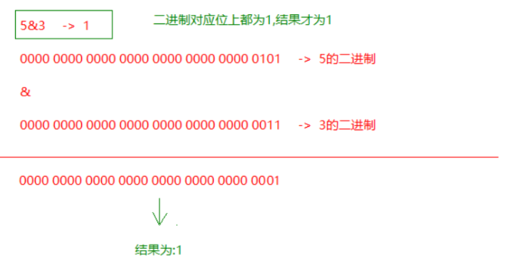

#  day02.变量  数据类型转换   运算符

```java
课前回顾:
  1.java概念:
    a.计算机编程语言:计算机看懂的语言,我们可以使用计算机编程语言对计算机下达指令
    b.java之父:詹姆斯高斯林
    c.java语言涉及的领域:用于互联网领域
    d.字节:计算机存储的最基本存储单元
      8bit = 1B
      1024B = 1KB
      1024KB = 1MB
      1024MB = 1GB
      1024GB = 1TB
  2.常用的dos命令:
    切换盘符   盘符名:
    查看      dir
    进入到指定目录  cd 文件夹名
                  cd 文件夹名\文件夹名
    退出上一级    cd..
    退到根目录    cd\
    清屏         cls
    退出dos窗口 exit
    创建文件夹   mkdir 文件夹名
               mkdir 文件夹名\文件夹名
    删除文件夹   rd 文件夹名
    删除文件     del 文件名.后缀名
                del *.后缀名
  3.java环境
    a.jvm:运行java程序的环境
    b.跨平台:java程序可以在不同的操作系统上运行,但是必须有不同版本jvm的支持
    c.jre: java运行环境,包含了jvm以及核心类库
    d.jdk: java开发工具包 包含jre
    e.环境变量:让javac和java命令可以在任意位置下运行
      JAVA_HOME
  4.开发三步骤:
    a.编写:创建一个.java文件
    b.编译:javac java文件名.java -> 生成一个class文件(字节码文件),jvm运行只认识class文件
    c.运行:java class文件名
  5.入门程序:
    public class 类名{
        public static void main(String[] args){
            System.out.println("helloworld");
        }
    }
  6.注释:对代码的解释说明,不参与编译和运行
    单行注释:  //
    多行注释:  /**/
    文档注释:  /***/ -> 根据javadoc命令生成API文档
             javadoc -d 文件夹名 -author -version java文件名.java
  7.关键字:
    java提前定义好的,具有特殊含义的小写单词,在高级记事本上颜色特殊.学到哪里记到哪里
  8.常见问题:
    a.编写和解码时遵循的规则必须是一样的,不然会乱码
    b.类名要和java文件名保持一致,而且一个java文件中一般只定义一个class
  9.入门程序注意事项:
    a.不要将main写成mian
    b.标点符号都是英文
    c.括号要成对的写
    d.类名和java文件名保持一致
    e.main写在public的class里
    f.String和System中的首字母s要大写
    g.;代表一句话结束了
  10.常量:在代码的运行过程中,值不会发生改变的数据
     整数常量:所有的整数
     小数常量:所有带小数点的
     字符常量:'' 单引号中必须有且只能有一个内容
     字符串常量:"" 随意
     布尔常量:true false
     空常量:null 代表数据不存在,不能直接使用
         
  11.变量:在代码的运行过程中,值可以根据不同的情况随时发生改变
     a.定义格式:
       数据类型 变量名 = 值
       数据类型 变量名;
       变量名 = 值;
     b.变量的数据类型分类:
       基本类型
           整型:byte short int long
           浮点型:float double
           字符型:char
           布尔型:boolean
       引用类型:类 数组 接口 枚举 注解
       
       String代表字符串,属于类,所以属于引用类型
           
       整数默认类型int   小数默认类型double        
             
今日重点:
  1.会使用变量
  2.会自动类型转换,强转
  3.会各种运算符的使用
```

# 第一章.变量

| 数据类型     | 关键字         | 内存占用 | 取值范围                                 |
| :----------- | :------------- | :------- | :--------------------------------------- |
| 字节型       | byte           | 1个字节  | -128 至 127  定义byte变量时超出范围,废了 |
| 短整型       | short          | 2个字节  | -32768 至 32767                          |
| 整型         | int（默认）    | 4个字节  | -2^31^ 至 2^31^-1  正负21个亿            |
| 长整型       | long           | 8个字节  | -2^63^ 至 2^63^-1   19位数字             |
| 单精度浮点数 | float          | 4个字节  | 1.4013E-45 至 3.4028E+38                 |
| 双精度浮点数 | double（默认） | 8个字节  | 4.9E-324 至 1.7977E+308                  |
| 字符型       | char           | 2个字节  | 0 至 2^16^-1                             |
| 布尔类型     | boolean        | 1个字节  | true，false(可以做判断条件使用)          |

## 1.变量的介绍以及使用

```java
1.概述:在代码的运行过程中,值会根据不同的情况发生改变的数据,叫做变量
2.作用:可以一次存储一个数据
  int i = 10
      i = 20
3.定义格式:
  a. 数据类型 变量名 = 值 -> 将等号右边的值赋值给等号左边的变量
  b. 数据类型 变量名;
     变量名 = 值;

4.java中的变量数据类型分类:
  基本数据类型:4类8种
      a.整型: byte short int long
      b.浮点型:float double
      c.字符型:char
      d.布尔型:boolean
          
  引用数据类型:
      类 数组 接口 注解 枚举
  
  String属于一个类,所以属于引用数据类型,但是String(字符串)的定义格式和基本类型一样 
          
5.注意:
  a.整数默认类型为int
  b.小数默认类型为double
      
6.问题:为啥跟float叫做单精度浮点型,double叫做双精度浮点型
      float的小数位只有23位二进制数,能表示的最大十进制为2的23次方,既8388608,是7位十进制数
    也就意味着float后面的小数位数,能保证7位的精确度
    
      
    double的小数位只有52位二进制数,能表示的最大十进制为4 503 599 627 370 496,这个数有16位,所以计算能保证16位的精确度
```

```java
public class Demo01Var{
	public static void main(String[] args){
		//byte型
		byte num1 = 10;
		System.out.println(num1);
		num1 = 120;
		System.out.println(num1);
		
		//short型
		short num2 = 100;
		System.out.println(num2);
		
		//int型
		int num3 = 18;
		System.out.println(num3);
		
		/*
		 long型
		 一般情况下,定义long型的变量后面加L
		*/
		long num4 = 100000L;
		System.out.println(num4);
		
		/*
		  float型
		  定义float型变量,后面需要加上F
		*/
		float num5 = 2.5F;
		System.out.println(num5);
		
		/*
		  double型
		*/
		double num6 = 3.5;
		System.out.println(num6);
		
		/*
		  char型
		  带单引号
		*/
		char num7 = 'A';
		System.out.println(num7);
		
		/*
		  boolean型
		*/
		boolean num8 = true;
		boolean num9 = false;
		/*
		   num8 = true
		   num9 = false
		   
		   num8 = num9   将等号右边的num9代表的false赋值给等号左边的变量num8
		   
		   此时num8为false
		*/
		num8 = num9;
		System.out.println(num8);
	}
}
```

```java
public class Demo01Var{
	public static void main(String[] args){
		float num = 10.0F;
		
	    float result01 = num/3;
		
		System.out.println(result01);//3.3333333
		
		
		double num1 = 10.0;
		double result02 = num1/3;
		System.out.println(result02);// 3.3333333333333335
		
		
		float num2 = 3.55F;
		float num3 = 2.12F;
		
		float result03 = num2-num3;
		System.out.println(result03);//1.4300001
	}
}
```

```java
public class Demo02Var{
	public static void main(String[] args){
		int num1 = 10;
		int result01 = num1+3;
		System.out.println(result01);
		System.out.println(num1-3);
		System.out.println(num1*3);
		System.out.println(num1/3);//取整数部分
		System.out.println(num1/3.0);//如果符号前后有一个为小数,结果就是带小数的,默认类型为double
		
		System.out.println("===================");
		
		int a = 10;
		int b = 2;
		
		int sum = a+b;
		System.out.println(sum);
		
		int sub = a-b;
		System.out.println(sub);
		
		int mul = a*b;
		System.out.println(mul);
		
		int div = a/b;
		System.out.println(div);
	}
}
```

```java
public class Demo03Var{
	public static void main(String[] args){
		/*
		  \  转义字符
		     将普通的字符转义成具有特殊含义的字符
			 将特殊含义的字符转义成普通字符
		*/
		
		
		/*
		  n:本身代表普通的字符
		  
		  \n: 为换行符
		*/
		
		System.out.println("哈哈哈哈\n呵呵呵呵");
		
		/*
		  t:本身代表普通的字符
		  \t:代表制表符 tab
		*/
		
		System.out.println("哈哈哈哈\t呵呵呵呵");
		
		/*
		  用char类型变量表示一个'
		  
		  '本身具有特殊含义
		  
		  \' 将具有特殊含义的'变成普通字符
		*/
		
		char num1 = '\'';
		System.out.println(num1);
		
		/*
		  用字符串表示一个路径
		  
		  \本身具有特殊含义,代表转义字符,我们需要将\变成普通的字符
		  所以\前面再加一个\
		  
		  \\代表\
		*/
		String path = "E:\\Idea\\io";
		System.out.println(path);
	}
}
```

## 2.变量使用时的注意事项

```java
1.变量不初始化(第一次赋值)不能直接使用
2.在同一个作用域(一个大括号一个作用域)中不能连续定义相同名字的变量   
3.不同的作用域之间不要随意互相调用
  在大作用域中不能直接访问小作用域中的数据
  在小作用域中能直接访问大作用域中提前定义好的数据
```

```java
public class Demo04Var{
	public static void main(String[] args){
		int i = 10;
		System.out.println(i);
		
		//int j;// j没有被初始化,不能直接使用
		//System.out.println(j);
		
		//int i = 20;  如果变量名前面带具体的数据类型,叫做重新定义
		
		i = 20;//变量名前面没有指明具体数据类型,不叫做重新定义,叫做再次赋值
		System.out.println(i);
		
		{
			int k = 100;
			System.out.println(k);
			System.out.println(i);//在小作用域中能直接访问大作用域中的数据
		}
		
		//System.out.println(k);在大作用域中不能直接访问小作用域中的数据
	}
}
```

## 3.练习

```java
练习:
  用代码描述一个人:
   姓名 年龄 性别 身高 体重
```

```java
public class Demo05Person{
	public static void main(String[] args){
		//姓名 String 
		String name = "曼姐";
		//年龄 int
		int age = 13;
		//性别 char
		char sex = '女';
		//身高 double 
		double height = 163;
		//体重
		double weight = 98;
		
		System.out.println(name);
		System.out.println(age);
		System.out.println(sex);
		System.out.println(height);
		System.out.println(weight);
	}
}
```

# 第二章.标识符

```java
1.概述:给类,方法,变量取的名字
2.注意:
  硬性要求(必须遵守):
    a.标识符可以包含'英文字母','数字',"$和_"
    b.标识符不能以数字开头  int i1 = 100(正确)  int 1i = 100(错误)
    c.标识符不能是关键字  int publicstatic = 10
  软性建议(建议遵守):
    a.给类取名字:遵循大驼峰式 -> 每个单词首字母大写
    b.给方法和变量取名字:遵循小驼峰式 -> 从第二个单词开始往后首字母大写    
```

```java
public class Demo06Var{
	public static void main(String[] args){
		int i1 = 100;
		//int 1i = 200; 名字不能数字开头
		int $1 = 200;
		System.out.println($1);
		
		//int static = 300; 名字不能是关键字
		//System.out.println(static);
		
		int _i = 1000;
		System.out.println(_i);
		
		int intVar = 2000; //小驼峰式
		System.out.println(intVar);
		
	}
}
```

# 第三章.数据类型转换

```java
1.什么时候会发生数据类型转换
  等号左右两边类型不一致
2.按照取值范围大小从小到大给数据类型排序
  byte short char -> int -> long -> float -> double
    
  取值范围大的叫做大类型(相对的)
  取值范围小的叫做小类型(相对的)
    
3.数据类型转换分两种:
  a.自动类型转换:将取值范围小的数据类型 赋值 给 取值范围大的数据类型
               或者在运算的时候,取值范围小的遇到了取值范围大的数据类型
               
               取值范围小的数据类型会自动提升为取值范围大的数据类型
  b.强制类型转换:
    强制将取值范围大的数据类型转成取值范围小的数据 ->向下转型
```

## 1.自动类型转换

```java
1.什么时候发生自动类型转换:
  a.取值范围大的数据类型 变量名 = 取值范围小的数据类型 -> 小的数据类型自动提升为大的数据类型
      
  b.小类型遇到了大类型做运算 -> 小自动转大的类型
```

```java
public class Demo01DataType{
	public static void main(String[] args){
		/*
		  100默认类型为int
		  num1类型为long
		  将100赋值给long型的num1,相当将取值范围小的数据类型赋值给了取值范围大的数据类型
		  发生了自动类型转换
		*/
		long num1 = 100;
		System.out.println(num1);
		
		
		/*
		  2默认类型为int
		  num2类型为double
		  将2赋值给了double型的num2,相当于将取值范围小的数据类型赋值给了取值范围大的数据类型
		  发生了自动类型转换
		*/
		double num2 = 2;
		System.out.println(num2);
		
		int num3 = 10;
		double num4 = 2.5;
		
		/*
		  double  = int+double
		  
		  double = double+double
		  
		  小类型和大类型做运算,小类型会自动提升为大类型
		*/
		double sum = num3+num4;
		System.out.println(sum);
		
	}
}
```

## 2.强制类型转换

```java
1.什么时候需要强转:
  取值范围小的数据类型 变量名 = 取值范围大的数据类型 -> 报错
2.怎么进行强转:
  取值范围小的数据类型 变量名 = (取值范围小的数据类型)取值范围大的数据类型
```

```java
public class Demo02DataType{
	public static void main(String[] args){
		//float num1 = 2.5;
		//float num1 = (float)2.5;
		float num1 = 2.5F;
		System.out.println(num1);
		
		System.out.println("================");
		
		//int num2 = 200L;
		int num2 = (int)200L;
		System.out.println(num2);
	}
}
```

## 3.强转的注意事项

```java
1.将来开发不要故意写成强转,除非没办法 
2.如果随意强转会容易出现:
  a.精度损失
  b.数据溢出
      
3.byte,short 如果等号右边是常量,如果不超出范围,不会报错,jvm自动转型 
  byte,short 如果等号右边有变量参与运算,会自动提升为int,结果重新赋值给byte short变量,需要手动强转 
     
4.char类型参与运算,会自动提升为int型,如果char类型提升为int型之后,会自动去ASCII码表查询字符对应的int值   
  如果ASCII码表中没有,会去unicode码表去查(万国码)    
```

```java
public class Demo03DataType{
	public static void main(String[] args){
		//精度损失
		int num1 = (int)2.9;
		System.out.println(num1);
		
		//数据溢出
		
		/*
		  int占内存4个字节-> 一个字节是8个二进制位  -> 32位二进制
		  
		  100亿:36位二进制
		  
		  将36位二进制的100亿强制赋值给最多能存32位二进制的int型变量
		  多出来4位,多出来的,干掉前4位
		*/
		int num2 = (int)10000000000L;
		System.out.println(num2);//1410065408
	}
}
```

```java
public class Demo04DataType{
	public static void main(String[] args){
		byte num1 = 100;//等号右边是一个值,不超出范围,不会报错,jvm自动强转
		System.out.println(num1);
		
		byte num2 = (byte)200;//如果超出范围,需要我们自己强转
		System.out.println(num2);
		
		byte num3 = 10+1;
		System.out.println(num3);
		
		byte num4 = 1;
		
		/*
		  byte = byte+int
		  byte = int+int -> 需要手动转
		*/
		byte num5 = (byte)(num4+1);
		System.out.println(num5);
		
		System.out.println("=====================");
		
		char num6 = '0';
		System.out.println(num6+0);
		
		System.out.println('中'+0);//20013
		
		int num7 = '国';
		System.out.println(num7);
	}
}
```


# 第四章.运算符

## 1.算数运算符

| 符号 | 说明                                                         |
| ---- | ------------------------------------------------------------ |
| +    | 加法                                                         |
| -    | 减法                                                         |
| *    | 乘法                                                         |
| /    | 除法<br>如果符号前后都是整数,结果取整数部分<br>如果符号前后有小数,结果就是带小数的 |
| %    | 模<br>取余数                                                 |

```java
public class Demo01SuanShu{
	public static void main(String[] args){
		int i = 10;
		int j = 3;
		
		int sum = i+j;
		System.out.println(sum);
		
		int sub = i-j;
		System.out.println(sub);
		
		int mul = i*j;
		System.out.println(mul);
		
		int div = i/j;
		System.out.println(div);
		
		int mo = i%j;
		System.out.println(mo);
	}
}
```

```java
+:
  1.加法
  b.字符串拼接-> 任何类型遇到字符串都会变成字符串类型数据,直接往后拼接
```

```java
public class Demo02SuanShu{
	public static void main(String[] args){
		int i = 10;
		int j = 3;
		
		System.out.println(i+j+"");//13
		System.out.println(i+""+j);//103
		System.out.println(""+i+j);//103
		System.out.println(""+(i+j));//13
		
		System.out.println("两个数的和:"+(i+j));
	}
}
```

## 2.自增自减运算符(也算算数运算符的一种)

```java
1.格式:
  变量++ -> 后自加 
  ++变量 -> 前自加
  变量-- -> 后自减
  --变量 -> 前自减
      
2.使用:
  a.单独使用:++ -- 自己单独成为一句
    符号在前或者在后没区别,都是直接运算
      
  b.混合使用:++ --和别的语句混合使用(赋值语句,打印语句)
    符号在前:先运算,再使用运算后的值
    符号在后:先使用原值,使用完毕之后,自身再运算
```

```java
public class Demo03SuanShu{
	public static void main(String[] args){
		int i = 10;
		//单独使用
		//i++;
		++i;
		System.out.println(i);
		
		System.out.println("=============");
		
		int j = 10;
		//混合使用
		//int result = ++j;
		int result = j++;
		System.out.println(result);
		System.out.println(j);
		
		System.out.println("=============");
		
		int x = 10;
		int y = 20;
		
		/*
		  以后开发不会这么写代码
		  10+19 = 29-10
		*/
		int result01 = x++ + --y - --x;
		System.out.println(result01);
		
		System.out.println("=============");
		
		int c = 100;
		c = c++;
		System.out.println(c);
	}
}
```


## 3.赋值运算符

```java
1.基本赋值运算符:
   =   -> 先看等号右边的,将等号右边的数据赋值给等号左边的变量
       
2.复合赋值运算符:       
   += 
       int i = 10;i+=1 -> 看做 i = i+1
   -=
   *=
   /=  取整数部分
   %=  取余数部分
           
3.针对于复合赋值运算符:
  byte short 参与运算,jvm会自动强转
```

```java
public class Demo04FuZhi{
	public static void main(String[] args){
		int i = 10;
		i+=2; // i = i+2
		System.out.println(i);
		
		System.out.println("================");
		
		byte b = 10;
		//b = b+1;
		b+=1;//b = b+1
		System.out.println(b);
	}
}
```

## 4.关系运算符(比较运算符)

```java
结果:boolean型
都是作为条件使用    
```

| 符号 | 说明                                                      |
| ---- | --------------------------------------------------------- |
| ==   | 如果符号前后数据相等,为true;否则为false                   |
| >    | 如果符号前大于符号后的数据,返回true,否则返回false         |
| <    | 如果符号前小于符号后的数据,返回true,否则返回false         |
| >=   | 如果符号前大于或者等于符号后的数据,返回true,否则返回false |
| <=   | 如果符号前小于或者等于符号后的数据,返回true,否则返回false |
| !=   | 如果符号前后的数据不相等,返回true,否则返回false           |

```java
public class Demo05Compare{
	public static void main(String[] args){
		int i = 10;
		int j = 20;
		int k = 10;
		
		boolean result01 = i==j;
		System.out.println(result01);
		
		System.out.println(i>j);
		System.out.println(i<j);
		System.out.println(i>=k);
		System.out.println(i<=k);
		System.out.println(i!=k);
	}
}
```

## 5.逻辑运算符

```java
1.作用:用于连接多个boolean结果的数据或者表达式
2.结果:boolean    
```

| 符号        | 说明                                         |
| ----------- | -------------------------------------------- |
| &&(与,并且) | 有假则假,符号前后有一个为false,结果就是false |
| \|\|(或)    | 有真则真,符号前后有一个为true,结果就是true   |
| !(非,取反)  | 不是真就是假,不是假就是真                    |
| ^(异或)     | 符号前后结果一样为false,不一样为true         |

```java
public class Demo06LuoJi{
	public static void main(String[] args){
		int i = 10;
		int j = 20;
		int k = 10;
		
		boolean result01 = (i>j)&&(i==k);//false&&true
		System.out.println(result01);//false
		
		boolean result02 = (i>j)||(i==k);//false||true
		System.out.println(result02);//true
		
		boolean result03 = !(i>j);//!false
		System.out.println(result03);//true
		
		boolean result04 = (i>j)^(i==k);//false^true
		System.out.println(result04);//true
	}
}
```

> 问题1:表示小明的分数是否在 50-100之间
>
> ​           50<=score<=100 -> 数学写法
>
> ​           score>=50 && score<=100 -> java写法
>
> 问题2:&和&& 以及|和||区别
>
> 

## 6.三元运算符

```java
1.格式:
  boolean表达式?表达式1:表达式2
      
2.执行流程:
  先走boolean表达式,如果是true,就走?后面的表达式1;否则就走:后面的表达式2
```

### 6.1练习1

```java
需求:小明考完试了,判断小明的分数是否及格
```

```java
public class Demo07SanYuan{
	public static void main(String[] args){
		int score = 59;
		String result01 = (score>=60)?"及格":"不及格";
		System.out.println(result01);
	}
}
```

### 6.2练习2

```java
有两个和尚,身高分别为150  210  求出两个和尚的最高身高
```

```java
public class Demo08Test{
	public static void main(String[] args){
		int heShang1 = 150;
		int heShang2 = 210;
		
		int max = (heShang1>heShang2)?heShang1:heShang2;
		
		System.out.println("两个和尚的最高身高为:"+max);
	}
}
```

### 6.3 练习3

```java
有三个和尚,身高分别为150  210  170 求出三个和尚的最高身高
```

```java
public class Demo09Test{
	public static void main(String[] args){
		int heShang1 = 150;
		int heShang2 = 210;
		int heShang3 = 170;
		
		int temp = (heShang1>heShang2)?heShang1:heShang2;
		int max = (temp>heShang3)?temp:heShang3;
		System.out.println("三个和尚的最高身高为:"+max);
	}
}
```

# 第五章.进制的转换(了解)

| 十进制 | 二进制 | 八进制 | 十六进制 |
| ------ | ------ | ------ | -------- |
| 0      | 0      | 0      | 0        |
| 1      | 1      | 1      | 1        |
| 2      | 10     | 2      | 2        |
| 3      | 11     | 3      | 3        |
| 4      | 100    | 4      | 4        |
| 5      | 101    | 5      | 5        |
| 6      | 110    | 6      | 6        |
| 7      | 111    | 7      | 7        |
| 8      | 1000   | 10     | 8        |
| 9      | 1001   | 11     | 9        |
| 10     | 1010   | 12     | a或A     |
| 11     | 1011   | 13     | b或B     |
| 12     | 1100   | 14     | c或C     |
| 13     | 1101   | 15     | d或D     |
| 14     | 1110   | 16     | e或E     |
| 15     | 1111   | 17     | f或F     |
| 16     | 10000  | 20     | 10       |

## 3.1 十进制转成二进制

```java
辗转相除法-> 循环除以2,取余数
```


## 3.2 二进制转成十进制

```java
8421规则
```


## 3.3 二进制转成八进制

```java
将二进制分开(3位为一组)
```


## 3.4 二进制转成十六进制

```java
二进制分为4个为一组  
```


# 第六章.位运算符(了解)


```java
1代表true   0代表false

我们要知道计算机在存储数据的时候都是存储的数据的补码,而计算的也是数据的补码

1.正数二进制最高位为0;负数二进制最高位是1
2.正数的原码,反码,补码一致
  如:5的源码,反码,补码为:
     0000 0000 0000 0000 0000 0000 0000 0101->二进制最高位是0,因为是正数
3.负数的话原码,反码,补码就不一样了
  反码是原码的基础上最高位不变,其他的0和1互变
  补码是在反码的基础上+1
         
  如:-9
     原码:1000 0000 0000 0000 0000 0000 0000 1001
     反码:1111 1111 1111 1111 1111 1111 1111 0110
     补码:1111 1111 1111 1111 1111 1111 1111 0111
```

#### （1）左移：<<

​	**运算规则**：左移几位就相当于乘以2的几次方

​	**注意：**当左移的位数n超过该数据类型的总位数时，相当于左移（n-总位数）位

```java
2<<2    等于8
相当于:2*(2的2次方)
```


```java
-2<<2   等于-8

相当于:-2*(2的2次方)
```


#### （2）右移：>>

快速运算：类似于除以2的n次，如果不能整除，**向下取整**

```java
9>>2  等于 2

相当于:9除以(2的2次方)

```


```java
-9>>2  等于-3

相当于:-9除以(2的2次方)
```


#### （3）无符号右移：>>>

运算规则：往右移动后，左边空出来的位直接补0，不管最高位是0还是1空出来的都拿0补

正数：和右移一样

```java
9>>>2  等于 2

相当于:9除以(2的2次方)
```

负数：右边移出去几位，左边补几个0，结果变为正数

```java
-9>>>2

结果为:1073741821
```

> 笔试题:8>>>32位->相当于没有移动还是8
>
> ​             8>>>34位->相当于移动2位

#### （4）按位与：&

小技巧:将0看成为false  将1看成true

运算规则：对应位都是1才为1,相当于符号左右两边都为true,结果才为true

​		1 & 1 结果为1  相当于  true&true

​		1 & 0 结果为0  

​		0 & 1 结果为0

​		0 & 0 结果为0

```java
比如:  5&3   结果为1

```



#### （5）按位或：|

运算规则：对应位只要有1即为1,相当于符号前后只要有一个为true,结果就是true

​		1 | 1 结果为1

​		1 | 0 结果为1

​		0 | 1 结果为1

​		0 | 0 结果为0

```
比如: 5|3  结果为:7
```


#### （6）按位异或：^

​	运算规则：对应位一样的为0,不一样的为1

​		1 ^ 1 结果为0 false

​		1 ^ 0 结果为1  true

​		0 ^ 1 结果为1   true

​		0 ^ 0 结果为0  false

```java
比如: 5^3   结果为6
```


#### （7）按位取反

运算规则：~0就是1  

​			       ~1就是0

```java
~10     ->  结果为-11
```


# 第七章.运算符的优先级(了解)


```java
提示说明：
（1）表达式不要太复杂
（2）先算的使用(),记住,如果想让那个表达式先运行,就加小括号就可以了
i<(n*m)
```

