# day03_流程控制

```java
课前回顾:
  1.变量的注意事项:
    a.变量不初始化不能直接使用
    b.相同作用域中不能定义重名的变量
    c.不同的作用域之间不要随意相互访问变量
      小作用域中可以直接使用大作用域中的变量
      大作用域中不可以直接使用小作用域中的变量
  2.标识符:
    a.概述:给类,方法,变量取的名字
    b.硬性要求:
      名字可以包含字母,数字,_和$
      不要以数字开头
      不要是关键字
    c.软性建议:
      给类取名:大驼峰式
      给方法和变量取名:小驼峰式
          
  3.类型转换:当等号左右两边的类型不一致时
    a.自动类型转换:将取值范围小的数据类型赋值给取值范围大的数据类型,小转大
                 或者做运算,小类型遇到大类型,小转大
    b.强制类型转换(强转):
      将取值范围大的数据类型强转成取值范围小的数据类型
    c.强转的注意事项:
      精度损失,数据溢出
      byte,short如果等号右边是常量,如果不超出范围,jvm自动转换
                如果等号右边是变量参与,需要我们手动强转
      char如果做运算,会自动提升为int型,一旦提升为int型,会去ascii码表中查询字符对应的int值,如果没有,去unicode码表中查询
          
   4.算数运算符:
     + - * / %
     +:字符串拼接
   5.自加自减:++ --
     a.单独使用
       符号在前在后都是先运算
     b.混合使用
       符号在前,先运算,再使用运算后的值
       符号在后,先使用原值,再自己运算
   6.比较运算符:boolean型
     == > < >= <= !=
   7.赋值运算符:
     = += -= *= /= %=
     byte.short使用复合赋值运算符时,jvm会自动转型
   8.三元运算符:
     a.格式:boolean表达式?表达式1:表达式2
     b.执行流程:先走boolean表达式,如果是true,就走?后面的表达式1,否则就走:后面的表达式2
   9.逻辑运算符:
     &&:有假则假
     ||:有真则真
     !:取反
     ^: 符号前后结果一样为false,不一样为true

今日重点:
  all
```

# 第一章.IDEA的使用

## 1.idea的介绍

```java
1.概述:开发工具,由java编写,需要电脑配置正确的jdk环境变量
2.作用:加速开发
3.特点:
  a.自动保存
  b.自动编译,不用javac java
  c.编译之后,自动查错,如果代码写错了,该代码会用红色字体,或者红色波浪线提示
  d.有很多快捷键,加速开发
  e.其他功能应有尽有
4.其他开发工具:
  eclipse  myeclipse(收费)
```

## 2.idea的目录结构

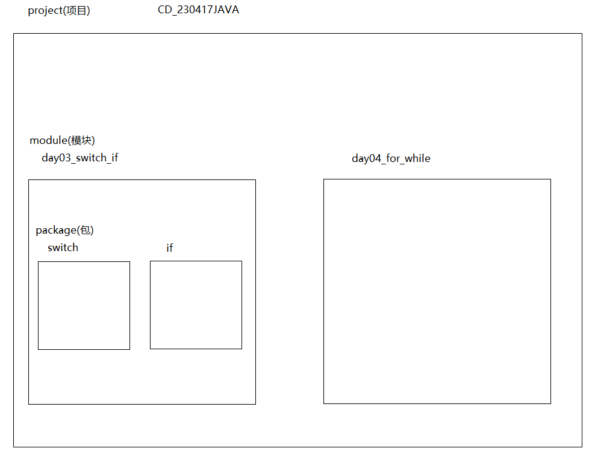

## 3.如何去创建一个Project


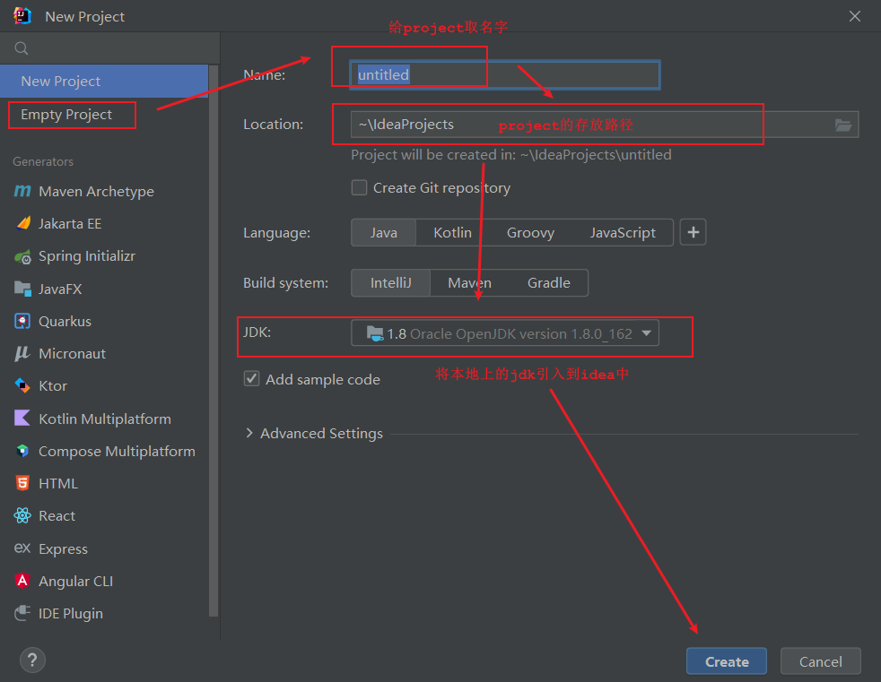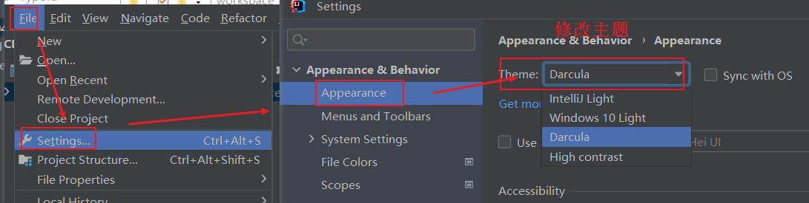


### 3.1再次创建一个新的Project

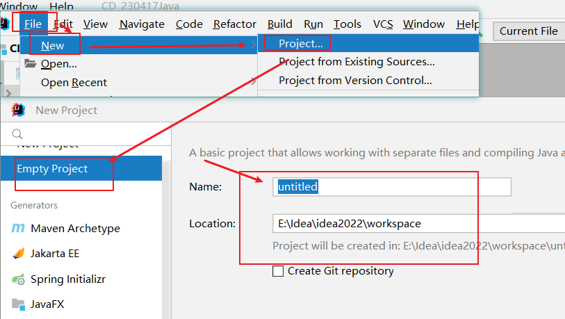

## 4.关闭Project

```java
file --> close project
```

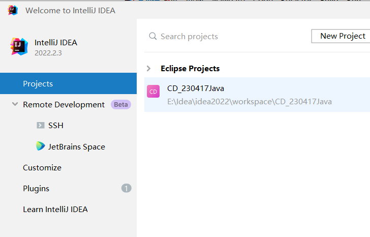

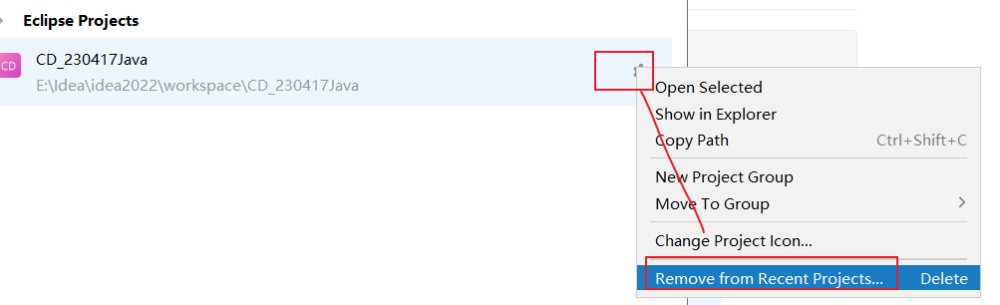

## 5.打开project

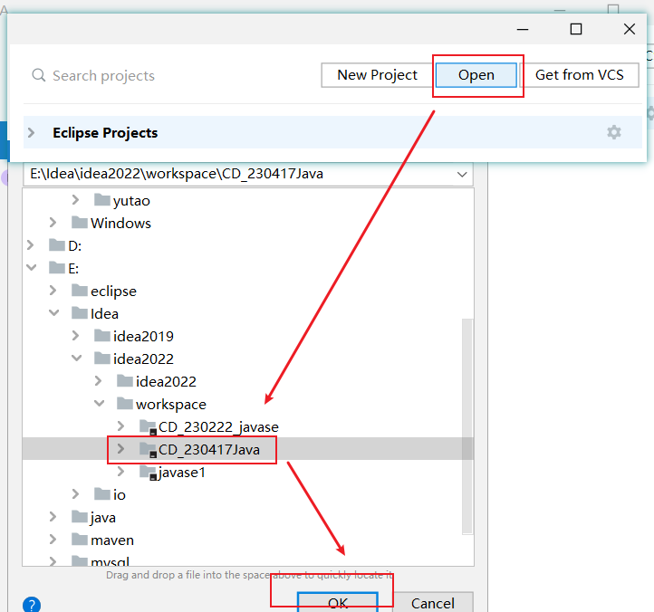

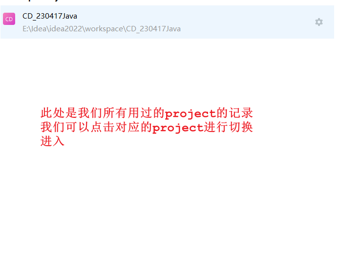

## 6.创建module

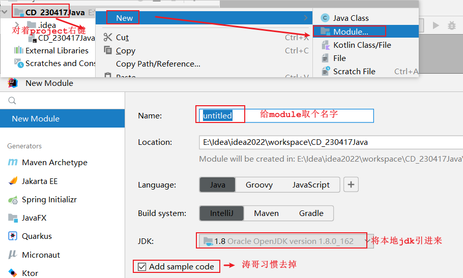


### 6.1.导入已有的module

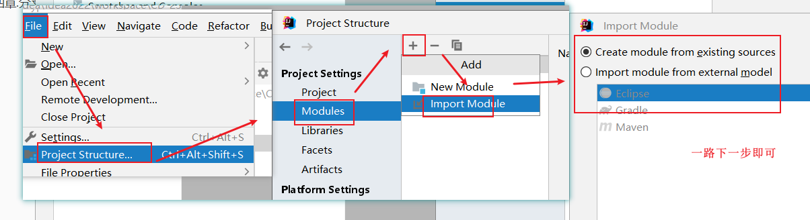

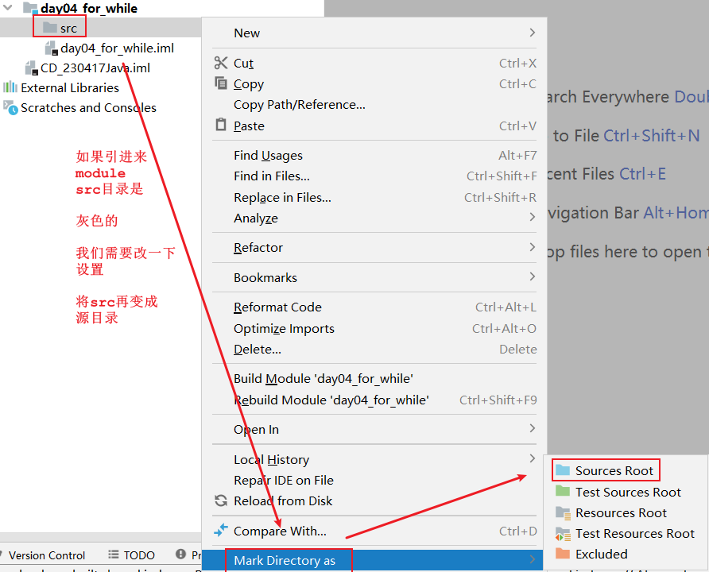

### 6.3.关闭module

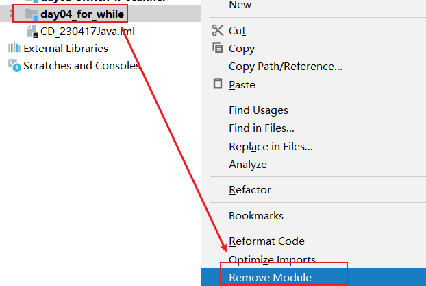

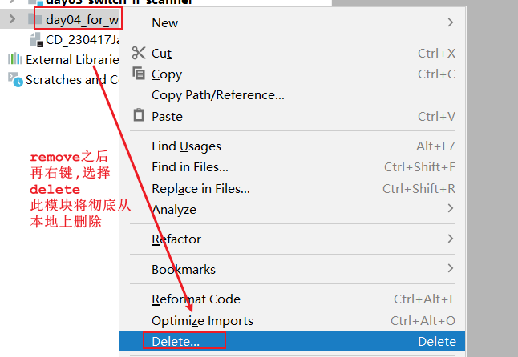

## 7.创建以及删除package

### 7.1创建

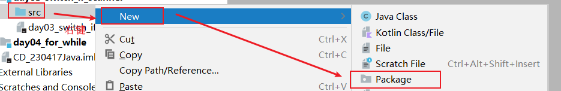

### 7.2 package的删除

```java
对着要删除的package-> 右键- > delete
```

### 7.3 package取名字规范

```java
1.给package取名字规范:
  a.包名小写
  b.都是英文
  c.公司域名倒着写 -> 比如 www.atguigu.com -> package取名为:  com.atguigu
  d.名字不要是关键字    
```

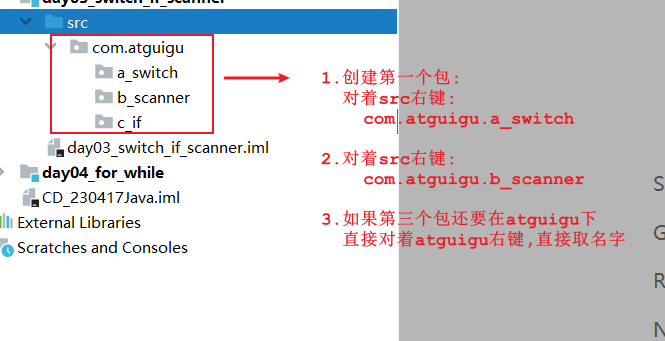

## 8.创建类以及基本语句生成快捷键

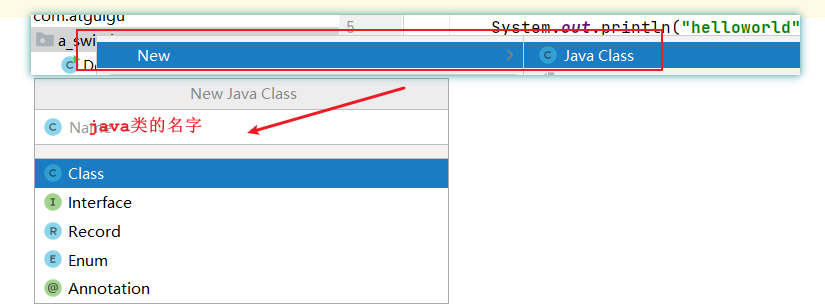

> 1.生成main方法
>
>    a.psvm -> 回车
>
>    b.main -> 回车
>
> 2.生成输出语句
>
>    a.sout -> 回车
>
>    b.将变量放到输出语句中: 变量名.sout
>
>    c.将变量放到输出语句中,并且让输出语句格式变得好看点:
>
> ​      变量名.soutv

## 9.基本设置

### 9.1设置字体

```java
file-settings
```

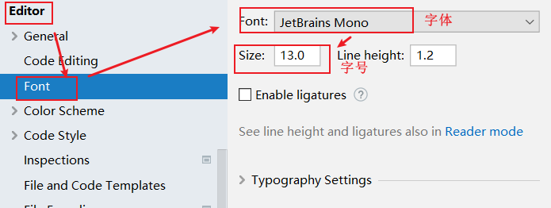

### 9.2设置提示的快捷键

```java
file-settings
```

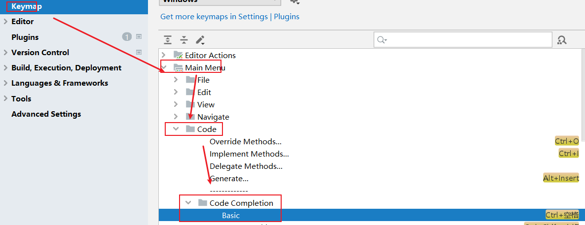

### 9.3 设置注释字体

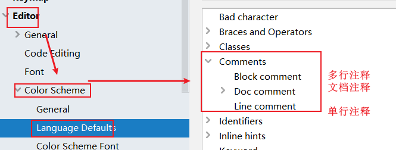

## 10.快捷键

| 快捷键               | 功能                                   |
| -------------------- | -------------------------------------- |
| `Alt+Enter`          | 导入包，自动修正代码(重中之重)         |
| `Ctrl+Y`             | 删除光标所在行                         |
| `Ctrl+D`             | 复制光标所在行的内容，插入光标位置下面 |
| `Ctrl+Alt+L`         | 格式化代码                             |
| `Ctrl+/`             | 单行注释                               |
| `Ctrl+Shift+/`       | 选中代码注释，多行注释，再按取消注释   |
| `Alt+Shift+上下箭头` | 移动当前代码行                         |

> 定义变量,创建也好,只要是涉及赋值的我们都可以先写等号右边的,再生成等号左边的
>
> 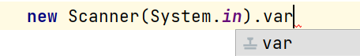
>
> 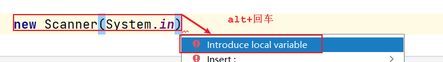

## 11.出现的问题

```java
1.创建project时,要选择empty project
2.在运行代码时会出现"找不到对应的发行源",证明本地jdk版本和idea中的project level不匹配
  所以要匹配版本
  file->project Structure->点击project->引入本地jdk->project level选择对应的版本
3.没有out路径的问题
  out路径是专门存放idea自动编译生成的.class文件的
  所以需要指明out路径
4.对着src,右键,选项中没有java class或者package
    
5.刚使用,jdk没有配置    
```

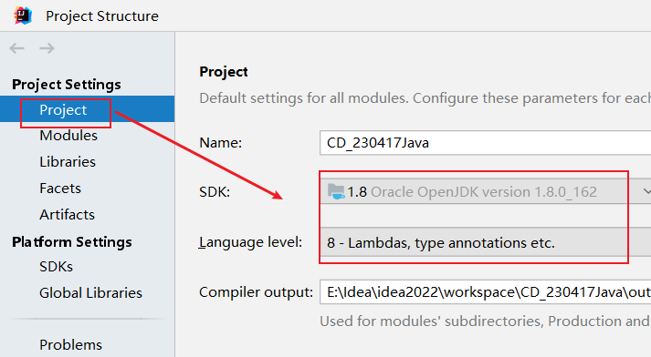

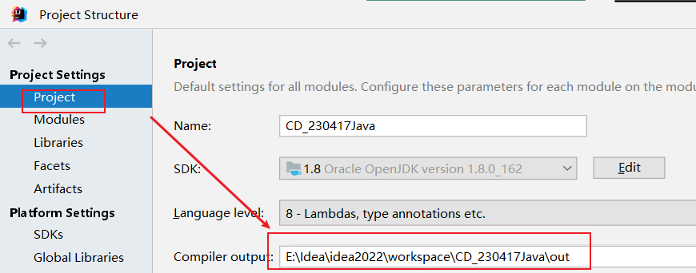

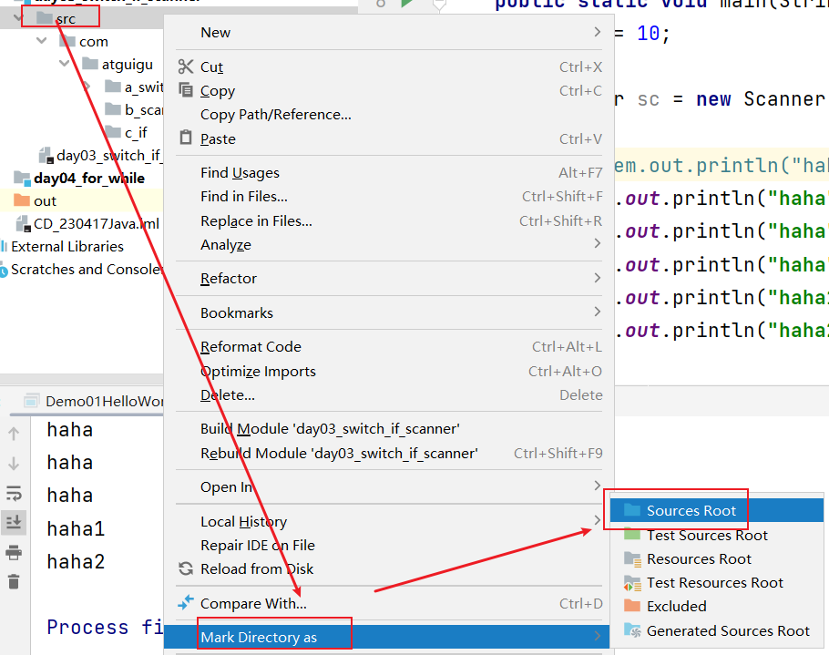

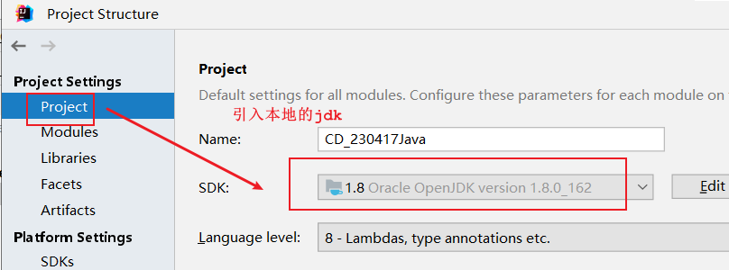

# 第二章.键盘录入_Scanner

```java
1.概述:Scanner是java定义好的类
2.作用:通过键盘录入的形式将数据放到代码中参与运行
3.怎么用:
  a.导包:为了找到想使用的类 -> import java.util.Scanner
  b.创建对象: Scanner 对象名 = new Scanner(System.in);
  c.调用方法,实现键盘录入:
    对象名.nextInt() -> 录入一个整数
    对象名.next() -> 录入一个字符串      
```

```java
public class Demo01Scanner {
    public static void main(String[] args) {
        Scanner sc = new Scanner(System.in);
        System.out.println("请您输入一个整数:");
        int data1 = sc.nextInt();
        System.out.println("data1 = " + data1);
        System.out.println("请您输入一个字符串:");
        String data2 = sc.next();
        System.out.println("data2 = " + data2);
    }
}
```

```java
public class Demo02Scanner {
    public static void main(String[] args) {
        Scanner sc = new Scanner(System.in);
        System.out.println("请你输入第一个整数:");
        int data1 = sc.nextInt();
        System.out.println("请你输入第二个整数:");
        int data2 = sc.nextInt();
        System.out.println("请你输入第三个整数:");
        int data3 = sc.nextInt();

        int temp = (data1 > data2) ? data1 : data2;
        int max = (temp > data3) ? temp : data3;
        System.out.println("max = " + max);
    }
}
```

```java
Exception in thread "main" java.util.InputMismatchException
	at java.util.Scanner.throwFor(Scanner.java:864)
	at java.util.Scanner.next(Scanner.java:1485)
	at java.util.Scanner.nextInt(Scanner.java:2117)
	at java.util.Scanner.nextInt(Scanner.java:2076)
	at com.atguigu.a_scanner.Demo02Scanner.main(Demo02Scanner.java:9)
```

```java
以上错误的原因为:输入的数据类型和指定的不一致
```

> ```java
> next():录入字符串,遇到回车或者空格就结束录入了
> nextLine():录入字符串,遇到回车就结束录入
> ```
>
> ```java
> public class Demo03Scanner {
>     public static void main(String[] args) {
>         Scanner sc = new Scanner(System.in);
>         String data1 = sc.next();
>         String data2 = sc.nextLine();
>         System.out.println(data1);
>         System.out.println(data2);
>     }
> }
> ```
>
> 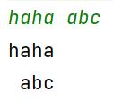

# 第三章.switch(选择语句)

## 1.switch基本使用

```java
1.格式:
  switch(变量){
      case 常量值1:
          执行语句1;
          break;
      case 常量值2:
          执行语句2;
          break;
      case 常量值3:
          执行语句3;
          break;
          ...
      default:
          执行语句n;
          break;
  }

2.执行流程:
  用变量代表的值去和下面的case匹配,配上哪个case就直接走哪个case对应的执行语句
  如果以上所有的case 都没有匹配上,那么就走default对应的执行语句
      
3.注意:switch中能写什么类型的数据
  byte short int char 枚举类型 String类型      
```

```java
public class Demo01Switch {
    public static void main(String[] args) {
        //创建Scanner对象
        Scanner sc = new Scanner(System.in);
        System.out.println("请你输入一个整数:");
        int data = sc.nextInt();
        switch (data){
            case 1:
                System.out.println("离离原上草");
                break;
            case 2:
                System.out.println("一岁一枯荣");
                break;
            case 3:
                System.out.println("野火烧不尽");
                break;
            case 4:
                System.out.println("春风吹又生");
                break;
            default:
                System.out.println("输入错误");
                break;
        }
    }
}
```

## 2.case的穿透性

```java
如果没有break,会出现case的穿透性,代码会一直往下穿透执行,直到遇到break或者switch结束了为止
```

```java
public class Demo02Switch {
    public static void main(String[] args) {
        Scanner sc = new Scanner(System.in);
        int month = sc.nextInt();
        switch(month){
            case 12:
                System.out.println("冬季");
                break;
            case 1:
                System.out.println("冬季");
                break;
            case 2:
                System.out.println("冬季");
                break;
            case 3:
                System.out.println("春季");
                break;
            case 4:
                System.out.println("春季");
                break;
            case 5:
                System.out.println("春季");
                break;
            case 6:
                System.out.println("夏季");
                break;
            case 7:
                System.out.println("夏季");
                break;
            case 8:
                System.out.println("夏季");
                break;
            case 9:
                System.out.println("秋季");
                break;
            case 10:
                System.out.println("秋季");
                break;
            case 11:
                System.out.println("秋季");
                break;
            default:
                System.out.println("输入有误!");
                break;
        }
    }
}

```

```java
public class Demo02Switch {
    public static void main(String[] args) {
        Scanner sc = new Scanner(System.in);
        int month = sc.nextInt();
        switch(month){
            case 12:
            case 1:
            case 2:
                System.out.println("冬季");
                break;
            case 3:
            case 4:
            case 5:
                System.out.println("春季");
                break;
            case 6:
            case 7:
            case 8:
                System.out.println("夏季");
                break;
            case 9:
            case 10:
            case 11:
                System.out.println("秋季");
                break;
            default:
                System.out.println("输入有误!");
                break;
        }
    }
}

```

# 第四章.分支语句

### 1.if的第一种格式

```java
1.格式:
  if(boolean表达式){
      执行语句
  }

  或者:
  if(boolean表达式)
      执行语句
2.执行流程:
  走if后面的执行语句,如果是true,就走if后面大括号中的执行语句
  否则就不走
```

```java
public class Demo01If {
    public static void main(String[] args) {
        Scanner sc = new Scanner(System.in);
        System.out.println("请你输入第一个整数:");
        int data1 = sc.nextInt();
        System.out.println("请您输入第二个整数:");
        int data2 = sc.nextInt();

        if (data1==data2){
            System.out.println("相等");
        }
        /*if (data1==data2)
            System.out.println("相等");*/

    }
}
```

### 2.if的第二种格式

```java
1.格式:
  if(boolean表达式){
      执行语句1
  }else{
      执行语句2
  }
2.执行流程:
  先走if后面的boolean表达式,如果是true,就走if后面的执行语句1
  否则就走else后面的执行语句2
```

```java
public class Demo02If {
    public static void main(String[] args) {
        Scanner sc = new Scanner(System.in);
        System.out.println("请你输入第一个整数:");
        int data1 = sc.nextInt();
        System.out.println("请您输入第二个整数:");
        int data2 = sc.nextInt();

        if (data1==data2){
            System.out.println("相等");
        }else{
            System.out.println("不相等");
        }

        /*if (data1==data2)
            System.out.println("相等");
        else
            System.out.println("不相等");*/

    }
}

```

#### 2.1 练习

```java
任意给出一个整数，请用程序实现判断该整数是奇数还是偶数，并在控制台输出该整数是奇数还是偶数
```

```java
public class Demo03If {
    public static void main(String[] args) {
        Scanner sc = new Scanner(System.in);
        System.out.println("请你输入一个整数:");
        int data = sc.nextInt();
        if (data%2==0){
            System.out.println("偶数");
        }else{
            System.out.println("奇数");
        }
    }
}

```

#### 2.2练习

```java
需求.利用if  else 求出两个数的较大值
```

```java
public class Demo04If {
    public static void main(String[] args) {
        Scanner sc = new Scanner(System.in);
        System.out.println("请你输入第一个整数:");
        int data1 = sc.nextInt();
        System.out.println("请你输入第二个整数:");
        int data2 = sc.nextInt();

        if (data1>data2){
            System.out.println(data1);
        }else {
            System.out.println(data2);
        }
    }
}

```

```java
public class Demo05If {
    public static void main(String[] args) {
        Scanner sc = new Scanner(System.in);
        System.out.println("请你输入第一个整数:");
        int data1 = sc.nextInt();
        System.out.println("请你输入第二个整数:");
        int data2 = sc.nextInt();
        System.out.println("请你输入第三个整数:");
        int data3 = sc.nextInt();

        int temp = 0;
        if (data1>data2){
            temp = data1;
        }else{
            temp = data2;
        }

        if (temp>data3){
            System.out.println(temp);
        }else{
            System.out.println(data3);
        }
    }
}

```

#### 2.3练习

```java
案例：从键盘输入年份，请输出该年的2月份的总天数。闰年2月份29天，平年28天。
闰年:
 a.能被4整除,但是不能被100整除
 b.或者能直接被400整除
```

```java
public class Demo06If {
    public static void main(String[] args) {
        Scanner sc = new Scanner(System.in);
        System.out.println("请你输入一个年份:");
        int year = sc.nextInt();
        /*
           a.能被4整除,但是不能被100整除
           b.或者能直接被400整除
         */
        if ((year%4==0 && year%100!=0) || (year%400==0)){
            System.out.println("闰年2月有29天");
        }else{
            System.out.println("平年2月有28天");
        }
    }
}

```

#### 2.4练习

```java
public class Demo07IfElse {
    public static void main(String[] args) {
        boolean num1 = false;
        boolean num2 = true;

        int i = 1;

        /*
          num2为true
          将num2的值赋值给了num1,num1由false变成true
         */
        if (num1=num2){
            i++;
            System.out.println(i);//2
        }

        if (false){
            --i;
            System.out.println(i);
        }
    }
}
```

### 3.if的第三种格式

```java
1.格式:
  if(boolean表达式){
      执行语句1;
  }else if(boolean表达式){
      执行语句2;
  }else if(boolean表达式){
      执行语句2;
  }else if(boolean表达式){
      执行语句2;
  }...else{
      执行语句n
  }
2.执行流程:
  a.先走if后面的boolean表达式,如果是true,就走if对应的执行语句1
  b.否则就走下面的else if,如果是true,就走else if对应的执行语句2
  c.否则就继续走下面的else if,以上所有判断都不成立,就走else对应的执行语句
```

```java
public class Demo08If {
    public static void main(String[] args) {
        Scanner sc = new Scanner(System.in);
        System.out.println("请您输入第一个整数:");
        int data1 = sc.nextInt();
        System.out.println("请您输入第二个整数:");
        int data2 = sc.nextInt();
        /*if (data1>data2){
            System.out.println("data1大于data2");
        }else if(data1<data2){
            System.out.println("data1小于data2");
        }else{
            System.out.println("data1等于data2");
        }*/

        if (data1>data2){
            System.out.println("data1大于data2");
        }else if(data1<data2){
            System.out.println("data1小于data2");
        }else if (data1==data2){
            System.out.println("data1等于data2");
        }
    }
}

```

#### 3.1.练习

```java
需求:
 键盘录入一个星期数(1,2,...7)，输出对应的星期一，星期二，...星期日

输入  1      输出	星期一
输入  2      输出	星期二
输入  3      输出	星期三
输入  4      输出	星期四
输入  5      输出	星期五
输入  6      输出	星期六
输入  7      输出	星期日
输入  其它数字   输出      数字有误

```

```java
public class Demo09If {
    public static void main(String[] args) {
        Scanner sc = new Scanner(System.in);
        System.out.println("请您输入一个数:");
        int week = sc.nextInt();
        /*if (week==1){
            System.out.println("周一");
        }else if(week==2){
            System.out.println("周二");
        }else if(week==3){
            System.out.println("周三");
        }else if(week==4){
            System.out.println("周四");
        }else if(week==5){
            System.out.println("周五");
        }else if(week==6){
            System.out.println("周六");
        }else if(week==7){
            System.out.println("周日");
        }else{
            System.out.println("输入有误!");
        }*/

        if (week<1 || week>7){
            System.out.println("输入有误");
        }else{
            if (week==1){
                System.out.println("周一");
            }else if(week==2){
                System.out.println("周二");
            }else if(week==3){
                System.out.println("周三");
            }else if(week==4){
                System.out.println("周四");
            }else if(week==5){
                System.out.println("周五");
            }else if(week==6){
                System.out.println("周六");
            }else if(week==7){
                System.out.println("周日");
            }
        }
    }
}
```

#### 3.2练习

```java
- 需求: 小明快要期末考试了，小明爸爸对他说，会根据他不同的考试成绩，送他不同的礼物，假如你可以控制小明的得分，请用程序实现小明到底该获得什么样的礼物，并在控制台输出。
- 奖励规则:
95~100		山地自行车一辆
90~94		游乐场玩一次
80~89		变形金刚玩具一个
80以下	   胖揍一顿
```

```java
public class Demo10If {
    public static void main(String[] args) {
       //95~100		山地自行车一辆
       //90~94		游乐场玩一次
       //80~89		变形金刚玩具一个
       //80以下	   胖揍一顿
        Scanner sc = new Scanner(System.in);
        int score = sc.nextInt();
        /*if (score>=95 && score<=100){
            System.out.println("山地自行车一辆");
        }else if (score>=90 && score<=94){
            System.out.println("游乐场玩一次");
        }else if(score>=80 && score<=89){
            System.out.println("变形金刚一个");
        }else if (score>=0 && score<80){
            System.out.println("胖揍一顿");
        }else{
            System.out.println("弄死你呀,一共就100分,还给我考冒了");
        }*/

        if (score<0 || score>100){
            System.out.println("弄死你呀,一共就100分,还给我考冒了");
        }else{
            if (score>=95 && score<=100){
                System.out.println("山地自行车一辆");
            }else if (score>=90 && score<=94){
                System.out.println("游乐场玩一次");
            }else if(score>=80 && score<=89){
                System.out.println("变形金刚一个");
            }else if (score>=0 && score<80){
                System.out.println("胖揍一顿");
            }
        }
    }
}

```

> 从效率上来说,switch比if要快
>
> if是从上到下挨个判断
>
> switch直接跳到相匹配的位置
>
> 但是开发中if用的多,因为用起来比较灵活

# 第五章.循环语句

## 1.for循环

```java
1.格式:
  for(初始化变量;比较;步进表达式){
      循环语句
  }
2.执行流程:
  a.先走初始化变量
  b.比较,如果是true,走循环语句,走步进表达式
  c.再比较,如果还是true,继续走循环语句,再走步进表达式
  d.再比较,直到比较为false,循环结束
```

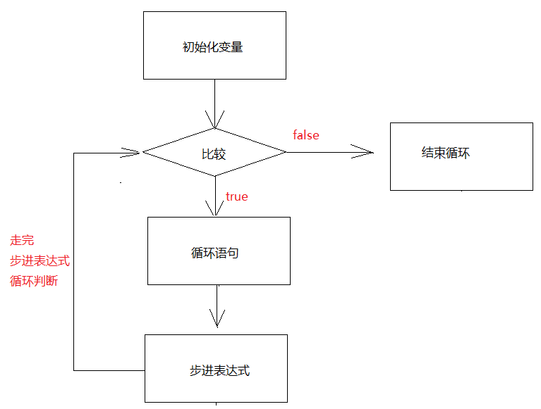

```java
public class Demo01For {
    public static void main(String[] args) {
        for (int i = 0;i<5;i++){
            System.out.println("我爱java");
        }
    }
}
```

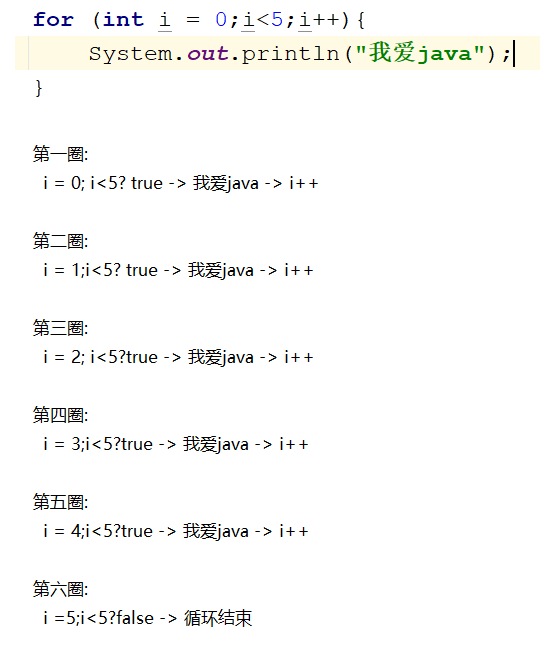

### 1.1练习

```java
for循环:求1-3之间的数据和,并把求和结果输出到控制台上
1+2+3
    
步骤:
  1.定义一个变量sum,用于接收两个数相加之和
  2.利用for循环1 2 3表示出来
  3.在循环体中做运算,两两相加,结果赋值给sum
  4.输出sum    
```

```java
public class Demo02For {
    public static void main(String[] args) {
        //1.定义一个变量sum,用于接收两个数相加之和
        int sum = 0;
        //2.利用for循环1 2 3表示出来
        for (int i = 1;i<=3;i++){
        //3.在循环体中做运算,两两相加,结果赋值给sum
            sum+=i;//sum = sum+i;
        }
        //4.输出sum
        System.out.println("sum = " + sum);
    }
}
```

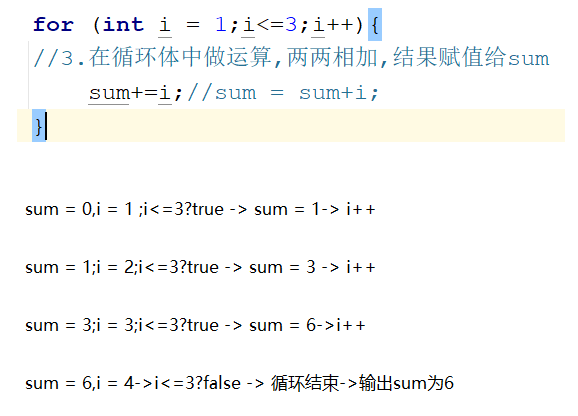

### 1.2练习

```java
需求:求出1-100的偶数和
步骤:
  1.定义一个变量sum,接收两个数的和
  2.利用for循环将1-100的数表述出来
  3.在循环体中判断,如果是偶数-> 相加,将结果赋值给sum
  4.输出sum
```

```java
public class Demo03For {
    public static void main(String[] args) {
        //1.定义一个变量sum,接收两个数的和
        int sum = 0;
        //2.利用for循环将1-100的数表述出来
        for (int i = 1;i<=100;i++){
        //3.在循环体中判断,如果是偶数-> 相加,将结果赋值给sum
            if (i%2==0){
                sum+=i;
            }
        }
        //4.输出sum
        System.out.println("sum = " + sum);
    }
}
```

### 1.3练习

```java
统计一下1-100之间的偶数个数
步骤:
  1.定义一个变量count,计数
  2.利用for循环将1-100的数表述出来
  3.在循环体中判断,如果是偶数-> count++
  4.输出count
```

```java
public class Demo04For {
    public static void main(String[] args) {
        //1.定义一个变量count,计数
        int count = 0;
        //2.利用for循环将1-100的数表述出来
        for (int i = 1;i<=100;i++){
        //3.在循环体中判断,如果是偶数-> count++
            if (i%2==0){
                count++;
            }
        }
        //4.输出count
        System.out.println("count = " + count);
    }
}
```

> 快速生成for循环快捷键:
>
>   次数.fori

## 2.while循环

```java
1.格式:
  初始化变量;
  while(比较){
    循环语句
    步进表达式
  }
2.执行流程:
  a.初始化变量
  b.比较,如果是true,执行循环语句,走步进表达式
  c.再比较,如果还是true,继续循环,走步进表达式
  d.再比较,直到比较为false,循环结束
```

```java
public class Demo01While {
    public static void main(String[] args) {
        int i = 0;
        while(i<5){
            System.out.println("我爱java");
            i++;
        }
    }
}
```

```java
public class Demo02While {
    public static void main(String[] args) {
        int sum = 0;
        int i = 1;
        while(i<=100){
            sum+=i;
            i++;
        }
        System.out.println("sum = " + sum);
    }
}
```

```java
public class Demo03While {
    public static void main(String[] args) {
        int sum = 0;
        int i = 1;
        while (i <= 100) {
            if (i % 2 == 0) {
                sum += i;
            }
            i++;
        }
        System.out.println("sum = " + sum);
    }
}
```

```java
public class Demo04While {
    public static void main(String[] args) {
        int count = 0;
        int i = 1;
        while (i <= 100) {
            if (i % 2 == 0) {
                count++;
            }
            i++;
        }
        System.out.println("count = " + count);
    }
}
```

