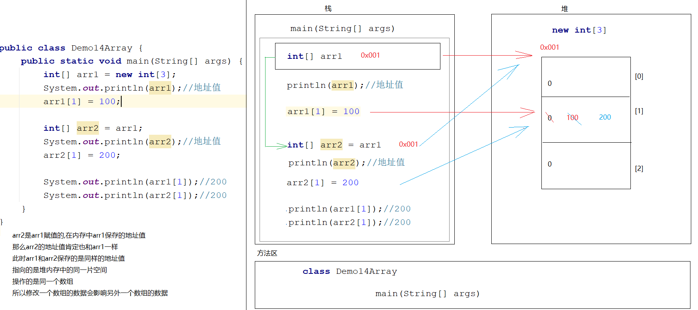

# day04.循环_数组

```java
课前回顾:
  1.idea:自己看
  2.Scanner:
    a.概述:java自带的一个类,在java.util
    b.作用:可以通过键盘录入的形式,将数据放大代码中参与运行
    c.使用:
      导包:import java.util.Scanner
      创建对象:Scanner 名字 = new Scanner(System.in)
      调用方法,实现键盘录入:
              nextInt()->录入int型的整数
              next()->录入字符串,遇到空格和回车就结束录入
              nextLine()->录入字符串,遇到回车就结束录入
    d.注意:自己创建的类类名不要叫Scanner
  3.switch:
    a.格式:
      switch(变量){
          case 常量值1:
              执行语句1;
              break;
          case 常量值2:
              执行语句2;
              break;
          case 常量值3:
              执行语句3;
              break;
              ...
                  default:
              执行语句n;
              break;
      }
    b.执行流程:
      用变量代表的值和下面的case做直接匹配,匹配到哪个case就执行哪个case对应的执行语句
    c.case的穿透性:
      如果break,就会一直往下穿透,直到遇到break或者switch代码结束了
          
  4.if格式1:
    a.格式:
      if(boolean表达式){
          执行语句
      }
    b.执行流程:
      先走if后面的boolean表达式,如果是true,就走if对应的执行语句
  5.if格式2:
    a.格式:
      if(boolean 表达式){
          执行语句1
      }else{
          执行语句2
      }
    b.执行流程:
      先走if后面的boolean表达式,如果是true,就走if后面的执行语句1,否则就走else对应的执行语句2
  6.if格式3:
    a.格式:
      if(boolean表达式){
          执行语句1
      }else if(boolean表达式){
          执行语句2
      }else if(boolean表达式){
          执行语句3
      }...else{
          执行语句n
      }
    b.执行流程:
      从if开始往下挨个判断,哪个if是true就走哪个if对应的执行语句,以上所有的if都没有判断成功,就走else对应的执行语句n
          
   7.for循环
     a.格式:
       for(初始化变量;比较;步进表达式){
           循环语句
       }
     b.执行流程:
       先走初始化变量,再比较,如果是true,走循环语句
       走步进表达式,再比较,如果还是true,继续走循环语句
       再走步进表达式,再比较,直到为false,循环结束
   8.while循环:
     a.格式:
       初始化变量;
       while(比较){
           循环语句
           步进表达式
       }
     b.执行流程:
       先走初始化变量,再比较,如果是true,走循环语句
       走步进表达式,再比较,如果还是true,继续走循环语句
       再走步进表达式,再比较,直到为false,循环结束

今日重点:
  1.会使用死循环,嵌套循环
  2.会使用Random在指定的范围内随机一个整数
  3.知道数组的作用以及特点
  4.知道数组怎么定义(静态初始化,动态初始化)
  5.会数组的操作(定义,存,取,遍历)
  6.知道操作数组时容易出现的异常问题    
```

# 第一章.while

### 1.1while练习

```java
需求：世界最高山峰是珠穆朗玛峰(8844.43米=8844430毫米)，假如我有一张足够大的纸，它的厚度是0.1毫米。请问，我折叠多少次，可以折成珠穆朗玛峰的高度? 27

步骤:
  1.定义一个变量,表示山峰的高度 mountain
  2.定义一个变量,表示纸的厚度 paper
  3.定义一个变量,统计折纸次数 count
  4.循环比较,如果纸的厚度小于山峰高度,我们就折(在原来纸的厚度的基础上*2)
  5.折一次,count++
```

```java
public class Demo01While {
    public static void main(String[] args) {
        //1.定义一个变量,表示山峰的高度 mountain
        int mountain = 8844430;
        //2.定义一个变量,表示纸的厚度 paper
        double paper = 0.1;
        //3.定义一个变量,统计折纸次数 count
        int count = 0;
        //4.循环比较,如果纸的厚度小于山峰高度,我们就折(在原来纸的厚度的基础上*2)
        while(paper<mountain){
            paper*=2;//paper = paper*2;
        //5.折一次,count++
            count++;
        }

        System.out.println("count = " + count);
    }
}
```

## 2.do...while循环(了解)

```java
1.格式:
  初始化变量;
  do{
      循环语句
      步进表达式
  }while(比较);
2.执行流程:
  a.初始化变量
  b.循环语句
  c.步进表达式
  d.比较,如果是true,继续循环,知道比较为false,循环结束
      
3.特点:
  至少执行一次
```

```java
public class Demo02DoWhile {
    public static void main(String[] args) {
        int i = 0;
        do{
            System.out.println("我爱java");
            i++;
        }while(i<10);
    }
}

```

## 3.循环的区别

```java
1.for循环中初始化的那个变量,出了for循环使用不了了 
2.while循环中初始化的那个变量,出了while还能使用
3.do...while至少执行一次    
```

## 4.循环控制关键字

```java
break:
  a.在switch中break代表结束switch
  b.在循环中,结束循环
continue:
  结束本次循环,进行下一次循环
```

```java
public class Demo01BreakAndContinue {
    public static void main(String[] args) {
        for (int i = 1; i <= 5; i++) {
            if (i==3){
                //break;//结束循环
                continue;//结束本次循环进入下一次循环
            }
            System.out.println("我爱java"+i);
        }
    }
}
```

## 5.死循环

```java
1.概述:一直循环
2.条件:比较永远是true
```

```java
public class Demo01DieFor {
    public static void main(String[] args) {
        int i = 0;
        for(;;){
            i++;
            System.out.println("我爱java"+i);
        }

/*        while(true){
            i++;
            System.out.println("我爱java"+i);
        }*/
    }
}

```

## 6.嵌套循环

```java
1.概述:循环中还有循环
2.执行流程:
  先走外层循环,再走内层循环,内层循环就一直循环,直到内层循环结束了,外层循环进入到下一次循环,直到外层循环都结束了,整体就结束了
```

```java
public class Demo01ForInFor {
    public static void main(String[] args) {
        for (int fen = 0; fen < 60; fen++) {
            for (int miao = 0; miao < 60; miao++) {
                System.out.println(fen+"分"+miao+"秒");
            }
        }

    }
}
```

```java
练习:打印矩形
```

```java
public class Demo02ForInFor {
    public static void main(String[] args) {
        for (int i = 0; i < 5; i++) {
            for (int j = 0; j < 5; j++) {
                System.out.print("* ");
            }
            System.out.println();
        }

    }
}
```

```java
练习:打印直角三角形
```

```java
*
**
***
****
*****    
```

```java
public class Demo03ForInFor {
    public static void main(String[] args) {
        for (int i = 0; i < 5; i++) {
            for (int j = 0; j <= i; j++) {
                System.out.print("* ");
            }
            System.out.println();
        }
    }
}
```

# 第三章.Random随机数

> 1.学习方式:和Scanner一样

```java
1.概述:java自带的一个类
2.作用:在指定的范围内随机一个整数
3.使用:
  a.导包: import java.util.Random
  b.创建对象: Random 对象名 = new Random()
  c.调用方法,实现生成随机数
    对象名.nextInt() -> 在int取值范围内随机一个数
      
    对象名.nextInt(int bound) -> 在0-(bound-1)之间随机一个整数 
      
    对象名.nextDouble()-> 在0.0到1.0之间随机  
```

```java
public class Demo01Random {
    public static void main(String[] args) {
        Random rd = new Random();
        int data1 = rd.nextInt();
        System.out.println("data1 = " + data1);
        System.out.println("===================");
        double data2 = rd.nextDouble();
        System.out.println("data2 = " + data2);
    }
}

```

```java
在1-10之间随机一个数: nextInt(10)+1 -> (0-9)+1 -> 1-10
在1-100之间随机一个数: nextInt(100)+1 -> (0-99)+1 -> 1-100
在100-999之间随机一个数: nextInt(900)+100 -> (0-899)+100 -> 100-999
```

```java
public class Demo02Random {
    public static void main(String[] args) {
        Random rd = new Random();
        int data1 = rd.nextInt(10);
        System.out.println("data1 = " + data1);
        System.out.println("=================");
        //在1-10之间随机一个数: nextInt(10)+1 -> (0-9)+1 -> 1-10
        int data2 = rd.nextInt(10)+ 1;
        System.out.println("data2 = " + data2);
        System.out.println("=================");
        //在1-100之间随机一个数: nextInt(100)+1 -> (0-99)+1 -> 1-100
        int data3 = rd.nextInt(100) + 1;
        System.out.println("data3 = " + data3);
        System.out.println("=================");
        //在100-999之间随机一个数: nextInt(900)+100 -> (0-899)+100 -> 100-999
        int data4 = rd.nextInt(900) + 100;
        System.out.println("data4 = " + data4);

    }
}

```

```java
练习:完成一个猜数字小游戏
步骤:
  1.创建Random和Scanner对象
  2.调用Random中的nextInt方法随机一个数 rdNumber
  3.调用Scanner中的nextInt方法键盘录入一个数 scNumber
  4.如果scNumber>rdNumber,证明猜大了
  5.如果scNumber<rdNumber,证明猜小了
  6.如果scNumber=rdNumber,证明猜中了
```

```java
public class Demo03Random {
    public static void main(String[] args) {
        //1.创建Random和Scanner对象
        Random rd = new Random();
        Scanner sc = new Scanner(System.in);
        //2.调用Random中的nextInt方法随机一个数 rdNumber
        int rdNumber = rd.nextInt(900) + 100;
        while (true) {
            //3.调用Scanner中的nextInt方法键盘录入一个数 scNumber
            System.out.println("请您猜一个数:");
            int scNumber = sc.nextInt();
            //4.如果scNumber>rdNumber,证明猜大了
            //5.如果scNumber<rdNumber,证明猜小了
            //6.如果scNumber=rdNumber,证明猜中了
            if (scNumber > rdNumber) {
                System.out.println("对不起,您猜大了!");
            } else if (scNumber < rdNumber) {
                System.out.println("对不起,您猜小了!");
            } else {
                System.out.println("恭喜您,中奖了!中了一个大嘴巴子!");
                break;
            }
        }

    }
}

```

# 第四章.数组的介绍以及定义

```java
1.概述:容器,数组本身属于引用数据类型
2.特点:
  a.既可以存储基本数据类型的数据,也能存储引用数据类型的数据
  b.定长(在定义数组的时候,长度定多长,就意味着最多能存多少个数据,后续不能更改数组的长度)  
3.定义格式:
  a.动态初始化:
    数据类型[] 数组名 = new 数据类型[数组的长度]
    数据类型 数组名[] = new 数据类型[数组的长度] 
        
    动态初始化各部分解释:
      数据类型:规定了数组中存储元素的数据类型
      []:代表的是数组,一个[]代表一维数组
      数组名:见名知意
      new:创建数组,代表真正将数组创建了出来
      数据类型:和等号前面的数据类型保持一致
      [数组的长度]:规定数组最多能存多少个数据(元素)  
          
   b.静态初始化:
     数据类型[] 数组名 = new 数据类型[]{元素1,元素2...}->不推荐
     数据类型 数组名[] = new 数据类型[]{元素1,元素2...}->不推荐
         
   c.简化静态初始化:
     数据类型[] 数组名 = {元素1,元素2...} -> 推推荐
```

```java
public class Demo01Array {
    public static void main(String[] args) {
        //动态初始化
        int[] arr1 = new int[3];
        String[] arr2 = new String[3];

        //静态初始化
        int[] arr3 = {1,2,3,4,5};
        String[] arr4 = {"黑猫警长","百变小樱","天线宝宝","熊出没","巴啦啦小魔仙","灌篮高手","网球王子","七龙珠"};
    }
}
```

# 第五章.操作数组

## 1.获取数组的长度

```java
格式:
  数组名.length
注意:length后面不要加小括号,因为length不是一个方法,而是数组的一个属性      
```

```java
public class Demo02Array {
    public static void main(String[] args) {
        String[] arr = {"立春","雨水","惊蛰","春分","清明","谷雨","立夏","小满","芒种","夏至","小暑"
        ,"大暑","立秋","处暑","白露","秋分","寒露","霜降","立冬","小雪","大雪","冬至","小寒","大寒"};

        int length = arr.length;
        System.out.println("length = " + length);
    }
}

```

## 2.索引

```java
1.概述:元素在数组中的存储位置(可以看做是每一个元素的编号,下标)
2.特点:
  a.索引从0开始,最大索引为(数组长度-1)
  b.索引唯一  
3.注意:
  我们以后存储元素,获取元素都是根据索引来操作      
```


## 3.存储元素

```java
1.格式:
  数组名[索引值] = 值 -> 将等号右边的值保存到数组中指定索引位置上
  arr[0] = "张三"    
```

```java
public class Demo03Array {
    public static void main(String[] args) {
        String[] arr1 = new String[3];
        arr1[0] = "杨过";
        arr1[1] = "小龙女";
        arr1[2] = "尹志平";
        
        int[] arr2 = new int[3];
        arr2[0] = 100;
        arr2[1] = 200;
        arr2[2] = 300;
    }
}
```

```java
public class Demo04Array {
    public static void main(String[] args) {
        String[] arr = new String[3];
        Scanner sc = new Scanner(System.in);
        //String data1 = sc.next();
        //String data2 = sc.next();
        //String data3 = sc.next();
        //
        //arr[0] = data1;
        //arr[1] = data2;
        //arr[2] = data3;
        
        //arr[0] = sc.next();
        //arr[1] = sc.next();
        //arr[2] = sc.next();
        /*for (int i = 0; i < 3; i++) {
            arr[i] = sc.next();
        }*/

        for (int i = 0; i < arr.length; i++) {
            arr[i] = sc.next();
        }
    }
}
```

```java
public class Demo05Array {
    public static void main(String[] args) {
        int[] arr = new int[3];
        Random rd = new Random();
        for (int i = 0; i < arr.length; i++) {
            arr[i] = rd.nextInt(10);
        }
    }
}
```

```java
public class Demo06Array {
    public static void main(String[] args) {
        int[] arr1 = {1,2,3,4,5};
        //定义一个数组arr2,将arr1中的元素复制到arr2中
        //创建一个长度为5的arr2数组
        int[] arr2 = new int[arr1.length];
        
        //arr2[0] = arr1[0]; //将arr1的0索引位置上的元素赋值到arr2数组的0索引上
        //arr2[1] = arr1[1]; 
        //arr2[2] = arr1[2]; 
        //arr2[3] = arr1[3]; 
        //arr2[4] = arr1[4]; 

        for (int i = 0; i < arr1.length; i++) {
            arr2[i] = arr1[i];
        }
    }
}
```

## 4.获取元素

```java
1.注意:我们写得代码,以及代码中包含的数据算是一个一个的应用程序,应用程序运行起来就肯定会进入到内存中,内存会为这些数据开辟一个一个的内存空间,并为其自动分配一个唯一标识,这个唯一标识叫做->地址值
    
2.获取元素格式:
  数组名[索引值]
      
3.注意:
  a.直接输出数组名,输出的为内存地址
  b.数组中的元素都是有默认值的
    整数: 0
    小数: 0.0
    字符: '\u0000'  -> 代表空白字符,对应的int值为0
    布尔: false
    引用: null
```

```java
public class Demo07Array {
    public static void main(String[] args) {
        int[] arr1 = new int[3];

        System.out.println(arr1[0]);//默认值0
        System.out.println(arr1[1]);//默认值0
        System.out.println(arr1[2]);//默认值0

        arr1[0] = 100;
        arr1[1] = 200;
        arr1[2] = 300;

        System.out.println(arr1);
        System.out.println(arr1[0]);
        System.out.println(arr1[1]);
        System.out.println(arr1[2]);
    }
}
```

```java
public class Demo08Array {
    public static void main(String[] args) {
        String[] arr = new String[3];
        System.out.println(arr[0]);//null
        System.out.println(arr[1]);//null
        System.out.println(arr[2]);//null

        arr[0] = "张三丰";
        arr[1] = "张翠山";
        arr[2] = "张无忌";

        System.out.println(arr[0]);
        System.out.println(arr[1]);
        System.out.println(arr[2]);
    }
}
```


## 5.遍历数组

```java
1.遍历:
  将元素一个一个从数组中获取出来
```

```java
public class Demo09Array {
    public static void main(String[] args) {
        String[] arr = {"许嵩","张杰","周杰伦","胡歌","郑源"};
        for (int i = 0; i < 5; i++) {
            System.out.println(arr[i]);
        }

        System.out.println("===============");

        for (int i = 0; i < arr.length; i++) {
            System.out.println(arr[i]);
        }

        System.out.println("==============");

        /*
          遍历快捷键
          数组名.fori
         */
        for (int i = 0; i < arr.length; i++) {
            System.out.println(arr[i]);
        }
    }
}

```

> ```java
> 遍历快捷键:
>   数组名.fori
> ```

# 第六章.操作数组时两个常见的问题

## 1.数组索引越界异常->ArrayIndexOutOfBoundsException

```java
1.原因:
  操作的索引超出了数组索引范围
```

```java
public class Demo10Array {
    public static void main(String[] args) {
        //数组索引越界异常-> ArrayIndexOutOfBoundsException
        int[] arr = {1,2,3,4,5};
       /* for (int i = 0; i <= arr.length; i++) {
            System.out.println(arr[i]);
        }*/

        System.out.println("================");

        int[] arr1 = new int[3];
        arr1[0] = 100;
        arr1[1] = 200;
        arr1[2] = 300;
        arr1[3] = 400;//越界,因为arr1没有3索引
    }
}
```


## 2.空指针异常_NullPointerException

```java
1.原因:
  当引用为null时,还操作了此数据
```

```java
public class Demo11Array {
    public static void main(String[] args) {
        int[] arr = {1,2,3};
        System.out.println(arr.length);
        System.out.println("============");
        arr = null;
        System.out.println(arr.length);
    }
}
```


> 以上两个问题:我们需要知道原因即可

# 第七章.数组内存

```java
1.内存:指的是运行内存
      开发出来的程序,以及程序中的数据都会在内存中出现,都会占用内存
    
2.在java的世界里,将内存划分成了5块    
  堆(Heap)(掌握)
      每new一次,都会进堆,会在堆内存中开辟一个空间,堆内存会为此空间分配一个地址值
      而且在堆内存中的数据都是有默认值的
      整数:0
      小数:0.0
      布尔:false
      字符:'\u0000'
      引用:null
          
      堆内存中的数据如果没有用了,jvm会认为此数据是垃圾,此时会调用gc(垃圾回收器),将其清理回收    
  栈(Stack)(掌握)
      专门运行方法的,所有方法的运行都会进栈运行    
          
      方法运行,自动进栈,方法运行完毕,自动弹栈
          
  方法区(Method Area)(掌握)
      可以将方法区看做成是代码运行的"预备区"
          
  本地方法栈(Native Method Stack)(了解)
      专门存本地方法的:方法上带native关键字
          
      本地方法不是我们写的,是c语言写的,c语言没有对我们开源,所以本地方法看不到具体实现
      有很多功能java实现不了,本地方法可以看做是对java功能的一个扩充    
          
  寄存器(pc Register)(了解中的了解中的了解) : 和CPU有关
```


## 1.一个数组内存图


## 2.两个数组内存图

```java
arr1和arr2是两个不同的空间,修改一个空间的数据不会影响另外一个空间中的数据
```


## 3.两个数组指向同一片内存空间

```java
arr2是arr1赋值的,在内存中arr1保存的地址值
那么arr2的地址值肯定也和arr1一样
此时arr1和arr2保存的是同样的地址值
指向的是堆内存中的同一片空间
操作的是同一个数组
所以修改一个数组的数据会影响另外一个数组的数据
```



# 第八章.练习

## 7.1练习

```java
第一题:需求:求出数组中的元素最大值
步骤:
  1.创建数组,存储数据
  2.定义一个变量,接收第一个元素 max
  3.遍历数组,将每一个元素获取出来
  4.用max和遍历出来的元素比较,如果遍历出来的大,将大的元素重新赋值给max
  5.输出max
```


```java
public class Demo01GetMax {
    public static void main(String[] args) {
       // 1.创建数组,存储数据
        int[] arr = {5,3,5,6,8,4,5,7};
       // 2.定义一个变量,接收第一个元素 max
        int max = arr[0];
       // 3.遍历数组,将每一个元素获取出来
        for (int i = 1; i < arr.length; i++) {
       // 4.用max和遍历出来的元素比较,如果遍历出来的大,将大的元素重新赋值给max
            if (max<arr[i]){
                max = arr[i];
            }
        }
       // 5.输出max
        System.out.println("max = " + max);
    }
}
```

