# day05.数组_方法

```java
课前回顾:
  1.do...while
    a.格式:
      初始化变量;
      do{
          循环语句
          步进表达式
      }while(比较);
    b.执行流程:
      初始化变量,循环语句,步进表达式,比较,如果是true,继续循环,直到比较为false,循环结束
    c.特点:
      至少执行一次
  2.break和continue
    a.break:结束循环
    b.continue:结束本次循环,进入下一次循环
  3.死循环:比较永远是true
  4.嵌套循环:先走外层循环,再走内层循环,内层循环就一直循环,直到内层循环结束,外层循环进入下一次循环
            直到外层循环都结束了,整体结束
  5.Random:java自带的类
    a.作用:在指定范围内随机一个数
    b.使用:
      导包:import java.util.Random
      创建对象:Random 对象名 = new Random()
      调用方法:
              nextInt()在int取值范围内随机
              nextDouble()在0.0到1.0之间随机
              nextInt(int bound)在0-(bound-1)之间随机一个数
  6.数组:
    a.概述:容器,数组本身属于引用数据类型
    b.特点:
      既可以存储基本类型数据,还可以存储引用类型数据
      定长
    c.定义:
      动态初始化:
        数据类型[] 数组名 = new 数据类型[数组长度]
        数据类型 数组名[] = new 数据类型[数组长度]    
      静态初始化:
        数据类型[] 数组名 = new 数据类型[]{元素1,元素2,元素3...}
        数据类型 数组名[] = new 数据类型[]{元素1,元素2,元素3...}
      简化静态初始化:
        数据类型[] 数组名 = {元素1,元素2...}

    d.数组的操作:
      获取长度:数组名.length
      获取元素:数组名[索引值]
      存储元素:数组名[索引值] = 元素
      遍历元素:数组名.fori
      索引:元素在数组中的存储位置
          从0开始,最大索引为数组长度-1
          唯一
      操作数组两个问题:
          ArrayIndexOutOfBoundsException:数组索引越界异常->操作的索引超出了数组索引范围
          NullPointerException:空指针异常->引用为null之后还在操作
    e.内存结构:
      堆 栈 方法区 本地方法栈 寄存器
          
今日重点:
  除了练习,都是重点
```

# 第一章.数组操作

## 练习

### 1.练习

```java
随机产生10个[0,100]之间整数，统计既是3又是5，但不是7的倍数的个数

步骤:
  1.创建Random对象以及数组
  2.定义一个变量,统计个数 count
  3.循环随机循环存
  4.遍历数组,将每一个元素获取出来
  5.判断如果 元素%3==0 && 元素%5==0 && 元素%7!=0
  6.如果判断成功,count++
  7.输出count    
```

```java
public class Demo01Array {
    public static void main(String[] args) {
        //1.创建Random对象以及数组
        Random rd = new Random();
        int[] arr = new int[10];
        //2.定义一个变量,统计个数 count
        int count = 0;
        //3.循环随机循环存
        for (int i = 0; i < arr.length; i++) {
            arr[i] = rd.nextInt(101);
        }
        //4.遍历数组,将每一个元素获取出来

        for (int i = 0; i < arr.length; i++) {
        //5.判断如果 元素%3==0 && 元素%5==0 && 元素%7!=0
            if (arr[i]%3==0 && arr[i]%5==0 && arr[i]%7!=0){
        //6.如果判断成功,count++
               count++;
            }
        }
        //7.输出count
        System.out.println("count = " + count);
    }
}

```

### 2.练习

```java
用一个数组存储本组学员的姓名，从键盘输入，并遍历显示
```

```java
public class Demo02Array {
    public static void main(String[] args) {
        String[] arr = new String[3];
        Scanner sc = new Scanner(System.in);
        for (int i = 0; i < arr.length; i++) {
            System.out.println("请你输入第"+(i+1)+"个学员姓名:");
            arr[i] = sc.next();
        }

        for (int i = 0; i < arr.length; i++) {
            System.out.println(arr[i]);
        }
    }
}

```

### 3.练习

```java
需求:
  1.定义一个数组 int[] arr = {1,2,3,4}
  2.遍历数组,输出元素按照[1,2,3,4]
```

```java
public class Demo03Array {
    public static void main(String[] args) {
        int[] arr = {1, 2, 3, 4};
        System.out.print("[");
        for (int i = 0; i < arr.length; i++) {
            //如果i的值变化到了最大索引,证明输出的即将是最后一个元素
            if (i == arr.length - 1) {
                System.out.print(arr[i] + "]");
            } else {
                System.out.print(arr[i] + ", ");
            }
        }
    }
}
```

### 4.练习

```java
键盘录入一个整数,找出整数在数组中存储的索引位置
    
步骤:
  1.创建Scanner对象
  2.定义数组,随意存点数据
  3.键盘录入一个整数 data
  4.遍历数组,将每一个元素获取出来
  5.在遍历的过程中,用data和遍历出来的元素比较,如果相等输出对应的索引
```

```java
public class Demo04Array {
    public static void main(String[] args) {
        //1.创建Scanner对象
        Scanner sc = new Scanner(System.in);
        //2.定义数组,随意存点数据
        int[] arr = {11, 22, 33, 44, 55, 66, 33};
        //3.键盘录入一个整数 data
        int data = sc.nextInt();
        //4.遍历数组,将每一个元素获取出来
        for (int i = 0; i < arr.length; i++) {
            if (data == arr[i]) {
                //5.在遍历的过程中,用data和遍历出来的元素比较,如果相等输出对应的索引
                System.out.println(i);
            }
        }
    }
}

```

```java
问题升级:
  如果查不到,输出对应的提示(一般我们输出负数)
```

```java
public class Demo04Array {
    public static void main(String[] args) {
        //1.创建Scanner对象
        Scanner sc = new Scanner(System.in);
        //2.定义数组,随意存点数据
        int[] arr = {11, 22, 33, 44, 55, 66, 33};
        //3.键盘录入一个整数 data
        int data = sc.nextInt();

        //定义一个变量,做标记
        int flag = 0;


        //4.遍历数组,将每一个元素获取出来
        for (int i = 0; i < arr.length; i++) {
            if (data == arr[i]) {
                //5.在遍历的过程中,用data和遍历出来的元素比较,如果相等输出对应的索引
                System.out.println(i);
                flag++;
            }
        }

        //出了循环,再次判断flag,如果还是0,证明在遍历的过程中,if根本没有进去过
        if (flag==0){
            System.out.println("没找到");
        }
    }
}

```

# 第二章.数组复杂操作

## 1.练习

```java
数组扩容
    
需求:
  定义一个数组:int[] arr1 = {1,2,3,4,5}
             将数组由原来的长度扩容到10
```

```java
public class Demo05Array {
    public static void main(String[] args) {
        //定义一个数组:int[] arr1 = {1,2,3,4,5}
        //将数组由原来的长度扩容到10

        int[] arr1 = {1,2,3,4,5};

        //定义新的新数组,长度定位10
        int[] arr2 = new int[10];

        //遍历arr1,将arr1中的数据放到arr2中

        for (int i = 0; i < arr1.length; i++) {
            arr2[i] = arr1[i];
        }

        /*for (int i = 0; i < arr2.length; i++) {
            System.out.print(arr2[i]+" ");
        }*/

        //将arr2的地址值赋值给arr1
        arr1 = arr2;

        for (int i = 0; i < arr1.length; i++) {
            System.out.print(arr1[i]+" ");
        }
    }
}
```

## 2.练习

```java
数组合并
```

```java
public class Demo06Array {
    public static void main(String[] args) {
        //1.定义两个数组
        int[] arr1 = {1,2,3};
        int[] arr2 = {4,5,6};
        //2.定义新数组
        int[] newArr = new int[arr1.length+ arr2.length];
        //3.遍历arr1,将arr1的元素放到newArr
        for (int i = 0; i < arr1.length; i++) {
            newArr[i] = arr1[i];
        }

        /*for (int i = 0; i < newArr.length; i++) {
            System.out.print(newArr[i]+" ");
        }*/

        int len = arr1.length;
        //4.遍历arr2,往newArr中存储
        for (int i = 0; i < arr2.length; i++) {
            /*
              第一次循环: newArr[3+0] = arr2[0]
              第二次循环: newArr[3+1] = arr2[1]
              第三次循环: newArr[3+2] = arr2[2]
             */
            newArr[len+i] = arr2[i];
        }

        for (int i = 0; i < newArr.length; i++) {
            System.out.print(newArr[i]+" ");
        }
    }
}

```

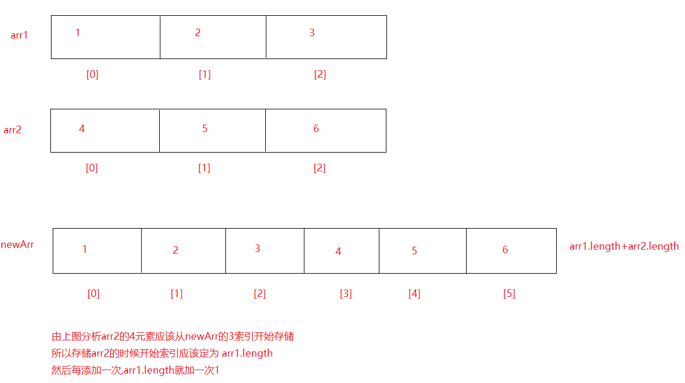

# 第三章.二维数组

## 2.1二维数组的定义格式

```java
1.概述:数组中套着多个一维数组
2.定义:
  动态初始化
     数据类型[][] 数组名 = new 数据类型[m][n]
     数据类型 数组名[][] = new 数据类型[m][n]
     数据类型[] 数组名[] = new 数据类型[m][n] 
      
     m:代表的是二维数组的长度->二维数组中最多能放几个一维数组
     n:代表的是每一个一维数组的长度->每一个一维数组中最多能放几个元素
         
  静态初始化
     数据类型[][] 数组名 = new 数据类型[][]{{元素1,元素2...},{元素1,元素2...}...}
     数据类型 数组名[][] = new 数据类型[][]{{元素1,元素2...},{元素1,元素2...}...}
     数据类型[] 数组名[] = new 数据类型[][]{{元素1,元素2...},{元素1,元素2...}...}  
   
  简化静态初始化:
     数据类型[][] 数组名 = {{元素1,元素2...},{元素1,元素2...}...}

3.特殊的定义方式:
  数据类型[][] 数组名 = new 数据类型[m][]
      只指明了二维数组的长度,但是后面没有指定一维数组长度,那么一维数组是不会被创建出来的
```

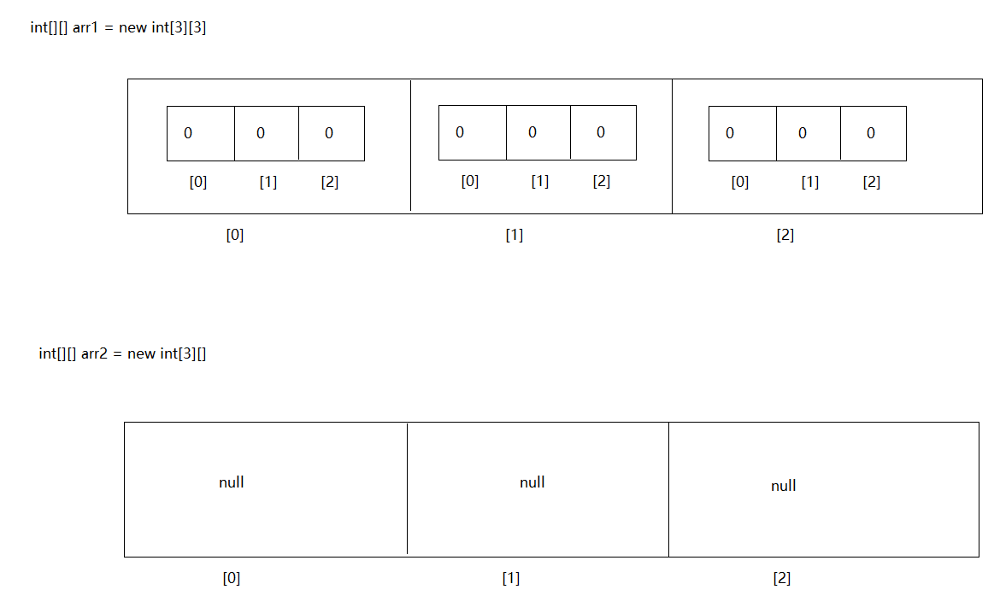

```java
public class Demo01Array {
    public static void main(String[] args) {
        //动态初始化
        int[][] arr1 = new int[3][3];
        int arr2[][] = new int[3][3];
        int[] arr3[] = new int[3][3];

        //静态初始化
        String[][] arr4 = {{"白骨精","蜘蛛精","老鼠精"},{"郭嘉","大乔"},{"宋江","李逵","卢俊义"}};

        System.out.println("================");

        int[][] arr5 = new int[3][3];
        for (int i = 0; i < arr5.length; i++) {
            System.out.println(arr5[i]);
        }

        System.out.println("================");

        int[][] arr6 = new int[3][];
        for (int i = 0; i < arr6.length; i++) {
            System.out.println(arr6[i]);
        }
    }
}

```

## 2.2获取二维数组长度

```java
1.格式:
  数组名.length
```

```java
public class Demo02Array {
    public static void main(String[] args) {
        String[][] arr1 = {{"乔峰","虚竹","段誉"},{"张三丰","张翠山","张无忌"},{"郭靖","黄蓉"}};
        System.out.println(arr1.length);
        //获取每一个一维数组长度
        for (int i = 0; i < arr1.length; i++) {
            System.out.println(arr1[i].length);
        }
    }
}
```

## 2.3获取二维数组中的元素

```java
1.格式:
  数组名[i][j]
      
  i:代表的是一维数组在二维数组中的索引位置
  j:代表的是元素在一维数组中的索引位置
```

```java
public class Demo03Array {
    public static void main(String[] args) {
        String[][] arr1 = {{"乔峰","虚竹","段誉"},{"张三丰","张翠山","张无忌"},{"郭靖","黄蓉"}};
        System.out.println(arr1[0][0]);
        System.out.println(arr1[1][0]);
        System.out.println(arr1[2][1]);
    }
}
```

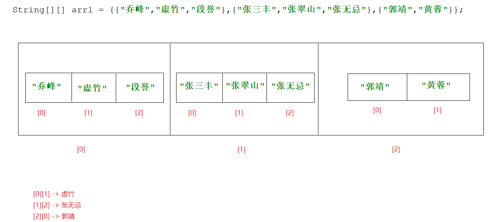

## 2.4二维数组中存储元素

```java
1.格式:
  数组名[i][j] = 值
      
  i:代表的是一维数组在二维数组中的索引位置
  j:代表的是元素在一维数组中的索引位置
```

```java
public class Demo04Array {
    public static void main(String[] args) {
        int[][] arr1 = new int[2][2];
        arr1[0][0] = 100;
        arr1[0][1] = 200;
        arr1[1][0] = 1000;
        arr1[1][1] = 2000;

        System.out.println(arr1[0][0]);
        System.out.println(arr1[0][1]);
        System.out.println(arr1[1][0]);
        System.out.println(arr1[1][1]);
    }
}
```

## 2.5.二维数组的遍历

```java
1.遍历思想:
  a.先将每一个一维数组从二维数组中遍历出来
  b.再将元素从一维数组中遍历出来
```

```java
public class Demo05Array {
    public static void main(String[] args) {
        String[][] arr1 = {{"乔峰","虚竹","段誉"},{"张三丰","张翠山","张无忌"},{"郭靖","黄蓉"}};
        for (int i = 0; i < arr1.length; i++) {
            for (int j = 0; j < arr1[i].length; j++) {
                System.out.println(arr1[i][j]);
            }
        }
    }
}

```

## 2.6二维数组内存图

```java
public class Demo06Array {
    public static void main(String[] args) {
        int[][] arr1 = new int[3][];

        arr1[1] = new int[]{1,2,3};

        arr1[2] = new int[3];

        arr1[2][1] = 100;
    }
}
```

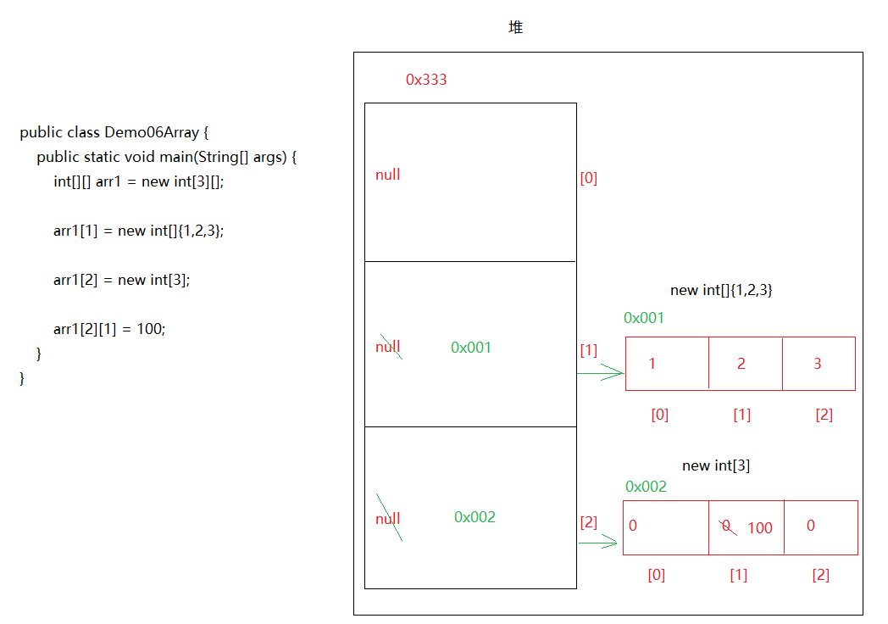

# 第四章.方法的使用

## 1.方法介绍以及简单方法定义(无参无返回值)

```java
1.问题描述:将来我们会开发不同的功能,那么如果不同的功能相关代码放在main方法中,那么会使main方法太乱,不好维护
  问题解决:不同的功能定义成不同的方法,给每一个方法取个名字(方法名),什么时候想执行该功能,就直接调用该功能的方法名,那么方法中的具体代码就会自动执行
      
2.什么叫做方法:
  方法就是功能,就是拥有功能性代码的代码块,开发中一个功能就应该定义一个方法

3.通用的定义格式:
  修饰符 返回值类型 方法名(参数){
      方法体;
      return 返回值结果
  }

4.为了好学方法,我们可以分为四种具体的方法
  a.无参无返回值方法
  b.有参无返回值方法
  c.无参有返回值方法
  d.有参有返回值方法
    
5.注意:
  a.方法不调用不执行
  b.方法之间不能互相嵌套,是平级关系
  c.方法的执行顺序只和调用顺序有关
  d.main方法是jvm自动调用的    
```

```java
1.无参无返回值方法定义格式:
  public static void 方法名(){
      方法体
  }
2.调用:直接调用
  在别的方法中:方法名()
```

```java
public class Demo01Method {
    public static void main(String[] args) {
        farmer();
        cooker();
        cooker();
        me();
    }
    //农民伯伯
    public static void farmer(){
        System.out.println("播种");
        System.out.println("浇水");
        System.out.println("施肥");
        System.out.println("拔草");
        System.out.println("收割");
    }

    //厨师
    public static void cooker(){
        System.out.println("洗菜");
        System.out.println("切菜");
        System.out.println("炒菜");
        System.out.println("装盘");
    }
    //顾客
    public static void me(){
        System.out.println("洗手");
        System.out.println("吃菜");
    }
}

```

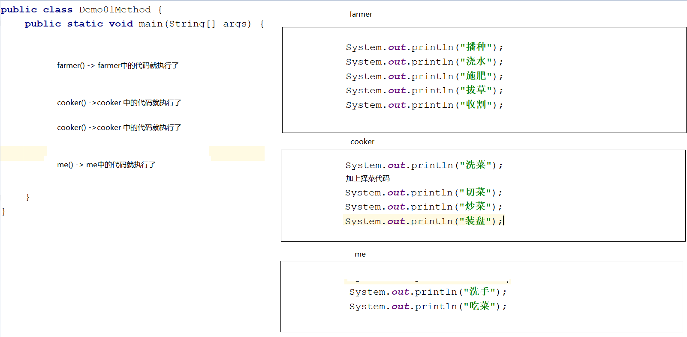

## 2.无参数无返回值的方法执行流程

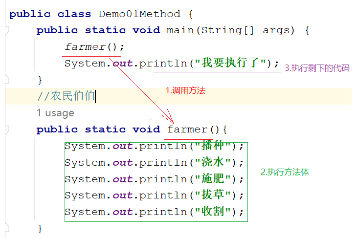


> 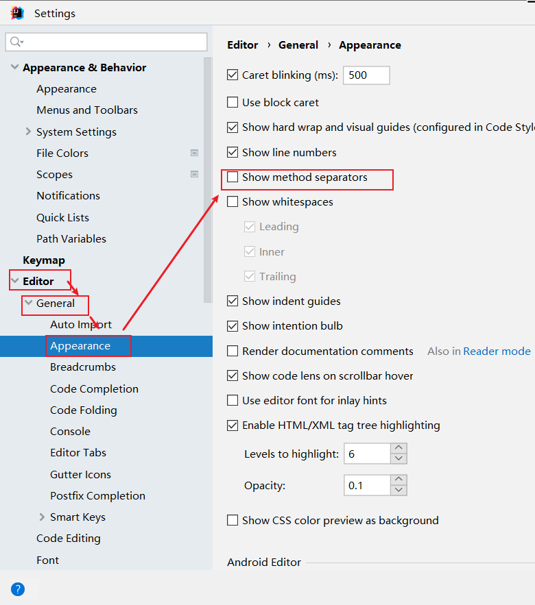

## 3.方法定义各部分解释

```java
1.通用定义格式:
  修饰符 返回值类型 方法名(参数){
      方法体
      return 结果
  }
2.各部分解释:
  a.修饰符:public static
  b.返回值类型:
    返回值数据的数据类型
    比如:return 1 ->返回值类型为int
        return "" ->返回值类型为String
        return 2.5->返回值类型为double
        
    如果没有返回值(说白了就是方法体中没有写return 结果),返回值类型写成void
    void 代表 没有返回值
        
    如果写了return 结果,那么就不能写void,只能写具体的返回值类型
        
  c.方法名:见名知意
  d.参数:进入到方法内部参与执行的数据
        格式:数据类型 变量名,数据类型 变量名
  e.方法体:实现该方法的具体代码
  f.return 结果:方法执行到最后得出的一个结果,将其返回
```

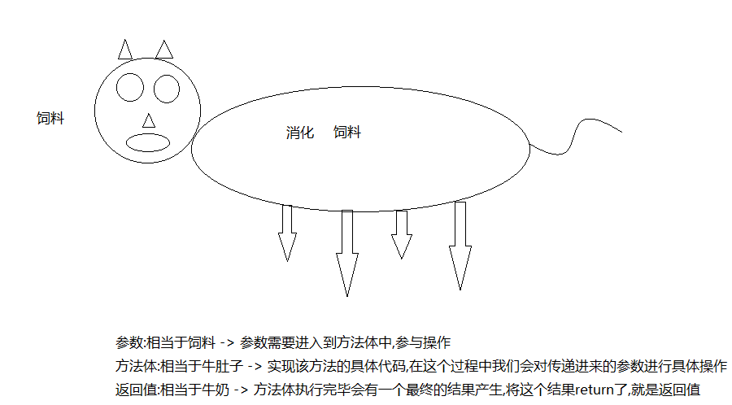

## 4.有参数无返回值的方法定义和执行流程

```java
1.格式:
  public static void 方法名(参数){
      方法体
  }

2.调用:
  直接调用: 方法名(具体的值)
```

```java
需求:定义一个方法,实现两个整数相加
```

```java
public class Demo02Method {
    public static void main(String[] args) {
        //直接调用
        sum(10,20);
    }

    //有参无返回值的方法
    public static void sum(int a,int b){
        int sum = a+b;
        System.out.println("sum = " + sum);
    }
}
```

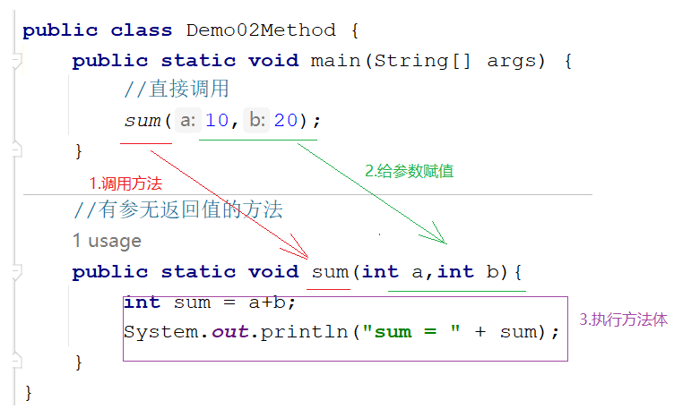

## 5.无参数有返回值定义以及执行流程

```java
1.格式: 
  public static 返回值类型 方法名(){
      方法体
      return 结果
  }

2.调用:  返回值返回给了谁?哪里调用结果就返回给哪里
    
  a.打印调用: sout(方法名())
  b.赋值调用: 数据类型 变量名 = 方法名()    
```

```java
需求:定义一个方法,实现两个整数相加,将结果返回
```

```java
public class Demo03Method {
    public static void main(String[] args) {
        //打印调用
        System.out.println(sum());

        //赋值调用-> 建议使用
        int result = sum();
        System.out.println("result = " + result);
        if (result>100){
            System.out.println("结果大于100");
        }else{
            System.out.println("结果小于100");
        }
    }

    public static int sum(){
        int a = 10;
        int b = 20;
        int sum = a+b;
        return sum;//30
    }
}
```

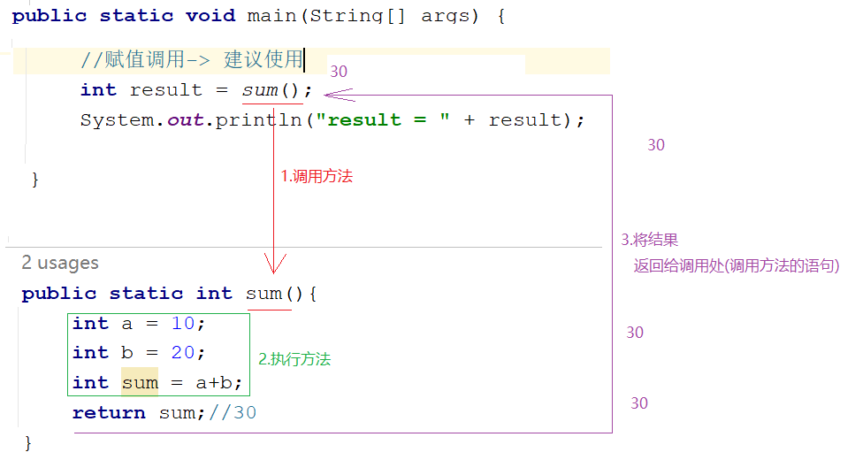

## 6.有参数有返回值定义以及执行流程

```java
1.格式:
  public static 返回值类型 方法名(参数){
      方法体
      return 结果
  }

2.调用:
  a.打印调用: sout(方法名(具体的值))
  b.赋值调用: 数据类型 变量名 = 方法名(具体的值)
```

```java
定义一个方法,实现两个整数相加,将结果返回
```

```java
public class Demo04Method {
    public static void main(String[] args) {
        int sum = sum(10, 20);
        System.out.println("sum = " + sum);
    }
    public static int sum(int a,int b){
        int sum = a+b;
        return sum;
        //return a+b;
    }
}

```

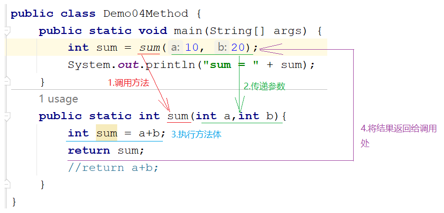

## 7.形式参数和实际参数区别

```java
形式参数:在定义方法的时候形式上定义的参数,此时还没有具体的值,简称形参
实际参数:在调用方法的时候,给形参传递的具体的值,简称实参
```


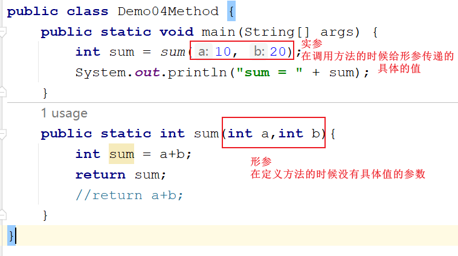

## 8.参数和返回值使用的时机

```java
1.参数:
  当想将一个方法中的数据传递到另外一个方法中,那么被调用方法需要定义参数,调用时传递想要传递过去的数据
2.返回值:
  调用方法时,想要此方法的结果,去参与其他操作,那么被调用的方法需要将自己的结果返回
```

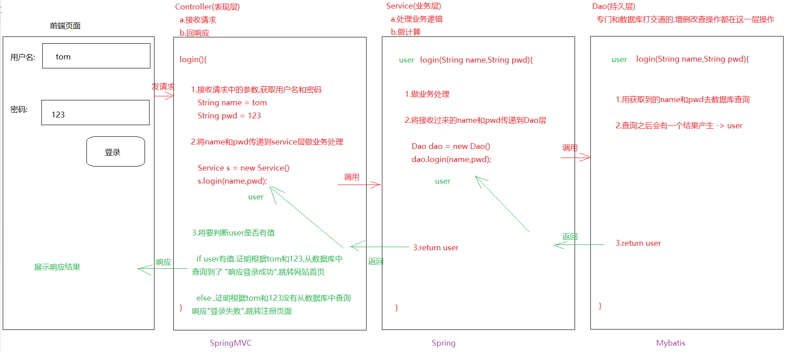

## 9.变量作为实参使用

```java
需求:定义一个方法,比较两个整数的大小,如果第一个比第二个大,返回true,否则返回false
方法三要素:
  参数:要
  返回值:要
  方法名:要
```

```java
public class Demo05Method {
    public static void main(String[] args) {
        int a = 10;
        int b = 20;
        /*
          a = 10
          b = 20

          传递a和b,仅仅是传递a和b的值,不是变量本身
         */
        boolean compare = compare(a, b);
        System.out.println("compare = " + compare);
    }

    public static boolean compare(int a,int b){
        if (a>b){
            return true;
        }else{
            return false;
        }
    }
}

```

# 第五章.方法注意事项终极版

```java
1.方法不调用不执行
2.方法之间是平级关系,不能互相嵌套
3.方法的执行顺序之和调用顺序有关
4.main方法是jvm调用的
5.void和[return 结果]不能共存,但是能和[return]共存
  a.void:代表的是无返回值
  b.return 结果:代表的是有返回值
               先用return将结果返回,然后用return结束方法
      
  c.return:return 关键字后面不跟任何数据
           仅仅代表结束方法
      
6.一个方法中只能有一个返回值,不能连续写多个return
7.调用方法时,需要看看下面有没有这样的方法(调用方法时要完全匹配上->方法名,参数类型,参数个数等)     
```

```java
初学者怎么写:
   1.先定义,再调用
   2.如果是没有返回值的方法,直接在被调用的方法内部输出结果
     如果是带返回值的方法,就调动完毕之后,在写输出语句
   3.调用方法:
     直接调用:方法名()  -> 只针对于无返回值的方法
     打印调用:sout(方法名)->针对于有返回值的方法->不推荐使用
     赋值调用:数据类型 变量名 = 方法名()  ->针对于有返回值的方法-> 推荐使用
```
