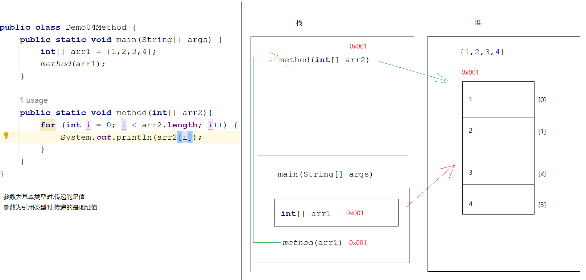
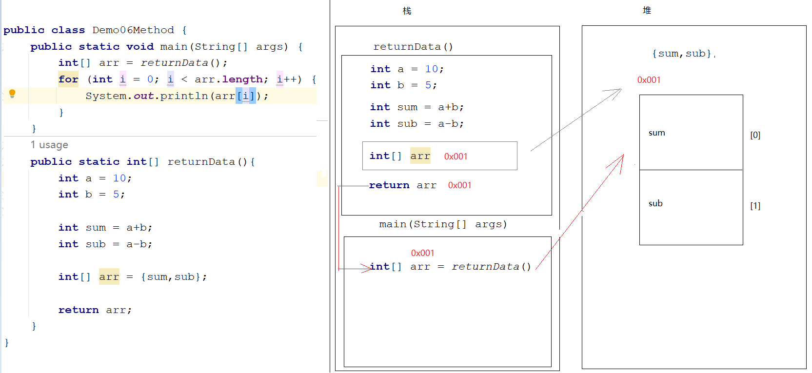
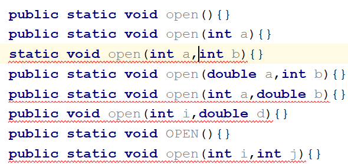
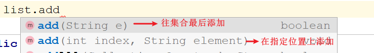
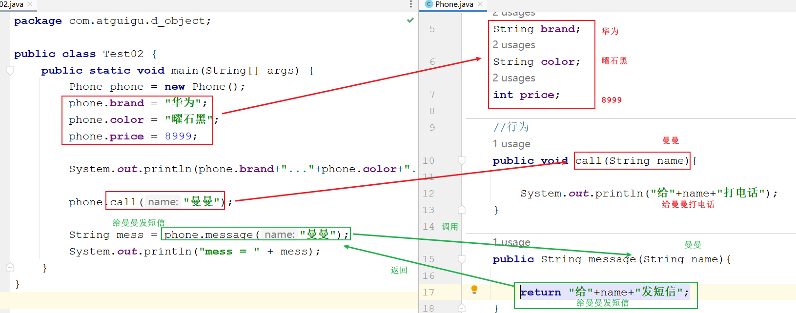
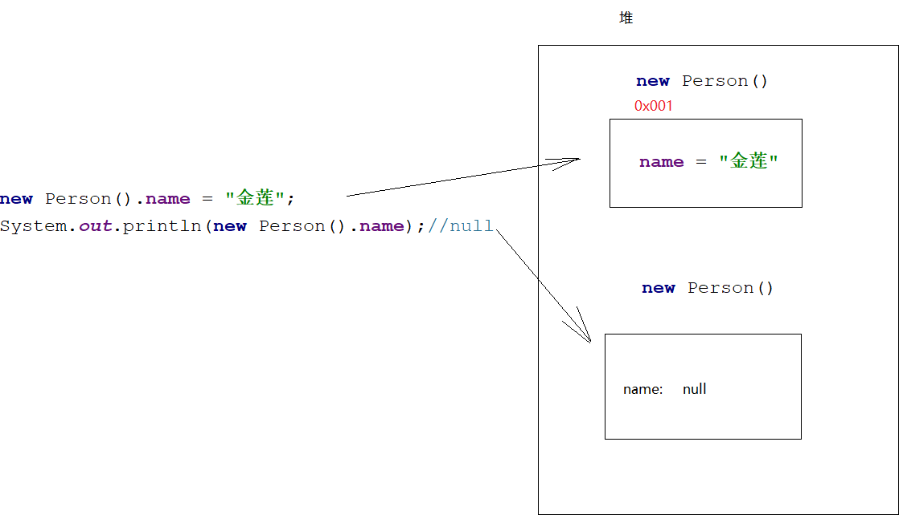
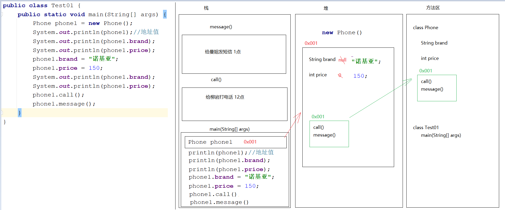
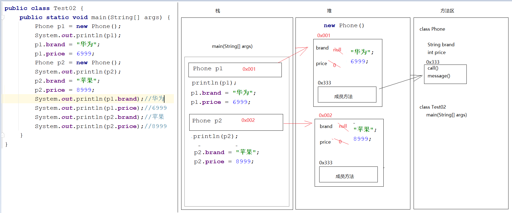
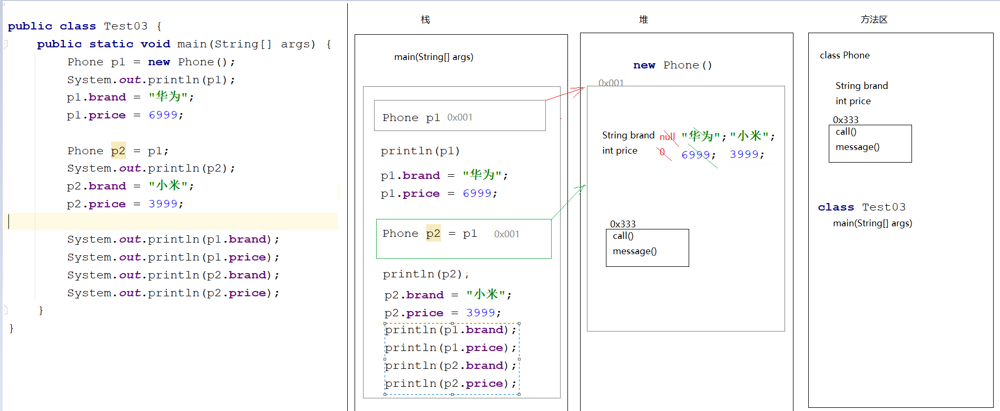
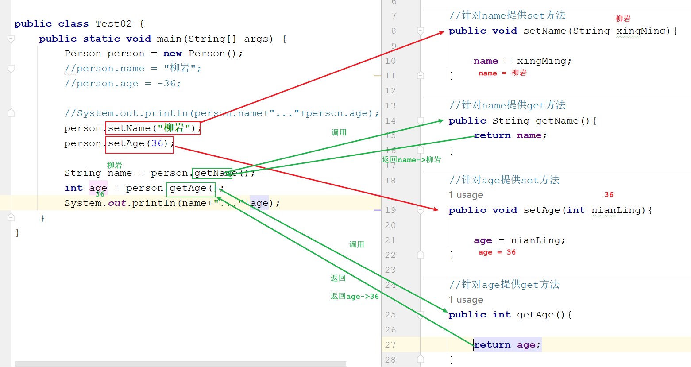

# day06.方法的重载_面向对象

```java
课前回顾:
 1.二维数组:
   a.动态初始化
     数据类型[][] 数组名 = new 数据类型[m][n]
     数据类型 数组名[][] = new 数据类型[m][n]
     数据类型[] 数组名[] = new 数据类型[m][n]
     m:二维数组数组长度
     n:每一个一维数组长度
   b.简化静态初始化
     数据类型[][] 数组名 = {{元素1,元素2...},{元素1,元素2...},{元素1,元素2...}...}
  2.二维数组操作:
    a.获取长度:数组名.length
    b.存储数据:数组名[i][j] = 值
      i:一维数组在二维数组中的索引位置
      j:元素在一维数组中的索引位置
    c.获取数据:
      数组名[i][j]
    d.遍历:嵌套for循环
      先遍历二维数组,将一维数组拿出来,再遍历每一个一维数组,将元素从一维数组中获取出来
  3.方法:拥有功能性代码的代码块
    a.无参无返回值方法:
      public static void 方法名(){
          方法体
      }
      直接调用:方法名()
          
    b.有参无返回值方法:
      public static void 方法名(参数){
          方法体
      }
      直接调用:方法名(实参)
    
    c.无参有返回值方法:
      public static 返回值类型 方法名(){
          方法体
          return 结果
      }
      打印调用:sout(方法名())
      赋值调用:数据类型 变量名 = 方法名()
     
    d.有参有返回值方法:
      public static 返回值类型 方法名(参数){
          方法体
          return 结果
      }
      打印调用:sout(方法名(实参))
      赋值调用:数据类型 变量名 = 方法名(实参)
          
  4.注意事项:
    a.方法不调用不执行
    b.方法不能互相嵌套
    c.main方法是jvm调用的
    d.void不能和return 结果共存,但是能和一个return共存
    e.方法的执行顺序之和调用顺序有关
    f.一个方法中只能有一个return返回值
    g.调用方法时要看有没有此方法,不然会报错
        
今日重点:
   1.认识重载的方法,会写重载方法
   2.会定义一个实体类,用类描述世间万物
   3.会使用new对象方式,调用别的类的成员
   4.知道成员变量和局部变量区别
   5.会使用private关键字将属性或者方法私有化,并知道访问权限
   6.会使用get/set方法为私有的成员变量赋值,取值
   7.会使用this关键字区分重名的成员变量和局部变量
   8.会使用构造方法创建对象,并为属性赋值
   9.知道无参构造特点,有参构造特点和作用
   10.会使用封装思想,编写一个标准javabean
```

# 第一章.方法练习

## 1.方法练习1(判断奇偶性)

```java
需求:
   键盘录入一个整数,将整数传递到另外一个方法中,在此方法中判断这个整数的奇偶性
   如果是偶数,方法返回"偶数"  否则返回"奇数"
 
方法三要素:
  方法名:要
  参数:要
  返回:要
```

```java
public class Demo01Method {
    public static void main(String[] args) {
        Scanner sc = new Scanner(System.in);
        int data = sc.nextInt();
        String result = method(data);
        System.out.println("result = " + result);
    }
    public static String method(int data){
        if (data%2==0){
            return "偶数";
        }else{
            return "奇数";
        }
    }
}
```

## 2.方法练习2(1-100的和)

```java
需求 :  求出1-100的和,并将结果返回
    
方法名:要
参数:要或者不要
返回值:要    
```

```java
public class Demo02Method {
    public static void main(String[] args) {
        int sum = sum();
        System.out.println("sum = " + sum);
    }
    public static int sum(){
        int sum = 0;
        for (int i = 1; i <= 100; i++) {
            sum+=i;
        }
        return sum;
    }
}
```

## 3.方法练习3(不定次数打印)

```java
需求:
   定义一个方法,给这个方法传几,就让这个方法循环打印几次"我是一个有经验的JAVA开发工程师"
       
方法名:要
参数:要
返回值:不要
```

```java
public class Demo03Method {
    public static void main(String[] args) {
        method(10);
    }
    public static void method(int n){
        for (int i = 0; i < n; i++) {
            System.out.println("我爱java");
        }
    }
}
```

## 4.方法练习4(遍历数组)

```java
需求:
  在main方法中定义一个数组,将数组传递到方法中,在此方法中遍历数组
      
方法名:要
参数:要 数组类型
返回值:不要    
```

```java
public class Demo04Method {
    public static void main(String[] args) {
        int[] arr1 = {1,2,3,4};
        method(arr1);
    }

    public static void method(int[] arr2){//int[] arr2 = arr1
        for (int i = 0; i < arr2.length; i++) {
            System.out.println(arr2[i]);
        }
    }
}

```



> 参数为基本类型时,传递的是值
> 参数为引用类型时,传递的是地址值

## 5.方法练习5(求数组最大值)

```java
需求: 
  在main方法中定义数组,传递到另外一个方法中,在此方法中实现获取数组最大值
```

```java
public class Demo05Method {
    public static void main(String[] args) {
        int[] arr = {5, 3, 4, 6, 7, 5, 4};
        int max = getMax(arr);
        System.out.println("max = " + max);
    }

    public static int getMax(int[] arr) {
        // 2.定义一个变量,接收第一个元素 max
        int max = arr[0];
        // 3.遍历数组,将每一个元素获取出来
        for (int i = 1; i < arr.length; i++) {
            // 4.用max和遍历出来的元素比较,如果遍历出来的大,将大的元素重新赋值给max
            if (max < arr[i]) {
                max = arr[i];
            }
        }

        return max;

    }
}
```

## 6.方法练习6(按照指定格式输出数组元素)

```java
需求:
  1.定义一个数组 int[] arr = {1,2,3,4}
  2.遍历数组,输出元素按照[1,2,3,4]
```

```java
自己写
```

## 7.练习7

```java
数组作为返回值返回
```

```java
public class Demo06Method {
    public static void main(String[] args) {
        int[] arr = returnData();
        for (int i = 0; i < arr.length; i++) {
            System.out.println(arr[i]);
        }
    }
    public static int[] returnData(){
        int a = 10;
        int b = 5;

        int sum = a+b;
        int sub = a-b;

        int[] arr = {sum,sub};

        return arr;
    }
}
```



> 返回值类型为引用数据类型,返回的是地址值

# 第二章.方法的重载(Overload)

```java
1.需求:定义三个方法,分别实现2个整数相加,3个整数相加,4个整数相加
```

```java
public class Demo01OverLoad {
    public static void main(String[] args) {
        sum(1,2);
        sum(1,2,3);
        sum(1,2,3,4);
    }
    //两个整数相加
    public static void sum(int a,int b){
        int sum = a+b;
        System.out.println("sum = " + sum);
    }

    //三个整数相加
    public static void sum(int a,int b,int c){
        int sum = a+b+c;
        System.out.println("sum = " + sum);
    }

    //四个整数相加
    public static void sum(int a,int b,int c,int d){
        int sum = a+b+c+d;
        System.out.println("sum = " + sum);
    }

}

```

```java
1.概述:方法名相同,参数列表不同的方法,叫做重载方法
2.什么叫做参数列表不同:
  a.参数个数不同
  b.参数类型不同
  c.参数类型的顺序不同
      
3.判断方法是否为重载方法,和什么无关
  a.和返回值无关
  b.和参数名无关
```

```java
public static void open(){}
public static void open(int a){}
static void open(int a,int b){}
public static void open(double a,int b){}
public static void open(int a,double b){}
public void open(int i,double d){}
public static void OPEN(){}
public static void open(int i,int j){}
```



```java
1.什么用:
  当功能一样,但是实现细节不一样时,就可以考虑用重载
```




# 第三章.类和对象

## 1.面向对象的介绍

```java
1.什么是面向对象:
  是java核心变成思想,说白了,就是很多功能别人都给我们封装好了,我们只需要直接使用,功能就能实现,但是封装好的具体代码不需要我们关心,我们只关注使用即可
      
2.面向过程:每一步都需要自己亲力亲为-> C语言
    
3.举例说明:
  a.洗衣服:
    面向过程:找盆儿,放水,放洗衣粉,找搓衣板,搓搓搓
    面向对象:找全自动洗衣机
        
  b.大学带饭
        
  c.点外卖
        
4. 为啥使用面向对象思想编程:
   有很多功能别人都帮我们实现了,我们只需要用即可,编程也就省事了,简单了,过程不用我们操心
      
5.什么时候要使用面向对象思想编程?
  当在一个类中使用别的类的成员,我们就需要面向对象编程了
       
6.怎么使用面向对象思想编程:
  a.new呀,点呀(调用)
  b.特殊:如果调用的功能是静态(static)的,我们不用new,可以直接类名调用    
```

```java
public class Demo01Object {
    public static void main(String[] args) {

        Scanner sc = new Scanner(System.in);
        /*
          Scanner就是我们找来的对象
          next方法就是此对象的功能
         */
        String data = sc.next();
        System.out.println("data = " + data);

        System.out.println("=================");

        /*
          Random就是我们找来的对象
          nextInt方法就是此对象的功能
         */
        Random random = new Random();
        int data2 = random.nextInt(10);
        System.out.println("data2 = " + data2);

        System.out.println("=================");

        int[] arr = {1, 2, 3, 4};
        System.out.print("[");
        for (int i = 0; i < arr.length; i++) {
            if (i == arr.length - 1) {
                System.out.print(arr[i] + "]");
            }else{
                System.out.print(arr[i] + ", ");
            }
        }

        System.out.println("");
        /*
          Arrays就是我们找来的对象
          toStrng就是此对象提前封装好的功能
          我们只需要找到对象,调用对象中的功能,就能实现我们的需求
          至于toString方法底层怎么写的,我们无需关注
         */
        System.out.println(Arrays.toString(arr));
    }
}

```

## 2.类和对象

### 2.1类(实体类)_class

```java
1.说明:
  a.带main方法的类叫做测试类,用来测试代码是否能执行的
  b.描述世间万物的类叫做实体类    
```

```java
1.概述:一类事物的抽象表示形式
2.属性(成员变量): 这类事物有啥
  a.定义位置:类中方法外
  b.作用范围:作用于整个类
  c.有默认值:
    整数:0
    小数:0.0
    字符:'\u0000'
    布尔:false
    引用:null
  d.定义格式:
    数据类型 变量名
3.行为(成员方法): 这类事物能干啥
  将之前定义的代码中的static干掉,其他的定义格式,以及调用方式和之前一样
```

```java
public class Person {
    //属性
    String name;
    int age;
    
    //行为
    public void eat(){
        System.out.println("人要干饭");
    }
    
    public void drink(){
        System.out.println("人要喝水");
    }
    
    public void sleep(){
        System.out.println("人要睡觉");
    }
    
    public void la(){
        System.out.println("人要排便");
    }
    
    public void pee(){
        System.out.println("人要嘘嘘");
    }
}
```

> 练习: 用代码描述一个手机类,以及电脑类

### 2.2对象

``` java
1.概述:一类事物的具体体现
2.使用:
  a.导包: import 包名.包名.类名
    如果两个类在同一个包下,使用对方的成员时,不需要导包  
    如果两个类不在同一个包下,使用对方的成员时,需要导包  
      
    特殊包:java.lang -> 使用lang包下得类无需导包
        
  b.创建对象:想要调用哪个类中的成员,就new哪个类的对象
    类名 对象名 = new 类名()
      
  c.调用成员:想要调用哪个类中的成员,就用哪个类的对象去点哪个成员
    对象名.成员名 
      
    对象名.成员变量名 = 值
    对象名.成员方法名() -> 调用的是无参无返回值方法
    对象名.成员方法名(实参) -> 调用的是有参无返回值方法
    数据类型 变量名 = 对象名.成员方法名()-> 调用的是无参有返回值方法
    数据类型 变量名 = 对象名.成员方法名(实参) -> 调用的是有参有返回值方法
```

```java
public class Person {
    //属性
    String name;
    int age;

    //行为
    public void eat(){
        System.out.println("人要干饭");
    }

    public void drink(){
        System.out.println("人要喝水");
    }

    public void sleep(){
        System.out.println("人要睡觉");
    }

    public void la(){
        System.out.println("人要排便");
    }

    public void pee(){
        System.out.println("人要嘘嘘");
    }
}
```

```java
public class Test01 {
    public static void main(String[] args) {
        //创建对象
        Person p1 = new Person();
        System.out.println(p1.name);
        System.out.println(p1.age);
        //为属性赋值
        p1.name = "柳岩";
        p1.age = 36;
        System.out.println(p1.name);
        System.out.println(p1.age);
        System.out.println("==================");

        p1.eat();
        p1.drink();
        p1.sleep();
        p1.la();
        p1.pee();

    }
}
```

```java
public class Phone {
    //属性
    String brand;
    String color;
    int price;

    //行为
    public void call(String name){

        System.out.println("给"+name+"打电话");
    }

    public String message(String name){

        return "给"+name+"发短信";
    }
}

```

```java
public class Test02 {
    public static void main(String[] args) {
        Phone phone = new Phone();
        phone.brand = "华为";
        phone.color = "曜石黑";
        phone.price = 8999;

        System.out.println(phone.brand+"..."+phone.color+"..."+phone.price);

        phone.call("曼曼");

        String mess = phone.message("曼曼");
        System.out.println("mess = " + mess);
    }
}

```



### 3.练习

```java
需求:用代码去描述一个动物类,在测试类中为动物类中的属性赋值,并且调用动物类中的功能
```

```java
public class Animal {
    String name;
    String color;

    public void eat(String kind,String food){
        System.out.println(kind+"吃"+food);
    }
    public void jiao(String kind){
        System.out.println(kind+"在叫");
    }
}
```

```java
public class Test03 {
    public static void main(String[] args) {
        Animal animal = new Animal();
        animal.name = "狗";
        animal.color = "黑白";
        System.out.println(animal.name+"..."+animal.color);

        System.out.println("========================");

        animal.eat("狗","屎");
        animal.jiao("狗");
    }
}
```

## 3.匿名对象的使用

> ```java
> Person p = new Person()  -> int i = 10
>     
> 等号左边的Person:是这个对象的类型
> p:对象名
> 等号右边的new Person():才是这个真正的对象,new代表的是创建,只有new才会将对象创建出来
> ```

```java
1.匿名对象:没有等号左边的对象
2.注意:
  a.如果想让一个放简单执行起来,可以用匿名对象
  b.如果涉及到赋值了,不要用了
```

```java
public class Person {
    //属性
    String name;

    //行为
    public void eat(){
        System.out.println("人要干饭");
    }
}
```

```java
public class Test01 {
    public static void main(String[] args) {
        //原始方式创建对象
        Person p1 = new Person();
        p1.name = "柳岩";
        System.out.println(p1.name);
        p1.eat();

        System.out.println("=================");

        //匿名对象的方式创建对象
        new Person().eat();

        //匿名对象方式为属性赋值
        new Person().name = "金莲";
        System.out.println(new Person().name);//null
    }
}
```



## 4.一个对象的内存图

```java
public class Phone {
    String brand;
    int price;

    public void call(){
        System.out.println("半夜12给柳岩打电话");
    }

    public void message(){
        System.out.println("半夜1点给曼姐发短信");
    }
}

```

```java
public class Test01 {
    public static void main(String[] args) {
        Phone phone1 = new Phone();
        System.out.println(phone1);//地址值
        System.out.println(phone1.brand);
        System.out.println(phone1.price);
        phone1.brand = "诺基亚";
        phone1.price = 150;
        System.out.println(phone1.brand);
        System.out.println(phone1.price);
        phone1.call();
        phone1.message();
    }
}

```



## 5.两个对象的内存图



> new了两个对象,在堆内存中开辟了两个不同的空间,修改一个空间的数据不会影响另外一个空间数据

## 6.两个对象指向同一片空间内存图



> p2是p1给的,p1在内存中保存的是地址值,所以p2的地址值和p1一样的
>
> 指向了同一片空间,修改一个对象的数据会影响另外一个对象

# 第四章.成员变量和局部变量的区别

```java
1.定义位置不同(重点)
  a.局部变量:方法内部以及参数位置
  b.成员变量:类中方法外    
2.初始化值不同(重点)
  a.局部变量:没有默认值,需要手动赋值之后才能使用
  b.成员变量:有默认值,不需要手动赋值就能使用
            整数:0
            小数:0.0
            字符:'\u0000'
            布尔:false
            引用:null
3.作用范围不同:(重点)
  a.局部变量:只作用于自己的方法内部,别的方法使用不了
  b.成员变量:作用于整个类    
4.内存位置不同:(了解)
  a.局部变量:在栈中
  b.成员变量:在堆中
5.生命周期不同:(了解)
  a.局部变量:随着方法的调用而产生,随着方法的调用完毕而消失
  b.成员变量:随着对象的创建而产生,随着对象的消失而消失    
```

```java
public class Person {
    //成员变量
    String name;
    public void eat(){
        //局部变量
        int i = 10;
        System.out.println(i);

        int j;
        //System.out.println(j);

        System.out.println(name);

    }

    public void drink(){
       // System.out.println(i);
        System.out.println(name);
    }
    
}
```

> ```java
> 小结:
>  1.为啥要使用面向对象思想编程:简单,方便
>    很多功能别人都准备好了,我们只需要直接使用即可,就能实现功能
>  2.什么时候使用面向对象思想编程:
>    在一个类中想使用别的类的成员时
>  3.怎么使用:
>    new呗,点呗
>  4.类
>    a.成员变量(属性):数据类型 变量名
>    b.成员方法(行为):去掉static即可
>        
>  5.对象:
>    a.导包: import 包名.包名.类名
>      两个类不在同一个包下,使用时需要导包
>      两个类在同一个包下,使用时不需要导包
>      java.lang包下得类使用时不需要导包
>        
>    b.创建对象:想要使用哪个类的成员,就new哪个类的对象
>      类名 对象名 = new 类名()
>    
>    c.调用成员:想要使用哪个类的成员,就使用哪个类的对象去点哪个成员
>      对象名.成员名
>        
>  6.成员变量和局部变量的区别:
>    a.定义位置  b.初始化值  c.作用范围   d.内存位置    e.生命周期
> ```

# 第五章.封装

## 1.封装的介绍以及使用

```java
1.面向对象三大特征:  [封装]     继承    多态
 
2.什么是封装思想:
  a.为什么需要封装,封装的作用和含义?
    我们找来了一个对象(洗衣机),只需要按一下按钮就可以了,有必要了解洗衣机的内部构造吗?我们没有必要去了解内部结构,我们只知道调用就可以了
    所以,洗衣机来说,将细节隐藏起来了,细节我们不要关注,会对外提供了一个公共的接口(按钮),供我们人类使用  
  b.隐藏对象内部的复杂性,只对外提供公开,公共的接口,便于外界调用,从而提高了系统的可扩展性,可维护性,安全性,通俗来说,把该隐藏的隐藏起来(细节),把该暴露的暴露出来(对外提供的供别人使用的接口),这就是封装思想 
      
  我们只需要调用这个接口(功能)即可,此接口背后封装起来的细节就开始执行了,但是我们不需要关注细节,只关注公共的接口怎么调用
      
3.封装思想中最具代表性的关键字:
  private-> 私有的 -> 如果成员一旦被私有化了,在别的类中无法直接访问
```

```java
问题1:
  定义类的时候,直接定义属性,在外界可以随便使用,哪怕是不合理的数据也没问题
解决问题1:
  将属性用private修饰,此时属性为私有成员,外界不能直接调用,相当于将细节隐藏了起来
      
问题2:
  如果将属性私有化了,外界彻底使用不了,所以我们需要对外提供共同的接口,供外界通过这个公共接口间接使用封装起来的细节
    
  setxxx() -> 为属性赋值
  getxxx() -> 获取属性值 
```

```java
public class Person {
    private String name;
    private int age;

    //针对name提供set方法
    public void setName(String xingMing) {

        name = xingMing;
    }

    //针对name提供get方法
    public String getName() {
        return name;
    }

    //针对age提供set方法
    public void setAge(int nianLing) {
        if (nianLing < 0 || nianLing > 120) {
            System.out.println("年龄不合理,归0");
            age = 0;
        } else {
            age = nianLing;

        }
    }

    //针对age提供get方法
    public int getAge() {

        return age;
    }
}

```

```java
public class Test02 {
    public static void main(String[] args) {
        Person person = new Person();
        //person.name = "柳岩";
        //person.age = -36;

        //System.out.println(person.name+"..."+person.age);
        person.setName("柳岩");
        person.setAge(-36);

        String name = person.getName();
        int age = person.getAge();
        System.out.println(name+"..."+age);
    }
}
```



> 1.用private修饰成员变量:相当于将细节隐藏起来
>
> 2.对外提供的get/set:对外提供的公共接口
>
> ​    setxxx():为属性赋值
>
> ​    getxxx():获取属性值

# 第六章.标准JavaBean

JavaBean` 是 Java语言编写类的一种标准规范。符合`JavaBean` 的类，要求： 

（1）类必须是具体的和公共的，public class 类名

（2）并且具有无参数的构造方法，有参构造

（3）成员变量私有化，并提供用来操作成员变量的`set` 和`get` 方法。  

```java
public class Person{
    //私有属性
    //构造方法->空参,有参
    //get/set方法
}
```
