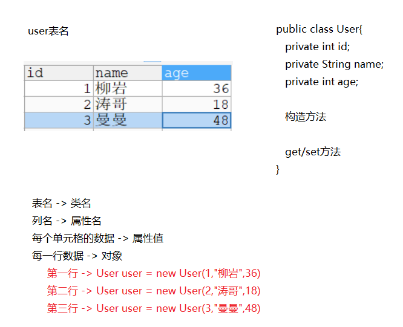
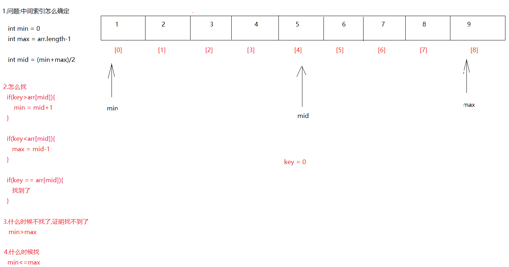

# day07.封装 可变参数 命令行参数 递归 对象数组

```java
public class MyDate {
    int year;
    int month;
    int day;
}

public class Citizen {
    //姓名
    String name; //null

    //出生日期 MyDate   MyDate mydate = new MyDate()
    MyDate birthday/* = new MyDate()*/; //null
    //身份证号
    String cardId; //null
}

public class Test02 {
    public static void main(String[] args) {
        Citizen citizen = new Citizen();
        citizen.name = "涛哥";

        MyDate birthday = citizen.birthday;//仅仅是将属性获取出来,并没有真正为其赋值
        birthday = new MyDate();//为自定义类型赋值,其实就是new个对象给它

        birthday.year = 2020;
        birthday.month = 10;
        birthday.day = 10;

        citizen.cardId = "1111";

        System.out.println(citizen.name);
        System.out.println(birthday.year);
        System.out.println(birthday.month);
        System.out.println(birthday.day);
        System.out.println(citizen.cardId);
    }
}

```

```java
课前回顾:
  1.方法的重载:
    a.概述:方法名相同,参数列表不同的方法
    b.什么叫做参数列表不同
      参数个数不同,参数类型不同,参数类型顺序不同
    c.和啥无关:
      和返回值无关,和参数名无关
  2.类
    a.概述:一类事物的抽象表示形式
    b.成员:
      属性(成员变量):定义在类中,方法外;有默认值,作用于整个类的变量
      行为(成员方法):定义方法的时候将static干掉
  3.对象:
    a.概述:一类事物的具体体现
    b.使用:
      导包:import 包名.类名
          两个类在同一个包下,使用时无需导包
          两个类不在同一个包下,使用时需要导包
          特殊包:java.lang包下的无需导包
      创建对象:想要使用哪个类中的成员,就new哪个类的对象
          类名 对象名 = new 类名()
      调用成员:想要使用哪个类中的成员,就用哪个类的对象调用哪个成员
          对象名.成员名
          
  4.匿名对象: 没有等号左半边的对象
    a.如果简单调用方法,可以使用匿名对象
    b.但是涉及到赋值了,不要用
  5.封装:面向对象三大特征之一
        将细节隐藏起来(为了不让外界随意调用),对外提供公共的接口(通过公共接口间接使用隐藏起来的细节)
  6.最具封装代表性的关键字:private(私有的,被它修饰之后,外界不能直接点)
                       修饰成员变量,方法
  7.提供公共接口:
    getxxx():获取属性值
    setxxx():为属性赋值
        
今日重点:
  1.会使用this关键字区分重名的成员变量和局部变量
  2.会定义静态成员,以及会调用静态成员
  3.会使用可变参数
  4.会使用简单的递归
  5.会数组操作中的:冒泡,二分查找    
```

# 第一章.封装

## 1.this的介绍

```java
1.注意:当成员变量和局部变量重名时,我们调用遵循"就近原则",先调用局部的
2.关键字:this
  a.概述: this代表的是当前对象,哪个对象调用的this所在的方法,this就代表哪个对象
  b.作用: 区分重名的成员变量和局部变量
         this后面的肯定是成员的
```

```java
public class Person {
    String name;

    /**
     * 哪个对象调用的this所在的方法
     * this就代表哪个对象
     * @param name
     */
    public void speak(String name){
        System.out.println(this+"........this");
        System.out.println(this.name+"您好,我是"+name);
    }
}

```

```java
public class Test01 {
    public static void main(String[] args) {
        Person person = new Person();
        System.out.println(person+".....person");
        person.name = "沉香";
        person.speak("刘彦昌");

        System.out.println("===============");

       Person person1 = new Person();
       System.out.println(person1+".........person1");
       person1.name = "哪吒";
       person1.speak("李靖");
    }
}

```


```java
public class Person {
    private String name;
    private int age;
    //针对name提供set方法
    public void setName(String name) {
        this.name = name;
    }

    //针对name提供get方法
    public String getName() {
        return name;
    }

    //针对age提供set方法
    public void setAge(int age) {
       this.age = age;
    }

    //针对age提供get方法
    public int getAge() {
        return age;
    }
}

```

```java
public class Test01 {
    public static void main(String[] args) {
        Person person = new Person();
        person.setName("柳岩");
        person.setAge(36);
        System.out.println(person.getName()+"..."+person.getAge());
    }
}
```


## 2.构造方法

```java
1.new对象修饰根据构造方法new的
2.构造方法方法名和类名一致,没有返回值,连void都没有
```

### 2.1空参构造

```java
1.格式:
  public 类名(){
      
  }

2.作用:
  new对象使用
   
3.注意:
  a.我们一new就是调用了,一new构造方法会自动执行
  b.每个类jvm都会都默认给一个空参构造,不写也有    
```

### 2.2有参构造

```java
1.格式:
  public 类名(参数){
      为属性赋值
  }
2.作用:
  a.new对象使用
  b.为属性赋值

3.注意:
  a.jvm不会为类自动提供有参构造,需要手写
  b.如果写了有参构造,jvm不再提供空参构造,所以我们一般都手写上
```

```JAVA
public class Person {
    private String name;
    private int age;

    //空参构造
    public Person(){

    }

    //有参构造
    public Person(String name,int age){
        this.name = name;
        this.age = age;
    }

    //针对name提供set方法
    public void setName(String name) {
        this.name = name;
    }

    //针对name提供get方法
    public String getName() {
        return name;
    }

    //针对age提供set方法
    public void setAge(int age) {
       this.age = age;
    }

    //针对age提供get方法
    public int getAge() {
        return age;
    }
}

```

```JAVA
public class Test01 {
    public static void main(String[] args) {
        Person person = new Person();
        person.setName("柳岩");
        person.setAge(36);
        System.out.println(person.getName()+"..."+person.getAge());

        System.out.println("=================");

        Person person1 = new Person("金莲", 26);
        person1.setName("28");
        System.out.println(person1.getName()+"..."+person1.getAge());
    }
}

```


> 细节:
>
>   如果构造方法在定义的时候被private修饰,那么外界就无法使用构造方法new对象了

## 3.标准JavaBean

JavaBean` 是 Java语言编写类的一种标准规范。符合`JavaBean` 的类，要求： 

（1）类必须是具体的(非抽象 abstract)和公共的，public class 类名

（2）并且具有无参数的构造方法，有参构造

（3）成员变量私有化，并提供用来操作成员变量的`set` 和`get` 方法。  

```java
将来干开发我们要分包分层:
  com.atguigu.controller -> 专门装和页面打交道的类 -> 表现层
  com.atguigu.service -> 专门放处理业务逻辑相关类 -> 业务层
  com.atguigu.dao -> 专门放和数据库打交道的类 -> 持久层
  com.atguigu.pojo -> 专门放javabean类
  com.atguigu.utils -> 专门放工具类
```

```java
public class Person {
    private String name;
    private int age;
    
    //无参构造
    public Person(){
        
    }
    
    //有参构造
    public Person(String name,int age){
        this.name = name;
        this.age = age;
    }
    
    //对应的get/set方法

    public void setName(String name) {
        this.name = name;
    }

    public String getName() {
        return name;
    }

    public void setAge(int age) {
        this.age = age;
    }

    public int getAge() {
        return age;
    }
}

```

```java
将来的javabean怎么创建出来的
    一般都是和数据库的表相结合创建
```



编写符合`JavaBean` 规范的类，以学生类为例，标准代码如下：

```java
public class Person {
    private String name;
    private int age;

    //无参构造
    public Person(){

    }

    //有参构造
    public Person(String name,int age){
        this.name = name;
        this.age = age;
    }

    //对应的get/set方法

    public void setName(String name) {
        this.name = name;
    }

    public String getName() {
        return name;
    }

    public void setAge(int age) {
        this.age = age;
    }

    public int getAge() {
        return age;
    }
}
```

> 快速定义一个标准的javabean:
>
> 通用快捷键:  alt+insert
>
> 1.生成无参构造:
>
> ​    
>
> 
>
> 2.生成有参构造:
>
> ​    
>
>  
>
> 3.生成get/set方法:
>
> ​    

```java
public class Test01 {
    public static void main(String[] args) {
        //利用set方法赋值
        Person person1 = new Person();
        person1.setName("曼曼");
        person1.setAge(58);
        System.out.println(person1.getName()+"...."+person1.getAge());

        System.out.println("====================");

        //利用有参构造赋值
        Person person2 = new Person("三上", 26);
        System.out.println(person2.getName()+"...."+person2.getAge());
    }
}
```

# 第二章.static静态关键字


## 1.static的介绍以及基本使用

```java
1.概述:静态的,关键字
2.特点
  a.被static修饰的成员随着类的加载而加载
  b.被static修饰的成员由于跟着类到内存,所以优先于对象存在
  c.被static修饰的成员属于类成员,不属于对象成员(成员方法,成员变量)
  d.根据static所在的类创建出来的对象,都会共享这个静态成员
3.使用:
  修饰成员变量: static 数据类型 变量名
  修饰方法:
     修饰符 static 返回值类型 方法名(参数){
         方法体
         return 结果
     }
4.使用:
  类名直接调用
```

```java
public class Student {
    String name;
    static String classRoom;

    //静态的方法
    public static void study(){
        System.out.println("学生们要学习,不要玩儿,游戏全部卸载,将来找个好工作");
    }
}

```

```java
public class Test01 {
    public static void main(String[] args) {
        //类名直接调用
        Student.classRoom = "222";


        Student s1 = new Student();
        s1.name = "郭靖";
        //s1.classRoom = "222";
        System.out.println(s1.name);
        System.out.println(s1.classRoom);

        //类名直接调用
        Student.study();

        System.out.println("====================");

        Student s2 = new Student();
        s2.name = "黄蓉";
        //s2.classRoom = "222";
        System.out.println(s2.name);
        System.out.println(s2.classRoom);

        //类名直接调用
        Student.study();
    }
}
```

## 2.static修饰成员的访问特点

```java
1.静态的能直接访问非静态成员吗?
  不能-> 静态成员随着类的加载而加载优先于非静态成员产生
    
  new对象可以访问非静态成员  

2.非静态的能直接访问静态成员吗?
  可以
  
  a.在同一个类中:直接调用,类名调用(实际上是直接调用),new对象调用(即使new对象调用的实际上也是直接调用的)
      
  b.不在同一个类中:类名调用,new对象调用(实际上也是类名直接调用)
      
 
3.静态的能直接访问静态成员吗?
  能
  
  a.在同一个类中:直接调用,类名调用,new对象调用
  b.不在同一个类中:类名调用,new对象调用
      
      
4.非静态能直接访问非静态成员吗?
  能
      
  a.在同一个类中:直接调用,new对象调用
  b.不在同一个类中:new对象调用
          
```


```java
public class Person {
    public void eat(){
        System.out.println("人要干饭");
    }

    public static void drink(){
        System.out.println("人要喝水");
    }
}

```

```java
public class Test01 {
    public static void main(String[] args) {
        Test01 test01 = new Test01();
        test01.method01();
        System.out.println("==================");
        Person person = new Person();
        person.eat();

        System.out.println("===============");
        method03();
        Test01.method03();

        System.out.println("=================");

        Person.drink();
        new Person().drink();
    }

    public void method01(){
        System.out.println("我是非静态方法method01");
        method02();  //直接调用
        Test01.method02();//类名直接调用
        new Test01().method02();

        System.out.println("===================");
        Person.drink();
        Person person = new Person();
        person.drink();
    }

    public static void method02(){
        System.out.println("我是静态方法method02");
    }

    public static void method03(){
        System.out.println("我是静态方法method03");
    }

    public void method04(){
        method01();
        new Test01().method01();

        System.out.println("=============");

        new Person().eat();
    }
}
```

> 总结:
>
>   1.不管在不在同一个类中,只要是访问静态的:都可以使用类名点
>
>   2.不管在不在同一个类中,只要是访问非静态的:都可以new对象调用

> ```java
> 1.问题1:静态成员太好使了,不管咋样都可以直接类名调用,不用new对象,那么我们开发中能不能将所有的成员都定义成静态的  -> 不能
>     
> 2.原因:静态成员随着类的加载而加载,如果所有成员都变成静态的,会过多的占用内存    
> ```
>
> ```java
> 1.问题1:那么开发中啥时候可以定义静态方法呢? -> 1.共享数据 2.抽取工具类时    
> ```
>
> ```java
> public class ArraysUtils {
>     //工具类不需要new对象调用,只需要类名调用,所以我们可以将构造方法变成私有的
>     private ArraysUtils(){
>     }
> 
>     public static void print(int[] arr){
>         System.out.print("[");
>         for (int i = 0; i < arr.length; i++) {
>             if (i==arr.length-1){
>                 System.out.print(arr[i]+"]");
>             }else{
>                 System.out.print(arr[i]+", ");
>             }
>         }
>     }
> }
> ```
>
> ```java
> public class Test02 {
>     public static void main(String[] args) {
>         int[] arr = {1,2,3,4,5};
>         ArraysUtils.print(arr);
>     }
> }
> ```
>
> ```java
> public class Test03 {
>     public static void main(String[] args) {
>         int[] arr = {1,2,3,34,54,5,6,67,7,8,8,89};
>         ArraysUtils.print(arr);
>     }
> }
> ```

# 第三章.可变参数

```java
1.需求:
  定义一个方法,实现任意个整数和
      
2.分析:
  参数类型确定
  参数个数不确定
```

## 1介绍和基本使用

```java
1.概述:可变的参数
2.作用:可以接受0个或者多个参数
3.格式:
  数据类型...变量名
4.可变参数本质:数组  
    
5.注意:
  参数位置只能有一个可变参数,而且要放到参数列表最后
```


```java
public class Demo01Var {
    public static void main(String[] args) {
        sum(1,2,3,4,56,545,5,7,8,7,6);
    }
    public static void sum(int j,int...arr){
        int sum = 0;
        for (int i = 0; i < arr.length; i++) {
            sum+=arr[i];
        }
        System.out.println("sum = " + sum);
    }
}
```

## 2可变参数

在**JDK1.5**之后，如果我们定义一个方法时，此时某个形参的类型可以确定，但是形参的个数不确定，那么我们可以使用可变参数。

格式：

```
【修饰符】 返回值类型 方法名(【非可变参数部分的形参列表,】参数类型... 形参名){  }
```

要求：

### （1）一个方法最多只能有一个可变参数

（2）如果一个方法包含可变参数，那么可变参数必须是形参列表的最后一个

（3）其实这个书写“≈”

```
【修饰符】 返回值类型 方法名(【非可变参数部分的形参列表,】参数类型[] 形参名){  }
```

只是后面这种定义，在调用时必须传递数组，而前者更灵活，既可以传递数组，又可以直接传递数组的元素，这样更灵活了。

### 示例一：    求n个整数的和

```java
public class Demo01Var {
    public static void main(String[] args) {
        sum(1,2,3,4,56,545,5,7,8,7,6);
    }
    public static void sum(int...arr){
        int sum = 0;
        for (int i = 0; i < arr.length; i++) {
            sum+=arr[i];
        }
        System.out.println("sum = " + sum);
    }
}
```

### 示例二：字符串拼接

需求一：返回n个字符串拼接结果，如果没有传入字符串，那么返回空字符串""

```java
public class Demo02Var {
    public static void main(String[] args) {
        String result = concat("张无忌", "张翠山", "张三丰", "金毛狮王", "白眉鹰王", "青翼蝠王", "紫衫龙王");
        System.out.println("result = " + result);
    }
    public static String concat(String...s){
        String str = "";
        for (int i = 0; i < s.length; i++) {
            str+=s[i];
        }
        return str;
    }
}

```

需求二：n个字符串进行拼接，每一个字符串之间使用某字符进行分隔，如果没有传入字符串，那么返回空字符串""

```java
public class Demo03Var {
    public static void main(String[] args) {
        String result = concat("-", "张无忌", "张翠山", "张三丰", "金毛狮王", "白眉鹰王", "青翼蝠王", "紫衫龙王");
        System.out.println("result = " + result);
    }

    public static String concat(String s, String... arr) {
        String str = "";
        for (int i = 0; i < arr.length; i++) {
            if (i == arr.length - 1) {
                str += arr[i];
            } else {
                str += arr[i] + s;
            }
        }
        return str;
    }
}

```

# 第四章.递归

```java
1.小时候故事:
  从前有座山,山上有座庙,庙里有个老和尚,老和尚在给小和尚讲故事,讲的啥呢?
      从前有座山,山上有座庙,庙里有个老和尚,老和尚在给小和尚讲故事,讲的啥呢?
      从前有座山,山上有座庙,庙里有个老和尚,老和尚在给小和尚讲故事,讲的啥呢?
      从前有座山,山上有座庙,庙里有个老和尚,老和尚在给小和尚讲故事,讲的啥呢?...
      
2.概述:方法内部自己调用自己

3.分类:
  a.直接递归 -> 方法内部自己调用自己
  b.间接递归 -> 转圈调
    public static void A(){
        B();
    } 

    public static void B(){
        C();
    } 

    public static void C(){
        A();
    } 

4.注意:
  a.递归一定要有出口
  b.即使有出口,递归次数也不能太多
```

## 3.1 递归

- **递归**：指在当前方法内调用自己的这种现象。
- **递归的分类:**
  - 递归分为两种，直接递归和间接递归。
  - 直接递归称为方法自身调用自己。
  - 间接递归可以A方法调用B方法，B方法调用C方法，C方法调用A方法。
- **注意事项**：
  - 递归一定要有条件限定，保证递归能够停止下来，否则会发生栈内存溢出(因为会不断的压栈)。
  - 在递归中虽然有限定条件，但是递归次数不能太多。否则也会发生栈内存溢出。

示例一：需求:利用递归输出3到1

```java
public class Demo02DiGui {
    public static void main(String[] args) {
        method(3);
    }
    public static void method(int n){
        if (n==1){
            System.out.println(n);
            return;//结束方法
        }
        System.out.println(n);
        n--;
        method(n);
    }
}
```

### 示例二：求n!

``` java
3的阶乘    
3*2*1 -> 相当于3 乘以2的阶乘
    
分析:
  定义一个方法,代表阶乘method(n)
      
  method(1) -> 1
  method(2) -> 2*1 -> 2*method(1)
  method(3) -> 3*2*1 -> 3*method(2)
      
规律:
  n的阶乘 -> n*method(n-1)
```

```java
public class Demo03DiGui {
    public static void main(String[] args) {
        int result = method(3);
        System.out.println("result = " + result);
    }

    public static int method(int n) {
        if (n==1){
            return 1;
        }
        return n*method(n-1);
    }
}

```


### 示例三：计算斐波那契数列（Fibonacci）的第n个值

```java
不死神兔
故事得从西元1202年说起，话说有一位意大利青年，名叫斐波那契。
在他的一部著作中提出了一个有趣的问题：假设一对刚出生的小兔一个月后就能长成大兔，再过一个月就能生下一对小兔，并且此后每个月都生一对小兔，一年内没有发生死亡
问：一对刚出生的兔子，一年内繁殖成多少对兔子? 
```

规律：一个数等于前两个数之和，比如: 1 1 2 3 5 8 13 21 34 55....  


```java
1.假设:定义一个方法,代表生兔子,参数代表月份
       method(int month)
    
2.分析:
  method(1)   1
  method(2)   1
  method(3)   2 -> method(1)+method(2)
  method(4)   3 -> method(2)+method(3)
  method(5)   5 -> method(3)+method(4)
  method(6)   8 -> method(4)+method(5)   
      
3.规律:
  第n个月相当于  method(n-2)+method(n-1)
```

```java
public class Demo04DiGui {
    public static void main(String[] args) {
        int result = method(12);
        System.out.println("result = " + result);
    }

    public static int method(int n) {
        if (n==1 || n==2){
            return 1;
        }
        return method(n-2)+method(n-1);
    }
}
```

# 第五章.二分查找(折半查找)

```java
1.前提:元素有序
2.二分思想:
  每次查询都和中间的数比,找不着下次比较就干掉一半的数据
```



```java
public class Demo01BinarySearch {
    public static void main(String[] args) {
        int[] arr = {1, 2, 3, 4, 5, 6, 7, 8, 9};
        //1.确定最大索引和最小索引
        int min = 0;
        int max = arr.length - 1;
        //2.确定要查找的数据
        int key = 6;

        //3.循环比较,循环找
        while (min <= max) {
            //4.循环的计算中间索引
            int mid = (min + max) / 2;
            if (key>arr[mid]){
                min = mid+1;
            }else if(key<arr[mid]){
                max = mid-1;
            }else{
                System.out.println(mid);
                break;
            }
        }
    }
}

```

> 作业:如果找不到,请输出对应的提示信息

# 第六章.数组翻转

```java
1.数组中对称位置上的元素互换位置
```


```java
public class Demo02Reverse {
    public static void main(String[] args) {
        int[] arr = {1,2,3,4,5};
        for (int min = 0,max = arr.length-1;min<max;min++,max--){
            int temp = arr[min];
            arr[min] = arr[max];
            arr[max] = temp;
        }

        for (int i = 0; i < arr.length; i++) {
            System.out.print(arr[i]+"  ");
        }
    }
}
```
