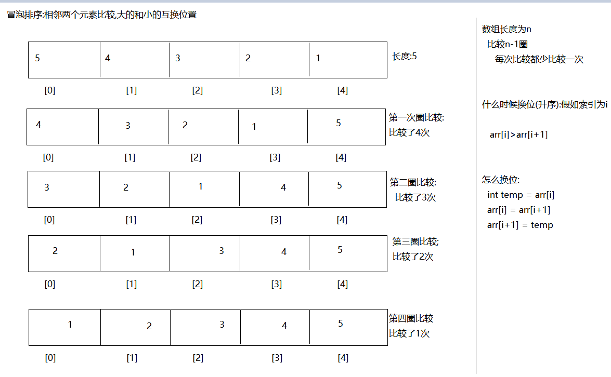
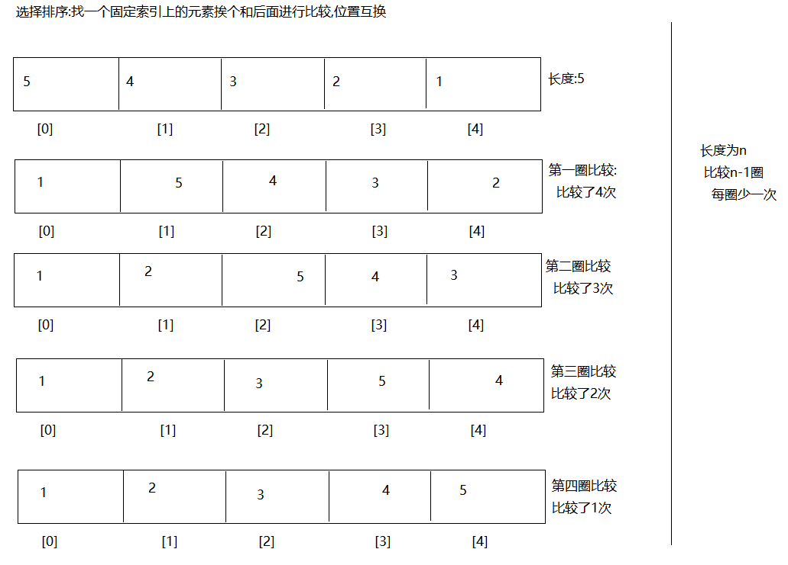
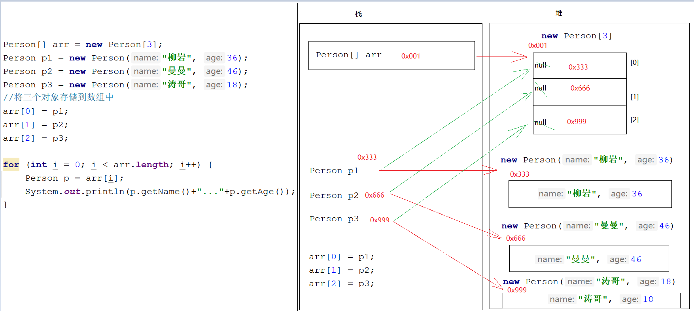
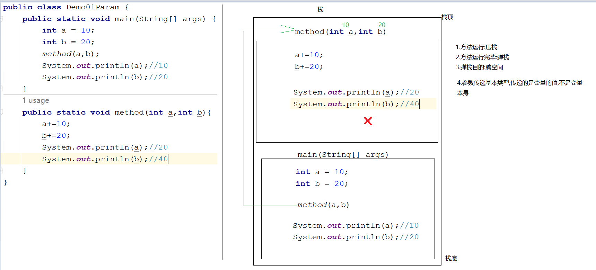
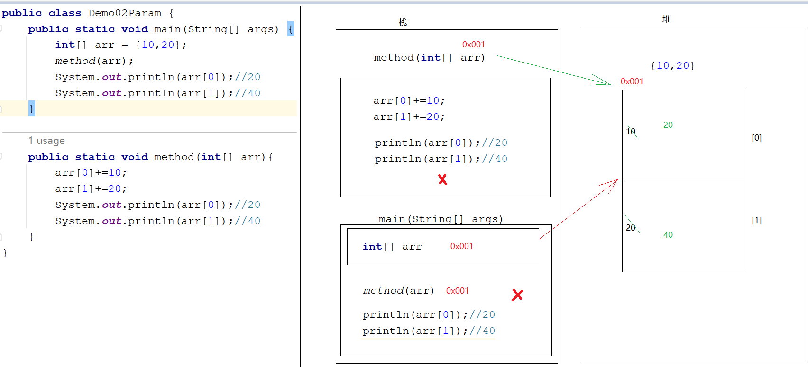
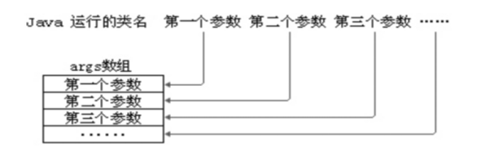
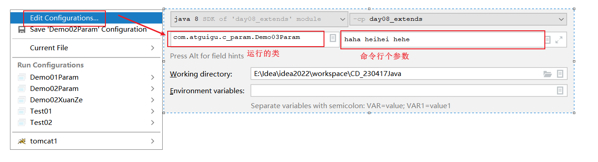
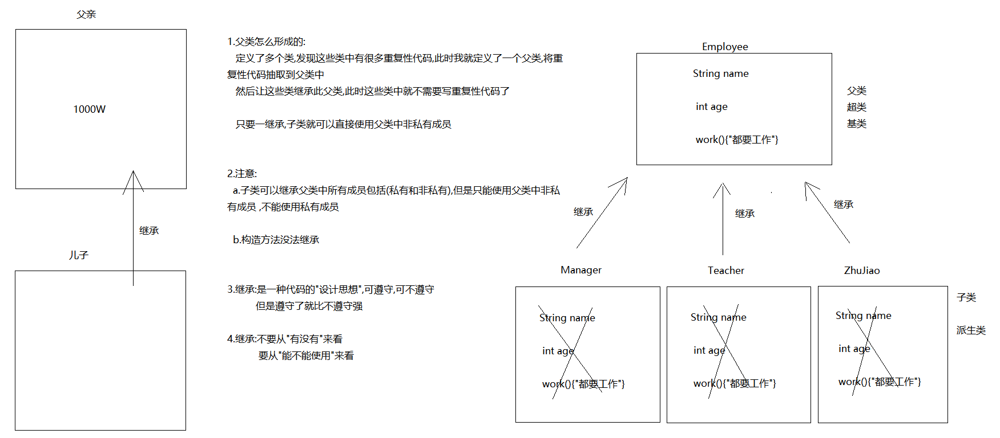
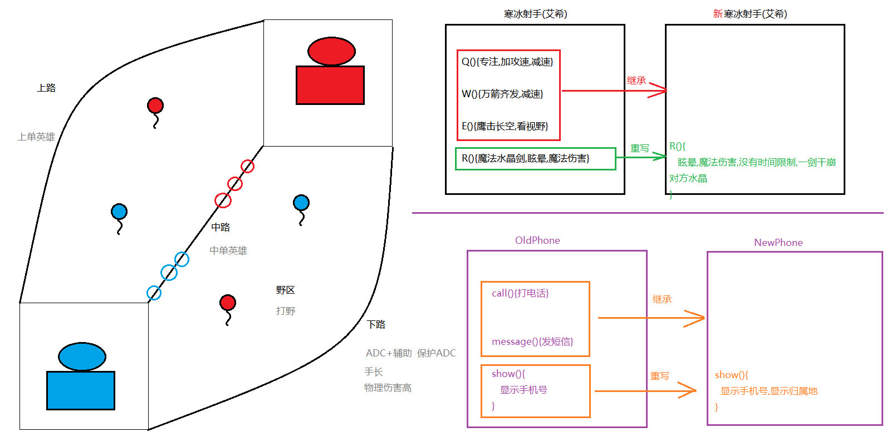

# day08_面向对象

```java
课前回顾:
  1.this:代表当前对象,哪个对象调用的this所在的方法,this就代表哪个对象
    a.作用:区分重名的成员变量和局部变量 -> this.的就是成员的
    b.注意:当成员变量和局部变量重名时,访问时遵循"就近原则"
  2.无参构造:jvm会为每个类提供一个无参构造
    a.作用:new对象
  3.有参构造:jvm不会为每个类提供一个有参构造
    a.注意:如果手写了有参构造,无参构造就没有了,所以建议都写上
    b.作用:new对象,为属性赋值
  4.标准javabean
    a.具体的公共的类
    b.属性私有
    c.无参构造有参构造
    d.get/set方法
    
    javabean和数据库表相关联的
  5.可变参数:
    a.格式:数据类型...变量名
    b.本质:数组
    c.注意:参数位置只能有一个可变参数,需要放到最后
  6.递归:
    a.概述:方法内部自己调用自己
    b.分类:
      直接递归:方法自己调用自己
      间接递归:多个方法之间互相调用
    c.注意:
      递归要有出口
      不要递归太多次
  7.static静态关键字
    a.修饰成员变量
      修饰一个方法
    b.使用:类名直接调用
    c.特点:
      静态成员属于类成员,不属于对象成员
      静态成员会随着类的加载而加载,优先于对象存在在内存中
      凡是根据static所在的类创建出来的对象,都可以共享这个static成员
    d.访问特点:
      静态能直接调用静态成员
      静态不能直接调用非静态成员
      非静态成员可以直接调用静态成员
      非静态成员可以直接调用非静态成员
          
       只要是静态的,我们都可以类名调用
       只要是非静态的,我们都可以new对象调用
          
今日重点:
  1.手撕冒泡排序
  2.参数会传递基本类型和引用类型,并知道特点
  3.知道继承的好处
  4.知道怎么继承
  5.知道继承之后成员的访问特点
  6.会方法的重写,并知道重写的作用
  7.如果能讲到第五章,那么我们就需要知道使用super调用父类成员,使用this调用当前对象成员    
```

# 第一章.数组操作

## 1.冒泡排序

 数组的排序，是将数组中的元素按照大小进行排序，默认都是以升序的形式进行排序，数组排序的方法很多，我们讲解的是数组的冒泡排序。

  排序，都要进行数组 元素大小的比较，再进行位置的交换。冒泡排序法是采用数组中相邻元素进行比较换位。

### 1.1 冒泡排序图解



### 1.2 代码实现

```java
public class Demo01MaoPao {
    public static void main(String[] args) {
        int[] arr = {5, 4, 3, 2, 1};

        /*
           第一圈
         */
        //for (int i = 0; i < arr.length-1-0; i++) {
        //    if (arr[i] > arr[i + 1]) {
        //        int temp = arr[i];
        //        arr[i] = arr[i + 1];
        //        arr[i + 1] = temp;
        //    }
        //}
        //System.out.println(Arrays.toString(arr));//按照[索引1,索引2]的格式打印元素

        /*
          第二圈
         */
        //for (int i = 0; i < arr.length-1-1; i++) {
        //    if (arr[i] > arr[i + 1]) {
        //        int temp = arr[i];
        //        arr[i] = arr[i + 1];
        //        arr[i + 1] = temp;
        //    }
        //}
        //System.out.println(Arrays.toString(arr));//按照[索引1,索引2]的格式打印元素

        /*
          第三圈
         */
        //for (int i = 0; i < arr.length-1-2; i++) {
        //    if (arr[i] > arr[i + 1]) {
        //        int temp = arr[i];
        //        arr[i] = arr[i + 1];
        //        arr[i + 1] = temp;
        //    }
        //}
        //System.out.println(Arrays.toString(arr));//按照[索引1,索引2]的格式打印元素

        /*
          第四圈
         */
        //for (int i = 0; i < arr.length-1-3; i++) {
        //    if (arr[i] > arr[i + 1]) {
        //        int temp = arr[i];
        //        arr[i] = arr[i + 1];
        //        arr[i + 1] = temp;
        //    }
        //}
        //System.out.println(Arrays.toString(arr));//按照[索引1,索引2]的格式打印元素

        //System.out.println("=====================");
        //外层循环代表圈数
        for (int j = 0; j < arr.length-1; j++) {
            //内层循环代表比较以及比较的次数
            for (int i = 0; i < arr.length-1-j; i++) {
                if (arr[i] > arr[i + 1]) {
                    int temp = arr[i];
                    arr[i] = arr[i + 1];
                    arr[i + 1] = temp;
                }
            }
        }
        System.out.println(Arrays.toString(arr));//按照[索引1,索引2]的格式打印元素
    }
}

```

## 2.选择排序_前言思想(待优化,待完善)

```java
找一个固定索引上的元素挨个和后面进行比较,位置互换-> 先知道思想
```



```java
public class Demo02XuanZe {
    public static void main(String[] args) {
        int[] arr = {5,4,3,2,1};
       /* for (int i = 0; i < arr.length-1; i++) {
            if (arr[0]>arr[i+1]){
                int temp = arr[0];
                arr[0] = arr[i+1];
                arr[i+1] = temp;
            }
        }
        System.out.println(Arrays.toString(arr));

        for (int i = 1; i < arr.length-1; i++) {
            if (arr[1]>arr[i+1]){
                int temp = arr[1];
                arr[1] = arr[i+1];
                arr[i+1] = temp;
            }
        }
        System.out.println(Arrays.toString(arr));

        for (int i = 2; i < arr.length-1; i++) {
            if (arr[2]>arr[i+1]){
                int temp = arr[2];
                arr[2] = arr[i+1];
                arr[i+1] = temp;
            }
        }
        System.out.println(Arrays.toString(arr));

        for (int i = 3; i < arr.length-1; i++) {
            if (arr[3]>arr[i+1]){
                int temp = arr[3];
                arr[3] = arr[i+1];
                arr[i+1] = temp;
            }
        }
        System.out.println(Arrays.toString(arr));*/

        System.out.println("=====================");

        for (int j = 0; j < arr.length; j++) {
            for (int i = j; i < arr.length-1; i++) {
                if (arr[j]>arr[i+1]){
                    int temp = arr[j];
                    arr[j] = arr[i+1];
                    arr[i+1] = temp;
                }
            }
        }

        System.out.println(Arrays.toString(arr));
    }
}

```

## 3.对象数组

```java
需求: 定义一个数组,存储三个person对象,遍历将三个person对象的属性值获取出来
```

```java
public class Person {
    private String name;
    private int age;

    public Person() {
    }

    public Person(String name, int age) {
        this.name = name;
        this.age = age;
    }

    public String getName() {
        return name;
    }

    public void setName(String name) {
        this.name = name;
    }

    public int getAge() {
        return age;
    }

    public void setAge(int age) {
        this.age = age;
    }
}

```

```java
public class Test01 {
    public static void main(String[] args) {
        /*
          定义一个存储int型数据的数组: int[]
          定义一个存储double型数据的数组: double[]
          定义一个存储char型数据的数组: char[]
          定义一个存储字符串型数据的数组: String[]
          定义一个存储Person类型对象的数组:  Person[]

         */

        Person[] arr = new Person[3];
        Person p1 = new Person("柳岩", 36);
        Person p2 = new Person("曼曼", 46);
        Person p3 = new Person("涛哥", 18);
        //将三个对象存储到数组中
        arr[0] = p1;
        arr[1] = p2;
        arr[2] = p3;

        /*
          i = 0,arr[0] = p1   将p1的地址值赋值给了p,那么p就代表p1对象
          i = 1,arr[1] = p2   将p2的地址值赋值给了p,那么p就代表p2对象
          i = 2,arr[2] = p3   将p3的地址值赋值给了p,那么p就代表p3对象
         */
        for (int i = 0; i < arr.length; i++) {
            Person p = arr[i];
            System.out.println(p.getName()+"..."+p.getAge());
        }
    }
}
```



数组是用来存储一组数据的容器，一组基本数据类型的数据可以用数组装，那么一组对象也可以使用数组来装。

即数组的元素可以是基本数据类型，也可以是引用数据类型。当元素是引用数据类型时，我们称为对象数组。

> 注意：对象数组，首先要创建数组对象本身，即确定数组的长度，然后再创建每一个元素对象，如果不创建，数组的元素的默认值就是null，所以很容易出现空指针异常NullPointerException。

> 将代码快速抽取到一个方法中:ctrl+alt+m

### 练习1

（1）定义学生类Student

​	声明姓名和成绩成员变量

（2）测试类ObjectArrayTest的main中创建一个可以装3个学生对象的数组，并且按照学生成绩排序，显示学生信息

```java
public class Student {
    private String name;
    private int score;

    public Student() {
    }

    public Student(String name, int score) {
        this.name = name;
        this.score = score;
    }

    public String getName() {
        return name;
    }

    public void setName(String name) {
        this.name = name;
    }

    public int getScore() {
        return score;
    }

    public void setScore(int score) {
        this.score = score;
    }
}

```

```java
public class Test02 {
    public static void main(String[] args) {
        //创建长度为3的数组
        Student[] arr = new Student[3];
        //创建3个Student对象
        Student s1 = new Student("柳岩",80);
        Student s2 = new Student("曼曼",59);
        Student s3 = new Student("涛哥",100);
        arr[0] = s1;
        arr[1] = s2;
        arr[2] = s3;

        /*
          比较的是score
          换的是整个对象
         */
        for (int j = 0; j < arr.length-1; j++) {
            for (int i = 0; i < arr.length-1-j; i++) {
                if (arr[i].getScore()>arr[i+1].getScore()){
                    Student temp = arr[i];
                    arr[i] = arr[i+1];
                    arr[i+1] = temp;
                }
            }
        }

        for (int i = 0; i < arr.length; i++) {
            System.out.println(arr[i].getName()+"..."+arr[i].getScore());
        }
    }
}

```

# 第二章.方法参数

## 1.基本数据类型做方法参数传递

```java
public class Demo01Param {
    public static void main(String[] args) {
        int a = 10;
        int b = 20;
        method(a,b);
        System.out.println(a);//10
        System.out.println(b);//20
    }
    public static void method(int a,int b){
        a+=10;
        b+=20;
        System.out.println(a);//20
        System.out.println(b);//40
    }
}

```

```java
1.压栈:方法的运行需要压栈

2.弹栈:方法运行完毕之后需要
           腾空间

3.如果参数传递的是基本类型
   只传递变量的值
   不会传递变量本身
```



## 2.引用数据类型做方法参数传递

```java
public class Demo02Param {
    public static void main(String[] args) {
        int[] arr = {10,20};
        method(arr);
        System.out.println(arr[0]);//20
        System.out.println(arr[1]);//40
    }

    public static void method(int[] arr){
        arr[0]+=10;
        arr[1]+=20;
        System.out.println(arr[0]);//20
        System.out.println(arr[1]);//40
    }
}
```

```java
参数传递的是引用数据类型,传递的是地址值
```



# 第三章.命令行参数(了解)

通过命令行给main方法的形参传递的实参称为命令行参数



```java
public class TestCommandParam{
	//形参：String[] args
	public static void main(String[] args){
		for(int i=0; i<args.length; i++){
			System.out.println("第" + (i+1) + "个参数的值是：" + args[i]);
		}
	}
}
```

运行命令：

```command
java TestCommandParam
```

```command
java TestCommandParam 1 2 3
```

```command
java TestCommandParam hello atguigu
```



# 第四章.继承

## 1.什么是继承

```java
1.父类怎么形成的:
   定义了多个类,发现这些类中有很多重复性代码,此时我就定义了一个父类,将重复性代码抽取到父类中
   然后让这些类继承此父类,此时这些类中就不需要写重复性代码了

   只要一继承,子类就可以直接使用父类中非私有成员


2.注意:
  a.子类可以继承父类中所有成员包括(私有和非私有),但是只能使用父类中非私有成员 ,不能使用私有成员

  b.构造方法没法继承


3.继承:是一种代码的"设计思想",可遵守,可不遵守 
          但是遵守了就比不遵守强

4.继承:不要从"有没有"来看
           要从"能不能使用"来看

```



## 2.继承如何使用

```java
1.关键字:extends
  子类 extends 父类    
```

```java
public class Employee {
    String name;
    int age;
    public void work(){
        System.out.println("人要工作");
    }
}
```

```java
public class Teacher extends Employee{

}
```

```java
public class Manager extends Employee{
}
```

```java
public class Test01 {
    public static void main(String[] args) {
        Teacher teacher = new Teacher();
        teacher.name = "涛哥";
        teacher.age = 18;
        System.out.println(teacher.name+"..."+teacher.age);
        teacher.work();

        System.out.println("===============");
        Manager manager = new Manager();
        manager.name = "曼曼";
        manager.age = 13;
        System.out.println(manager.name+"..."+manager.age);
        manager.work();
    }
}
```


## 3.继承中,成员变量和成员方法的访问特点

### 3.1  成员变量

#### 3.1.1 子类和父类中的成员变量不重名:

```java
public class Fu {
    int numFu = 1000;
}
```

```java
public class Zi extends Fu{
    int numZi = 100;
}
```

```java
public class Test01 {
    public static void main(String[] args) {
        Fu fu = new Fu();
        System.out.println(fu.numFu);//调用的父类中的成员变量
        //System.out.println(fu.numZi);//不能调用子类特有的成员

        Zi zi = new Zi();
        System.out.println(zi.numZi);//子类的numZi
        System.out.println(zi.numFu);//从父类中继承过来的
    }
}
```

#### 2.1.2.子类和父类中的成员变量重名

```java
public class Fu {
    int numFu = 1000;

    int num = 10000;
}
```

```java
public class Zi extends Fu{
    int numZi = 100;

    int num = 1;
}

```

```java
public class Test01 {
    public static void main(String[] args) {
        Fu fu = new Fu();
        System.out.println(fu.numFu);//调用的父类中的成员变量
        //System.out.println(fu.numZi);//不能调用子类特有的成员
        System.out.println(fu.num);//父类中的num
        Zi zi = new Zi();
        System.out.println(zi.numZi);//子类的numZi
        System.out.println(zi.numFu);//从父类中继承过来的
        System.out.println(zi.num);//子类中的num
    }
}
```

> 看等号左边是谁,先调用谁中的成员变量,子类没有找父类

### 2.2 成员方法

#### 2.2.1.子类和父类中的成员方法不重名:

```java
public class Fu {
    public void methodFu(){
        System.out.println("我是父类中的methodFu方法");
    }
}
```

```java
public class Zi extends Fu{
    public void methodZi(){
        System.out.println("我是子类中的methodZi方法");
    }
}
```

```java
public class Test01 {
    public static void main(String[] args) {
        Fu fu = new Fu();
        fu.methodFu();
        //fu.methodZi();//不能调用子类特有的
        System.out.println("========");
        Zi zi = new Zi();
        zi.methodZi();
        zi.methodFu();
    }
}
```

#### 2.2.2.子类和父类中的成员方法重名

```java
public class Fu {
    public void methodFu(){
        System.out.println("我是父类中的methodFu方法");
    }

    public void method(){
        System.out.println("我是父类中的method方法");
    }
}
```

```java
public class Zi extends Fu{
    public void methodZi(){
        System.out.println("我是子类中的methodZi方法");
    }

    public void method(){
        System.out.println("我是子类中的method方法");
    }
}

```

```java
public class Test01 {
    public static void main(String[] args) {
        Fu fu = new Fu();
        fu.methodFu();
        //fu.methodZi();//不能调用子类特有的
        fu.method();//父类中的method
        System.out.println("========");
        Zi zi = new Zi();
        zi.methodZi();
        zi.methodFu();
        zi.method();//子类中的method
    }
}
```

> 看new的是谁,先调用谁中的成员方法,子类没有找父类

## 4.方法的重写

```java
1.概述:子类中有一个和父类方法名,参数列表一毛一样的方法
2.检测:@Override 
3.访问特点:
  如果new的是子类对象,调用子类重写的方法,子类没有找父类
```

```java
public class Animal {
    public void eat(){
        System.out.println("动物要干饭");
    }
}

```

```java
public class Dog extends Animal{
    @Override
    public void eat(){
        System.out.println("狗啃骨头");
    }
}
```

```java
public class Test01 {
    public static void main(String[] args) {
        Dog dog = new Dog();
        dog.eat();
    }
}

```

### 4.1.注意事项

```java
1. 子类方法重写父类方法，必须要保证权限大于等于父类权限。(权限指的是权限修饰符)
   public->protected->默认->private
2. 子类方法重写父类方法,方法名和参数列表都要一模一样。
3. 私有方法不能被重写,构造方法不能被重写
4. 子类重写父类方法之后,返回值类型应该是父类方法返回值类型的子类类型  
    
注意:我们将来写代码,重写的方法都是和父类一毛一样的    
```

### 4.2.使用场景

```java
1.方法的升级改造
```



```java
public class OldPhone {
    public void call(){
        System.out.println("打电话");
    }

    public void message(){
        System.out.println("发短信");
    }

    public void show(){
        System.out.println("显示手机号");
    }
}
```

```java
public class NewPhone extends OldPhone{
    public void show(){
        System.out.println("显示手机号");
        System.out.println("显示归属地");
    }
}
```

```java
public class Test01 {
    public static void main(String[] args) {
        NewPhone newPhone = new NewPhone();
        newPhone.call();
        newPhone.message();
        newPhone.show();
    }
}
```

# 第五章.super和this

## 1.继承中构造方法的特点

```java
1.注意:
  初始化子类对象之前先调用父类无参构造
2.为啥:
  因为每一个构造方法第一行都会默认有一个super(),是jvm给的,不写也有
      
3.super():代表的是父类无参构造 
  如果要是手写出来,super()必须写在构造中,而且必须要写在构造第一行
```

```java
public class Fu {
    public Fu(){
        System.out.println("我是父类中的无参构造");
    }
}
```

```java
public class Zi extends Fu{
    public Zi(){
        //super();
        System.out.println("我是子类中的无参构造");
    }

    public Zi(int i){
        //super();
        System.out.println("我是子类中的有参构造");
    }
}
```

```java
public class Test {
    public static void main(String[] args) {
        Zi zi = new Zi();
    }
}
```

## 2.super和this的具体使用

### 2.1 super的具体使用

```java
1.概述:代表的是父类引用
2.作用:调用父类中的成员
3.使用:
  a.调用父类中的构造方法:在子类构造方法中写
    super():调用父类中的无参构造
    super(实参):调用父类中的有参构造
      
  b.调用父类中的成员变量:
    super.成员变量名
        
  c.调用父类中的成员方法
    super.成员方法名(参数)
        
4.注意:
  构造方法中第一行默认会有一个super(),而且手写super()或者superr(实参)必须在构造第一行
```

```java
public class Fu {
    int num = 100;
    public Fu(){
        System.out.println("我是父类中的无参构造");
    }

    public Fu(int i){
        System.out.println("我是父类中的有参构造");
    }

    public void method(){
        System.out.println("我是父类中的method方法");
    }
}
```

```java
public class Zi extends Fu{
    int num = 10;
    public Zi(){
        super();//调用父类中的无参构造
        //super(10);
        System.out.println("我是子类中的无参构造");
    }

    public Zi(int i){
        super(10);
        System.out.println("我是子类中的有参构造");
    }

    public void method(){
        System.out.println(num);//子类的成员变量
        System.out.println(super.num);//父类的成员变量
        super.method();//调用父类中的method方法
    }
}
```

```java
public class Test01 {
    public static void main(String[] args) {
        Zi zi = new Zi();
        Zi zi1 = new Zi(1);
        System.out.println("===========");
        new Zi().method();

    }
}
```

### 2.2 this的具体使用

```java
1.概述:代表的是当前对象
2.作用:区分重名的成员变量和局部变量
3.使用:
  a.调用当前对象的构造:在构造中
    this():调用无参构造
    this(实参):调用有参构造
  b.调用当前对象的成员变量
    this.成员变量名
  c.调用当前对象的成员方法
    this.成员方法名(参数)  
4.注意:
  this()或者this(实参) -> 如果要是再构造中写出来,那么必须要在构造第一行
  所以this和super不能同时出现在构造里面    
```

```java
public class Zi {
    int num = 100;
    public Zi(){
        this(1);
        System.out.println("我是无参构造");
    }
    
    public Zi(int i){
        //this();
        System.out.println("我是有参构造");
    }

    public void method(){
        int num = 1000;
        System.out.println(num);//局部的num
        System.out.println(this.num);//成员的num
        //this.method01();
        method01();
    }
    public void method01(){
        System.out.println("method01");
    }
}

```

## 3.继承的特点

```java
1.注意:
  构造方法不能被继承,私有方法不能被重写,静态方法不能被重写
2.特点:
  a.继承只支持单继承,不能多继承-> 一脉单传
    public class A extends B,C -> 不行
        
  b.继承支持多层继承:
    public class A extends B
    public class B extends C
        
  c.一个父类可以有多个子类
    public class A extends B
    public class C extends B
```

## 4.问题:如何为父类中private的成员变量赋值(经验值)

```java
public class Employee {
    private String name;
    private int age;

    public Employee() {
    }

    public Employee(String name, int age) {
        this.name = name;
        this.age = age;
    }

    public String getName() {
        return name;
    }

    public void setName(String name) {
        this.name = name;
    }

    public int getAge() {
        return age;
    }

    public void setAge(int age) {
        this.age = age;
    }

    public void work(){
        System.out.println("人要工作");
    }
}

```

```java
public class Manager extends Employee {
}
```

```java
public class Test01 {
    public static void main(String[] args) {
        Manager manager = new Manager();
        //manager.name = "";
        manager.setName("柳岩");
        manager.setAge(36);
        System.out.println(manager.getName()+"..."+manager.getAge());
    }
}

```

