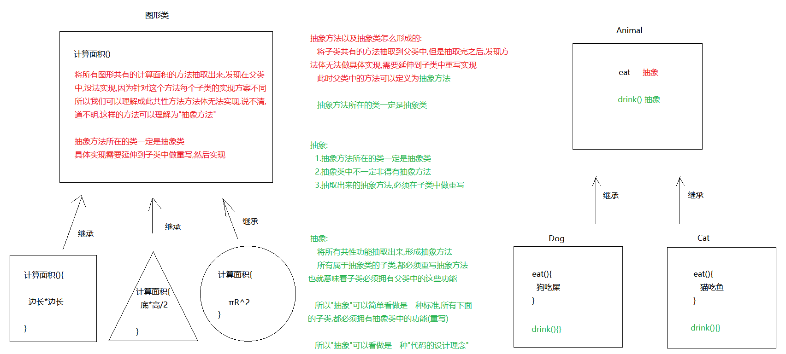
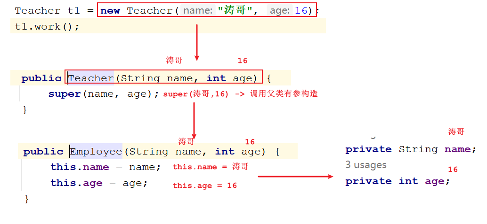
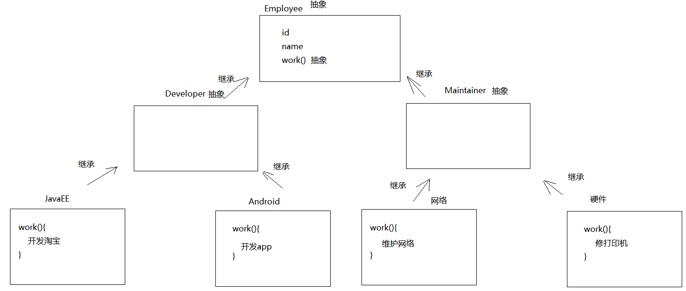
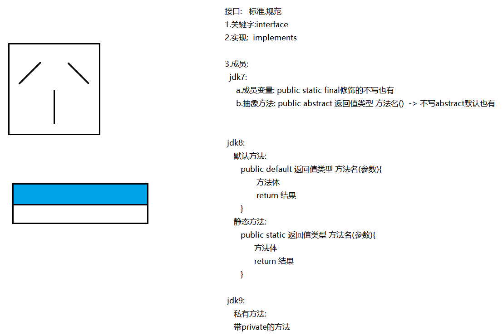
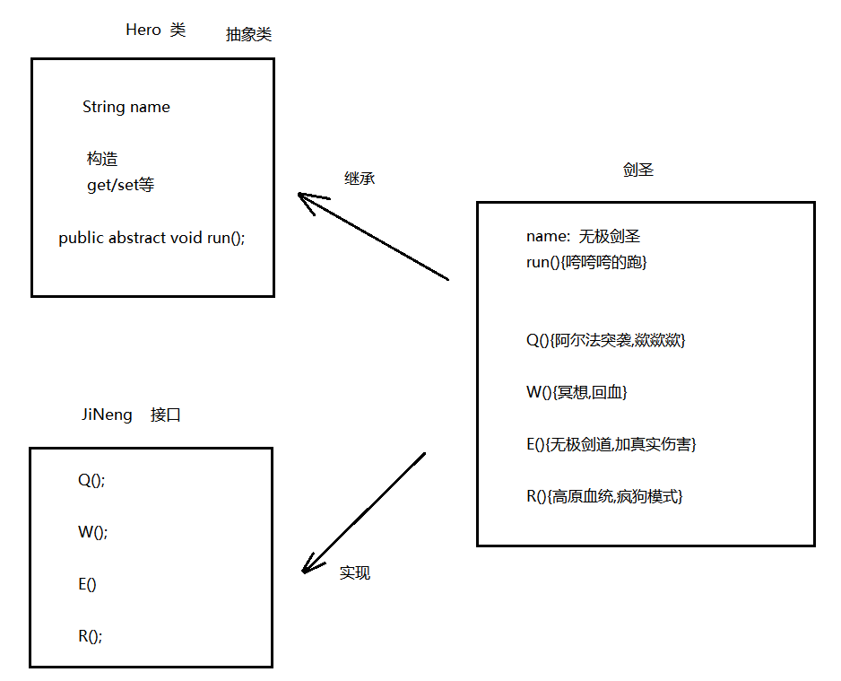
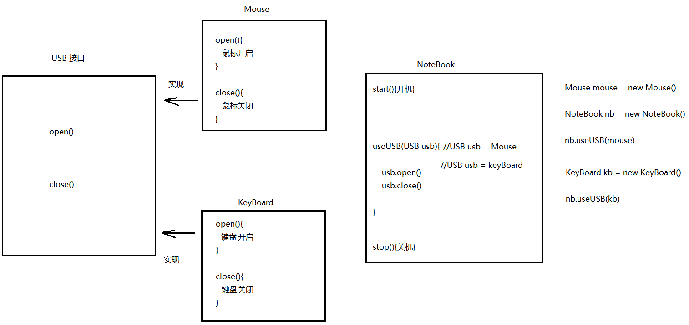

# day09_面向对象

```java
课前回顾:
 1.方法参数:
   a.基本类型作为方法参数,传递的是值,不是变量本身
   b.引用类型作为方法参数,传递的是地址值
 2.继承:extends -> 子类 extends 父类
   a.成员变量访问方式:看等号左边是谁,先调用谁,子类没有找父类
   b.成员方法访问方式:看new的是谁,先调用谁,子类没有找父类
 3.重写方法:
   a.概述:子类中有一个和父类从方法名上,以及参数列表上一样的方法
   b.访问方式:先调用重写的,子类没有再找父类
 4.super和this
   a.初始化子类对象,先调用父类无参构造->每个构造的第一行默认会有一个super()
   b.super关键字:代表的是父类引用
     调用父类构造方法:在子类构造中写
         super():调用父类无参构造
         super(实参):调用父类有参构造
     调用父类成员变量:
         super.成员变量名
     调用父类成员方法:
         super.方法名(参数)
      
   c.this关键字:代表的是当前对象
     调用当前对象中的构造:
         this()
         this(实参)
     调用当前对象中的成员变量
         this.变量名
     调用当前对象中的成员方法
         this.成员方法名(参数)
             
   d.注意:
     在构造中使用super和this时,不能同时出现,因为两个都需要在构造第一行
 5.继承的特点:
   a.继承只支持单继承,不能多继承
   b.继承支持多层继承
   c.一个父类可以有多个子类
       
今日重点:
  1.会定义抽象方法以及抽象类
  2.会重写抽象方法,调用重写的方法
  3.会定义接口,以及实现接口
  4.在接口中会定义抽象方法,以及实现抽象方法,调用抽象方法
  5.知道接口的特点
  6.知道多态的前提
  7.知道在多态的前提下,成员访问特点
  8.知道多态的好处
  9.会向下转型
  10.会判断类型
```

# 第一章.抽象



## 1.抽象的介绍

```java
1.将多个类中共有的方法抽取到父类中,发现方法体没法实现,所以将此方法定义成抽象方法
  抽象方法所在的类一定是抽象类

2.抽象关键字:abstract

3.抽象类:
   public abstract class 类名{}

4.抽象方法:
    修饰符 abstract 返回值类型 方法名(参数);


5.注意:  子类继承父类之后,必须要重写父类中的所有抽象方法
```

```java
public abstract class Animal {
    private String brand;

    public Animal() {
    }

    public Animal(String brand) {
        this.brand = brand;
    }

    public String getBrand() {
        return brand;
    }

    public void setBrand(String brand) {
        this.brand = brand;
    }

    //抽象方法
    public abstract void eat();
    public abstract void drink();
    public abstract void sleep();
    public abstract void la();
    public abstract void pee();
}

```

```java
public class Dog extends Animal{

    @Override
    public void eat() {
        System.out.println("狗啃骨头");
    }

    @Override
    public void drink() {
        System.out.println("狗卷水喝");
    }

    @Override
    public void sleep() {
        System.out.println("狗趴着睡");
    }

    @Override
    public void la() {
        System.out.println("狗蹲着拉");
    }

    @Override
    public void pee() {
        System.out.println("狗抬腿尿");
    }
}

```

```java
public class Test01 {
    public static void main(String[] args) {
        Dog dog = new Dog();
        dog.setBrand("哈士奇");//继承的
        String brand = dog.getBrand();//继承的
        System.out.println("brand = " + brand);
        System.out.println("====================");
        dog.eat();//重写的
        dog.drink();//重写的
        dog.sleep();//重写的
        dog.la();//重写的
        dog.pee();//重写的
    }
}
```

## 2.抽象的注意事项

```java
1.抽象类不能直接new对象,只能创建非抽象子类的对象
2.抽象类中,可以有构造方法,是供子类创建对象时,初始化父类中属性使用的 
3.抽象类中可以有成员变量,构造,成员方法
4.抽象类中不一定非得有抽象方法,但是有抽象方法的类一定是抽象类
5.抽象类的子类,必须重写父类中的所有抽象方法,否则,编译无法通过.除非该子类也是抽象类
```

```java
public abstract class Employee {
    private String name;
    private int age;

    public Employee() {
    }

    public Employee(String name, int age) {
        this.name = name;
        this.age = age;
    }

    public String getName() {
        return name;
    }

    public void setName(String name) {
        this.name = name;
    }

    public int getAge() {
        return age;
    }

    public void setAge(int age) {
        this.age = age;
    }

    //工作
    public abstract void work();
}

```

```java
public class Teacher extends Employee{
    public Teacher() {
    }

    public Teacher(String name, int age) {
        super(name, age);
    }

    @Override
    public void work() {
        System.out.println("讲师在讲课");
    }
}
```

```java
public class Test {
    public static void main(String[] args) {
        Teacher t1 = new Teacher("涛哥", 16);
        t1.work();
    }
}

```



# 第二章.综合案例

```java
某IT公司有多名员工，按照员工负责的工作不同，进行了部门的划分（研发部、维护部）。
研发部(Developer)根据所需研发的内容不同，又分为 JavaEE工程师 、Android工程师 ；
维护部(Maintainer)根据所需维护的内容不同，又分为 网络维护工程师 、硬件维护工程师 。

公司的每名员工都有他们自己的员工编号、姓名，并要做它们所负责的工作。

工作内容:

- JavaEE工程师： 员工号为xxx的 xxx员工，正在研发淘宝网站
- Android工程师：员工号为xxx的 xxx员工，正在研发淘宝手机客户端软件
- 网络维护工程师：员工号为xxx的 xxx员工，正在检查网络是否畅通
- 硬件维护工程师：员工号为xxx的 xxx员工，正在修复打印机

请根据描述，完成员工体系中所有类的定义，并指定类之间的继承关系。进行XX工程师类的对象创建，完成工作方法的调用。
```



## 方式1:利用set赋值

```java

public abstract class Employee {
    private int id;
    private String name;

    public Employee() {
    }

    public Employee(int id, String name) {
        this.id = id;
        this.name = name;
    }

    public int getId() {
        return id;
    }

    public void setId(int id) {
        this.id = id;
    }

    public String getName() {
        return name;
    }

    public void setName(String name) {
        this.name = name;
    }

    public abstract void work();
}

```

```java
public abstract class Developer extends Employee{
}
```

```java
public class JavaEE extends Developer{
    @Override
    public void work() {
        System.out.println("员工号为:"+getId()+"的"+getName()+"员工,正在开发淘宝");
    }
}
```

```java
public class Test01 {
    public static void main(String[] args) {
        JavaEE javaEE = new JavaEE();
        javaEE.setId(1);
        javaEE.setName("涛哥");
        javaEE.work();
        System.out.println("======================");
    }
}
```

## 方式2:利用构造赋值

```java
public abstract class Employee {
    private int id;
    private String name;

    public Employee() {
    }

    public Employee(int id, String name) {
        this.id = id;
        this.name = name;
    }

    public int getId() {
        return id;
    }

    public void setId(int id) {
        this.id = id;
    }

    public String getName() {
        return name;
    }

    public void setName(String name) {
        this.name = name;
    }

    public abstract void work();
}

```

```java
public abstract class Developer extends Employee{
    public Developer() {
    }

    public Developer(int id, String name) {
        super(id, name);
    }
}
```

```java
public class JavaEE extends Developer{
    public JavaEE() {
    }

    public JavaEE(int id, String name) {
        super(id, name);
    }

    @Override
    public void work() {
        System.out.println("员工号为:"+getId()+"的"+getName()+"员工,正在开发淘宝");
    }
}

```

```java
public class Test01 {
    public static void main(String[] args) {
        JavaEE javaEE = new JavaEE();
        javaEE.setId(1);
        javaEE.setName("涛哥");
        javaEE.work();
        System.out.println("======================");

        JavaEE javaEE1 = new JavaEE(2, "曼曼");
        javaEE1.work();

    }
}
```

# 第三章.接口

## 1.接口的介绍



## 2.接口的定义以及使用

```java
接口:   标准,规范
1.关键字:interface
2.实现:  implements

3.成员:
  jdk7:
     a.成员变量: public static final修饰的不写也有
     b.抽象方法: public abstract 返回值类型 方法名()  -> 不写abstract默认也有


 jdk8:
    默认方法:
       public default 返回值类型 方法名(参数){
              方法体
              return 结果
       }
    静态方法:
       public static 返回值类型 方法名(参数){
             方法体
             return 结果
       }

 jdk9:
    私有方法:
    带private的方法

```

```java
1.定义一个接口: interface 
  public interface 接口名{
    
  }

2.定义实现类实现接口:implements
  public class 类名 implements 接口名
      
3.在实现类中重写接口中所有的抽象方法
      
4.创建实现类对象(接口不能直接new对象),调用重写的方法      
```

```java
public interface USB {
    public abstract void open();
    public abstract void close();
}
```

```java
public class Mouse implements USB{
    @Override
    public void open() {
        System.out.println("鼠标开启");
    }

    @Override
    public void close() {
        System.out.println("鼠标关闭");
    }
}

```

```java
public class Test01 {
    public static void main(String[] args) {
        Mouse mouse = new Mouse();
        mouse.open();
        mouse.close();
    }
}
```

## 3.接口中的成员

### 3.1抽象方法

```java
1.格式:
  public abstract 返回值类型 方法名();

2.注意:
  即使没有abstract 默认也有

3.使用:
  a.创建实现类实现接口
  b.重写抽象方法
  c.创建实现类对象
  d.调用重写方法
```

```java
public interface USB {
    public abstract void open();
    void close();
}

```

```java
public class Mouse implements USB{
    @Override
    public void open() {
        System.out.println("鼠标开启");
    }

    @Override
    public void close() {
        System.out.println("鼠标关闭");
    }
}

```

```java
public class Test01 {
    public static void main(String[] args) {
        Mouse mouse = new Mouse();
        mouse.open();
        mouse.close();
    }
}
```

### 3.2默认方法

```java
1.格式:
  public default 返回值类型 方法名(参数){
      方法体
      return 结果
  }

2.使用:
  a.定义实现类,实现接口
  b.在实现类中可重写默认方法,也可不重写
  c.创建实现类对象,调用默认方法
```

```java
public interface USB {
    //默认方法
    public default void methodDef(){
        System.out.println("我是接口中的默认方法");
    }
}
```

```java
public class Mouse implements USB{
    @Override
    public void methodDef(){
        System.out.println("我是重写的接口中的默认方法");
    }
}
```

```java
public class Test01 {
    public static void main(String[] args) {
        Mouse mouse = new Mouse();
        mouse.methodDef();
    }
}

```

### 3.3静态方法

```java
1.格式:
  public static 返回值类型 方法名(参数){
      方法体
      return 结果
  }

```

```java
public interface USB {
   
    //静态方法
    public static void methodSta(){
        System.out.println("我是接口中的静态方法");
    }
}
```

```java
public class Test01 {
    public static void main(String[] args) {
        USB.methodSta();
    }
}

```

### 3.4成员变量

```java
1.格式:
  public static final 数据类型 变量名 = 值
2.注意:
  a.不写static final 默认也有
  b.被static final修饰的变量名一般都是大写    
```

```java
public interface USB {
    /*
      final代表最终的
      被final修饰之后不能被二次赋值
     */
    public static final int NUM = 100;
    int NUM1 = 10;
}
```

```java
public class Test01 {
    public static void main(String[] args) {
        System.out.println(USB.NUM);
        System.out.println(USB.NUM1);
    }
}
```

## 4.接口的特点

```java
1.接口可以多实现:
  public class InterfaceImpl implements InterfaceA,InterfaceB{}
2.接口可以多继承
  public Interface InterfaceA extends InterfaceB,InterfaceC{}
3.一个类可以继承一个父类的同时实现一个或者多个接口
  public class InterfaceImpl extends Fu implements InterfaceB,InterfaceC{}
```

> 当一个类实现多个接口时,如果接口中的抽象方法有重名且参数一样的,只需要重写一次
>
> ```java
> public interface InterfaceB {
>        public abstract void methodAbs();
> }
> ```
>
> ```java
> public interface InterfaceC {
>        public abstract void methodAbs();
> }
> 
> ```
>
> ```java
> public class InterfaceImpl implements InterfaceB,InterfaceC{
>        @Override
>        public void methodAbs() {
>            System.out.println("我是重写的methodAbs");
>        }
> }
> 
> ```
>
> 当一个类实现多个接口时,如果默认方法有重名的,参数一样,要重写一次
>
> ```java
> public interface InterfaceB {
>        public abstract void methodAbs();
>    
>        public default void methodDef(){
>            System.out.println("我是接口B中的methodDef方法");
>     }
>    }
>    ```
>    
>    ```java
> public interface InterfaceC {
>     public abstract void methodAbs();
> 
>    public default void methodDef(){
>         System.out.println("我是接口C中的methodDef方法");
>     }
>    }
> ```
>    
>    ```java
>    public class InterfaceImpl implements InterfaceB,InterfaceC{
>     @Override
>     public void methodAbs() {
>        System.out.println("我是重写的methodAbs");
>     }
> 
>        @Override
>     public void methodDef() {
>            System.out.println("我是重写的默认方法");
>        }
>    
> }
> ```

## 5.接口和抽象类的区别

```java
相同点:
  a.都位于继承的顶端,用于被其他类实现或者继承
  b.都不能new
  c.都包含抽象方法,其子类都必须重写这些抽象方法

不同点:
  a.抽象类:一般作为父类使用,可以有成员变量,构造,成员方法,抽象方法等
  b.接口:成员单一,一般抽取接口,抽取的都是方法,是功能的大集合
  c.类不能多继承,接口可以
```



# 第四章.多态

```java
1.怎么学多态:
  a.知道多态的前提
  b.知道多态的new法
  c.知道多态的好处
```

## 1.多态的介绍

```java
前提:
  1.必须有子父类继承关系或者接口实现关系
  2.必须有方法的重写(没有方法的重写多态没有任何意义)
    多态主要玩儿的就是重写方法
  3.父类引用指向子类对象:
    父类类型 对象名 = new 子类对象() -> 好比是 double b = 10
```

## 2.多态的基本使用

```java
1.定义一个父类或者接口
2.定义一个子类或者实现类
3.重写抽象方法
4.父类引用指向子类对象
5.调用重写的方法
```

```java
public class Animal {
    public void eat(){
        System.out.println("动物要吃饭");
    }
}
```

```java
public class Dog extends Animal{
    public void eat(){
        System.out.println("狗啃骨头");
    }

    //特有方法
    public void lookDoor(){
        System.out.println("狗会看门");
    }
}

```

```java
public class Cat extends Animal{
    @Override
    public void eat() {
        System.out.println("猫吃鱼");
    }

    //特有方法
    public void catchMouse(){
        System.out.println("猫会抓老鼠");
    }
}
```

```java
public class Test01 {
    public static void main(String[] args) {
        //原始方式new对象
        Dog dog = new Dog();
        dog.eat();
        dog.lookDoor();
        System.out.println("==========");
        Cat cat = new Cat();
        cat.eat();
        cat.catchMouse();

        System.out.println("==========");

        //多态形式new对象
        Animal animal = new Dog();
        animal.eat();
        //animal.lookDoor();//多态前提下,不能直接调用子类特有功能
        System.out.println("==========");

        Animal animal1 = new Cat();
        animal1.eat();
        //animal1.catchMouse();//多态前提下,不能直接调用子类特有功能
    }
}

```

## 3.多态的条件下成员的访问特点

### 3.1成员变量

```java
public class Fu {
    int num = 100;
}
```

```java
public class Zi extends Fu{
    int num = 10;
}

```

```java
public class Test {
    public static void main(String[] args) {
        Fu fu = new Zi();
        System.out.println(fu.num);//父类的100
        
        System.out.println("============");

        Zi zi = new Zi();
        System.out.println(zi.num);//子类的10
    }
}

```

```java
看等号左边是谁,先调用谁中的成员变量,子类没有,找父类
```

### 3.2成员方法

```java
public class Fu {
    int num = 100;
    public void method(){
        System.out.println("父类中的method方法");
    }
}
```

```java
public class Zi extends Fu{
    int num = 10;

    public void method(){
        System.out.println("子类中的method方法");
    }
}
```

```java
public class Test {
    public static void main(String[] args) {
        //多态方式
        Fu fu = new Zi();
        System.out.println(fu.num);//父类的100
        fu.method();

        System.out.println("============");

        //原始方式
        Zi zi = new Zi();
        System.out.println(zi.num);//子类的10
        zi.method();
    }
}

```

```java
看new的是谁,先调用谁中的成员方法,子类没有,找父类
```

## 4.多态的好处(为什么学多态)

```java
1.多态的new法:
  父类类型 对象名 = new 子类对象()  -> 大类型接收了小类型的数据
      
  父类类型属于大类型
  子类对象属于小类型
      
      
  好比: 
    int i = 10;
    long j = 100L;
    double b = i;
    b = j;

2.多态的好处:
  
  原始方式: 等号左右两边一样
    a.好处:既能调用子类特有的,还能调用重写的,还能调用从父类中继承过来的
    b.坏处:扩展性差
        
  多态方式:父类引用指向子类对象
    a.好处:扩展性强
    b.弊端:不能直接调用子类特有方法    
    
```

```java
public class Animal {
    public void eat(){
        System.out.println("动物要吃饭");
    }
}
```

```java
public class Dog extends Animal {
    public void eat(){
        System.out.println("狗啃骨头");
    }

    //特有方法
    public void lookDoor(){
        System.out.println("狗会看门");
    }
}
```

```java
public class Cat extends Animal {
    @Override
    public void eat() {
        System.out.println("猫吃鱼");
    }

    //特有方法
    public void catchMouse(){
        System.out.println("猫会抓老鼠");
    }
}
```

```java
public class Test01 {
    public static void main(String[] args) {
        //原始方式new对象
        Dog dog = new Dog();
        method(dog);

        Cat cat = new Cat();
        method(cat);

        //TaoGe taoGe = new TaoGe();
        //method(taoGe);

        //Bird bird = new Bird();
        //method(bird);
    }
    public static void method(Dog dog){
        dog.eat();
        dog.lookDoor();
    }

    public static void method(Cat cat){
        cat.eat();
        cat.catchMouse();
    }

    /*public static void method(TaoGe taoge){

    }*/

   /* public static void method(Bird bird){

    }*/
}

```

```java
public class Test02 {
    public static void main(String[] args) {
        Dog dog = new Dog();
        method(dog);

        Cat cat = new Cat();
        method(cat);
    }

    /*
      形参传递父类类型,就可以接受任意它的子类对象
      接收哪个子类对象,就调用哪个子类对象重写的方法
    */
    public static void method(Animal animal) {//Animal animal = Dog  Animal animal = Cat
        animal.eat();
    }
}
```

## 5.多态中的转型

### 5.1向上转型

```java
1.格式:
  父类引用指向子类对象(默认)
```

### 5.2向下转型

```java
1.可以理解为强转
2.格式:
  父类类型 对象名1 = new 子类对象() -> 向上转型
  子类类型 对象名2 = (子类类型)对象名1 -> 向下转型
      
  好比:
    double b = 10;
    int i = (int)b;

3.好处:可以调用子类特有功能
```

```java
public class Animal {
    public void eat(){
        System.out.println("动物要吃饭");
    }
}
```

```java

public class Cat extends Animal {
    @Override
    public void eat() {
        System.out.println("猫吃鱼");
    }

    //特有方法
    public void catchMouse(){
        System.out.println("猫会抓老鼠");
    }
}

```

```java
public class Dog extends Animal {
    public void eat(){
        System.out.println("狗啃骨头");
    }

    //特有方法
    public void lookDoor(){
        System.out.println("狗会看门");
    }
}

```

```java
public class Test01 {
    public static void main(String[] args) {
        Dog dog = new Dog();
        method(dog);
    }

    public static void method(Animal animal) {//Animal animal = Dog  Animal animal = Cat
        animal.eat();
        //向下转型
        Dog dog = (Dog) animal;
        dog.lookDoor();
    }
}
```

## 6.转型可能会出现的问题

```java
1.向下转型容易出现的问题:
  ClassCastException -> 类型转换异常
2.出现问题的原因:
  转型的时候,等号左右两边类型不一致
 
3.解决:做判断
  a.关键字: instanceof 判断类型 结果为boolean
  b.格式:
    对象名 instanceof 类型 -> 关键字前面的对象是否属于关键字后面的类型
```

```java
public class Animal {
    public void eat(){
        System.out.println("动物要吃饭");
    }
}
```

```java
public class Dog extends Animal {
    public void eat(){
        System.out.println("狗啃骨头");
    }

    //特有方法
    public void lookDoor(){
        System.out.println("狗会看门");
    }
}

```

```java
public class Cat extends Animal {
    @Override
    public void eat() {
        System.out.println("猫吃鱼");
    }

    //特有方法
    public void catchMouse(){
        System.out.println("猫会抓老鼠");
    }
}

```

```java
public class Test01 {
    public static void main(String[] args) {
        Dog dog = new Dog();
        method(dog);

        Cat cat = new Cat();
        method(cat);
    }

    public static void method(Animal animal) {//Animal animal = Dog  Animal animal = Cat
        if (animal instanceof Dog){
            animal.eat();
            //向下转型
            Dog dog = (Dog) animal;
            dog.lookDoor();
        }

        if (animal instanceof Cat){
            animal.eat();
            Cat cat = (Cat) animal;
            cat.catchMouse();
        }

    }
}

```

## 7.综合练习

```java
定义笔记本类，具备开机，关机和使用USB设备的功能。具体是什么USB设备，笔记本并不关心，只要符合USB规格的设备都可以。鼠标和键盘要想能在电脑上使用，那么鼠标和键盘也必须遵守USB规范，不然鼠标和键盘的生产出来无法使用;
进行描述笔记本类，实现笔记本使用USB鼠标、USB键盘

- USB接口，包含开启功能、关闭功能
- 笔记本类，包含运行功能、关机功能、使用USB设备功能
- 鼠标类，要符合USB
- 键盘类，要符合USB接口
```



```java
public interface USB {
    void open();
    void close();
}

```

```java
public class Mouse implements USB{

    @Override
    public void open() {
        System.out.println("鼠标开启");
    }

    @Override
    public void close() {
        System.out.println("鼠标关闭");
    }
}

```

```java
public class KeyBoard implements USB{
    @Override
    public void open() {
        System.out.println("键盘开启");
    }

    @Override
    public void close() {
        System.out.println("键盘关闭");
    }
}
```

```java
public class NoteBook {
    public void start(){
        System.out.println("开机了");
    }

    public void useUSB(USB usb){//USB usb = mouse  USB usb = keyBoard
        usb.open();
        usb.close();
    }

    public void stop(){
        System.out.println("关机了");
    }
}
```

```java
public class Test01 {
    public static void main(String[] args) {
        NoteBook noteBook = new NoteBook();

        noteBook.start();

        Mouse mouse = new Mouse();
        noteBook.useUSB(mouse);

        System.out.println("==================");

        KeyBoard keyBoard = new KeyBoard();
        noteBook.useUSB(keyBoard);

        noteBook.stop();
    }
}

```

> 作业:在Mouse中添加特有单击方法
>
> ​        在KeyBoard中添加特有敲击方法
>
> ​        在useUSB方法中调用