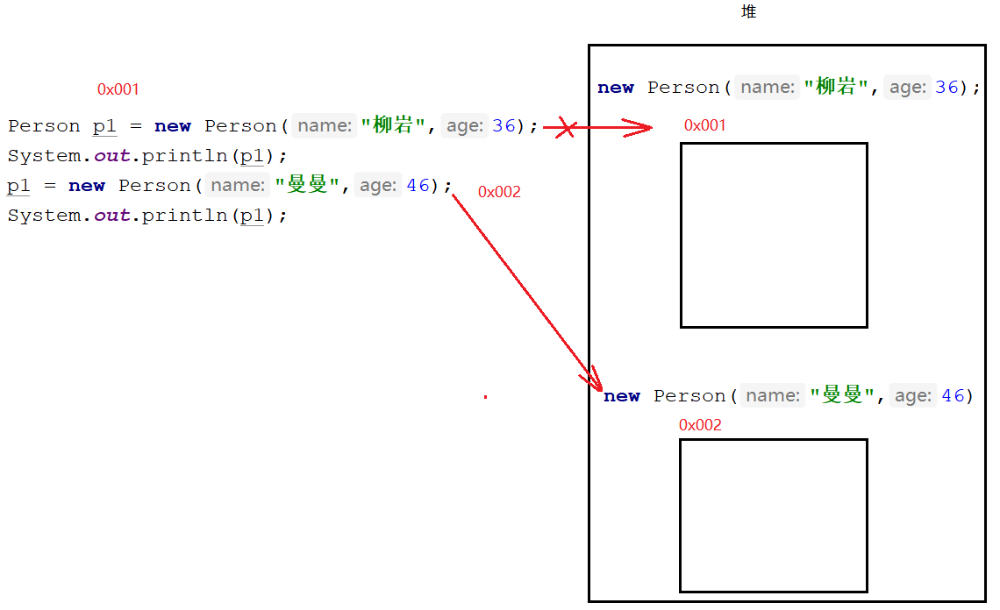
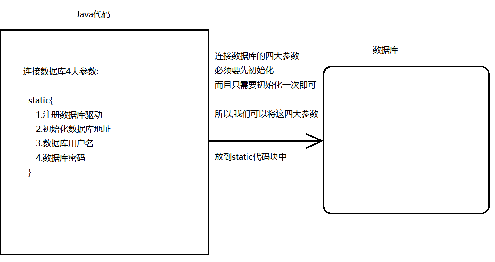
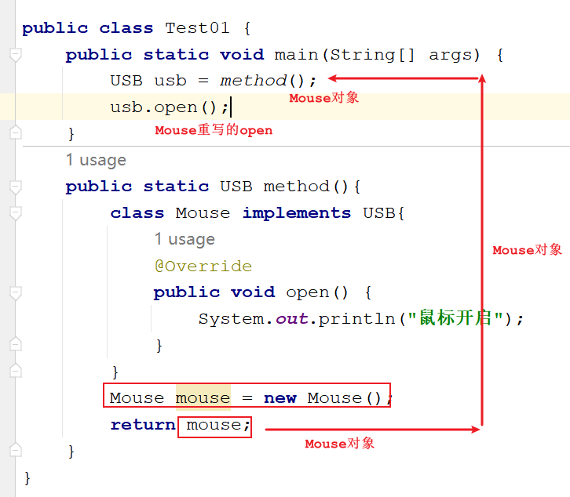
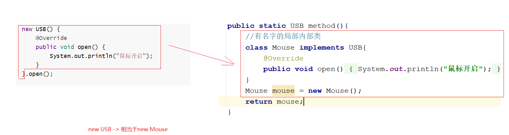
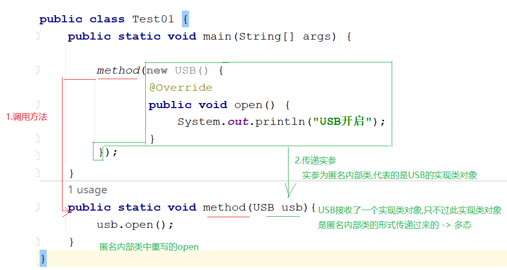
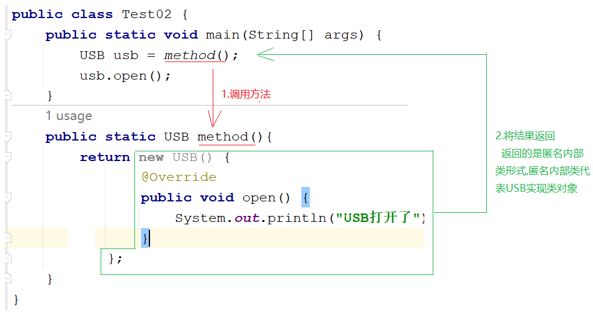
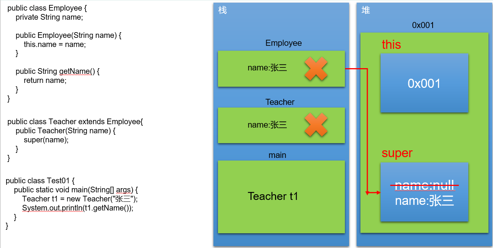
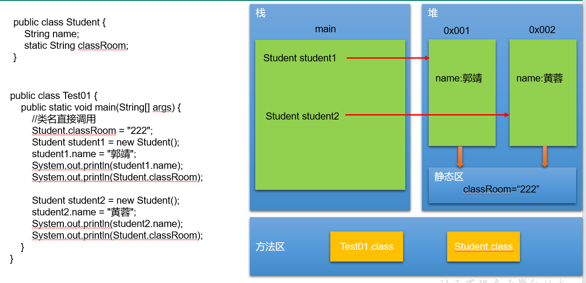

# day10面向对象

```java
课前回顾:
  1.抽象关键字: abstract
  2.抽象方法:
    public abstract 返回值类型 方法名(参数);
  3.抽象类:
    public abstract class 类名{}
  4.需要注意的点:
    a.抽象方法所在的类,一定是抽象类
    b.抽象类中不一定非得有抽象方法
    c.抽象类不能new对象,需要创建非抽象的子类
    d.抽象类中可以有成员变量,构造方法,其他方法,抽象方法等
    e.抽象类中的构造方法是供创建子类对象时初始化父类属性使用的
    f.子类继承抽象类之后,需要重写所有抽象方法,除非子类也是一个抽象类
  5.接口:标准,规范
    a.关键字:interface 和 implements
    b.接口怎么定义:public interface 接口名{}
    c.怎么实现:
      定义一个实现类,实现接口  implements 接口名
      重写接口中的抽象方法
      创建实现类对象(接口不能new对象),调用重写方法
    d.接口:抽象方法
      定义:public abstract 返回值类型 方法名(参数);
          即使不写abstract默认也有
      使用:通过实现类重写,调用重写方法
    e.接口:默认方法
      定义:public default 返回值类型 方法名(参数){
              方法体
              return 结果    
          }
      使用:需要创建实现类对象,调用默认方法
    f.接口:静态方法
      定义:public static 返回值类型 方法名(参数){
              方法体
              return 结果
          }
      使用:接口名直接调用
    g.接口:成员变量
      定义:public static final 数据类型 变量名 = 值
      使用:接口名直接调用
  6.接口特点:
    a.接口可以多实现
    b.接口可以多继承
    c.一个实现类可以继承一个父类的同时实现一个或者多个接口
  7.多态
    a.前提:
      必须有子父类继承关系或者接口实现关系
      必须有方法的重写
      父类引用指向子类对象
    b.好处:
      扩展性强,形参为父类类型,可以接受任意它的子类对象,传递哪个子类对象,就指向哪个子类对象,就调用哪个子类对象重写的方法
    c.坏处:不能直接调用子类特有方法
    d.向下转型:将父类类型转成子类类型
    e.判断类型:
      对象名 instanceof 类型 -> 判断对象是否属于关键字后面的类型
    f.异常:
      ClassCastException:类型转换异常->转型时等号左右两边类型不一致
       
今日重点:
  1.会使用final修饰成员,以及知道被final修饰之后成员的特点
  2.会使用静态代码块
  3.会匿名内部类操作    
```

```java
public class KeyBoard implements USB {
    @Override
    public void open() {

        System.out.println("键盘开启");
    }

    @Override
    public void close() {

        System.out.println("键盘关闭");
    }

    //特有方法
    public void qiaoJi(){
        System.out.println("快来呀,敲死我!");
    }
}

```

```java
public class Mouse implements USB {

    @Override
    public void open() {

        System.out.println("鼠标开启");
    }

    @Override
    public void close() {

        System.out.println("鼠标关闭");
    }

    //特有方法
    public void click(){
        System.out.println("来呀,点我呀!点死我!");
    }
}

```

```java
public class NoteBook {
    public void start(){
        System.out.println("开机了");
    }

    public void useUSB(USB usb){//USB usb = mouse  USB usb = keyBoard
        if (usb instanceof Mouse){
            usb.open();
            usb.close();
            Mouse mouse = (Mouse) usb;
            mouse.click();
        }

        if (usb instanceof KeyBoard){
            usb.open();
            usb.close();
            KeyBoard keyBoard = (KeyBoard) usb;
            keyBoard.qiaoJi();
        }
    }

    public void stop(){
        System.out.println("关机了");
    }
}

```

```java
public class Test01 {
    public static void main(String[] args) {
        NoteBook noteBook = new NoteBook();

        noteBook.start();

        Mouse mouse = new Mouse();
        noteBook.useUSB(mouse);

        System.out.println("==================");

        KeyBoard keyBoard = new KeyBoard();
        noteBook.useUSB(keyBoard);

        noteBook.stop();
    }
}

```

# 第一章.权限修饰符

## 1 概述

在Java中提供了四种访问权限，使用不同的访问权限修饰符修饰时，被修饰的内容会有不同的访问权限，

- public：公共的,最高权限,被public修饰的成员,在哪里都能访问
- protected：受保护的
- default：:默认的 注意  不写权限修饰符就是默认权限,不能直接把default写出来
- private：私有的,只能在自己的类中直接访问

## 2 不同权限的访问能力

|              | public | protected | default（空的） | private |
| ------------ | ------ | --------- | --------------- | ------- |
| 同类         | yes    | yes       | yes             | yes     |
| 同包不同类   | yes    | yes       | yes             | no      |
| 不同包子父类 | yes    | yes       | no              | no      |
| 不同包无关类 | yes    | no        | no              | no      |

public具有最大权限,private有最小权限

编写代码时,如果没有特殊的考虑,建议这样使用权限:

```java
1.属性:private -> 封装思想
2.成员方法:public -> 方便调用
3.构造方法:public -> 方便new对象
```

# 第二章.final关键字

```java
1.概述:最终的
2.使用:
  a.修饰一个类
  b.修饰一个方法
  c.修饰一个成员变量
  d.修饰一个局部变量
  e.修饰一个对象   
```

## 1.final修饰类

```java
1.格式:
  public final class 类名{} -> 最终类
2.特点:
  被final修饰的类不能被继承->太监类
```

```java
public final class Animal {
    
}
```

```java
public class Dog /*extends Animal*/{
}
```

## 2.final修饰方法

```java
1.格式:
  修饰符 final 返回值类型 方法名(参数){
      方法体
      return 结果
  }
2.特点:
  a.被final修饰的方法不能被重写
  b.final不能和abstract结合使用    
```

```java
public abstract class Animal {
   public final void eat(){
       System.out.println("动物要吃饭");
   }

   /*
     final修饰方法不能被重写
     abstract修饰方法必须重写
     所以不能一起使用->冲突
    */
   //public final abstract void drink();
   
}
```

```java
public class Dog extends Animal{
    //被final修饰的方法不能被重写
    /*public void eat(){
        System.out.println("狗要吃饭");
    }*/
}
```

## 3.final修饰局部变量

```java
1.格式:
  final 数据类型 变量名 = 值
2.特点:
  不能被二次赋值
```

```java
public class Test {
    public static void main(String[] args) {
        final int i = 10;
        //i = 20;
        System.out.println("i = " + i);
        
        final int j;
        j = 10;
        //j = 100;
    }
}
```

## 4.final修饰对象

```java
1.格式:
  final 类名 对象名 = new 类名()
2.特点:
  被final修饰的对象地址值不能改变,但是属性值可以改变
```

```java
public class Person {
    private String name;
    private int age;

    public Person() {
    }

    public Person(String name, int age) {
        this.name = name;
        this.age = age;
    }

    public String getName() {
        return name;
    }

    public void setName(String name) {
        this.name = name;
    }

    public int getAge() {
        return age;
    }

    public void setAge(int age) {
        this.age = age;
    }
}

```

```java
public class Test01 {
    public static void main(String[] args) {
        final Person p1 = new Person("柳岩",36);
        System.out.println(p1);
        //p1 = new Person("曼曼",46);
        p1.setAge(38);
        System.out.println(p1.getName()+"..."+p1.getAge());

    }
}
```



## 5.final修饰成员变量

```java
1.格式:
  final 数据类型 变量名 = 值
2.特点:
  被final修饰的变量不能被二次赋值
```

```java
public class Person {
    final String name = "坤坤";
    //final String name;

    public Person() {
        //this.name = "坤坤";
    }

    /**
     * 成员变量已经初始化了,而且被final修饰了
     * 所以jvm在编译的时候认为有参构造是二次赋值操作,所以报错
     * @param name
     */
   /* public Person(String name) {
        this.name = name;
    }*/

    public String getName() {
        return name;
    }

    /**
     * 成员变量已经初始化了,而且被final修饰了
     * 所以jvm在编译的时候认为set方法是二次赋值操作,所以报错
     * @param name
     */
    /*public void setName(String name) {
        this.name = name;
    }*/
}

```

# 第三章.代码块

### 2.1构造代码块

```java
1.格式:
  {
      代码
  }

2.特点:
  优先于构造方法执行,每new一次构造代码块就执行一次
```

```java
public class Person {
    public Person(){
        System.out.println("我是空参构造方法");
    }

    //构造代码块
    {
        System.out.println("我是构造代码块");
    }
}
```

```java
public class Test01 {
    public static void main(String[] args) {
        Person p1 = new Person();
        Person p2 = new Person();
    }
}

```

### 2.2静态代码块

```java
1.格式:
  static{
      代码
  }

2.特点:
  静态代码块优先于构造代码块以及构造方法执行,而且只执行一次
```

```java
public class Person {
    public Person(){
        System.out.println("我是空参构造方法");
    }

    //构造代码块
    {
        System.out.println("我是构造代码块");
    }

    //静态代码块
    static{
        System.out.println("我是静态代码块");
    }
}
```

```java
public class Person {
    public Person(){
        System.out.println("我是空参构造方法");
    }

    //构造代码块
    {
        System.out.println("我是构造代码块");
    }

    //静态代码块
    static{
        System.out.println("我是静态代码块");
    }
}

```

### 2.3.静态代码块使用场景

```java
如果需要上来就是先初始化一些数据,而且这些数据只需要初始化一次,此时这些数据可以放到静态代码块中
```



# 第四章.内部类

```java
1.什么时候使用内部类:
  当一个事物的内部,还有一个部分需要完整的结构进行描述,而这个内部的完整的结构又只为外部事物提供服务,那么整个内部的完整结构最好使用内部类
  比如:人类都有心脏,人类本身需要用属性,行为去描述,那么人类内部的心脏也需要心脏特殊的属性和行为来描述,此时心脏就可以定义成内部类,人类中的一个内部类
  
  当一个类内部的成员也需要用属性和行为描述时,就可以定义成内部类了
      
2.在java中允许一个类的定义位于另外一个类内部,前者就称之为内部类,后者称之为外部类
  class A{
      class B{
          
      }
  }
  A就是B的外部类
  B就是A的内部类
      
3.分类:
  成员内部类(静态,非静态)
  局部内部类
  匿名内部类(重点)
```

## 1 静态成员内部类

```java
1.格式:直接在定义内部类的时候加上static关键字即可
  public class A{
      static class B{
          
      }
  }

2.注意:
  a.内部类中可以定义属性,方法,构造等
  b.静态内部类可以被final或者abstract修饰
    给final修饰,不能被继承
    被abstract修饰,不能new
  c.静态内部类不能调用外部的非静态成员
  d.内部类还可以被四种权限修饰符修饰
 
3.调用静态内部类成员:
  外部类.内部类 对象名 = new 外部类.内部类()
```

```java
public class Person {
    public void eat(){
        System.out.println("人要吃饭");
        new Heart().jump();
    }
    //静态成员内部类
    static class Heart{
       public void jump(){
           System.out.println("心在咣咣咣的跳");
           
           //eat();
           new Person().eat();
       }
    }
}

```

```java
public class Test01 {
    public static void main(String[] args) {
        Person.Heart heart = new Person.Heart();
        heart.jump();
    }
}
```

## 2 非静态成员内部类

```java
1.格式:
  public class 类名{
      class 类名{
          
      }
  }

2.注意:
  a.内部类中可以定义属性,方法,构造等
  b.静态内部类可以被final或者abstract修饰
    给final修饰,不能被继承
    被abstract修饰,不能new
  c.静态内部类不能调用外部的非静态成员
  d.内部类还可以被四种权限修饰符修饰
      
3.调用非静态成员内部类
  外部类.内部类 对象名 = new 外部类().new 内部类()
```

```java
public class Person {
    public void eat(){
        System.out.println("人要干饭");
        //new Heart().jump();
    }

    class Heart{
        public void jump(){
            System.out.println("心脏在哐哐哐跳");
            //eat();
            new Person().eat();
        }
    }
}

```

```java
public class Test01 {
    public static void main(String[] args) {
        Person.Heart heart = new Person().new Heart();
        heart.jump();
    }
}

```

> 外部类的成员变量和内部类的成员变量以及内部类的局部变量重名时,怎么区分?
>
> ```java
> public class Student {
>     String name = "张三";
>     class Heart{
>         String name = "心脏";
>         public void display(String name){
>             System.out.println(name);
>             System.out.println(this.name);
>             //可以简单理解为Student的成员变量(this.name)
>             System.out.println(Student.this.name);
>         }
>     }
> }
> 
> 
> public class Test01 {
>     public static void main(String[] args) {
>         Person.Heart heart = new Person().new Heart();
>         heart.jump();
> 
>         System.out.println("============================");
> 
>         Student.Heart heart1 = new Student().new Heart();
>         heart1.display("李四");
>     }
> }
> 
> ```

## 3 局部内部类

## 3 局部内部类

### 3.1.局部内部类基本操作

```java
1.可以定义在方法中,代码块中,构造方法中
```

```java
public class Person {
    public void method(){
        /**
         * class Heart放到了method方法中
         * 所以Heart就叫做局部内部类
         */
        class Heart{
            public void jump(){
                System.out.println("心一跳,爱就开始煎熬,每一分,每一秒!!!");
            }
        }

        new Heart().jump();
    }
}
```

```java
public class Test01 {
    public static void main(String[] args) {
        Person person = new Person();
        person.method();
    }
}
```

### 3.2.局部内部类实际操作

#### 3.2.1.接口类型作为方法参数传递和返回

> 接口作为方法参数传递,我们实参传递实现类对象
>
> 接口作为方法返回值,我们返回的应该是实现类对象

```java
public interface USB {
    public abstract void open();
}
```

```java
public class Mouse implements USB{

    @Override
    public void open() {
        System.out.println("鼠标开启");
    }
}
```

```java
public class Test01 {
    public static void main(String[] args) {
        //调用method01传递参数,传递实参时,
        Mouse mouse = new Mouse();
        method01(mouse);
        System.out.println("=================");
        USB usb = method02();
        usb.open();//Mouse重写的方法
    }

    /**
     * 形参为接口类型
     * @param usb
     */
    public static void method01(USB usb){//形参为接口类型 USB usb = mouse
        usb.open();
    }

    /**
     * 方法返回值类型为接口类型
     */
    public static USB method02(){
        Mouse mouse = new Mouse();
        return mouse;
    }
}

```


#### 3.2.2.抽象类作为方法参数和返回值

> 方法形参为抽象类,调用方法传递实参时需要传递子类对象
>
> 方法返回值类型为抽象类类型,返回的结果需要返回子类对象

```java
public abstract class Animal {
    public abstract void eat();
}
```

```java
public class Dog extends Animal{
    @Override
    public void eat() {
        System.out.println("狗啃骨头");
    }
}
```

```java
public class Test01 {
    public static void main(String[] args) {
        Dog dog = new Dog();
        method01(dog);
        System.out.println("=============");
        Animal animal = method02();//method02()接收的是返回回来的Dog对象
        animal.eat();
    }
    public static void method01(Animal animal){//Animal animal = dog
        animal.eat();
    }

    public static Animal method02(){
        Dog dog = new Dog();
        return dog;
    }
}

```

#### 3.2.3.普通类做方法参数和返回值

> 普通类作为方法的参数和返回值时,需要传递和返回其对象

```java
public class Person {
    public void eat(){
        System.out.println("人要吃饭");
    }
}
```

```java
public class Test01 {
    public static void main(String[] args) {
        Person person1 = new Person();
        method01(person1);//person1在内存中保存的是地址值,0x001

        System.out.println("=============================");

        /*
          method02返回的person1给了method02()
          此处的method02()接收了person1对象
          然后让person2接收了person1
          此时person2和person1的地址值一样
         */
        Person person2 = method02();
        person2.eat();
    }
    public static void method01(Person person2){//Person person2 = person1
        person2.eat();
    }

    public static Person method02(){
        Person person1 = new Person();
        return person1;//person1在内存中保存的是地址值,0x002
    }
}
```

#### 3.2.4.局部内部类实际操作

```java
public interface USB {
    public abstract void open();
}
```

```java
public class Test01 {
    public static void main(String[] args) {
        USB usb = method();
        usb.open();
    }
    public static USB method(){
        class Mouse implements USB{
            @Override
            public void open() {
                System.out.println("鼠标开启");
            }
        }
        Mouse mouse = new Mouse();
        return mouse;
    }
}

```



## 4.匿名内部类(重点)

```java
1.概述:之前我们为了实现一个接口
  a.创建实现类实现接口
  b.重写抽象方法
  c.创建实现类对象
  d.调用重写方法
    
  我们能不能将上面的实现方式合成一步来操作
    
  匿名内部类就是没有名字的局部内部类,可以将上面实现方式四合一,一种格式代表以上四步

2.注意:匿名内部类代表的是子类对象或者实现类对象
    
3.格式:
  new 接口/抽象父类(){
      重写方法
  }.重写方法();

  或者

  接口/抽象类型 对象名 = new 接口/抽象父类(){
      重写方法
  }

  对象名.重写方法名();
```

```java
public interface USB {
    public abstract void open();
}
```

```java
public class Test01 {
    public static void main(String[] args) {
        new USB() {
            @Override
            public void open() {
                System.out.println("鼠标开启");
            }
        }.open();

        System.out.println("========================");

        USB usb = new USB() {
            @Override
            public void open() {
                System.out.println("鼠标开启");
            }
        };
        usb.open();

    }
}

```




> 什么时候用匿名内部类:
>
>   当指向简单调用实现一次接口中的方法,我们就可以使用搞匿名内部类

### 4.2 匿名内部类复杂用法_当参数传递

```java
public interface USB {
    public abstract void open();
}
```

```java
public class Test01 {
    public static void main(String[] args) {
        //new实现类对象,调用方法,传递实现类对象,现在实现类对象可以用匿名内部类表示
        method(new USB() {
            @Override
            public void open() {
                System.out.println("USB开启");
            }
        });
    }
    public static void method(USB usb){
        usb.open();
    }
}

```



### 4.3 匿名内部类复杂用法_当返回值返回

```java
public interface USB {
    public abstract void open();
    //public abstract void close();
}
```

```java
public class Test02 {
    public static void main(String[] args) {
        USB usb = method();
        usb.open();
    }
    public static USB method(){
        return new USB() {
            @Override
            public void open() {
                System.out.println("USB打开了");
            }
        };
    }
}
```



# 第五章.经典接口(五一回来再说)

## 1、java.lang.Comparable

我们知道基本数据类型的数据（除boolean类型外）需要比较大小的话，之间使用比较运算符即可，但是引用数据类型是不能直接使用比较运算符来比较大小的。那么，如何解决这个问题呢？

Java给所有引用数据类型的大小比较，指定了一个标准接口，就是java.lang.Comparable接口：

```java
package java.lang;

public interface Comparable{
    int compareTo(Object obj);
}
```

那么我们想要使得我们某个类的对象可以比较大小，怎么做呢？步骤：

第一步：哪个类的对象要比较大小，哪个类就实现java.lang.Comparable接口，并重写方法

* 方法体就是你要如何比较当前对象和指定的另一个对象的大小

第二步：对象比较大小时，通过对象调用compareTo方法，根据方法的返回值决定谁大谁小。

* this对象（调用compareTo方法的对象）大于指定对象（传入compareTo()的参数对象）返回正整数
* this对象（调用compareTo方法的对象）小于指定对象（传入compareTo()的参数对象）返回负整数
* this对象（调用compareTo方法的对象）等于指定对象（传入compareTo()的参数对象）返回零

代码示例：

```java
public class Student implements Comparable{
    private String name;
    private int score;

    public Student() {
    }

    public Student(String name, int score) {
        this.name = name;
        this.score = score;
    }

    public String getName() {
        return name;
    }

    public void setName(String name) {
        this.name = name;
    }

    public int getScore() {
        return score;
    }

    public void setScore(int score) {
        this.score = score;
    }

    @Override
    public String toString() {
        return "Student{" +
                "name='" + name + '\'' +
                ", score=" + score +
                '}';
    }

    @Override
    public int compareTo(Object o) {
        Student student = (Student) o;
        return this.getScore()-student.getScore();
    }
}
```

测试类

```java
public class Test01 {
    public static void main(String[] args) {
        //定义存储Student对象的数组
        Student[] students = new Student[3];
        students[0] = new Student("zhangsan",100);
        students[1] = new Student("lisi",95);
        students[2] = new Student("wangwu",98);

        for (int j = 0; j < students.length-1; j++) {
            for (int i = 0; i < students.length-1-j; i++) {
               /* if (students[i].getScore()>students[i+1].getScore()){
                    Student temp = students[i];
                    students[i] = students[i+1];
                    students[i+1] = temp;
                }*/

                //调用compareTo方法,如果返回的是正整数,就来一个升序排序
                if (students[i].compareTo(students[i+1])>0){
                    Student temp = students[i];
                    students[i] = students[i+1];
                    students[i+1] = temp;
                }
            }
        }

        for (int i = 0; i < students.length; i++) {
            System.out.println(students[i]);
        }
    }
}

```

## 2、java.util.Comparator

思考：

（1）如果一个类，没有实现Comparable接口，而这个类你又不方便修改（例如：一些第三方的类，你只有.class文件，没有源文件），那么这样类的对象也要比较大小怎么办？

（2）如果一个类，实现了Comparable接口，也指定了两个对象的比较大小的规则，但是此时此刻我不想按照它预定义的方法比较大小，但是我又不能随意修改，因为会影响其他地方的使用，怎么办？

JDK在设计类库之初，也考虑到这种情况了，所以又增加了一个java.util.Comparator接口。

```java
package java.util;

public interface Comparator{
    int compare(Object o1,Object o2);
}
```

那么我们想要比较某个类的两个对象的大小，怎么做呢？步骤：

第一步：编写一个类，我们称之为比较器类型，实现java.util.Comparator接口，并重写方法

* 方法体就是你要如何指定的两个对象的大小

第二步：比较大小时，通过比较器类型的对象调用compare()方法，将要比较大小的两个对象作为compare方法的实参传入，根据方法的返回值决定谁大谁小。

* o1对象大于o2返回正整数
* o1对象小于o2返回负整数
* o1对象等于o2返回零

```java
public class Student1 {
    private String name;
    private int score;

    public Student1() {
    }

    public Student1(String name, int score) {
        this.name = name;
        this.score = score;
    }

    public String getName() {
        return name;
    }

    public void setName(String name) {
        this.name = name;
    }

    public int getScore() {
        return score;
    }

    public void setScore(int score) {
        this.score = score;
    }

    @Override
    public String toString() {
        return "Student{" +
                "name='" + name + '\'' +
                ", score=" + score +
                '}';
    }


}

```

```java
public class StudentCompare implements Comparator {
    @Override
    public int compare(Object o1, Object o2) {
        Student1 s1 = (Student1) o1;
        Student1 s2 = (Student1) o2;
        return s1.getScore()-s2.getScore();
    }
}

```

代码示例：测试类

```java
public class Test02 {
    public static void main(String[] args) {
        //定义存储Student对象的数组
        Student1[] students = new Student1[3];
        students[0] = new Student1("zhangsan",100);
        students[1] = new Student1("lisi",95);
        students[2] = new Student1("wangwu",98);

        StudentCompare sc = new StudentCompare();
        for (int j = 0; j < students.length-1; j++) {
            for (int i = 0; i < students.length-1-j; i++) {
                //调用compare方法,如果返回的是正整数,就来一个升序排序
                if (sc.compare(students[i],students[i+1])>0){
                    Student1 temp = students[i];
                    students[i] = students[i+1];
                    students[i+1] = temp;
                }
            }
        }

        for (int i = 0; i < students.length; i++) {
            System.out.println(students[i]);
        }
    }
}

```

## 3、java.lang.Cloneable

在java.lang.Object类中有一个方法：

```java
protected Object clone()throws CloneNotSupportedException 
```

所有类型都可以重写这个方法，它是获取一个对象的克隆体对象用的，就是造一个和当前对象各种属性值一模一样的对象。当然地址肯定不同。

我们在重写这个方法后时，调用super.clone()，发现报异常CloneNotSupportedException，因为我们没有实现java.lang.Cloneable接口。

```java
public class Person implements Cloneable{
    private String name;
    private int age;

    public Person() {
    }

    public Person(String name, int age) {
        this.name = name;
        this.age = age;
    }

    public String getName() {
        return name;
    }

    public void setName(String name) {
        this.name = name;
    }

    public int getAge() {
        return age;
    }

    public void setAge(int age) {
        this.age = age;
    }

    @Override
    public String toString() {
        return "Person{" +
                "name='" + name + '\'' +
                ", age=" + age +
                '}';
    }

    @Override
    public boolean equals(Object o) {
        if (this == o) return true;
        if (o == null || getClass() != o.getClass()) return false;
        Person person = (Person) o;
        return age == person.age && Objects.equals(name, person.name);
    }

    @Override
    protected Object clone() throws CloneNotSupportedException {
        return super.clone();
    }
}

```

```java
public class Test03 {
    public static void main(String[] args) throws CloneNotSupportedException {
        Person p1 = new Person("柳岩", 36);
        /*Person p2 = new Person("柳岩", 36);
        System.out.println(p1==p2);
        System.out.println(p1.equals(p2));*/

        Object p2 = p1.clone();//相当于Person p2 = new Person("柳岩", 36);

        System.out.println(p1.equals(p2));//true
        System.out.println(p1==p2);//false
    }
}
```

# 第六章.设计模式(扩展)

```java
1.设计模式:
  代码的总结经验
      
2.大话设计模式
```

## 1.模板方法

```java
模板方法（Template Method）模式：定义一个操作中的算法的骨架，而将一些步骤延迟到子类中。

饭店中吃饭: 点菜，吃菜和买单三个步骤。点菜和买单基本上一致的，但是吃菜不同，吃法也不同。明确了一部分功能，而另一部分功能不明确。
```

```java
public abstract class Hotel {
    public void eat(){
        System.out.println("点菜");
        eatCai();
        System.out.println("买单");
    }
    public abstract void eatCai();
}
```

```java

public class QuanJuDe extends Hotel{
    @Override
    public void eatCai() {
        System.out.println("薄饼");
        System.out.println("放鸭肉");
        System.out.println("酱");
        System.out.println("葱丝");
        System.out.println("黄瓜丝");
        System.out.println("卷着吃");
    }
}

public class ZhaJiangMian extends Hotel{

    @Override
    public void eatCai() {
        System.out.println("先放点油,防止面条坨了");
        System.out.println("放酱");
        System.out.println("黄豆");
        System.out.println("黄瓜丝");
        System.out.println("胡萝卜丝");
        System.out.println("豆芽");
    }
}

```

```java
public class Test01 {
    public static void main(String[] args) {
        QuanJuDe quanJuDe = new QuanJuDe();
        quanJuDe.eat();

        ZhaJiangMian zhaJiangMian = new ZhaJiangMian();
        zhaJiangMian.eat();
    }
}
```

## 2.工厂设计模式

```java
简单工厂模式又称静态工厂方法模式。名上就可以看出这个模式一定很简单。它存在的目的很简单：定义一个用于创建对象的接口。
```

```properties
1.工厂用于造东西的(创建对象),但是不能随便造,不能创造不是一类的东西(对象)
2.所以,为了防止随便造,达成只能创建一类对象的目的,我们可以定义一个抽象类或者接口
3.让创建出来的类去继承抽象类或者实现接口
4.除了子类或者实现类,我们需要一个工厂去专门造对象
5.创建一个工厂类,定义一个方法,到时候调用这个方法的时候,让我创建啥,我就创建啥
6.弊端:
    如果调用方法的时候传递了其他的车, createCar()方法就直接报NullPointerException()了
    不想报NullPointerException(),就需要在此方法中加一个判断代码,这样会造成我们反复修改源代码的弊端
```

```java
public interface Car {
    public abstract void drive();
}
```

```java
public class Benz implements Car{
    @Override
    public void drive() {
        System.out.println("开奔驰");
    }
}

public class Bmw implements Car{
    @Override
    public void drive() {
        System.out.println("开宝马");
    }
}

public class CarFactory {
    public static Car createCar(String name){
        /*
           字符串不能用==比较

           boolean equals(Object obj) -> 比较字符串内容
           boolean equalsIgnoreCase(String s) -> 比较字符串内容,但是忽略大小写
         */
        if ("benz".equalsIgnoreCase(name)){
            return new Benz();
        }
        if ("bmw".equalsIgnoreCase(name)){
            return new Bmw();
        }

        return null;
    }
}

```

```java
public class Test01 {
    public static void main(String[] args) {
        Car benz = CarFactory.createCar("benz");
        benz.drive();

        Car bmw = CarFactory.createCar("bmw");
        bmw.drive();

        Car qq = CarFactory.createCar("QQ");
        qq.drive();
    }
}
```

## 3.工厂方法设计模式

```java
工厂方法模式去掉了简单工厂模式中工厂方法的静态属性，使得它可以被子类继承。这样在简单工厂模式里集中在工厂方法上的压力可以由工厂方法模式里不同的工厂子类来分担。
```

```properties
1.问题:
      从上面的简单工厂代码来看,如果我们调用createCar,传递的不是Benz和Bmw,那么直接就返回空
      再调用drive()方法的时候就报NullPinterException()了
2.工厂方法就是对简单工厂的延伸
3.怎么解决呢?
   针对不同的对象,创建不同的工厂.不同的工厂创建不同的对象,我直接不判断了,也就避免了判断有可能失败的问题
4.好处:
   a.不用像简单工厂那样,调用方法的时候传递参数而造成NullPinterException()了
   b.我们如果传递别的汽车,我就不用像简单工厂那样再加一个判断了(这属于修改源代码,不好)
   b.如果我们想创建别的牌子的车,我们直接再创建一个造此车的工厂,不用修改已经写好的代码了
```

```java
public interface Car {
    public abstract void drive();
}

public class Benz implements Car {
    @Override
    public void drive() {
        System.out.println("开奔驰");
    }
}

public class Bmw implements Car {
    @Override
    public void drive() {
        System.out.println("开宝马");
    }
}


public interface Factory {
    public abstract Car createCar();
}

public class BenzFactory implements Factory{
    @Override
    public Car createCar() {
        return new Benz();
    }
}

public class BmwFactory implements Factory{
    @Override
    public Car createCar() {
        return new Bmw();
    }
}


```

```java
public class Test01 {
    public static void main(String[] args) {
        BenzFactory benzFactory = new BenzFactory();
        Car car = benzFactory.createCar();
        car.drive();

        BmwFactory bmwFactory = new BmwFactory();
        Car car1 = bmwFactory.createCar();
        car1.drive();
    }
}
```

> 工厂设计模式:创建一个工厂,工厂类中产生对象
>
> 主要使用的是工厂方法:针对不用的对象,创建不同的工厂,产生对应的对象,供外界使用

# 第七章.内存

## 1.this和super



## 2.static关键字内存图

