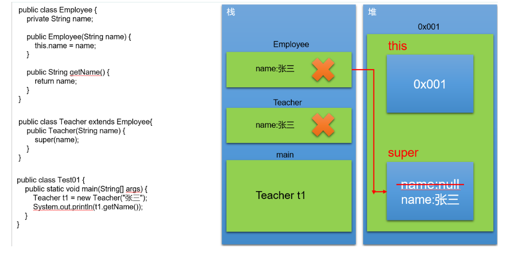
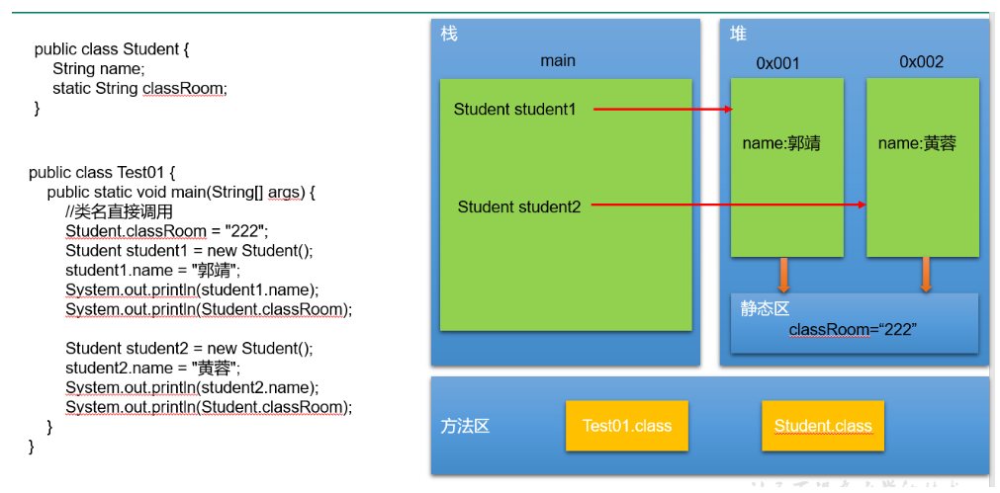
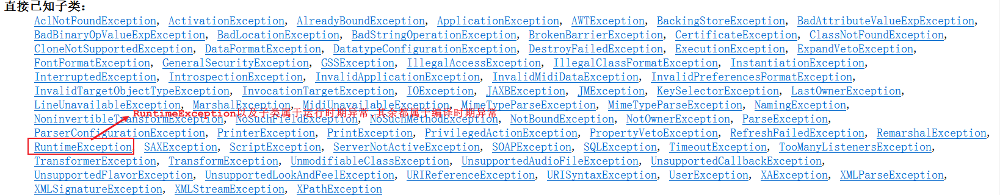
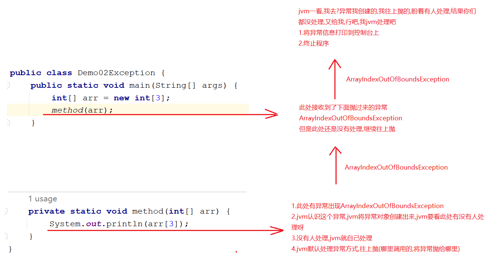
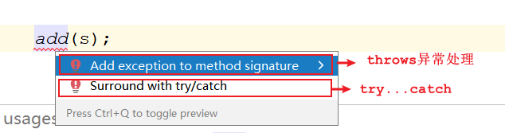
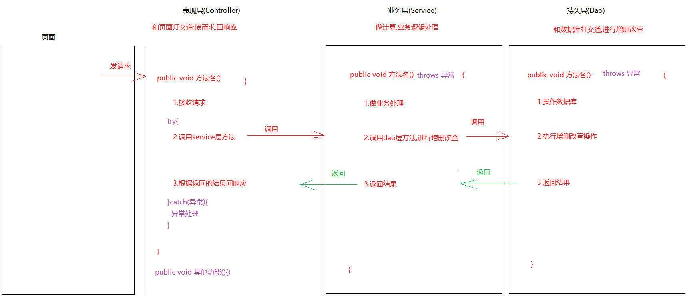
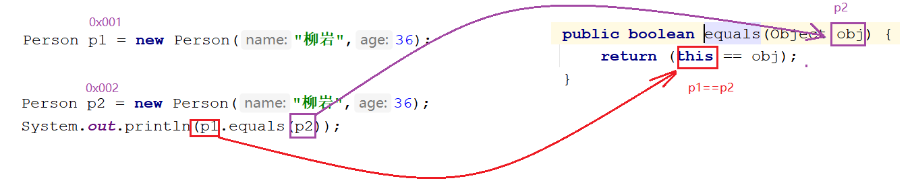

# day11.内部类_异常

```java
课前回顾:
  1.权限修饰符:
    a.从大到小排列:public protected 默认 private
    b.使用:
      构造:建议用public-> 方便new对象 -> 在工具类中构造一般私有化(不用new,类名直接调用即可)
      成员方法:建议用public -> 方便调用
      属性:建议用private -> 封装思想
  2.final:最终的
    a.修饰类:不能被继承
    b.修饰方法:不能被重写
    c.修饰局部变量:不能被二次赋值
    d.修饰对象:地址值不能改变,但是属性值可以改变
    e.修饰成员变量:需要手动赋值,不能被二次赋值
  3.内部类:
    a.匿名内部类:代表的是接口或者抽象类的子类对象或者实现类对象
      new 抽象类/接口(){
         重写方法  
      }.重写的方法();

     抽象类类名/接口名 对象名 =  new 抽象类/接口(){
         重写方法  
     }
     对象名.重写的方法();

  4.代码块:
    a.构造代码块:
      {
          代码
      }
      优先于构造方法执行,每new一次,就执行一次
    b.静态代码块:
      static{
          代码
      }
      优先于构造方法以及构造代码块执行的,只执行一次
      使用场景:最先初始化一些数据
     
今日重点:
  1.能分清编译时期异常和运行时期异常
  2.会使用throws处理异常
  3.会使用try...catch处理异常
  4.知道我们最终为啥要使用try...catch处理异常
  5.知道Object是谁
  6.知道Object中的toString方法作用以及重写toString方法之后的作用
  7.知道Object中的equals方法作用以及重写equals方法之后的作用
```

# 第一章.内存

## 1.this和super



## 2.static关键字内存图



# 第二章.异常

## 1.异常介绍

```java
1.概述:代码出现了不正常的现象,在java中每一个异常都是java的一个一个的类,或者叫做异常对象
2.异常体系说明:
  Throwable:
     Error:错误 -> 好比是人得了癌症 -> 不能通过处理让代码变正常了,必须重新写
     Exception:异常(所有异常的父类) -> 好比是人得了感冒(能治) -> 可以通过处理,让代码变得正常
               a.编译时期异常:代码一写,jvm一编译,报红了 -> Exception以及Exception的子类(除了RuntimeException以及RuntimeException的子类)
                   
               b.运行时期异常:代码写的时候没事,但是已运行就报错(RuntimeException以及子类)
```



```java
public class Demo01Exception {
    public static void main(String[] args){
        //Error
        //int[] arr1 = new int[999999999];
        
        //运行时期异常
        int[] arr2 = new int[3];
        System.out.println(arr2[3]);
        
        /*
          编译时期异常-> 
          不是我们写的语法错误,
          而是人家底层给我们抛了一个编译时期异常对象,底层抛出的异常继承自Exception
          我们一用就出现了编译时期异常
         */
        //FileOutputStream fos = new FileOutputStream("day11_exception\\1.txt");
    }
}

```

> 1.ctrl+n -> 搜索所有的类(包括自己写的以及java提前定义好的)

## 2.异常出现的过程



## 3.创建异常对象(了解)

> 创建异常对象,是为了故意造异常,以便我们后续学处理异常

```java
1.格式:
  throw new 异常对象()
```

```java
public class Demo03Exception {
    public static void main(String[] args) {
        String s = "abc.txt";
        method(s);
    }

    public static void method(String s) {
        if (!s.endsWith(".txt")){
          //创建异常对象
            throw new NullPointerException();
        }
    }
}
```

## 4.异常处理方式(重点)

### 4.1 异常处理方式一_throws

```java
1.格式:在参数后面
  throws 异常
```

```java
public class Demo04Exception {
    public static void main(String[] args)throws FileNotFoundException {
        String s = "abc.txt1";
        /*
          method方法使用了throws异常处理方案
          往上抛异常,但是抛的是编译时期异常
          此异常让调用处接收了
          也就是说:method(s)接收了一个下面抛过来的编译时期异常
          所以此处爆红
         */
        add(s);

        System.out.println("删除功能");
        System.out.println("修改功能");
        System.out.println("查询功能");
    }

    public static void add(String s)throws FileNotFoundException {
        if (!s.endsWith(".txt")){
            //创建异常对象
            throw new FileNotFoundException();
        }
        System.out.println("我要执行");
    }
}

```

### 4.2 异常处理方式一_throws多个异常

```java
1.格式:
  throws 异常1,异常2
      
2.注意:
  如果处理的多个异常之间,有子父类继承关系,我们可以直接抛父类异常
  如果不知道多个异常之间到底有没有子父类继承关系,我们可以直接抛Exception    
```

```java
public class Demo05Exception {
    public static void main(String[] args)throws /*FileNotFoundException,*//*IOException*/Exception {
        String s = "abc.txt1";
        /*
          method方法使用了throws异常处理方案
          往上抛异常,但是抛的是编译时期异常
          此异常让调用处接收了
          也就是说:method(s)接收了一个下面抛过来的编译时期异常
          所以此处爆红
         */
        add(s);
    }

    public static void add(String s)throws /*FileNotFoundException,*//*IOException*/Exception {
        if (s==null){
            //创建异常对象
            throw new IOException("IO异常了");
        }

        if (!s.endsWith(".txt")){
            //创建异常对象
            throw new FileNotFoundException("文件找不到异常");//利用有参构造设置异常信息
        }

        System.out.println("我要执行");
    }
}
```

### 4.3 异常处理方式二_try...catch

```java
1.格式:
  try{
      可能会出现异常的代码
  }catch(异常类型 对象名){
      处理异常的方案->开发中将异常信息保存到日志文件中
  }
```

```java
public class Demo06Exception {
    public static void main(String[] args) {
        String s = "abc.txt1";
        try {
            //String s1 = null;
            //System.out.println(s1.length());//NullPointerException
            add(s);
        }catch (FileNotFoundException e){
            //如果try中的异常抓不到,try...catch外面的功能会受影响
            
            e.printStackTrace();//将异常详细信息打印出来
        }
        System.out.println("删除功能");
        System.out.println("修改功能");
        System.out.println("查询功能");
    }

    private static void add(String s) throws FileNotFoundException {
        if (!s.endsWith(".txt")) {
            throw new FileNotFoundException("文件找不到");
        }
        System.out.println("我要执行");
    }
}
```

### 4.4 异常处理方式二_多个catch

```java
1.格式:
  try{
      可能会出现异常的代码
  }catch(异常类型 对象名){
      处理异常的方案->开发中将异常信息保存到日志文件中
  }catch(异常类型 对象名){
      处理异常的方案->开发中将异常信息保存到日志文件中
  }catch(异常类型 对象名){
      处理异常的方案->开发中将异常信息保存到日志文件中
  }...
      
2.注意:
  a.如果多个异常之间有子父类继承关系,先抓子类,再抓父类异常
  b.如果多个异常之间有子父类继承关系,我们可以直接抓父类异常
```

```java
public class Demo07Exception {
    public static void main(String[] args) {
        String s = "abc.txt1";
        /*try {
            add(s);
        } catch (FileNotFoundException e) {
            e.printStackTrace();
        } catch (IOException e){
            e.printStackTrace();
        }*/

        //错误演示
        /*try {
            add(s);
        }catch (IOException e){
            e.printStackTrace();
        } catch (FileNotFoundException e) {
            e.printStackTrace();
        }*/

        /*try {
            add(s);
        }catch (IOException e){
            e.printStackTrace();
        }*/

        try {
            add(s);
        }catch (Exception e){
            e.printStackTrace();
        }
    }

    public static void add(String s) throws FileNotFoundException, IOException {
        if (s == null) {
            //创建异常对象
            throw new IOException("IO异常了");
        }

        if (!s.endsWith(".txt")) {
            //创建异常对象
            throw new FileNotFoundException("文件找不到异常");//利用有参构造设置异常信息
        }

        System.out.println("我要执行");
    }
}
```

> 

## 5.finally关键字

```java
1.作用:一定会执行的代码块
2.使用:都是和try结合使用
```

```java
public class Demo08Exception {
    public static void main(String[] args) {
        String s = "abc.txt1";
        try {
            String s1 = null;
            System.out.println(s1.length());//NullPointerException
            method(s);
        } catch (FileNotFoundException e) {
            e.printStackTrace();
        }finally {
            System.out.println("我一定要执行,爱谁谁!");
        }
    }
    public static void method(String s)throws FileNotFoundException{
        if (!s.endsWith(".txt")){
            throw new FileNotFoundException("文件找不到异常");
        }
    }
}

```

```java
public class Demo09Exception {
    public static void main(String[] args) {
        int result = method();
        System.out.println(result);
    }

    public static int method() {
        try {
            String s = null;
            System.out.println(s.length());//空指针异常
            return 2;
        } catch (Exception e) {
            return 1;
        } finally {
            System.out.println("我一定要执行");
            //return 3;
        }

    }
}
```

> finally的使用场景:关闭资源
>
> ​     堆内存中的对象由GC(垃圾回收器)回收,但是有很多对象,如:IO流对象,网编 Socket对象,数据库连接对象(Connection)等,GC无法回收,既然GC没有办法回收,我们只能自己关闭资源,销毁对象,所以我们可以将关闭资源,销毁对象的操作放到finally中.

## 6.抛异常时注意的事项(扩展)

```java
1.父类中的方法抛了异常了,那么子类重写此方法之后要不要抛呢?
  可抛可不抛
    
2.父类中的方法没有抛异常,那么子类重写此方法之后要不要抛呢?
  不要抛
```

## 7.try_catch和throws的使用时机

```java
1.如果处理异常之后,还想让后续的代码正常执行,我们使用try...catch
2.如果方法之间是递进关系(调用),我们可以先throws,但是到了最后需要用try...catch做一个统一的异常处理
```



> 1.运行时期异常一般我们不处理,因为一旦有运行时期异常出现,肯定是代码写的有问题
>
> 2.编译时期异常我们肯定要处理,不处理爆红,代码爆红了,不处理还继续往下写,没意义

## 8.自定义异常

```java
1.需求:键盘录入一个用户名,实现登录功能,如果登录失败,抛出LoginUserException
```

```java
public class Demo11Exception {
    public static void main(String[] args) throws LoginUserException {
        //1.创建Scanner对象
        Scanner scanner = new Scanner(System.in);
        System.out.println("请您输入要登录的用户名:");
        String username = scanner.next();
        //2.定义一个字符串,代表已经注册过的用户名
        String name = "root";

        //3.判断
        if (username.equals(name)){
            System.out.println("登录成功");
        }else{
            //如果失败了,就创建异常对象
            throw new LoginUserException("登录失败");
        }
    }
}
```

```java
public class LoginUserException extends Exception /*RuntimeException*/{
    public LoginUserException() {
    }

    public LoginUserException(String message) {
        super(message);
    }
}

```

> 1.创建一个类
>
> ​    a.继承Exception,此时变成了编译时期异常
>
> ​    b.继承RuntimeException,此时变成了运行时期异常
>
> 2.提供构造方法,方便我们设置异常信息

## 9.打印异常信息的三个方法

```java
Throwable中的方法:
    public String getMessage():获取异常的描述信息,原因(提示给用户的时候,就提示错误信息)
    public String toString():获取异常的类型和异常描述信息(不用)
    public void printStackTrace():打印异常的跟踪栈信息并输出到控制台上(最详细的异常信息)
```

```java
public class Demo12Exception {
    public static void main(String[] args) {
        String s = "abc.txt1";
        try {
            method(s);
        } catch (FileNotFoundException e) {
            //System.out.println(e.getMessage());
            //System.out.println(e.toString());
            e.printStackTrace();
        }
    }
    public static void method(String s)throws FileNotFoundException{
        if (!s.endsWith(".txt")){
            throw new FileNotFoundException("文件找不到异常");
        }
    }
}

```

# 第三章.Object类

## 1.Object的介绍

```java
1.概述:
  所有类的父类,根类,所有的类都会直接或者间接去继承Object类
      
2.注意:
  a.一个类如果没有明确写出extends xxx,那么此类默认的亲爹就是Object
```

## 2.Object类中的toString方法

> 小技巧:
>
> 1.按住ctrl不放,鼠标点击被调用的方法或者变量,可以快速跳到对应的方法以及变量的位置
>
> 2.ctrl+n     查询类
>
> 3.alt+7       查看当前类中的成员

```java
1.Object中的toString方法  -> 返回对象的字符串表示形式
  public String toString() {
      return getClass().getName() + "@" + Integer.toHexString(hashCode());
  }

2.结论:
  a.如果一个类没有重写toString方法,直接输出对象名会默认调用Object中的toString方法,此时会输出地址值     这个地址值的组成形式就是Object中toString方法拼接成的形式
      
  b.如果一个类重写了Object中的toString方法,再返回地址值就没有意义了,所以我们重写toString之后,我们应该返回对象的内容    
```

```java
public class Person{
    private String name;
    private int age;

    public Person() {
    }

    public Person(String name, int age) {
        this.name = name;
        this.age = age;
    }

    public String getName() {
        return name;
    }

    public void setName(String name) {
        this.name = name;
    }

    public int getAge() {
        return age;
    }

    public void setAge(int age) {
        this.age = age;
    }

    //重写toString

    @Override
    public String toString() {
        return name+","+age;
    }
}
```

```java
public class Test01 {
    public static void main(String[] args) {
        Person p1 = new Person("柳岩",36);
        Person p2 = new Person("涛哥",18);
        System.out.println(p2);
        System.out.println(p1.toString());//com.atguigu.b_object.Person@135fbaa4
        System.out.println(p2.toString());//com.atguigu.b_object.Person@45ee12a7

        ArrayList<String> list = new ArrayList<>();
        list.add("abc");
        list.add("def");
        System.out.println(list);// [abc, def]
    }
}
```

> 结论:
>
>   1.如果直接输出对象名,不让其输出地址值,就在此对象中重写toString方法,让toString返回内容
>
>   2.怎么重写:
>
> ​     alt+insert->toString->ok

## 3.Object类中的equals方法

```java
1.Object中的equals方法:
  public boolean equals(Object obj) {
      return (this == obj);
  }

2.注意:
  ==:
   a.针对于基本类型,比较的值
   b.针对于引用类型,比较的是地址值    
3.结论:
  a.如果没有重写Object中的equals方法,那么会调用Object中的equals方法,针对引用类型比较地址值
  b.如果重写Object中的equals方法,再比较地址值就没意义了,所以重写之后,我们应该比较对象的内容    
```

```java
public class Person{
    private String name;
    private int age;

    public Person() {
    }

    public Person(String name, int age) {
        this.name = name;
        this.age = age;
    }

    public String getName() {
        return name;
    }

    public void setName(String name) {
        this.name = name;
    }

    public int getAge() {
        return age;
    }

    public void setAge(int age) {
        this.age = age;
    }

    //重写toString

   /* @Override
    public String toString() {
        return name+","+age;
    }*/

    @Override
    public String toString() {
        return "Person{" +
                "name='" + name + '\'' +
                ", age=" + age +
                '}';
    }


    /**
     *
     * @param obj
     * @return
     *
     * 问题1:为啥用obj调用name和age报错? 因为此时obj为Object类型接收了Person类型的p2
     *      此处为多态,name和age是Person中的特有属性,多态前提下,不能直接调用子类特有成员,所以报错
     * 解决问题1:
     *      向下转型
     *
     * 问题2:如果传递的不是Person类型,会出现类型转换异常
     * 解决问题2:加个类型判断,如果传递过来的数据属于Person类型,在强转成Person类型
     *
     * 问题3:如果equals方法接收的是null,我们就没有必要判断类型了
     * 解决问题3:直接做非空判断,提高点效率
     *
     * 问题4:如果equals方法接收的是自己,就会出现自己和自己比较,自己跟自己比肯定为true,就没有必要
     *      判断类型,向下转型,比较了
     * 解决问题4:加判断,如果地址值一样,直接返回true
     *
     */
    /*public boolean equals(Object obj){
        if (this==obj){
            return true;
        }

        if (obj==null){
            return false;
        }

        if (obj instanceof Person){
            Person p2 = (Person)obj;
            return this.name.equals(p2.name) && this.age == p2.age;
        }

        return false;

    }*/

    @Override
    public boolean equals(Object o) {
        if (this == o) return true;
        if (o == null || getClass() != o.getClass()) return false;
        Person person = (Person) o;
        return age == person.age && Objects.equals(name, person.name);
    }

}

```

```java
public class Test02 {
    public static void main(String[] args) {
        Person p1 = new Person("柳岩",36);
        Person p2 = new Person("柳岩",36);
        //System.out.println(p1.equals(p2));

        //ArrayList<String> list = new ArrayList<>();
        //System.out.println(p1.equals(list));
        //System.out.println(p1.equals(null));
        System.out.println(p1.equals(p1));

        System.out.println("=========================");

        String s1 = new String("abc");
        String s2 = new String("abc");
        System.out.println(s1.equals(s2));//true
        System.out.println(s1==s2);//false
    }
}
```



> 结论:
>
>   1.如果比较两个对象,想比较对象的内容,就重写equals方法
>
>   2.怎么重写:alt+insert -> equals and hashCode -> 一路下一步->ok

## 4.Object类中的getClass()方法

```java

```

```java

```

```java

```


## 5.native方法

```java
    private static native void registerNatives();->将当前类中的native方法注册进来
    static {
        registerNatives();//注册本地方法
    }
    方法作用:当该类被加载的时候，调用该方法完成对该类中本地方法的注册
        
            在Object类中，除了有registerNatives这个本地方法之外，还有hashCode()、clone()等本地方法，而在Class类中有forName0()这样的本地方法等等。也就是说，凡是包含registerNatives()本地方法的类，同时也包含了其他本地方法。所以，显然，当包含registerNatives()方法的类被加载的时候，注册的方法就是该类所包含的除了registerNatives()方法以外的所有本地方法
            
     registerNatives()注册当前类的本地方法

1.native:关键字->代表的本地方法
2.本地方法是有方法体的:c语言编写,本地方法的方法体源码没有对我们开源,所以我们看不到方法体,简单理解为本地方法就是对java语言的扩展,比如:后面io流部分,很多功能java本身没有,比如读写,那么就需要调用本地方法进进行读写
3.位置:在本地方法栈运行
4.意义:跟系统打交道
```

```java
 1.本地方法:对java不能实现的功能进行扩充
 2.本地方法是由C语言编写,源码没有开源
 3.本地方法运行在本地方法栈中
```

## 6.GC垃圾回收简介

运行垃圾回收器，JVM将从堆内存中清理对象，清理对象的同时会调用对象的finalize()方法，JVM的垃圾回收器是通过另一个线程开启的，因此程序中的效果并不明显。

```java
1.方法:System类中的方法:public static void gc() -> 运行垃圾回收器
2.作用:主要用于回收堆内存中的数据
3.堆内存中的数据什么时候被清理:如果我们的对象没有用了,GC底层会有很多精妙的算法,会做判断,做回收
  比如: Person p = new Person()
       p = null
      
       GC ROOTS->可达性算法 ->从根节点出发,是否能到达对应的对象,如果到不了,证明此对象为垃圾,直接清理
      
4.要了解到的:
  构造方法:new对象的
  析构函数:销毁对象,C语言中才有这个析构函数的概念
      
  Object中的finalize():相当于C语言中的析构函数,用于清理对象,在回收之前,会自动被调用;而且不是垃圾回收器直接调用的,而是垃圾回收器通知当前对象,自动调用此方法进行对象回收    
```

```java
public class Student {
    @Override
    protected void finalize() throws Throwable {
        System.out.println(this+"........"+"被回收了");
    }
}
```

```java
public class Test04 {
    public static void main(String[] args) {
        Student student = new Student();
        System.out.println(student);

        System.out.println("===================");

        student = null;
        //运行垃圾回收器
        System.gc();
    }
}

```

```java
垃圾回收关键点:
1.垃圾回收机制只回收JVM堆内存里的对象空间。
2.对其他物理连接，比如数据库连接(Connection)、输入流输出流(IO)、Socket连接(网络编程)无能为力
3.现在的JVM有多种垃圾回收实现算法，表现各异。
4.垃圾回收发生具有不可预知性，程序无法精确控制垃圾回收机制执行
5.可以将对象的引用变量设置为null，暗示垃圾回收机制可以回收该对象。-自动
6.程序员可以通过System.gc()或者Runtime.getRuntime().gc()来通知系统进行垃圾回收，会有
  一些效果，但是系统是否进行垃圾回收依然不确定。
7.垃圾回收机制回收任何对象之前，总会先调用它的finalize方法（如果覆盖该方法，让一个新的引用变量重新引用该对象，则会重新激活对象）。
8.永远不要主动调用某个对象的finalize方法，应该交给垃圾回收机制通知。
```

# 第四章.经典接口

#### 1、java.lang.Comparable

我们知道基本数据类型的数据（除boolean类型外）需要比较大小的话，之间使用比较运算符即可，但是引用数据类型是不能直接使用比较运算符来比较大小的。那么，如何解决这个问题呢？

Java给所有引用数据类型的大小比较，指定了一个标准接口，就是java.lang.Comparable接口：

```java
package java.lang;

public interface Comparable{
    int compareTo(Object obj);
}
```

那么我们想要使得我们某个类的对象可以比较大小，怎么做呢？步骤：

第一步：哪个类的对象要比较大小，哪个类就实现java.lang.Comparable接口，并重写方法

* 方法体就是你要如何比较当前对象和指定的另一个对象的大小

第二步：对象比较大小时，通过对象调用compareTo方法，根据方法的返回值决定谁大谁小。

* this对象（调用compareTo方法的对象）大于指定对象（传入compareTo()的参数对象）返回正整数
* this对象（调用compareTo方法的对象）小于指定对象（传入compareTo()的参数对象）返回负整数
* this对象（调用compareTo方法的对象）等于指定对象（传入compareTo()的参数对象）返回零

代码示例：

```java
public class Student implements Comparable{
    private String name;
    private int score;

    public Student() {
    }

    public Student(String name, int score) {
        this.name = name;
        this.score = score;
    }

    public String getName() {
        return name;
    }

    public void setName(String name) {
        this.name = name;
    }

    public int getScore() {
        return score;
    }

    public void setScore(int score) {
        this.score = score;
    }

    @Override
    public String toString() {
        return "Student{" +
                "name='" + name + '\'' +
                ", score=" + score +
                '}';
    }

    @Override
    public int compareTo(Object o) {
        Student student = (Student) o;
        return this.getScore()-student.getScore();
    }
}
```

测试类

```java
public class Test01 {
    public static void main(String[] args) {
        //定义存储Student对象的数组
        Student[] students = new Student[3];
        students[0] = new Student("zhangsan",100);
        students[1] = new Student("lisi",95);
        students[2] = new Student("wangwu",98);

        for (int j = 0; j < students.length-1; j++) {
            for (int i = 0; i < students.length-1-j; i++) {
               /* if (students[i].getScore()>students[i+1].getScore()){
                    Student temp = students[i];
                    students[i] = students[i+1];
                    students[i+1] = temp;
                }*/

                //调用compareTo方法,如果返回的是正整数,就来一个升序排序
                if (students[i].compareTo(students[i+1])>0){
                    Student temp = students[i];
                    students[i] = students[i+1];
                    students[i+1] = temp;
                }
            }
        }

        for (int i = 0; i < students.length; i++) {
            System.out.println(students[i]);
        }
    }
}

```

#### 2、java.util.Comparator

思考：

（1）如果一个类，没有实现Comparable接口，而这个类你又不方便修改（例如：一些第三方的类，你只有.class文件，没有源文件），那么这样类的对象也要比较大小怎么办？

（2）如果一个类，实现了Comparable接口，也指定了两个对象的比较大小的规则，但是此时此刻我不想按照它预定义的方法比较大小，但是我又不能随意修改，因为会影响其他地方的使用，怎么办？

JDK在设计类库之初，也考虑到这种情况了，所以又增加了一个java.util.Comparator接口。

```java
package java.util;

public interface Comparator{
    int compare(Object o1,Object o2);
}
```

那么我们想要比较某个类的两个对象的大小，怎么做呢？步骤：

第一步：编写一个类，我们称之为比较器类型，实现java.util.Comparator接口，并重写方法

* 方法体就是你要如何指定的两个对象的大小

第二步：比较大小时，通过比较器类型的对象调用compare()方法，将要比较大小的两个对象作为compare方法的实参传入，根据方法的返回值决定谁大谁小。

* o1对象大于o2返回正整数
* o1对象小于o2返回负整数
* o1对象等于o2返回零

```java
public class Student1 {
    private String name;
    private int score;

    public Student1() {
    }

    public Student1(String name, int score) {
        this.name = name;
        this.score = score;
    }

    public String getName() {
        return name;
    }

    public void setName(String name) {
        this.name = name;
    }

    public int getScore() {
        return score;
    }

    public void setScore(int score) {
        this.score = score;
    }

    @Override
    public String toString() {
        return "Student{" +
                "name='" + name + '\'' +
                ", score=" + score +
                '}';
    }


}

```

```java
public class StudentCompare implements Comparator {
    @Override
    public int compare(Object o1, Object o2) {
        Student1 s1 = (Student1) o1;
        Student1 s2 = (Student1) o2;
        return s1.getScore()-s2.getScore();
    }
}

```

代码示例：测试类

```java
public class Test02 {
    public static void main(String[] args) {
        //定义存储Student对象的数组
        Student1[] students = new Student1[3];
        students[0] = new Student1("zhangsan",100);
        students[1] = new Student1("lisi",95);
        students[2] = new Student1("wangwu",98);

        StudentCompare sc = new StudentCompare();
        for (int j = 0; j < students.length-1; j++) {
            for (int i = 0; i < students.length-1-j; i++) {
                //调用compare方法,如果返回的是正整数,就来一个升序排序
                if (sc.compare(students[i],students[i+1])>0){
                    Student1 temp = students[i];
                    students[i] = students[i+1];
                    students[i+1] = temp;
                }
            }
        }

        for (int i = 0; i < students.length; i++) {
            System.out.println(students[i]);
        }
    }
}

```

#### 3、java.lang.Cloneable

在java.lang.Object类中有一个方法：

```java
protected Object clone()throws CloneNotSupportedException 
```

所有类型都可以重写这个方法，它是获取一个对象的克隆体对象用的，就是造一个和当前对象各种属性值一模一样的对象。当然地址肯定不同。

我们在重写这个方法后时，调用super.clone()，发现报异常CloneNotSupportedException，因为我们没有实现java.lang.Cloneable接口。

```java
public class Person implements Cloneable{
    private String name;
    private int age;

    public Person() {
    }

    public Person(String name, int age) {
        this.name = name;
        this.age = age;
    }

    public String getName() {
        return name;
    }

    public void setName(String name) {
        this.name = name;
    }

    public int getAge() {
        return age;
    }

    public void setAge(int age) {
        this.age = age;
    }

    @Override
    public String toString() {
        return "Person{" +
                "name='" + name + '\'' +
                ", age=" + age +
                '}';
    }

    @Override
    public boolean equals(Object o) {
        if (this == o) return true;
        if (o == null || getClass() != o.getClass()) return false;
        Person person = (Person) o;
        return age == person.age && Objects.equals(name, person.name);
    }

    @Override
    protected Object clone() throws CloneNotSupportedException {
        return super.clone();
    }
}

```

```java
public class Test03 {
    public static void main(String[] args) throws CloneNotSupportedException {
        Person p1 = new Person("柳岩", 36);
        /*Person p2 = new Person("柳岩", 36);
        System.out.println(p1==p2);
        System.out.println(p1.equals(p2));*/

        Object p2 = p1.clone();//相当于Person p2 = new Person("柳岩", 36);

        System.out.println(p1.equals(p2));//true
        System.out.println(p1==p2);//false
    }
}
```

# 