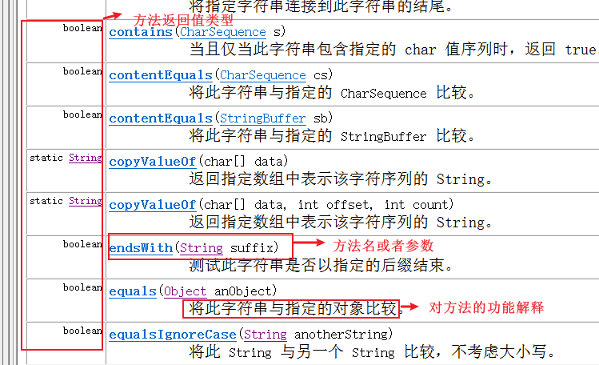

# day12.基础API

```java
课前回顾:
  1.异常:代码出现了不正常的现象,在java中异常都是一个一个的类,一个一个的对象
  2.异常分类:
    Throwable:
       Error:错误
       Exception:异常
            编译时期异常:Exception以及除RuntimeException之外的子类
                       语法没问题,但是一写编译爆红 -> 需要处理
            运行时期异常:RuntimeException以及子类
                       语法没问题,写的时候没有爆红,但是一运行就出错了->不需要处理->改代码就可以了
  3.处理异常:throws 异常
    a.throws 异常
    b.throws 异常1,异常2...
    c.注意:如果处理多个异常,多个异常之间有子父类继承关系,直接处理父类异常类型
  4.处理异常:try...catch
    a.格式:
      try{
          可能出现异常的代码
      }catch(异常 对象名){
          处理异常的方法 -> 将异常信息打印出来放到日志文件中
      }
    b.格式:
      try{
          可能出现异常的代码
      }catch(异常 对象名){
          处理异常的方法 -> 将异常信息打印出来放到日志文件中
      }catch(异常 对象名){
          处理异常的方法 -> 将异常信息打印出来放到日志文件中
      }catch(异常 对象名){
          处理异常的方法 -> 将异常信息打印出来放到日志文件中
      }...
    c.注意:如果catch多个异常,多个异常之间有子父类继承关系,可以直接抓父类
        
  5.创建异常: throw new 异常对象()
  6.方法重写后,抛异常的注意事项:
    a.父类方法没有抛异常,子类重写之后不能抛
    b.父类方法抛异常了,子类重写之后可抛可不抛
  7.finally:必须要执行的代码
    a.使用:跟try一起使用
    b.使用场景:关闭资源
  8.throws和try的使用时机:
    a.如果有了异常,还想让后面的功能正常执行,那么我们需要用try
    b.如果有方法调用,可以先throws,最后再统一try
  9.自定义异常:
    a.定义一个类
      继承Exception -> 属于编译时期异常
      继承RuntimeException -> 属于运行时期异常
    b.提供构造方法->方便我们设置异常信息
  10.Object类-> 所有类的根类,所有的类都会直接或者间接继承Object类
     a.toString:不重写,直接输出对象名会默认调用toString方法,输出地址值
                重写,直接输出对象内容
     b.equals:不重写,引用类型会比较地址值
              重写,比较对象的内容
   
今日重点:
  1.API文档的使用
  2.debug功能的使用
  3.会使用String中的方法处理字符串
  4.会使用StringBuilder的方法做字符串拼接(看时间)    
```

# 第一章.Object类

## 1.Object类中的getClass()方法

```java
1.public final native Class<?> getClass(); -> 获取class对象
2.注意:涉及到反射了    
```

```java
public class Person {
    private String name;
    private int age;

    public Person() {
    }

    public Person(String name, int age) {
        this.name = name;
        this.age = age;
    }

    public String getName() {
        return name;
    }

    public void setName(String name) {
        this.name = name;
    }

    public int getAge() {
        return age;
    }

    public void setAge(int age) {
        this.age = age;
    }
}

```

```java
public class Test01 {
    public static void main(String[] args) {
        Person person = new Person("柳岩",36);
        Class personClass = person.getClass();
        System.out.println(personClass);// class com.atguigu.a_object.Person
    }
}
```


## 2.native方法

```java
    private static native void registerNatives();->将当前类中的native方法注册进来
    static {
        registerNatives();//注册本地方法
    }
    方法作用:当该类被加载的时候，调用该方法完成对该类中本地方法的注册
        
     在Object类中，除了有registerNatives这个本地方法之外，还有hashCode()、clone()等本地方法，而在Class类中有forName0()这样的本地方法等等。也就是说，凡是包含registerNatives()本地方法的类，同时也包含了其他本地方法。所以，显然，当包含registerNatives()方法的类被加载的时候，注册的方法就是该类所包含的除了registerNatives()方法以外的所有本地方法
            
     registerNatives()注册当前类的本地方法

1.native:关键字->代表的本地方法
2.本地方法是有方法体的:c语言编写,本地方法的方法体源码没有对我们开源,所以我们看不到方法体,简单理解为本地方法就是对java语言的扩展,比如:后面io流部分,很多功能java本身没有,比如读写,那么就需要调用本地方法进进行读写
3.位置:在本地方法栈运行
4.意义:跟系统打交道
```

```java
 1.本地方法:对java不能实现的功能进行扩充
 2.本地方法是由C语言编写,源码没有开源
 3.本地方法运行在本地方法栈中
```

## 3.GC垃圾回收简介

运行垃圾回收器，JVM将从堆内存中清理对象，清理对象的同时会调用对象的finalize()方法，JVM的垃圾回收器是通过另一个线程开启的，因此程序中的效果并不明显。

```java
1.方法:System类中的方法:public static void gc() -> 运行垃圾回收器
2.作用:主要用于回收堆内存中的数据
3.堆内存中的数据什么时候被清理:如果我们的对象没有用了,GC底层会有很多精妙的算法,会做判断,做回收
  比如: Person p = new Person()
       p = null
      
       GC ROOTS->可达性算法 ->从根节点出发,是否能到达对应的对象,如果到不了,证明此对象为垃圾,直接清理
      
4.要了解到的:
  构造方法:new对象的
  析构函数:销毁对象,C语言中才有这个析构函数的概念
      
  Object中的finalize():相当于C语言中的析构函数,用于清理对象,在回收之前,会自动被调用;而且不是垃圾回收器直接调用的,而是垃圾回收器通知当前对象,自动调用此方法进行对象回收    
```

```java
public class Student {
    @Override
    protected void finalize() throws Throwable {
        System.out.println(this+"........"+"被回收了");
    }
}
```

```java
public class Test04 {
    public static void main(String[] args) {
        Student student = new Student();
        System.out.println(student);

        System.out.println("===================");

        student = null;
        //运行垃圾回收器
        System.gc();
    }
}

```

```java
垃圾回收关键点:
1.垃圾回收机制只回收JVM堆内存里的对象空间。
2.对其他物理连接，比如数据库连接(Connection)、输入流输出流(IO)、Socket连接(网络编程)无能为力
3.现在的JVM有多种垃圾回收实现算法，表现各异。
4.垃圾回收发生具有不可预知性，程序无法精确控制垃圾回收机制执行
5.可以将对象的引用变量设置为null，暗示垃圾回收机制可以回收该对象。-自动
6.程序员可以通过System.gc()或者Runtime.getRuntime().gc()来通知系统进行垃圾回收，会有
  一些效果，但是系统是否进行垃圾回收依然不确定。
7.垃圾回收机制回收任何对象之前，总会先调用它的finalize方法（如果覆盖该方法，让一个新的引用变量重新引用该对象，则会重新激活对象）。
8.永远不要主动调用某个对象的finalize方法，应该交给垃圾回收机制通知。
```

# 第二章.经典接口

## 1.java.lang.Comparable

我们知道基本数据类型的数据（除boolean类型外）需要比较大小的话，之间使用比较运算符即可，但是引用数据类型是不能直接使用比较运算符来比较大小的。那么，如何解决这个问题呢？

Java给所有引用数据类型的大小比较，指定了一个标准接口，就是java.lang.Comparable接口：

```java
package java.lang;

public interface Comparable{
    int compareTo(Object obj);
}
```

那么我们想要使得我们某个类的对象可以比较大小，怎么做呢？步骤：

第一步：哪个类的对象要比较大小，哪个类就实现java.lang.Comparable接口，并重写方法

* 方法体就是你要如何比较当前对象和指定的另一个对象的大小

第二步：对象比较大小时，通过对象调用compareTo方法，根据方法的返回值决定谁大谁小。

* this对象（调用compareTo方法的对象）大于指定对象（传入compareTo()的参数对象）返回正整数
* this对象（调用compareTo方法的对象）小于指定对象（传入compareTo()的参数对象）返回负整数
* this对象（调用compareTo方法的对象）等于指定对象（传入compareTo()的参数对象）返回零

代码示例：

```java
public class Student implements Comparable{
    private String name;
    private int score;

    public Student() {
    }

    public Student(String name, int score) {
        this.name = name;
        this.score = score;
    }

    public String getName() {
        return name;
    }

    public void setName(String name) {
        this.name = name;
    }

    public int getScore() {
        return score;
    }

    public void setScore(int score) {
        this.score = score;
    }

    @Override
    public String toString() {
        return "Student{" +
                "name='" + name + '\'' +
                ", score=" + score +
                '}';
    }

    @Override
    public int compareTo(Object o) {
        Student s = (Student)o;
        return this.score-s.score;
    }
}
```

测试类

```java
public class Test01 {
    public static void main(String[] args) {
        Student[] students = new Student[3];
        students[0] = new Student("张三", 100);
        students[1] = new Student("李四", 60);
        students[2] = new Student("王五", 80);

        for (int j = 0; j < students.length-1; j++) {
            for (int i = 0; i < students.length-1-j; i++) {
                if (students[i].compareTo(students[i+1])>0){
                    Student temp = students[i];
                    students[i] = students[i+1];
                    students[i+1] = temp;
                }
            }
        }

        /*for (int j = 0; j < students.length-1; j++) {
            for (int i = 0; i < students.length-1-j; i++) {
                if (students[i].getScore()>students[i+1].getScore()){
                    Student temp = students[i];
                    students[i] = students[i+1];
                    students[i+1] = temp;
                }
            }
        }*/

        for (int i = 0; i < students.length; i++) {
            System.out.println(students[i]);
        }
    }
}

```

## 2.java.util.Comparator

思考：

（1）如果一个类，没有实现Comparable接口，而这个类你又不方便修改（例如：一些第三方的类，你只有.class文件，没有源文件），那么这样类的对象也要比较大小怎么办？

（2）如果一个类，实现了Comparable接口，也指定了两个对象的比较大小的规则，但是此时此刻我不想按照它预定义的方法比较大小，但是我又不能随意修改，因为会影响其他地方的使用，怎么办？

JDK在设计类库之初，也考虑到这种情况了，所以又增加了一个java.util.Comparator接口。

```java
package java.util;

public interface Comparator{
    int compare(Object o1,Object o2);
}
```

那么我们想要比较某个类的两个对象的大小，怎么做呢？步骤：

第一步：编写一个类，我们称之为比较器类型，实现java.util.Comparator接口，并重写方法

* 方法体就是你要如何指定的两个对象的大小

第二步：比较大小时，通过比较器类型的对象调用compare()方法，将要比较大小的两个对象作为compare方法的实参传入，根据方法的返回值决定谁大谁小。

* o1对象大于o2返回正整数
* o1对象小于o2返回负整数
* o1对象等于o2返回零

```java
public class Person{
    private String name;
    private int age;

    public Person() {
    }

    public Person(String name, int age) {
        this.name = name;
        this.age = age;
    }

    public String getName() {
        return name;
    }

    public void setName(String name) {
        this.name = name;
    }

    public int getAge() {
        return age;
    }

    public void setAge(int age) {
        this.age = age;
    }

    @Override
    public String toString() {
        return "Person{" +
                "name='" + name + '\'' +
                ", age=" + age +
                '}';
    }


}

```

```java
public class PersonComparator implements Comparator {
    @Override
    public int compare(Object o1, Object o2) {
        Person p1 = (Person) o1;
        Person p2 = (Person) o2;
        return p1.getAge()-p2.getAge();
    }
}
```

代码示例：测试类

```java
public class Test02 {
    public static void main(String[] args) {
        Person[] people = new Person[3];
        people[0] = new Person("张三",40);
        people[1] = new Person("李四",30);
        people[2] = new Person("王五",70);

        PersonComparator pc = new PersonComparator();

        for (int j = 0; j < people.length-1; j++) {
            for (int i = 0; i < people.length-1-j; i++) {
                if (pc.compare(people[i],people[i+1])>0){
                    Person temp = people[i];
                    people[i] = people[i+1];
                    people[i+1] = temp;
                }
            }
        }

        for (int i = 0; i < people.length; i++) {
            System.out.println(people[i]);
        }
    }
}
```

## 3.java.lang.Cloneable

在java.lang.Object类中有一个方法：

```java
protected Object clone() throws CloneNotSupportedException
```

所有类型都可以重写这个方法，它是获取一个对象的克隆体对象用的，就是造一个和当前对象各种属性值一模一样的对象。当然地址肯定不同。

我们在重写这个方法后时，调用super.clone()，发现报异常CloneNotSupportedException，因为我们没有实现java.lang.Cloneable接口。

```java
public class Dog implements Cloneable{
    private String color;
    private int age;

    public Dog() {
    }

    public Dog(String color, int age) {
        this.color = color;
        this.age = age;
    }

    public String getColor() {
        return color;
    }

    public void setColor(String color) {
        this.color = color;
    }

    public int getAge() {
        return age;
    }

    public void setAge(int age) {
        this.age = age;
    }

    @Override
    public String toString() {
        return "Dog{" +
                "color='" + color + '\'' +
                ", age=" + age +
                '}';
    }

    @Override
    public boolean equals(Object o) {
        if (this == o) return true;
        if (o == null || getClass() != o.getClass()) return false;
        Dog dog = (Dog) o;
        return age == dog.age && Objects.equals(color, dog.color);
    }

    @Override
    public Object clone() throws CloneNotSupportedException {
        return super.clone();
    }
}
```

```java
public class Test03 {
    public static void main(String[] args) throws CloneNotSupportedException {
        Dog dog1 = new Dog("黑白", 2);
        Dog dog2 = new Dog("黑白", 2);
        System.out.println(dog1==dog2);//false
        System.out.println(dog1.equals(dog2));//true

        System.out.println("========================");

        Dog dog3 = new Dog("黄色", 3);

        Object o = dog3.clone();//相当于Dog dog4 = new Dog("黄色", 3);

        Dog dog4 = (Dog)o;//相当于Dog dog4 = new Dog("黄色", 3);

        System.out.println(dog3==dog4);

        System.out.println(dog3.equals(dog4));
    }
}

```

# 第三章.api文档.debug.方法骚操作

## 1.API文档

```java
1.概述:API(Application Programming Interface,应用程序编程接口)是一些预先定义的函数，目的是提供应用程序与开发人员基于某软件或硬件的以访问一组例程的能力，而又无需访问源码，或理解内部工作机制的细节。API除了有应用“应用程序接口”的意思外，还特指 API的说明文档，也称为帮助文档
    
2.API文档:相当于程序员的"字典"    
```


## 2.API文档的使用

### 2.1.如何查询要使用的类以及类中的方法


### 2.2.查询出来之后关注点




## 3.debug

```java
1.概述:代码调试工具
2.作用:
  a.可以让代码一步一步执行,可以清楚看到每一个变量在代码中的变化情况
  b.找错
3.怎么用:
  a.在想要开始debug执行的那一行代码左边,"单击"一下,出现"小圆点"(断点),对着"小圆点"再单击一下子,没了
  b.右键 -> debug run    
```


## 4.方法简便操作

### 4.1.定义方法:

```java
1.可以先调用,再生成
2.快捷键:alt+回车    
```


### 4.2.快速将一段代码抽取到一个方法中

```java
1.选中要抽取的代码
2.快捷键:ctrl+alt+m    
```


# 第四章.String

## 1.String介绍

```java
1.概述:String 类代表字符串
2.特点:
  a.Java 程序中的所有字符串字面值（如 "abc" ）都作为此类的实例(对象)实现
    凡是带双引号的都是String的对象
    String s = "abc"
  b.字符串是常量；它们的值在创建之后不能更改 
    String s = "hello"
    s+="world"
  c.因为 String 对象是不可变的，所以可以共享  
    String s1 = "abc"
    String s2 = "abc"  
```


## 2.String的实现原理

```java
1.String底层实现原理:数组
2.在不同的jdk版本中,String底层数组类型不一样
  在jdk8:String的底层数组是final的char[]  -> 一个char类型占内存2个字节
  在jdk9:String的底层数组是final的byte[]  -> 一个byte类型占内存1个字节 
      
3.注意:
  String底层是一个数组,字符串定义出来之后,会自动存放到数组中
  比如:
   String s = "abc"
   char value[] = {'a','b','c'}
```

```java
private final char value[];
```

> 数组一旦被final修饰,地址值直接锁死

## 3.String的创建

```java
1.String() -> 根据空参构造创建String对象
2.String(String original) -> 根据有参构造创建String对象,带内容
3.简化:String 变量名 = ""    
```

```java
public class Demo01String {
    public static void main(String[] args) {
        //1.String() -> 根据空参构造创建String对象
        String s1 = new String();
        System.out.println(s1);
        //2.String(String original) -> 根据有参构造创建String对象,带内容
        String s2 = new String("abc");
        System.out.println(s2);
        //3.简化:String 变量名 = ""
        String s3 = "abc";
        System.out.println(s3);

    }
}
```

```java
1.String(char[] value)  -> 根据char数组创建String对象
2.String(byte[] bytes)  -> 通过使用平台的默认字符集解码指定的 byte 数组，构造一个新的 String对象
  平台(操作系统)默认字符集:GBK
    
  字节数为负数,一般代表中文-> 中文的字节都是负数

   GBK编码:一个中文占2个字节
   UTF-8编码: 一个中文占3个字节
       
   虽然平台默认字符集为GBK,但是代码在idea中写的,idea在启动的时候会加一个启动参数,会变成UTF-8
   -Dfile.encoding=UTF-8    
       
3.String(char[] value, int offset, int count) -> 将char数组的一部分转成String对象
         value:要转的数组
         offset:从数组的哪个索引开始转
         count:转多少个
             
4.String(byte[] bytes, int offset, int length)-> 将byte数组的一部分转成String对象
         bytes:要转的数组
         offset:从数组的哪个索引开始转
         length:转多少个
```

```java
public class Demo02String {
    public static void main(String[] args) {
        //1.String(char[] value)  -> 根据char数组创建String对象
        char[] chars = {'a','b','c'};
        String s1 = new String(chars);
        System.out.println("s1 = " + s1);

        /*
          2.String(byte[] bytes)  -> 通过使用平台的默认字符集解码指定的 byte 数组，构造一个新的 String对象
                                     平台(操作系统)默认字符集:GBK

                                     字节数为负数,一般代表中文-> 中文的字节都是负数

                                     GBK编码:一个中文占2个字节
                                     UTF-8编码: 一个中文占3个字节
         */
        byte[] bytes = {97,98,99};
        String s2 = new String(bytes);
        System.out.println("s2 = " + s2);

        System.out.println("===============");

        byte[] bytes1 = {-28,-67,-96};
        String s3 = new String(bytes1);
        System.out.println("s3 = " + s3);

        System.out.println("===============");

        /*
          3.String(char[] value, int offset, int count) -> 将char数组的一部分转成String对象
            value:要转的数组
            offset:从数组的哪个索引开始转
            count:转多少个
         */
        char[] chars1 = {'a','b','c','d','e','f'};
        String s4 = new String(chars1,0,3);
        System.out.println("s4 = " + s4);

        System.out.println("===============");

        /*
          4.String(byte[] bytes, int offset, int length)-> 将byte数组的一部分转成String对象
            bytes:要转的数组
            offset:从数组的哪个索引开始转
            length:转多少个
         */
        byte[] bytes2 = {97,98,99,100,101};
        String s5 = new String(bytes2,0,2);
        System.out.println("s5 = " + s5);
    }
}

```


## 4.String 面试题

```java
public class Demo03String {
    public static void main(String[] args) {
        String s1 = "abc";
        String s2 = "abc";
        String s3 = new String("abc");
        System.out.println(s1==s2);//true
        System.out.println(s1==s3);//false
    }
}
```


```java
1.问题:String s = new String("abc"); 创建了几个对象?
      1个或者2个
    
2.解释:
  a.如果在new的时候abc早就存在了,那么只创建了一个(new的),abc是共享过来的
  b.如果在new的时候abc没有,那么就创建了两个,一个是创建出来的abc,一个是new的    
```


## 5.字符串常见问题

```Java
public class Demo04String {
    public static void main(String[] args) {
        String s1 = "hello";
        String s2 = "world";
        String s3 = "helloworld";
        String s4 = "hello"+"world";  // helloworld
        String s5 = s1+"world"; //helloworld
        String s6 = s1+s2;//helloworld

        System.out.println(s3==s4);//true
        System.out.println(s3==s5);//false
        System.out.println(s3==s6);//false
    }
}
```

> 1.注意:如果字符串拼接时,等号右边都是字符串字面值,不会new对象
>
> ​            如果字符串拼接时,等号右边有变量参与,新的字符串是new出来的
>
> 

# 第五章.String的方法

## 1.判断方法

```java
boolean equals(Object anObject) -> 比较两个字符串的内容 
boolean equalsIgnoreCase(String anotherString)-> 比较两个字符串的内容,忽略大小写
```

```java
public class Demo01Equals {
    public static void main(String[] args) {
        String s1 = "abc";
        String s2 = "abc";
        String s3 = new String("ABC");
        //boolean equals(Object anObject) -> 比较两个字符串的内容
        System.out.println(s1.equals(s2));//true
        System.out.println(s1.equals(s3));//false
        //boolean equalsIgnoreCase(String anotherString)-> 比较两个字符串的内容,忽略大小写
        System.out.println(s1.equalsIgnoreCase(s3));
    }
}
```

## 2.练习1

```java
已知用户名和密码，请用程序实现模拟用户登录。总共给三次机会，登录之后，给出相应的提示

步骤:
  1.先定义两个字符串,表示已经注册过的用户名和密码
  2.创建Scanner对象,调用next方法,录入用户名和密码
  3.如果用户名和密码跟注册过的一样,登录成功
  4.否则,登录失败
```

```java
public class Demo02Equals {
    public static void main(String[] args) {
        //1.先定义两个字符串,表示已经注册过的用户名和密码
        String username = "root";
        String password = "1234";
        //2.创建Scanner对象,调用next方法,录入用户名和密码
        Scanner sc = new Scanner(System.in);
        for (int i = 0; i < 3; i++) {
            System.out.println("请您输入用户名:");
            String name = sc.next();
            System.out.println("请您输入密码:");
            String pwd = sc.next();
            //3.如果用户名和密码跟注册过的一样,登录成功
            if (name.equals(username) && pwd.equals(password)){
                System.out.println("登录成功");
                break;
            }else{
                if (i==2){
                    System.out.println("账号冻结,请解冻");
                }else{
                    //4.否则,登录失败
                    System.out.println("登录失败");
                }

            }
        }

    }
}

```

> ```java
> 1.开发中比较字符串内容正确打开方式
> =================================================
> public class Demo03Equals {
>     public static void main(String[] args) {
>         String s = null;
>         method(s);
>     }
> 
>     private static void method(String s) {
>         //如果将变量s,放到equals前面,假如s为null,此处很容易出现空指针异常
>         /*if (s.equals("root")){
>             System.out.println("字符串内容是root");
>         }else{
>             System.out.println("字符串内容不是root");
>         }*/
> 
>         //我们应该将定值放到前面
>         /*if ("root".equals(s)){
>             System.out.println("字符串内容是root");
>         }else{
>             System.out.println("字符串内容不是root");
>         }*/
>     }
> }    
> ```
>
> ```java
> /*
>   扩展一个工具类:Objects
>   
>   static boolean equals(参数1,参数2) -> 可以比较字符串内容,底层做了防空指针操作
> */
> 
> public class Demo04Equals {
>     public static void main(String[] args) {
>         String s = null;
>         method(s);
>     }
> 
>     private static void method(String s) {
>        if (Objects.equals(s,"root")){
>            System.out.println("字符串内容都是root");
>        }else{
>            System.out.println("字符串内容不都是root");
>        }
>     }
> }
> 
> ```

## 3.获取功能

```java
public int length():返回 此字符串的长度
public String concat(String str):将指定的字符串拼接到老串的末尾
char charAt(int index)  :返回指定索引处的char值
int indexOf(String str)  :获取的是指定字符串在老串中第一次出现的索引位置
String substring(int beginIndex):返回一个子字符串,从beginIndex开始截取字符串到字符串末尾,老串不动
String substring(int beginIndex, int endIndex) :返回一个子字符串,从beginIndex到endIndex截取字符串,  含beginIndex,不含endIndex
```

```java
public class Demo05Get {
    public static void main(String[] args) {
        String s1 = "abcdefga";
        //public int length():返回 此字符串的长度
        System.out.println(s1.length());
        //public String concat(String str):将指定的字符串拼接到老串的末尾
        String newStr = s1.concat("hahahaha");
        System.out.println("newStr = " + newStr);
        System.out.println("s1 = " + s1);
        //char charAt(int index)  :返回指定索引处的char值
        System.out.println(s1.charAt(1));
        //int indexOf(String str)  :获取的是指定字符串在老串中第一次出现的索引位置
        System.out.println(s1.indexOf("a"));
        //String substring(int beginIndex):返回一个子字符串,从beginIndex开始截取字符串到字符串末尾,老串不动
        String newStr1 = s1.substring(4);
        System.out.println("newStr1 = " + newStr1);
        //String substring(int beginIndex, int endIndex) :返回一个子字符串,从beginIndex到endIndex截取字符串,  含beginIndex,不含endIndex
        String newStr2 = s1.substring(1, 5);
        System.out.println("newStr2 = " + newStr2);
    }
}

```

## 4.练习2

```java
遍历字符串
```

```java
public class Demo06Get {
    public static void main(String[] args) {
        String s = "abcdefg";
        for (int i = 0; i < s.length(); i++) {
            System.out.println(s.charAt(i));
        }
    }
}
```

## 5.转换功能

```java
char[] toCharArray()  ->  将字符串转成char数组
byte[] getBytes()  -> 使用默认字符集,将字符串转成字节数组
String replace(CharSequence target, CharSequence replacement)  ->将与target匹配的字符串使用replacement字符串替换

扩展:
 byte[] getBytes(String charsetName)->按照指定的编码表将字符串转成byte数组
```

```java
public class Demo07Replace {
    public static void main(String[] args) throws UnsupportedEncodingException {
        String s1 = "abcdefg";
        //char[] toCharArray()  ->  将字符串转成char数组
        char[] chars = s1.toCharArray();
        for (int i = 0; i < chars.length; i++) {
            System.out.println(chars[i]);
        }
        //byte[] getBytes()  -> 使用默认字符集,将字符串转成字节数组
        byte[] bytes = "abcdefg".getBytes();
        for (int i = 0; i < bytes.length; i++) {
            System.out.println(bytes[i]);
        }
        System.out.println("==================================");
        byte[] bytes1 = "你".getBytes();
        for (int i = 0; i < bytes1.length; i++) {
            System.out.println(bytes1[i]);
        }
        /*String replace(CharSequence target, CharSequence replacement)
                ->将与target匹配的字符串使用replacement字符串替换*/

        String s2 = "abdefeaeazzzafeaf";
        String replace = s2.replace("z", "y");
        System.out.println("replace = " + replace);

        System.out.println("===========================");
        /*
           byte[] getBytes(String charsetName)->按照指定的编码表将字符串转成byte数组
         */
        byte[] bytes2 = "你".getBytes("GBK");
        for (int i = 0; i < bytes2.length; i++) {
            System.out.println(bytes2[i]);
        }
    }
}
```

## 7.练习4

```java
键盘录入一个字符串，统计该字符串中大写字母字符，小写字母字符，数字字符出现的次数(不考虑其他字符)
步骤:
  1.创建Scanner对象
  2.调用next方法,录入一个字符串
  3.定义三个变量,分别统计大写字母个数,小写字母个数,数字个数
    int big = 0;
    int small = 0;
    int number = 0;
  4.遍历字符串,将每一个字符获取出来
  5.判断字符是否为大写字母,小写字母,数字
    a.判断大写字母-> 比如B
      A-Z ASCII码值 -> 65-90
      B 的ASCII码值 -> 66 -> 在65-90范围内的
      big++
      
    b.判断小写字母 -> 比如 b
      a-z 的ascii码值 -> 97-122
      b的ascii码值 -> 98 -> 在97-122范围内的
      small++
      
    c.判断数字 -> 比如2
      字符0-字符9的ascii码值 -> 48-57
      字符2的ascii码值 -> 50 -> 在48-57之间
      number++
      
  6.输出三个变量    
```

```java
public class Demo08Count {
    public static void main(String[] args) {
        //1.创建Scanner对象
        Scanner sc = new Scanner(System.in);
        //2.调用next方法,录入一个字符串
        System.out.println("请你输入一个字符串:");
        String data = sc.next();
        //3.定义三个变量,分别统计大写字母个数,小写字母个数,数字个数
        //int big = 0;
        //int small = 0;
        //int number = 0;
        int big = 0;
        int small = 0;
        int number = 0;

        //4.遍历字符串,将每一个字符获取出来
        char[] chars = data.toCharArray();
        for (int i = 0; i < chars.length; i++) {
            char num = chars[i];
        //5.判断字符是否为大写字母,小写字母,数字
        /*a.判断大写字母-> 比如B
        A-Z ASCII码值 -> 65-90
        B 的ASCII码值 -> 66 -> 在65-90范围内的
        big++*/
            if (num>='A' && num<='Z'){
                big++;
            }

        /*b.判断小写字母 -> 比如 b
        a-z 的ascii码值 -> 97-122
        b的ascii码值 -> 98 -> 在97-122范围内的
        small++*/
            if (num>='a' && num<='z'){
                small++;
            }

       /* c.判断数字 -> 比如2
        字符0-字符9的ascii码值 -> 48-57
        字符2的ascii码值 -> 50 -> 在48-57之间
        number++*/
            if (num>='0' && num<='9'){
                number++;
            }

        }

        //6.输出三个变量
        System.out.println("大写字母个数为:"+big+"个");
        System.out.println("小写字母个数为:"+small+"个");
        System.out.println("数字个数为:"+number+"个");
    }
}

```

## 8.分割功能

```java
String[] split(String regex):按照指定规则分割字符串,返回String数组
```

```java
public class Demo09Split {
    public static void main(String[] args) {
        //String[] split(String regex):按照指定规则分割字符串,返回String数组
        String s = "java,text";
        String[] arr = s.split(",");
        for (int i = 0; i < arr.length; i++) {
            System.out.println(arr[i]);
        }

        System.out.println("========================");
        String s1 = "java.text";
        String[] arr1 = s1.split("\\.");
        for (int i = 0; i < arr1.length; i++) {
            System.out.println(arr1[i]);
        }
    }
}
```

# 第六章.扩展方法

```java
boolean contains(CharSequence s)  -> 判断字符串中是否包含指定串儿
boolean endsWith(String suffix) -> 判断字符串是否以指定的串儿结尾
boolean startsWith(String s) -> 判断字符串是否以指定的串儿开头
String toLowerCase() -> 将字符串转成小写
String toUpperCase() -> 将字符串转成大写
String trim() -> 去掉字符串两端空格(之间空格去不掉)    
```

```java
public class Demo10Other {
    public static void main(String[] args) {
        String s1 = "abcdefg";
        //boolean contains(CharSequence s)  -> 判断字符串中是否包含指定串儿
        System.out.println(s1.contains("a"));//true
        System.out.println(s1.contains("ab"));//true
        System.out.println(s1.contains("ac"));//false
        //boolean endsWith(String suffix) -> 判断字符串是否以指定的串儿结尾
        System.out.println(s1.endsWith("g"));//true
        System.out.println(s1.endsWith("fg"));//true
        System.out.println(s1.endsWith("abcdefg"));//true
        System.out.println(s1.endsWith("eg"));//false
        //boolean startsWith(String s) -> 判断字符串是否以指定的串儿开头
        System.out.println(s1.startsWith("a"));//true
        //String toLowerCase() -> 将字符串转成小写
        String s2 = "ADAewqr";
        System.out.println(s2.toLowerCase());
        //String toUpperCase() -> 将字符串转成大写
        System.out.println(s2.toUpperCase());
        //String trim() -> 去掉字符串两端空格(之间空格去不掉)
        String s3 = " adfadsfa  adsfadsf ";
        System.out.println(s3.trim());

        System.out.println("==============================");

        String s4 = " adfa sdfa  dsfas sdaf  ";
        String newStr = s4.replace(" ", "");
        System.out.println(newStr);
    }
}

```

