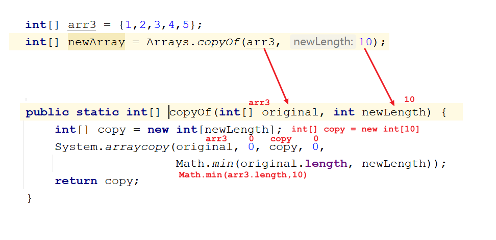

# day13.常用API

``` java
课前回顾:
  1.String:
    a.代表字符串
    b.特点:
      字符串定义出来不可变
      凡是带双引号的都是String的对象
      由于字符串是不可变的,所以可以共享
  2.底层实现原理:
    jdk9之前:final修饰的char数组
    jdk9之后:final修饰的byte数组
  3.创建:
    a.String()
    b.String(String s)
    c.简化:String 变量名 = ""
    d.String(char[] chars) 根据char数组创建String对象
    e.String(byte[] bytes) 根据平台默认字符集,创建一个String对象
    f.String(char[] chars,int offset,int count) -> 将char数组的一部分转成String对象
    g.String(byte[] bytes,int offset,int length) -> 将byte数组的一部分转成String对象
  4.比较方法:比较的内容
    boolean equals(Object obj) -> 比较字符串 内容
    boolean equalsIgnoreCase(String s) -> 比较字符串内容,忽略大小写
  5.获取方法:
    String concat(String s) -> 字符串拼接,往末尾拼接,返回一个新串儿
    int length()-> 获取字符串长度
    char charAt(int index) -> 根据索引获取对应的字符
    int indexOf(String s) -> 查询执行字符在串儿中第一次出现的索引位置
    String subString(int beginIndex) -> 截取字符串,从指定索引开始截取到最后,返回新串儿
    String subString(int beginIndex,int endIndex)->截取字符串,含头不含尾
  6.转换方法:
    char[] toCharArray()-> 将字符串转成char数组
    byte[] getBytes()-> 将字符串转成byte数组
    byte[] getBytes(String charsetName) -> 根据指定的字符集将字符串转成byte数组
    String replace(String s1,String s2) -> 替换字符串
  7.分割功能:
   String[] split(String regex) -> 按照指定规则分割字符串
  8.扩展功能:
    boolean contains(String s) -> 判断字符串中是否包含指定串儿
    boolean endsWith(String s) -> 判断字符串是否以指定串儿结尾
    boolean startsWith(String s) -> 判断字符串是否以指定串儿开头
    String toLowerCase()-> 将字母转成小写
    String toUpperCase()-> 将字母转成大写
    String trim()-> 去掉字符串两端空格
        
今日重点:
  1.会使用StringBuilder拼接字符串
  2.会使用BigDecimal处理小数直接参与运算时出现的精度损失问题
  3.会使用Date日期类
  4.会使用SimpleDateFormat日期格式化类
  5.会System类中的arrayCopy方法
  6.会使用Arrays类中方法
```

# 第一章.StringBuilder类

## 1.StringBuilder的介绍

```java
1.概述:一个可变的字符序列。此类提供一个与 StringBuffer 兼容的 API，但不保证线程同步
2.作用:主要作用是拼接字符串
3.明明String可以做字符串拼接,那为啥还要学StringBuilder?
  a.String做拼接的时候,会产生新的字符串对象,如果要是频繁用String拼接,会出现很多新的字符串对象,占用内存
  b.StringBuilder底层自带缓冲区,我们拼接的字符串都会出现在缓冲区中,不会每次拼接不会随意产生新字符串对象,效率高,省内存
    
4.StringBuilder特点:
  a.StringBuilder底层也是一个char数组(缓冲区),但是这个char数组没有被final修饰,地址值可变
  b.StringBuilder底层的缓冲区默认为16
  c.StringBuilder拼接字符串,会自动放到缓冲区中,如果拼接的字符串,超出了缓冲区长度,缓冲区(数组)会自动扩容
  d.StringBuilder底层扩容为老数组的2倍+2
  e.创建一个新长度的新数组,将老数组的元素复制到新数组中,然后将新数组地址值给老数组  
```


## 2.StringBuilder的使用

```java
1.构造:
  StringBuilder()
  StringBuilder(String str)    
```

```java
public class Demo01StringBuilder {
    public static void main(String[] args) {
        StringBuilder sb1 = new StringBuilder();
        System.out.println(sb1);

        System.out.println("=====================");

        StringBuilder sb2 = new StringBuilder("abc");
        System.out.println(sb2);
    }
}
```

```java
2.常用方法:
  StringBuilder append(任意类型数据) -> 往缓冲区中追加内容,返回StringBuilder自己-> 可以理解为拼接
      
  StringBuilder reverse()->内容翻转,返回StringBuilder自己
  
  String toString()->将StringBuilder对象转成String对象    
      
```

```java
public class Demo02StringBuilder {
    public static void main(String[] args) {
        //StringBuilder append(任意类型数据) -> 往缓冲区中追加内容,返回StringBuilder自己-> 可以理解为拼接
        StringBuilder sb1 = new StringBuilder();
        sb1.append("张无忌");
        sb1.append("周芷若");
        System.out.println(sb1);

        /*
          如果调用某一个方法,返回了某一个对象,就可以直接往后点此对象的方法
          链式调用
         */
        sb1.append("赵敏").append("灭绝师太").append("金毛狮王").append("紫衫龙王");
        System.out.println(sb1);

        //StringBuilder reverse()->内容翻转,返回StringBuilder自己
        sb1.reverse();
        System.out.println(sb1);

        //String toString()->将StringBuilder对象转成String对象
        String s = sb1.toString();
        System.out.println(s.length());
    }
}
```

```java
需求:
  键盘录入一个字符串,判断是否为回文内容-> 比如:上海自来水来自海上  1234321  abcba
```

```java
public class Demo03StringBuilder {
    public static void main(String[] args) {
        //1.创建Scanner对象
        Scanner sc = new Scanner(System.in);
        System.out.println("请您输入一个字符串:");
        String data = sc.next();
        //2.创建StringBuilder对象,将输入的字符串放进去
        StringBuilder sb = new StringBuilder(data);
        //3.翻转内容
        sb.reverse();
        //4.将StringBuilder对象转成String对象
        String s = sb.toString();
        if (s.equals(data)){
            System.out.println("是回文内容");
        }else{
            System.out.println("不是回文内容");
        }
    }
}
```

## 3.练习

```java
定义一个数组,以[元素1, 元素2, 元素3..]的形式输出,用StringBuilder拼接
```

```java
自己写
```

## 4.String 和StringBuilder以及StringBuffer区别

```java
String:
  拼接字符串效率低,每拼接一次,都会产生一个新的字符串,耗费内存资源
```

```java
StringBuilder和StringBuffer区别:

相同点:
   用法一样,作用一样
不同点:
   StringBuilder:
     效率比StringBuffer高
     线程不安全
   StringBuffer:
     效率低
     线程安全
         
拼接效率来说:  StringBuilder>StringBuffer>String
```

# 第二章.Math类

## 1.Math类介绍

```java
1.概述:Math是一个数学工具类
2.作用:主要用于数学运算
3.特点:
  a.构造私有化,不能new对象
  b.方法都是静态的
4.使用:
  类名直接调用
```

## 2.Math类方法

```java
static int abs(int a) -> 求参数的绝对值
static double ceil(double a) -> 向上取整
static double floor(double a) ->向下取整
static long round(double a)  -> 四舍五入
static int max(int a, int b) ->求两个数之间的较大值 
static int min(int a, int b) ->求两个数之间的较小值
```

```java
public class Demo01Math {
    public static void main(String[] args) {
        //static int abs(int a) -> 求参数的绝对值
        System.out.println("Math.abs(1) = " + Math.abs(1));
        System.out.println("Math.abs(-1) = " + Math.abs(-1));
        //static double ceil(double a) -> 向上取整
        System.out.println("Math.ceil(2.6) = " + Math.ceil(2.6));
        System.out.println("Math.ceil(-2.6) = " + Math.ceil(-2.6));
        //static double floor(double a) ->向下取整
        System.out.println("Math.floor(2.4) = " + Math.floor(2.4));
        //static long round(double a)  -> 四舍五入
        System.out.println("Math.round(2.6) = " + Math.round(2.6));
        System.out.println("Math.round(-1.8) = " + Math.round(-1.8));
        //static int max(int a, int b) ->求两个数之间的较大值
        System.out.println("Math.max(10,20) = " + Math.max(10, 20));
        //static int min(int a, int b) ->求两个数之间的较小值
        System.out.println("Math.min(10,20) = " + Math.min(10, 20));
    }
}
```

> round()方法的实现原理:先给参数+0.5,取小于或者等于这个数的最大整数

# 第三章.BigInteger

## 1.BigInteger介绍

```java
1.概述:将来我们操作的整数,有可能非常大,大到比long型还要大,这种整数应该称之为"对象",我们需要用BigInteger来接收超大整数
 
2.作用:
  处理超大整数
```

## 2.BigInteger使用

```java
1.构造:
  BigInteger(String val)  -> val要求是数字形式 "12121212"
2.方法:
  BigInteger add(BigInteger val)  返回其值为 (this + val) 的 BigInteger。->加法
  BigInteger subtract(BigInteger val)  返回其值为 (this - val) 的 BigInteger。->减法
  BigInteger multiply(BigInteger val)  返回其值为 (this * val) 的 BigInteger->乘法
  BigInteger divide(BigInteger val)  返回其值为 (this / val) 的 BigInteger->除法
```

```java
public class Demo01BigInteger {
    public static void main(String[] args) {
        BigInteger b1 = new BigInteger("121212121212121212121212121212121212");
        BigInteger b2 = new BigInteger("121212121212121212121212121212121212");

        BigInteger add = b1.add(b2);
        System.out.println("add = " + add);

        BigInteger subtract = b1.subtract(b2);
        System.out.println("subtract = " + subtract);

        BigInteger multiply = b1.multiply(b2);
        System.out.println("multiply = " + multiply);

        BigInteger divide = b1.divide(b2);
        System.out.println("divide = " + divide);
    }
}
```

# 第四章.BigDecimal类

## 1.BigDecimal介绍

```java
1.注意:我们不能直接用double和float类型的数据直接参与运算,因为有可能会出现精度损失问题
2.解决:我们可以用BigDecimal来解决
3.作用:解决double和float的精度损失问题
```

## 2.BigDecimal使用

```java
1.构造:
  BigDecimal(String val) 
      
2.方法:
  BigDecimal add(BigDecimal val)  返回其值为 (this + val) 的 BigDecimal。->加法
  BigDecimal subtract(BigDecimal val)  返回其值为 (this - val) 的 BigDecimal。->减法
  BigDecimal multiply(BigDecimal val)  返回其值为 (this * val) 的 BigDecimal->乘法
  BigDecimal divide(BigDecimal val)  返回其值为 (this / val) 的 BigDecimal->除法 
      
3.注意:如果除不尽,会报错      
```

```java
public class Demo02BigDecimal {
    public static void main(String[] args) {
        BigDecimal b1 = new BigDecimal("3.15");
        BigDecimal b2 = new BigDecimal("2.12");
        BigDecimal add = b1.add(b2);
        System.out.println("add = " + add);

        BigDecimal subtract = b1.subtract(b2);
        System.out.println("subtract = " + subtract);

        BigDecimal multiply = b1.multiply(b2);
        System.out.println("multiply = " + multiply);

        //BigDecimal divide = b1.divide(b2);
        //System.out.println("divide = " + divide);  如果除不尽,报错
    }
}
```

```java
BigDecimal divide(BigDecimal divisor, int scale, int roundingMode)  
                  divisor:代表的是要除的那个数
                  scale:保留几位小数
                  roundingMode:取舍方式
                               static int ROUND_UP :向上加1
                               static int ROUND_DOWN :直接舍去
                               static int ROUND_HALF_UP:四舍五入
```

```java
public class Demo03BigDecimal {
    public static void main(String[] args) {
        BigDecimal b1 = new BigDecimal("3.15");
        BigDecimal b2 = new BigDecimal("2.12");

        BigDecimal divide = b1.divide(b2,2,BigDecimal.ROUND_UP);
        System.out.println("divide = " + divide);
    }
}
```

> 注意:以后开发不要用double和float直接做运算

# 第五章.Date日期类

## 1.Date类的介绍

```java
1.概述:类 Date 表示特定的瞬间，精确到毫秒
2.地理常识:
  a.北京经纬度:东经116 北纬39.56
  b.时区:北京在东八区 -> 一个时区差一个小时
  c.分南北半球:赤道
  d.0度经线:本初子午线
  e.毫秒:  1000毫秒 = 1秒
  f.北京温度带:
    温带大陆性季风气候->四季分明
  g.时间原点:1970年1月1日 0时0分0秒 -> 我国北京时间是东八区的时间,比时间原点差8个小时      
```

## 2.Date类的使用

```java
1.构造:
  Date() -> 分配 Date 对象并初始化此对象，以表示分配它的时间（精确到毫秒）。
  Date(long time) -> 分配 Date 对象并初始化此对象-> 从时间原点开始算的->传递毫秒值 
```

```java
public class Demo01Date {
    public static void main(String[] args) {
        //Date() -> 分配 Date 对象并初始化此对象，以表示分配它的时间（精确到毫秒）。
        Date date = new Date();
        System.out.println("date = " + date);
        //Date(long time) -> 分配 Date 对象并初始化此对象-> 从时间原点开始算的->传递毫秒值
        Date date1 = new Date(1000L);
        System.out.println("date1 = " + date1);
    }
}
```

## 3.Date类的常用方法

```java
long getTime()-> 获取当前系统时间毫秒值
void setTime(long time)->设置时间,传递毫秒值,从时间原点开始计算
```

```java
public class Demo02Date {
    public static void main(String[] args) {
        Date date = new Date();
        //long getTime()-> 获取当前系统时间毫秒值
        System.out.println("date.getTime() = " + date.getTime());
        //void setTime(long time)->设置时间,传递毫秒值,从时间原点开始计算
        date.setTime(1000L);
        System.out.println("date = " + date);
    }
}
```

# 第六章.Calendar日历类

## 1.Calendar介绍

```java
1.概述:日历类,是一个抽象类
2.获取:
  static Calendar getInstance()  
      
3.月份问题:
  国外: 0 1 2 3 4 5 6 7 8 9  10 11
  国内: 1 2 3 4 5 6 7 8 9 10 11 12
```

```java
常用方法:
  int get(int field) ->返回给定日历字段的值
  void set(int field, int value)  :将给定的日历字段设置为指定的值
  void add(int field, int amount) :根据日历的规则,为给定的日历字段添加或者减去指定的时间量
  Date getTime():将Calendar转成Date对象
      
field:代表的是日历字段-> 年 月 日 星期等,都是静态的      
```


```java
public class Demo01Calendar {
    public static void main(String[] args) {
        Calendar calendar = Calendar.getInstance();
        //int get(int field) ->返回给定日历字段的值
        int year = calendar.get(Calendar.YEAR);
        System.out.println("year = " + year);

        int month = calendar.get(Calendar.MONTH);
        System.out.println("month = " + month);
        //void set(int field, int value)  :将给定的日历字段设置为指定的值
        //calendar.set(Calendar.YEAR,2000);
        //System.out.println(calendar.get(Calendar.YEAR));
        //void add(int field, int amount) :根据日历的规则,为给定的日历字段添加或者减去指定的时间量
        calendar.add(Calendar.YEAR,-1);
        System.out.println(calendar.get(Calendar.YEAR));
        //Date getTime():将Calendar转成Date对象
        Date date = calendar.getTime();
        System.out.println("date = " + date);
    }
}

```

> 扩展方法:
>
> ```java
> void set(int year, int month, int date) -> 直接设置年月日
>     
> 需求:键盘录入一个年份,判断这一年是闰年,还是平年
> 
> 步骤:
>   1.创建Scanner对象,调用nextInt方法,录入一个年份 year
>   2.获取Calendar对象
>   3.调用set方法,设置年月日
>     set(year,2,1) -> 设置2月1日相当于3月1日,因为外国是从0开始
>   4.将1日往前-1天就变成了2月的最后一天
>   5.获取day的字段,比较是否为28,如果是28平年
> ```
>
> ```java
> public class Demo02Calendar {
>     public static void main(String[] args) {
>         //1.创建Scanner对象,调用nextInt方法,录入一个年份 year
>         Scanner sc = new Scanner(System.in);
>         System.out.println("请您输入一个年份:");
>         int year = sc.nextInt();
>         //2.获取Calendar对象
>         Calendar calendar = Calendar.getInstance();
>         //3.调用set方法,设置年月日
>         //set(year,2,1) -> 设置2月1日相当于3月1日,因为外国是从0开始
>         calendar.set(year,2,1);
>         //4.将1日往前-1天就变成了2月的最后一天
>         calendar.add(Calendar.DATE,-1);
>         //5.获取day的字段,比较是否为28,如果是28平年
>         int day = calendar.get(Calendar.DATE);
>         if (day==28){
>             System.out.println("今年是平年");
>         }else{
>             System.out.println("今年是闰年");
>         }
>     }
> }
> ```

# 第七章.SimpleDateFormat日期格式化类

## 1.SimpleDateFormat介绍

```java
1.概述:DateFormat是一个抽象类
      使用其子类:SimpleDateFormat
2.作用:可以按照指定的格式将日期格式化
3.创建:
  SimpleDateFormat(String pattern) 
                   pattern:指定的格式
                       
                   yyyy-MM-dd HH:mm:ss -> 连接符可以改变,但是字母不能变
```

| 时间字母表示 | 说明 |
| ------------ | ---- |
| y            | 年   |
| M            | 月   |
| d            | 日   |
| H            | 时   |
| m            | 分   |
| s            | 秒   |

## 2.SimpleDateFormat常用方法

```java
String format(Date date) -> 将Date对象按照指定格式转成String
Date parse(String source) -> 将符合指定格式的String转成Date对象    
```

```java
public class Demo01DateFormat {
    public static void main(String[] args) throws ParseException {
        Date date = new Date();
        SimpleDateFormat sdf = new SimpleDateFormat("yyyy-MM-dd HH:mm:ss");
        //String format(Date date) -> 将Date对象按照指定格式转成String
        String time = sdf.format(date);
        System.out.println("time = " + time);

        System.out.println("====================================");

        SimpleDateFormat sdf1 = new SimpleDateFormat("yyyy-MM-dd HH:mm:ss");
        String timeDate = "2000-10-10 10:10:10";
        //Date parse(String source) -> 将符合指定格式的String转成Date对象
        Date date1 = sdf1.parse(timeDate);
        System.out.println("date1 = " + date1);

    }
}
```

# 第八章.JDK8新日期类

## 1. LocalDate 本地日期

### 1.1.获取LocalDate对象

```java
 1.LocalDate概述:LocalDate是一个不可变的日期时间对象，表示日期，通常被视为年月日
 2.获取:
   a.static LocalDate now()  
   b.static LocalDate of(int year, int month, int dayOfMonth)      
```

```java
public class Demo01Date {
    public static void main(String[] args) {
        //a.static LocalDate now()
        LocalDate localDate1 = LocalDate.now();
        System.out.println("localDate1 = " + localDate1);
        //b.static LocalDate of(int year, int month, int dayOfMonth)
        LocalDate localDate2 = LocalDate.of(2000, 12, 12);
        System.out.println("localDate2 = " + localDate2);
    }
}
```

> ```java
> 1.LocalDateTime概述:LocalDateTime是一个不可变的日期时间对象，代表日期时间，通常被视为年 - 月 - 日 - 时 - 分 - 秒
> 2.获取:
>   a.static LocalDateTime now()  
>   b.static LocalDateTime of(int year, int month, int dayOfMonth, int hour, int minute, int second)      
> ```
>
> ```java
> public class Demo02Date {
>     public static void main(String[] args) {
>        //a.static LocalDateTime now()
>         LocalDateTime localDateTime1 = LocalDateTime.now();
>         System.out.println("localDateTime1 = " + localDateTime1);
>         //static LocalDateTime of(int year, int month, int dayOfMonth, int hour, int minute, int second)
>         LocalDateTime localDateTime2 =
>                 LocalDateTime.of(2000, 12, 12, 12, 12, 12);
>         System.out.println("localDateTime2 = " + localDateTime2);
>     }
> }
> ```

### 1.2.获取日期字段的方法 : 名字是get开头

```java
int getYear()->获取年份
int getMonthValue()->获取月份
int getDayOfMonth()->获取月中的第几天
```

```java
public class Demo03Date {
    public static void main(String[] args) {
        LocalDate localDate = LocalDate.now();
        System.out.println("localDate.getYear() = " + localDate.getYear());
        System.out.println("localDate.getMonthValue() = " + localDate.getMonthValue());
        System.out.println("localDate.getDayOfMonth() = " + localDate.getDayOfMonth());
    }
}
```

### 1.3.设置日期字段的方法 : 名字是with开头

```java
LocalDate withYear(int year):设置年份
LocalDate withMonth(int month):设置月份
LocalDate withDayOfMonth(int day):设置月中的天数
```

```java
public class Demo04Date {
    public static void main(String[] args) {
        LocalDate localDate = LocalDate.now();
       // System.out.println("localDate = " + localDate);
       // System.out.println("=========================");
       // LocalDate localDate1 = localDate.withYear(2000);
       // System.out.println("localDate1 = " + localDate1);
       // System.out.println("=========================");
       // LocalDate localDate2 = localDate1.withMonth(12);
       // System.out.println("localDate2 = " + localDate2);
       // System.out.println("=========================");
       // LocalDate localDate3 = localDate2.withDayOfMonth(12);
       // System.out.println("localDate3 = " + localDate3);
        System.out.println("=================================");
        LocalDate localDate1 = localDate.withYear(2000).withMonth(12).withDayOfMonth(12);
        System.out.println("localDate1 = " + localDate1);
    }
}
```

### 1.4.日期字段偏移

```java
设置日期字段的偏移量,方法名plus开头,向后偏移
设置日期字段的偏移量,方法名minus开头,向前偏移
```

```java
public class Demo05Date {
    public static void main(String[] args) {
        LocalDate localDate = LocalDate.now();
        //LocalDate localDate1 = localDate.plusYears(1);
        //System.out.println(localDate1.getYear());

        System.out.println("=======================");
        LocalDate localDate1 = localDate.minusYears(1);
        System.out.println(localDate1.getYear());
    }
}
```

## 2.Period和Duration类

### 2.1 Period 计算日期之间的偏差

```java
方法:
  static Period between(LocalDate d1,LocalDate d2):计算两个日期之间的差值
  
  getYears()->获取相差的年
  getMonths()->获取相差的月
  getDays()->获取相差的天
```

```java
public class Demo06Date {
    public static void main(String[] args) {
        LocalDate localDate1 = LocalDate.of(2022, 12, 12);
        LocalDate localDate2 = LocalDate.of(2021, 11, 11);
        Period period = Period.between(localDate2, localDate1);
        //getYears()->获取相差的年
        System.out.println("period.getYears() = " + period.getYears());
        //getMonths()->获取相差的月
        System.out.println("period.getMonths() = " + period.getMonths());
        //getDays()->获取相差的天
        System.out.println("period.getDays() = " + period.getDays());
    }
}
```

### 2.2 Duration计算时间之间的偏差

```java
1.static Duration between(Temporal startInclusive, Temporal endExclusive)  -> 计算时间差
2.参数:Temporal接口
      实现类有:LocalDate,LocalDateTime
3.注意:
  Duration计算时间偏差,计算的是精确时间,所以当我们调用between的时候参数就不应该传递LocalDate,应该传递能操作精确时间的LocalDateTime
      
4.利用Duration获取相差的时分秒  -> to开头
  toDays():获取相差天数
  toHours():获取相差小时
  toMinutes():获取相差分钟
  toMillis():获取相差秒(毫秒)    
```

```java
public class Demo07Date {
    public static void main(String[] args) {
        LocalDateTime localDate1 = LocalDateTime.of(2022, 12, 12,12,12,12);
        LocalDateTime localDate2 = LocalDateTime.of(2021, 11, 11,11,11,11);

        Duration duration = Duration.between(localDate2, localDate1);
        //toDays():获取相差天数
        System.out.println("duration.toDays() = " + duration.toDays());
        //toHours():获取相差小时
        System.out.println("duration.toHours() = " + duration.toHours());
        //toMinutes():获取相差分钟
        System.out.println("duration.toMinutes() = " + duration.toMinutes());
        //toMillis():获取相差秒(毫秒)
        System.out.println("duration.toMillis() = " + duration.toMillis());
    }
}
```

> 如果计算年月日用Period
>
> 如果计算精确时间(时分秒)用Duration

## 3.DateTimeFormatter日期格式化类

```java
1.概述:日期格式化类
2.获取:
  static DateTimeFormatter ofPattern(String pattern)  
                                     pattern:指定的格式
                                         
3.常用方法:
  String format(TemporalAccessor temporal)  ->将日期对象按照指定格式转成String
                TemporalAccessor是一个接口,是Temporal接口的子接口
                实现类有:LocalDate,LocalDateTime
                    
  TemporalAccessor parse(CharSequence text)  -> 将符合格式的字符串日期转成日期对象
                返回值:TemporalAccessor接口,实现类有:LocalDate LocalDateTime  
                    
  static LocalDateTime from(TemporalAccessor temporal)  -> 将 TemporalAccessor转成LocalDateTime                 
```

```java
public class Demo08Date {
    public static void main(String[] args) {
        //format();
        parse();
    }

    /**
     *  TemporalAccessor parse(CharSequence text)  -> 将符合格式的字符串日期转成日期对象
     *                 返回值:TemporalAccessor接口,实现类有:LocalDate LocalDateTime
     *
     *  static LocalDateTime from(TemporalAccessor temporal)  -> 将 TemporalAccessor转成LocalDateTime
     */
    private static void parse() {
        String time = "2000-10-10 10:10:10";
        DateTimeFormatter dtf = DateTimeFormatter.ofPattern("yyyy-MM-dd HH:mm:ss");
        TemporalAccessor temporalAccessor = dtf.parse(time);
        System.out.println("temporalAccessor = " + temporalAccessor);
        LocalDateTime localDateTime = LocalDateTime.from(temporalAccessor);
        System.out.println("localDateTime = " + localDateTime);
    }

    /**
     * String format(TemporalAccessor temporal)  ->将日期对象按照指定格式转成String
     *                 TemporalAccessor是一个接口,是Temporal接口的子接口
     *                 实现类有:LocalDate,LocalDateTime
     */
    
    private static void format() {
        LocalDateTime localDateTime = LocalDateTime.now();
        DateTimeFormatter dtf = DateTimeFormatter.ofPattern("yyyy-MM-dd HH:mm:ss");
        String time = dtf.format(localDateTime);
        System.out.println("time = " + time);
    }
}
```

# 第九章.System类

```java
1.概述:系统相关类
2.特点:
  a.构造私有
  b.方法都是静态的
3.使用:
  类名直接调用 
 
```

| 方法                                                         | 说明                                                         |
| ------------------------------------------------------------ | ------------------------------------------------------------ |
| static long currentTimeMillis()                              | 获取当前系统时间毫秒值                                       |
| static void exit(int status)                                 | 终止当前正在运行的 Java 虚拟机                               |
| static void gc()                                             | 运行垃圾回收器                                               |
| static void arraycopy(Object src, int srcPos, Object dest, int destPos, int length) | 数组复制<br>src:源数组<br>srcPos:从源数组的哪个索引开始复制<br>dest:目标数组,复制到哪个数组中去<br>destPos:从目标数组的哪个索引开始粘贴<br>length:复制多少个 |

```java
public class Demo01System {
    public static void main(String[] args) {
        long start = System.currentTimeMillis();
        System.out.println("start = " + start);//可以测试程序运行效率

        /*
          static void arraycopy(Object src, int srcPos, Object dest, int destPos, int length)
          数组复制
          src:源数组
          srcPos:从源数组的哪个索引开始复制
          dest:目标数组,复制到哪个数组中去
          destPos:从目标数组的哪个索引开始粘贴
          length:复制多少个
         */
        int[] arr1 = {1,2,3,4,5,6,7,8,9};
        int[] arr2 = new int[10];
        System.arraycopy(arr1,0,arr2,1,5);
        for (int i = 0; i < arr2.length; i++) {
            System.out.print(arr2[i]+" ");
        }
    }
}
```

# 第十章.Arrays数组工具类

```java
1.概述:数组工具类
2.特点:
  a.构造私有
  b.方法都是静态的
3.使用:
  类名直接调用         
```

| 方法                                               | 说明             |
| -------------------------------------------------- | ---------------- |
| static void sort(int[] a)                          | 数组排序(升序)   |
| static String toString(int[] a)                    | 按照格式打印元素 |
| static int binarySearch(int[] a, int key)          | 二分查找         |
| static int[] copyOf(int[] original, int newLength) | 数组扩容         |

```java
public class Demo01Arrays {
    public static void main(String[] args) {
        int[] arr1 = {5,4,3,2,1};
        Arrays.sort(arr1);
        System.out.println(Arrays.toString(arr1));

        System.out.println("=====================");

        int[] arr2 = {1,2,3,4,5,6,7,8,9};
        int index = Arrays.binarySearch(arr2, 1);
        System.out.println("index = " + index);

        System.out.println("=====================");

        /*
          static int[] copyOf(int[] original, int newLength)
         */
        int[] arr3 = {1,2,3,4,5};
        int[] newArray = Arrays.copyOf(arr3, 10);
        arr3 = newArray;
        System.out.println(Arrays.toString(arr3));
    }
}
```

