# day14.API_多线程

```java
课前回顾:
 1.StringBuilder:主要用于拼接字符串,效率高,线程不安全
   特点:
    a.底层自带一个没有被final修饰的char数组(缓冲区)
    b.用StringBuilder拼接字符串,不会每拼接一次,就产生一个新对象,节省内存
    c.StringBuilder自带的缓冲区,默认长度为16
    d.如果超出了这个长度,会自动扩容
    e.扩容:2倍+2
    f.Arrays.copyOf -> 底层用的是数组复制
 2.构造:
   a.StringBuiler()
   b.StringBuilder(数据)
 3.方法:
   StringBuilder append(任意类型)->往缓冲区中存储字符->相当于拼接字符串,返回的是StringBuilder自己
   StringBuilder reverse()->字符串翻转,返回的是StringBuilder自己
   String toString()->将StringBuilder转成String对象
 2.Math类:数学工具类
   a.特点:构造私有 方法为静态 类名直接调用
   b.方法:
     abs->求绝对值
     ceil->向上取整
     floor->向下取整
     round->四舍五入
     max->求两个数较大值
     min->求两个数较小值
 3.BigInteger:处理超大整数
   a.构造:
     BigInteger(String s) -> s要符合数字形式
   b.方法:
     add->加
     subtract->减
     multiply->乘
     divide->除
 4.BigDecimal -> 解决double和float直接参与运算损失精度的问题
   a.构造:
     BigDecimal(String s)
   b.方法:
     add->加
     subtract->减
     multiply->乘
     divide->除 -> 如果除不尽会报异常
     divide(被除的那个数,保留几位小数,舍入方式)
 5.Date:日期类,代表瞬间,精确到毫秒
   a.构造:
     Date()-> 获取当前系统时间
     Date(long time)-> 相当于设置时间,时间从时间原点开始算(1970年1月1日0时0分0秒)
   b.方法:
    getTime:获取对应时间的毫秒值
    setTime:设置时间,时间从时间原点开始算
 6.Calendar:日历类
   a.获取: getInstance()
   b.方法:
     get : 获取指定时间字段
     set : 给指定时间字段设置值
     add : 给指定时间字段设置偏移量
     getTime:将Calendar转成Date对象
 7.SimpleDateFormat:日期格式化对象
   a.构造:
     SimpleDateFormat(String pattern) ->创建对象,指定日期格式
                      年:y   月:M   日:d   时:H   分:m   秒:s
   b.方法:
     format:将Date对象按照指定格式转成String
     parse:将符合指定格式的String转成Date对象
    
 8.新日期类:
   a.LocalDate:日期类,操作年月日
     now() -> 获取当前系统时间
     of(年,月,日) -> 设置时间
   b.LocalDateTime:日期类,操作年月日时分秒
     now() -> 获取当前系统时间
     of(年,月,日,时,分,秒) -> 设置时间
   c.获取时间字段: get开头的方法
   d.设置时间字段:with开头的方法
   e.计算日期偏差:
     Period:主要操作年月日
            between:计算日期偏差
     Duration:操作精确时间偏差
            between:计算日期偏差
   f.日期偏移量:
     plus开头的方法:向后偏移
     minus开头的方法:向前偏移
   g.日期格式化:
     DateTimeFormatter:
       获取:ofPattern(String str)
       方法: format:将日期对象按照指定格式转成String
            parse:将符合格式的String转成日期对象
            from -> LocalDateTime中的方法
                
 9.System类:
   currentTimeMills:获取当前系统时间毫秒值
   gc:运行垃圾回收器
   exit:退出当前正在执行的jvm
   arrayCopy:数组复制
  
 10.Arrays:数组工具类
   toString:按照指定格式打印元素
   sort:升序排序
   binarySearch:二分查找
   copyOf:数组扩容 -> 创建一个指定容量的数组,将老数组元素复制过去,产生新数组
  
今日重点:
  1.会使用包装类
  2.知道包装类和String之间的转换
  3.会使用继承Thread的方式实现多线程程序
  4.会使用实现Runnable的方式实现多线程程序
  5.会使用匿名内部类方式实现多线程程序
  6.会使用同步代码块实现线程同步(线程安全)
  7.会使用同步方法实现线程同步(线程安全)
```

# 第一章.包装类

## 1.基本数据类型对应的引用数据类型(包装类)

```java
1.概述:所谓的包装类就是基本类型对应的类(引用类型),我们需要将基本类型转成包装类,从而让基本类型具有类的特性(说白了,就是将基本类型的数据转成包装类,就可以使用包装类中的方法来操作此数据)
    
2.为啥要学包装类:
  a.将来有一些特定操作,调用方法需要传递包装类
    比如:ArrayList集合,add(Object obj),我们只能传递Object的子类对象,此时如果我们想传递一些基本类型的数据,Object作为一个引用类型不能直接接受基本类型,所以我们需要先将基本类型转成包装类传递到Object中
        
3.将来我们需要让基本类型和包装类互相转换,为啥:
  a.基本类型为啥转成包装类:
    调用某个方法,方法参数传递Object类型,ArrayList集合,add(Object obj),我们只能传递Object的子类对象,此时如果我们想传递一些基本类型的数据,Object作为一个引用类型不能直接接受基本类型,所以我们需要先将基本类型转成包装类传递到Object中
        
        
  b.包装类为啥转成基本类型:
    包装类不能直接使用+ - * /做运算,所以需要先将包装类转成基本类型,才能直接使用+ - * /符号
```

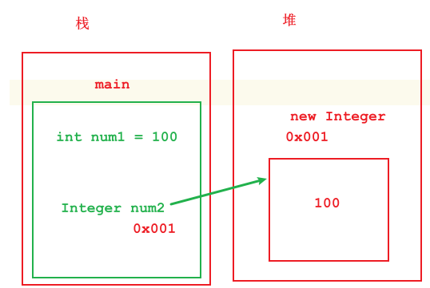

| 基本类型 | 包装类    |
| -------- | --------- |
| byte     | Byte      |
| short    | Short     |
| int      | Integer   |
| long     | Long      |
| float    | Float     |
| double   | Double    |
| char     | Character |
| boolean  | Boolean   |

## 2.Integer的介绍以及使用

### 2.1.Integer基本使用

```java
1.概述:Integer是int型的包装类,里面包装了一个int型的数据
2.构造:
  Integer(int value) 
  Integer(String s)  -> s必须要是数字形式  
      
3.方法:
  static Integer valueOf(int i)  
  static Integer valueOf(String s)  -> s必须要是数字形式 
      
4.注意:
  将基本类型转成包装类 -> 这个动作叫做装箱
```

```java
public class Demo01Integer {
    public static void main(String[] args) {
        //Integer(int value)
        Integer i1 = new Integer(100);
        System.out.println("i1 = " + i1);
        //Integer(String s)  -> s必须要是数字形式
        Integer i2 = new Integer("1");
        System.out.println("i2 = " + i2);

        System.out.println("=================");

        Boolean b1 = new Boolean(true);
        System.out.println("b1 = " + b1);

        Boolean b2 = new Boolean(false);
        System.out.println("b2 = " + b2);

        System.out.println("================");
        Boolean b3 = new Boolean("true");
        System.out.println("b3 = " + b3);
        Boolean b4 = new Boolean("false");
        System.out.println("b4 = " + b4);

        System.out.println("=================");

        /*
          创建 Boolean对象时,如果传递的是字符串的true,底层会比较
          字符串内容,比较的过程中是忽略大小写的
         */
        Boolean b5 = new Boolean("TrUe");
        System.out.println("b5 = " + b5);

        /*
          除了true之外其他都是false
         */
        Boolean b6 = new Boolean("FalsE");
        System.out.println("b6 = " + b6);

    }
}

```

```java
public class Demo02Integer {
    public static void main(String[] args) {
        Integer i1 = Integer.valueOf(100);
        System.out.println("i1 = " + i1);

        Integer i2 = Integer.valueOf("1000");
        System.out.println("i2 = " + i2);
    }
}
```

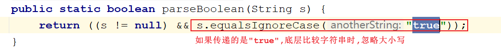

```java
拆箱:
  int intValue()  -> 将包装类转成基本类型
```

```java
public class Demo03Integer {
    public static void main(String[] args) {
        Integer i1 = Integer.valueOf("1000");
        //拆箱->将包装类转成基本类型
        int i = i1.intValue();
        System.out.println(i+1);
    }
}
```

### 2.2.自动拆箱装箱

```java
在操作的过程中,可以自动拆箱和装箱
```

```java
public class Demo04Integer {
    public static void main(String[] args) {
        Integer i = 1;//装箱 Integer.valueOf
        i+=1;//先拆箱(intValue),做运算,将结果装箱(Integer.valueOf)
        System.out.println(i);
    }
}

```

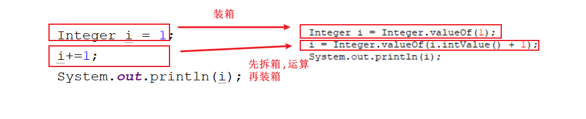

> ```java
> public class Demo05Integer {
>     public static void main(String[] args) {
>         Integer i1 = 100;
>         Integer i2 = 100;
>         System.out.println(i1==i2);//true
> 
>         Integer i3 = 127;
>         Integer i4 = 127;
>         System.out.println(i3==i4);//true
> 
>         Integer i5 = 128;
>         Integer i6 = 128;
>         System.out.println(i5==i6);//false
>     }
> }
> ```
>
> 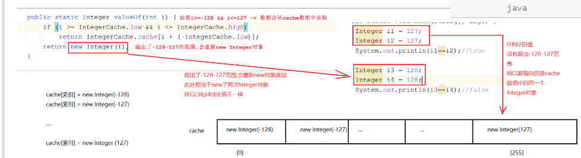
>
> 
>
> 享元设计模式

## 3.基本类型和String之间的转换

### 3.1 基本类型往String转

```java
1.方式1:
  +
2.方式2:String中的静态方法:
  static String valueOf(int i) 
 
```

```java
public class Demo06Integer {
    public static void main(String[] args) {
        //基本类型转成String
        int i = 10;
        String s1 = i+"";
        System.out.println(s1+1);

        System.out.println("==========");
        String s2 = String.valueOf(10);
        System.out.println(s2+1);
    }
}
```

### 3.2 String转成基本数据类型

```java
1.在每一个包装类中都有一个静态方法: parseXXX(String s) -> 可以将String转成基本类型
```

| 位置    | 方法                                  | 说明                |
| ------- | ------------------------------------- | ------------------- |
| Byte    | static byte parseByte(String s)       | 将字符串转成byte    |
| Short   | static short parseShort(String s)     | 将字符串转成short   |
| Integer | static int parseInt(String s)         | 将字符串转成int     |
| Long    | static long parseLong(String s)       | 将字符串转成long    |
| Float   | static float parseFloat(String s)     | 将字符串转成float   |
| Double  | static double parseDouble(String s)   | 将字符串转成double  |
| Boolean | static boolean parseBoolean(String s) | 将字符串转成boolean |

```java
public class Demo07Integer {
    public static void main(String[] args) {
        int i = Integer.parseInt("1111");
        System.out.println(i+1);

        double d = Double.parseDouble("2.5");
        System.out.println(d+1);

        boolean b = Boolean.parseBoolean("true");
        System.out.println(b);
    }
}
```

> ```java
> 1.注意:以后写javabean的时候,要求将属性为基本类型的都写成包装类型
> 2.原因:
>   将来我们的id都是主键自增的,如果某一列为自增,我们在插入数据的时候可以用默认值占位,不用单独此列设置值,直接用NULL占位即可
>   因为我们包装类的属性默认值是NULL
>       
>   我们将来需要将javabean对象中的属性值放到insert(插入)语句中,将属性值放到表中    
>       
>   如果将属性变成包装类,我们可以直接使用包装类中的方法操作属性值    
> ```
>
> ```sql
> INSERT INTO `user` VALUES (NULL,'jack','12345');
> ```
>
> ```java
> public class User {
>     //用户id
>     private Integer id;//null
>     //用户名
>     private String username;//null
>     //密码
>     private String password;//null
> 
>     public User() {
>     }
> 
>     public User(Integer id, String username, String password) {
>         this.id = id;
>         this.username = username;
>         this.password = password;
>     }
> 
>     public Integer getId() {
>         return id;
>     }
> 
>     public void setId(Integer id) {
>         this.id = id;
>     }
> 
>     public String getUsername() {
>         return username;
>     }
> 
>     public void setUsername(String username) {
>         this.username = username;
>     }
> 
>     public String getPassword() {
>         return password;
>     }
> 
>     public void setPassword(String password) {
>         this.password = password;
>     }
> 
>     @Override
>     public String toString() {
>         return "User{" +
>                 "id=" + id +
>                 ", username='" + username + '\'' +
>                 ", password='" + password + '\'' +
>                 '}';
>     }
> }
> ```

# 第三章.多线程基本了解

## 1.多线程_线程和进程

```java
1.进程:
  进入到内存中执行的应用程序
```

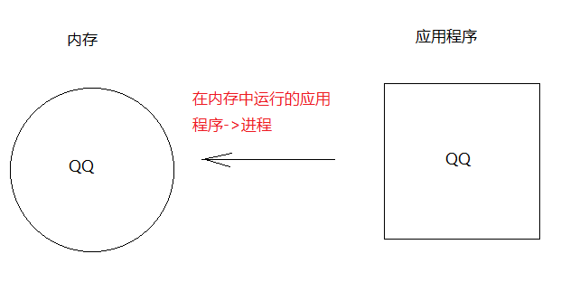

```java
1.线程:进程中的执行单元
  线程作用:负责当前进程中程序的运行,一个进程中至少有一个线程.一个进程中是可以有多个线程的,这样的应用程序就称之为多线程程序   
```

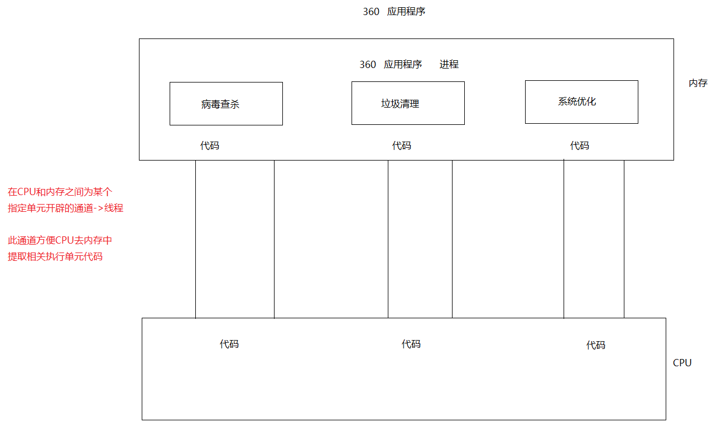

> 并发:同一个时刻多个线程同时操作了同一个数据
>
> 并行:同一个时刻多个线程同时执行不同的程序

## 2.CPU调度

```java
1.分时调度:指的是让所有的线程轮流获取CPU使用权,并且平均分配每个线程占用的cpu的时间片
2.抢占式调度:多个线程轮流抢占CPU使用权,那个线程的优先级高,先执行的几率就大,不是每次都是优先级高的线程先抢到 -> java程序为抢占式
```

## 3.主线程介绍

```java
专门运行main方法的线程 -> 主线程
=====================================================    
public class Demo01Thread {
    public static void main(String[] args) {
        for (int i = 0; i < 5; i++) {
            System.out.println("我是一个for循环");
        }

        System.out.println(Math.abs(-1));
    }
}
```

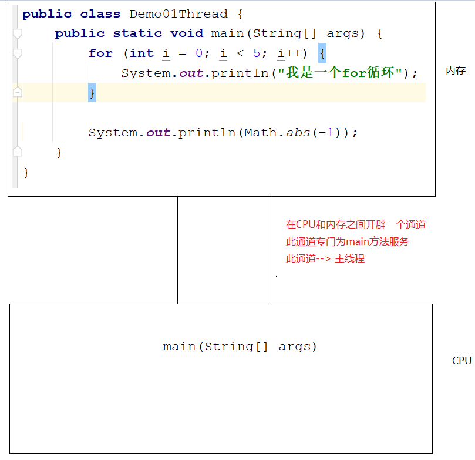

# 第四章.创建线程的方式(重点)

## 1.第一种方式_extends Thread

```java
步骤:
  1.创建一个类,继承Thread类
  2.重写Thread中的run方法,设置线程任务(该线程要执行啥代码)
  3.创建自定义的线程类对象
  4.调用Thread中的start方法(开启线程,jvm自动调用重写的run方法执行线程任务)
```

```java
public class MyThread extends Thread{
    @Override
    public void run() {
        for (int i = 0; i < 10; i++) {
            System.out.println("MyThread...执行了............."+i);
        }
    }
}
```

```java
public class Demo02Thread {
    public static void main(String[] args) {
        //创建线程对象
        MyThread myThread = new MyThread();
        //调用Thread中的start方法,开启线程,jvm自动执行run方法
        myThread.start();

        for (int i = 0; i < 10; i++) {
            System.out.println("main方法.............执行了"+i);
        }
    }
}
```

## 2.多线程在内存中的运行原理

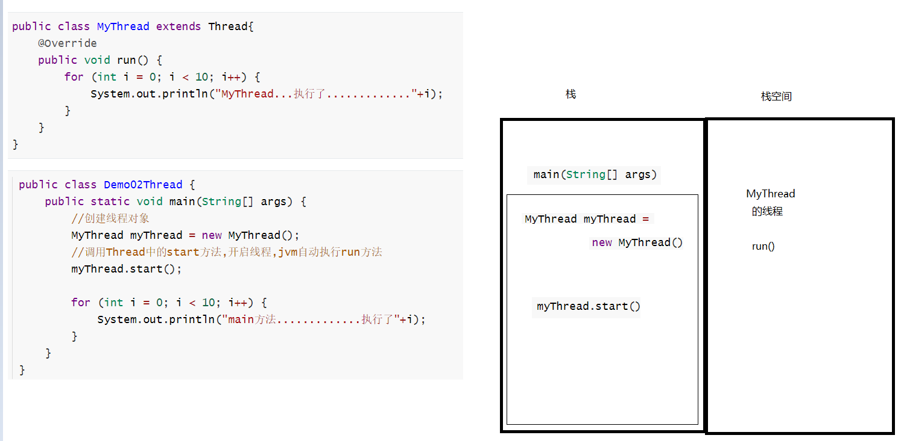

```java
注意:同一个线程对象,不能连续调用多次start方法
```

## 3.Thread类中的方法

```java
public void run() :此线程要执行的任务在此处定义代码。
public String getName() :获取当前线程名称。
public void setName(线程名字):给线程设置名字    
public static Thread currentThread() :返回对当前正在执行的线程对象的引用。此方法在哪个线程中用获取的就是哪个线程对象 
static void sleep(long millis) :线程睡眠,设置的是毫秒值,如果超时,线程会自动醒来,继续执行 
void start()  使该线程开始执行；Java 虚拟机调用该线程的 run 方法    
```

```java
public class MyThread extends Thread{
    @Override
    public void run() {
        for (int i = 0; i < 5; i++) {
            try {
                Thread.sleep(2000L);
            } catch (InterruptedException e) {
               e.printStackTrace();
            }
            System.out.println(Thread.currentThread().getName()+"线程开始执行了........"+i);
        }
    }
}
```

```java
public class Test01 {
    public static void main(String[] args) throws InterruptedException {
        MyThread myThread = new MyThread();
        myThread.setName("曼曼");
        myThread.start();
        for (int i = 0; i < 5; i++) {
            Thread.sleep(1000L);
            System.out.println(Thread.currentThread().getName()+"线程开始执行............"+i);
        }
    }
}
```

## 4.第二种方式_实现Runnable接口

```java
1.创建一个类,实现Runnable接口
2.重写run方法,设置线程任务
3.创建线程类对象
4.创建Thread对象,将线程类对象封装到Thread中   ->  Thread(Runnable target) 
5.调用Thread中的start方法
```

```java
public class Test01 {
    public static void main(String[] args) {
        MyRunnable myRunnable = new MyRunnable();
        Thread t1 = new Thread(myRunnable,"岳不群");
        t1.start();
        for (int i = 0; i < 5; i++) {
            System.out.println(Thread.currentThread().getName()+"...执行了"+i);
        }
    }
}
```

```java
public class MyRunnable implements Runnable{
    @Override
    public void run() {
        for (int i = 0; i < 5; i++) {
            System.out.println(Thread.currentThread().getName()+"...执行了"+i);
        }
    }
}
```

> 为啥在run中必须try...catch处理异常?
>
> ​      父类中的方法没有抛异常,子类重写之后不能抛 -> Runnable中的run方法没有抛异常,重写之后的run就不能throws

## 5.两种实现多线程的方式区别

```java
1.继承Thread,有局限性,因为继承支持单继承
2.实现Runnable,解决了单继承的局限性
```

## 6.第三种方式_匿名内部类创建多线程

```java
1.匿名内部类回顾:
  a.匿名内部类代表的是子类对象或者实现类对象
  b.格式1:
    new 接口/抽象类(){
        重写方法
    }.重写的方法();

  c.格式2:
    接口/抽象类 对象名 = new 接口/抽象类(){
        重写方法
    }
    对象名.重写的方法();
```

```java
public class Test02 {
    public static void main(String[] args) {
        new Thread(new Runnable() {
            @Override
            public void run() {
                for (int i = 0; i < 5; i++) {
                    try {
                        Thread.sleep(100L);
                    } catch (InterruptedException e) {
                        e.printStackTrace();
                    }
                    System.out.println(Thread.currentThread().getName()+"...执行了"+i);
                }
            }
        },"杨童").start();

        new Thread(new Runnable() {
            @Override
            public void run() {
                for (int i = 0; i < 5; i++) {
                    try {
                        Thread.sleep(100L);
                    } catch (InterruptedException e) {
                        e.printStackTrace();
                    }
                    System.out.println(Thread.currentThread().getName()+"...执行了"+i);
                }
            }
        },"曼曼").start();
    }
}

```

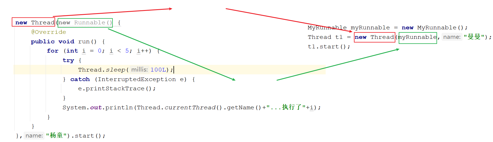

# 第五章.线程安全

```java
1.什么时候会发生线程安全问题:
  多个线程访问同一个资源(数据)时
```

## 1.线程安全问题-->线程不安全的代码

```java
public class MyTicket implements Runnable{
    int ticket = 100;
    @Override
    public void run() {
        while(true){
            try {
                Thread.sleep(100L);
            } catch (InterruptedException e) {
                e.printStackTrace();
            }
            if (ticket>0){
                System.out.println(Thread.currentThread().getName()+"买了第"+ticket+"张票");
                ticket--;
            }
        }
    }
}

```

```java
public class Test01 {
    public static void main(String[] args) {
        MyTicket myTicket = new MyTicket();
        Thread t1 = new Thread(myTicket,"曼曼");
        Thread t2 = new Thread(myTicket,"童童");
        Thread t3 = new Thread(myTicket,"雪雪");
        t1.start();
        t2.start();
        t3.start();
    }
}
```

```java
CPU在多个线程之间做切换
```

## 2.解决线程安全问题的第一种方式(使用同步代码块)

```java
1.关键字:synchronized
2.格式:
  synchronized(任意对象){
      可能出现线程不安全的代码
  }
3.线程进了synchronized代码块相当于上锁了,其他线程只能在代码块外面等待,等到执行的线程执行完毕,出了synchronized,相当于将锁释放了,此时其他等待的线程才有机会拿到锁,上锁,进去执行
4.注意:想要实现线程安全,线程同步,多个线程之间用的锁对象需要是同一个锁对象    
```

```java
public class MyTicket implements Runnable{
    int ticket = 100;

    Object obj = new Object();

    @Override
    public void run() {
        while(true){
            try {
                Thread.sleep(100L);
            } catch (InterruptedException e) {
                e.printStackTrace();
            }
            synchronized (new Object()){
                if (ticket>0){
                    System.out.println(Thread.currentThread().getName()+"买了第"+ticket+"张票");
                    ticket--;
                }
            }

        }
    }
}

```

```java
public class Test01 {
    public static void main(String[] args) {
        MyTicket myTicket = new MyTicket();
        Thread t1 = new Thread(myTicket,"曼曼");
        Thread t2 = new Thread(myTicket,"童童");
        Thread t3 = new Thread(myTicket,"雪雪");
        t1.start();
        t2.start();
        t3.start();
    }
}
```

## 3.解决线程安全问题的第二种方式:同步方法

### 3.1.普通同步方法

``` java
1.格式:
  public synchronized 返回值类型 方法名(参数){
      可能出现线程不安全的代码
  }

2.默认锁:
  this
```

```java
public class MyTicket implements Runnable {
    int ticket = 100;

    @Override
    public void run() {
        while (true) {
            try {
                Thread.sleep(100L);
            } catch (InterruptedException e) {
                e.printStackTrace();
            }
            method();
        }
    }

   /* public synchronized void method() {
        if (ticket > 0) {
            System.out.println(Thread.currentThread().getName() + "买了第" + ticket + "张票");
            ticket--;
        }
    }*/

    public void method(){
        synchronized (this){
            if (ticket > 0) {
                System.out.println(Thread.currentThread().getName() + "买了第" + ticket + "张票");
                ticket--;
            }
        }
    }
}

```

```java
public class Test01 {
    public static void main(String[] args) {
        MyTicket myTicket = new MyTicket();
        Thread t1 = new Thread(myTicket,"曼曼");
        Thread t2 = new Thread(myTicket,"童童");
        Thread t3 = new Thread(myTicket,"雪雪");
        t1.start();
        t2.start();
        t3.start();
    }
}
```

### 3.2.静态同步方法

```java
1.格式:
  public static synchronized 返回值类型 方法名(参数){
      可能出现线程不安全的代码
  }

2.默认锁:
  当前类.class
```

```java
public class MyTicket implements Runnable {
    static int ticket = 100;

    @Override
    public void run() {
        while (true) {
            try {
                Thread.sleep(100L);
            } catch (InterruptedException e) {
                e.printStackTrace();
            }
            method();
        }
    }

   /* public static synchronized void method() {
        if (ticket > 0) {
            System.out.println(Thread.currentThread().getName() + "买了第" + ticket + "张票");
            ticket--;
        }
    }*/

    public static void method(){
        synchronized (MyTicket.class){
            if (ticket > 0) {
                System.out.println(Thread.currentThread().getName() + "买了第" + ticket + "张票");
                ticket--;
            }
        }
    }
}

```

```java
public class Test01 {
    public static void main(String[] args) {
        MyTicket myTicket = new MyTicket();
        Thread t1 = new Thread(myTicket,"曼曼");
        Thread t2 = new Thread(myTicket,"童童");
        Thread t3 = new Thread(myTicket,"雪雪");
        t1.start();
        t2.start();
        t3.start();
    }
}
```

# 第六章.死锁(了解)

## 1.死锁介绍(锁嵌套就有可能产生死锁)

```java
指的是两个或者两个以上的线程在执行的过程中,由于竞争同步锁而产生的一种阻塞现象;如果没有外力的作用,他们将无法继续执行下去,这种情况就称之为死锁.
```

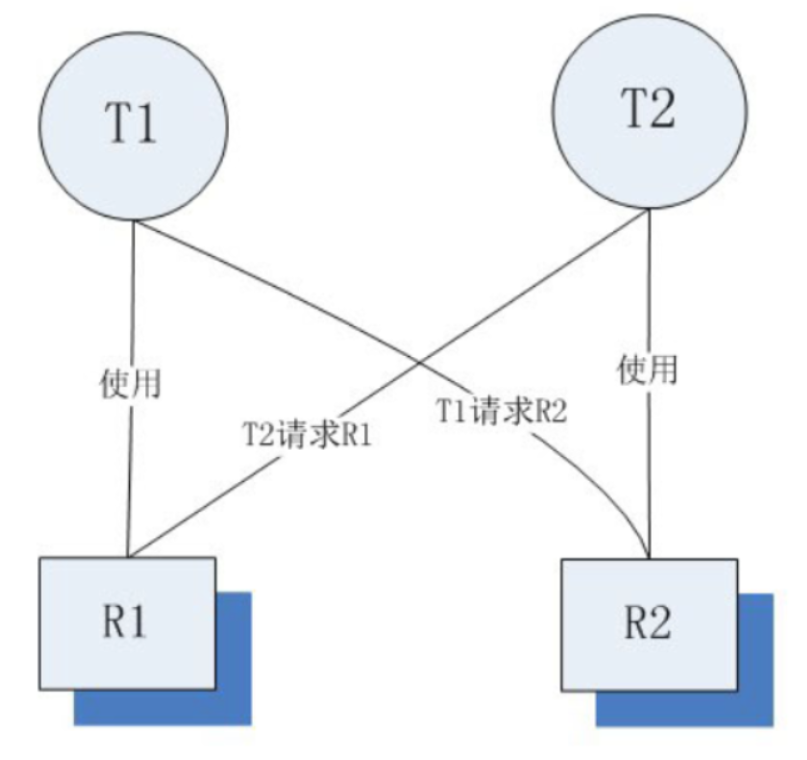

```java
根据上图所示:线程T1正在持有R1锁,但是T1线程必须再拿到R2锁,才能继续执行
而线程T2正在持有R2锁,但是T2线程需要再拿到R1锁,才能继续执行
此时两个线程处于互相等待的状态,就是死锁,在程序中的死锁将出现在同步代码块的嵌套中
```

## 2.死锁的分析

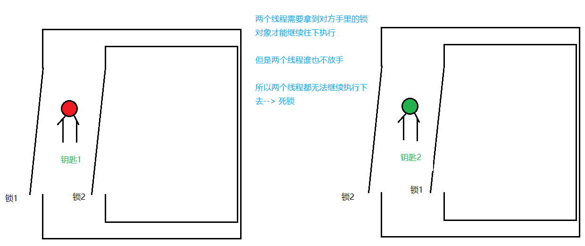

## 3.代码实现

```java
public class LockA {
    public static LockA lockA = new LockA();
}
```

```java
public class LockB {
    public static LockB lockB = new LockB();
}
```

```java
public class DieLock implements Runnable{
    private boolean flag;

    public DieLock(boolean flag) {
        this.flag = flag;
    }

    @Override
    public void run() {
        if (flag){
            synchronized (LockA.lockA){
                System.out.println("if...lockA");
                synchronized (LockB.lockB){
                    System.out.println("if...lockB");
                }
            }
        }else{
            synchronized (LockB.lockB){
                System.out.println("else...lockB");
                synchronized (LockA.lockA){
                    System.out.println("else...lockA");
                }
            }
        }
    }
}

```

```java
public class Test01 {
    public static void main(String[] args) {
        DieLock dieLock1 = new DieLock(true);
        DieLock dieLock2 = new DieLock(false);

        new Thread(dieLock1).start();
        new Thread(dieLock2).start();
    }
}
```

