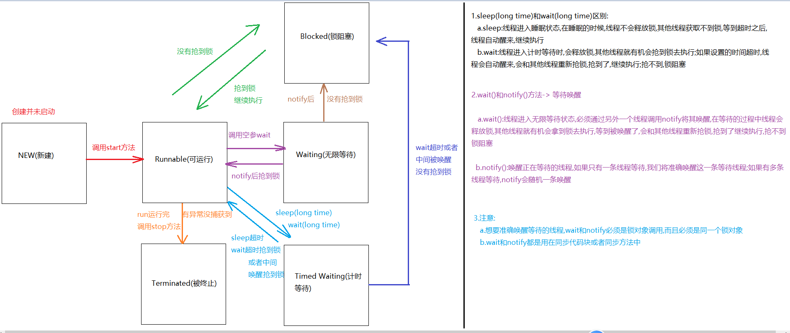
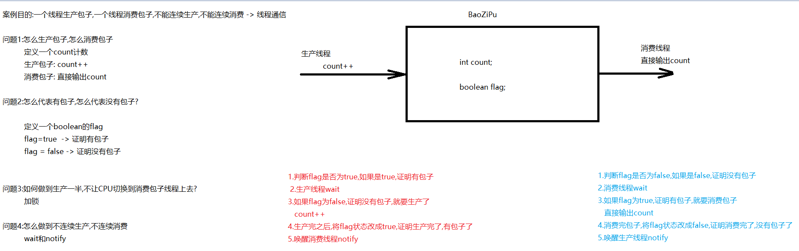
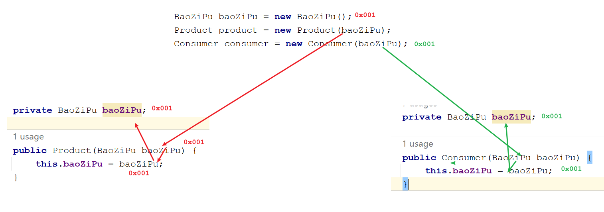
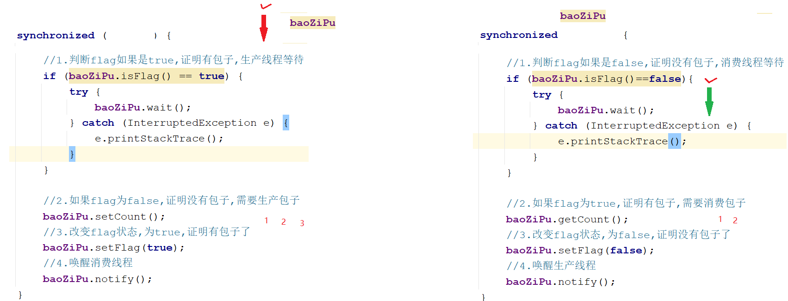
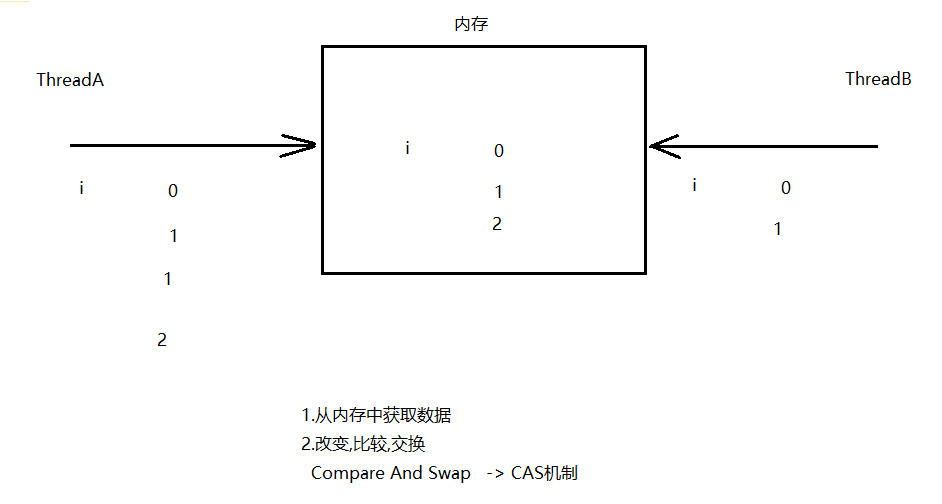
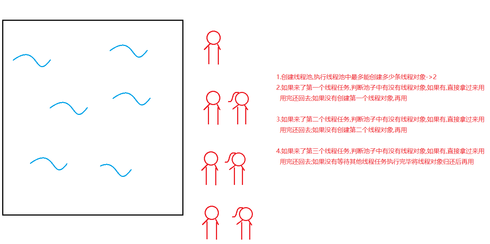

# day15. 多线程

```java
课前回顾:
  1.包装类:基本类型对应的类
  2.拆箱和装箱:
    a.拆箱:将包装类转成基本类型
    b.装箱:将基本类型转成包装类
  3.Integer为例
    a.装箱:
      Integer(int i)
      Integer(String s)
     
      valueOf(int i)
      valueOf(String s)
    b.拆箱:
      intValue()
          
  4.基本类型和String之间的转换
    a.基本类型转成String
      +
      String中的静态方法 -> valueOf(int i)
          
    b.String转成基本类型:
      parseXXX(String s)
          
  5.线程和进程:
    a.进程:进入到内存执行的应用程序
    b.线程:进程中的一个执行单元
       
  6.CPU调度:
    a.分时调度  b.抢占式调度->java程序
        
  7.主线程:专门执行main方法的线程
  8.实现多线程方式1:
    a.定义一个类,继承Thread类
    b.重写run方法,设置线程任务的
    c.创建自定义线程类对象,调用Thread中的start方法(开启线程,jvm自动运行run方法)
  
  9.实现多线程方式2:
    a.定义一个类,实现Runnable接口
    b.重写run方法,设置线程任务的
    c.创建实现类对象,将其封装到Thread对象中
    d.调用start方法
        
  10.匿名内部类方式实现多线程:
     new Thread(new Runnable(){
         重写run方法
     }).start();

  11.实现线程安全
     a.同步代码块
       synchronized(锁对象){
          线程不安全代码
       }
     b.同步方法:
       普通同步方法:默认锁this
       静态同步方法:默认锁当前类.class
           
  
今日重点:
   1.会wait和notify基本使用
   2.知道wait和sleep区别
   3.会使用lock锁
   4.会使用线程池结合Callable实现多线程
   5.乐观锁和悲观锁区别 -> 有时间再背
```

# 第一章.线程状态

## 1.线程状态介绍

```java
  当线程被创建并启动以后，它既不是一启动就进入了执行状态，也不是一直处于执行状态。在线程的生命周期中，有几种状态呢？在API中java.lang.Thread.State这个枚举中给出了六种线程状态：
  这里先列出各个线程状态发生的条件，下面将会对每种状态进行详细解析。
```

| 线程状态                | 导致状态发生条件                                             |
| ----------------------- | ------------------------------------------------------------ |
| NEW(新建)               | 线程刚被创建，但是并未启动。还没调用start方法。              |
| Runnable(可运行)        | 线程可以在java虚拟机中运行的状态，可能正在运行自己代码，也可能没有，这取决于操作系统处理器。 |
| Blocked(锁阻塞)         | 当一个线程试图获取一个对象锁，而该对象锁被其他的线程持有，则该线程进入Blocked状态；当该线程持有锁时，该线程将变成Runnable状态。 |
| Waiting(无限等待)       | 一个线程在等待另一个线程执行一个（唤醒）动作时，该线程进入Waiting状态。进入这个状态后是不能自动唤醒的，必须等待另一个线程调用notify或者notifyAll方法才能够唤醒。 |
| Timed Waiting(计时等待) | 同waiting状态，有几个方法有超时参数，调用他们将进入Timed Waiting状态。这一状态将一直保持到超时期满或者接收到唤醒通知。带有超时参数的常用方法有Thread.sleep 、Object.wait。 |
| Terminated(被终止)      | 因为run方法正常退出而死亡，或者因为没有捕获的异常终止了run方法而死亡。或者调用过时方法stop() |

## 2.线程状态图



# 第二章.等待唤醒

## 1.等待唤醒案例分析(线程之间的通信)



## 2.等待唤醒案例实现

```java
public class BaoZiPu {
    private int count;
    private boolean flag;

    public BaoZiPu() {
    }

    public BaoZiPu(int count, boolean flag) {
        this.count = count;
        this.flag = flag;
    }

    /**
     * getCount专门给消费线程用
     * @return
     */
    public void getCount() {
        System.out.println("消费了第......"+count+"个包子");
    }

    /**
     * setCount专门给生产线程生产包子用
     * @param
     */
    public void setCount() {
        count++;
        System.out.println("生成了第..."+count+"个包子");
    }

    public boolean isFlag() {
        return flag;
    }

    public void setFlag(boolean flag) {
        this.flag = flag;
    }
}
```

```java
/**
 * 生产线程
 */
public class Product implements Runnable {
    private BaoZiPu baoZiPu;

    public Product(BaoZiPu baoZiPu) {
        this.baoZiPu = baoZiPu;
    }

    @Override
    public void run() {
        while (true) {
            synchronized (baoZiPu) {
                try {
                    Thread.sleep(100L);
                } catch (InterruptedException e) {
                    throw new RuntimeException(e);
                }
                //1.判断flag如果是true,证明有包子,生产线程等待
                if (baoZiPu.isFlag() == true) {
                    try {
                        baoZiPu.wait();
                    } catch (InterruptedException e) {
                        e.printStackTrace();
                    }
                }

                //2.如果flag为false,证明没有包子,需要生产包子
                baoZiPu.setCount();
                //3.改变flag状态,为true,证明有包子了
                baoZiPu.setFlag(true);
                //4.唤醒消费线程
                baoZiPu.notify();
            }
        }

    }
}

```

```java
/**
 * 消费线程
 */
public class Consumer implements Runnable{
    private BaoZiPu baoZiPu;

    public Consumer(BaoZiPu baoZiPu) {
        this.baoZiPu = baoZiPu;
    }
    @Override
    public void run() {
        while(true){
            synchronized (baoZiPu){
                try {
                    Thread.sleep(100L);
                } catch (InterruptedException e) {
                    throw new RuntimeException(e);
                }
                //1.判断flag如果是false,证明没有包子,消费线程等待
                if (baoZiPu.isFlag()==false){
                    try {
                        baoZiPu.wait();
                    } catch (InterruptedException e) {
                        e.printStackTrace();
                    }
                }

                //2.如果flag为true,证明有包子,需要消费包子
                baoZiPu.getCount();
                //3.改变flag状态,为false,证明没有包子了
                baoZiPu.setFlag(false);
                //4.唤醒生产线程
                baoZiPu.notify();
            }

        }

    }
}

```

```java
public class Test01 {
    public static void main(String[] args) {
        BaoZiPu baoZiPu = new BaoZiPu();
        Product product = new Product(baoZiPu);
        Consumer consumer = new Consumer(baoZiPu);
        new Thread(product).start();
        new Thread(consumer).start();
    }
}
```





## 3.用同步方法改造等待唤醒案例

```java
public class BaoZiPu {
    private int count;
    private boolean flag;

    public BaoZiPu() {
    }

    public BaoZiPu(int count, boolean flag) {
        this.count = count;
        this.flag = flag;
    }

    /**
     * getCount专门给消费线程用
     *
     * @return
     */
    public synchronized void getCount() {
        //1.判断flag如果是false,证明没有包子,消费线程等待
        if (flag == false) {
            try {
                this.wait();
            } catch (InterruptedException e) {
                e.printStackTrace();
            }
        }

        //2.如果flag为true,证明有包子,需要消费包子
        System.out.println("消费了第......" + count + "个包子");
        //3.改变flag状态,为false,证明没有包子了
        flag = false;
        //4.唤醒生产线程
        this.notify();
    }

    /**
     * setCount专门给生产线程生产包子用
     *
     * @param
     */
    public synchronized void setCount() {
        //1.判断flag如果是true,证明有包子,生产线程等待
        if (flag == true) {
            try {
                this.wait();
            } catch (InterruptedException e) {
                e.printStackTrace();
            }
        }

        //2.如果flag为false,证明没有包子,需要生产包子
        count++;
        System.out.println("生成了第..." + count + "个包子");
        //3.改变flag状态,为true,证明有包子了
        flag = true;
        //4.唤醒消费线程
        this.notify();
    }

    public boolean isFlag() {
        return flag;
    }

    public void setFlag(boolean flag) {
        this.flag = flag;
    }
}
```

```java
/**
 * 生产线程
 */
public class Product implements Runnable {
    private BaoZiPu baoZiPu;

    public Product(BaoZiPu baoZiPu) {
        this.baoZiPu = baoZiPu;
    }

    @Override
    public void run() {
        while (true) {
            try {
                Thread.sleep(100L);
            } catch (InterruptedException e) {
                throw new RuntimeException(e);
            }

            baoZiPu.setCount();
        }

    }
}

```

```java
/**
 * 消费线程
 */
public class Consumer implements Runnable {
    private BaoZiPu baoZiPu;

    public Consumer(BaoZiPu baoZiPu) {
        this.baoZiPu = baoZiPu;
    }

    @Override
    public void run() {
        while (true) {
            try {
                Thread.sleep(100L);
            } catch (InterruptedException e) {
                throw new RuntimeException(e);
            }
            baoZiPu.getCount();
        }

    }
}
```

```java
public class Test01 {
    public static void main(String[] args) {
        BaoZiPu baoZiPu = new BaoZiPu();
        Product product = new Product(baoZiPu);
        Consumer consumer = new Consumer(baoZiPu);
        new Thread(product).start();
        new Thread(consumer).start();
    }
}

```

# 第三章.多等待多唤醒

## 1.解决多生产多消费问题(if改为while,将notify改为notifyAll)

```java
public class BaoZiPu {
    private int count;
    private boolean flag;

    public BaoZiPu() {
    }

    public BaoZiPu(int count, boolean flag) {
        this.count = count;
        this.flag = flag;
    }

    /**
     * getCount专门给消费线程用
     *
     * @return
     */
    public synchronized void getCount() {
        //1.判断flag如果是false,证明没有包子,消费线程等待
        while (flag == false) {
            try {
                this.wait();
            } catch (InterruptedException e) {
                e.printStackTrace();
            }
        }

        //2.如果flag为true,证明有包子,需要消费包子
        System.out.println("消费了第......" + count + "个包子");
        //3.改变flag状态,为false,证明没有包子了
        flag = false;
        //4.唤醒生产线程
        this.notifyAll();
    }

    /**
     * setCount专门给生产线程生产包子用
     *
     * @param
     */
    public synchronized void setCount() {
        //1.判断flag如果是true,证明有包子,生产线程等待
        while (flag == true) {
            try {
                this.wait();
            } catch (InterruptedException e) {
                e.printStackTrace();
            }
        }

        //2.如果flag为false,证明没有包子,需要生产包子
        count++;
        System.out.println("生成了第..." + count + "个包子");
        //3.改变flag状态,为true,证明有包子了
        flag = true;
        //4.唤醒消费线程
        this.notifyAll();
    }

    public boolean isFlag() {
        return flag;
    }

    public void setFlag(boolean flag) {
        this.flag = flag;
    }
}

```

```java
/**
 * 生产线程
 */
public class Product implements Runnable {
    private BaoZiPu baoZiPu;

    public Product(BaoZiPu baoZiPu) {
        this.baoZiPu = baoZiPu;
    }

    @Override
    public void run() {
        while (true) {

            try {
                Thread.sleep(100L);
            } catch (InterruptedException e) {
                throw new RuntimeException(e);
            }

            baoZiPu.setCount();
        }

    }
}

```

```java
/**
 * 消费线程
 */
public class Consumer implements Runnable {
    private BaoZiPu baoZiPu;

    public Consumer(BaoZiPu baoZiPu) {
        this.baoZiPu = baoZiPu;
    }

    @Override
    public void run() {
        while (true) {
            try {
                Thread.sleep(100L);
            } catch (InterruptedException e) {
                throw new RuntimeException(e);
            }
            baoZiPu.getCount();
        }

    }
}
```

```java
public class Test01 {
    public static void main(String[] args) {
        BaoZiPu baoZiPu = new BaoZiPu();
        Product product = new Product(baoZiPu);
        Consumer consumer = new Consumer(baoZiPu);
        new Thread(product).start();
        new Thread(product).start();

        new Thread(consumer).start();
        new Thread(consumer).start();
    }
}

```

# 第四章.Lock锁

## 1.Lock对象的介绍和基本使用

```java
1.概述:是一个接口,作为锁对象使用
2.实现类:ReentrantLock
3.方法:
  void lock() :获取锁
  void unlock() :释放锁     
```

```java
public class Test01 {
    public static void main(String[] args) {
        MyTicket myTicket = new MyTicket();
        Thread t1 = new Thread(myTicket,"曼曼");
        Thread t2 = new Thread(myTicket,"童童");
        Thread t3 = new Thread(myTicket,"雪雪");
        t1.start();
        t2.start();
        t3.start();
    }
}

```

```java
public class MyTicket implements Runnable {
    int ticket = 100;

    Lock lock = new ReentrantLock();

    @Override
    public void run() {
        while (true) {
            try {
                Thread.sleep(100L);
            } catch (InterruptedException e) {
                e.printStackTrace();
            }
            //获取锁
            lock.lock();
            if (ticket > 0) {
                System.out.println(Thread.currentThread().getName() + "买了第" + ticket + "张票");
                ticket--;
            }
            //释放锁
            lock.unlock();

        }
    }
}

```

## 2.Lock和synchronized区别

### 2.1.Lock

```java
1.实现原理:Lock是一个轻量级锁,乐观锁
2.乐观锁实现机制:Compare And Swap  -> CAS机制
```



```java
1.在java.util.concurrent.atomic 包下有很多"原子类",这些类都是对某一个值进行修改,进行操作的,底层实现原理都是"乐观锁"
    AtomicXXX
```

```java
1.比如:AtomicInteger -> 以原子形式,修改int的值
2.构造:
  a.AtomicInteger()创建具有初始值 0 的新 AtomicInteger -> int i = 0
  b.AtomicInteger(int initialValue)创建具有给定初始值的新 AtomicInteger -> int i = 10
      
3.方法:
  int addAndGet(int delta)  以原子方式将给定值与当前值相加
  int getAndIncrement()-> 加1 
  int getAndDecrement()-> 减1     
```

```java
public class Test02 {
    public static void main(String[] args) {
        AtomicInteger i = new AtomicInteger(10);
        System.out.println(i);
        int sum = i.addAndGet(10);
        System.out.println("sum = " + sum);
    }
}
```

### 2.2.synchronized

```java
属于悲观锁,当一个线程拿到锁对象之后,其他线程拿不到,执行不了,当一个线程做操作的时候,其他线程操作不了->排队
```

### 2.3.Lock和synchronized区别(悲观锁和乐观锁的区别)

```java
a. Lock属于乐观锁,使用多个线程操作的是同一个变量
   synchronized属于悲观锁,使用多个线程操作一段代码
b.
   乐观锁:线程A在操作变量时,允许线程B操作,只是会先判断,如果有问题,就放弃本次操作.判断如果没有问题,就会正常操作
   悲观锁:当线程A正在操作的时候,不允许线程B执行,要等A出来之后B才有可能进入执行

c.相对来说,悲观锁效率比较低,乐观锁效率比较高
```

> 当多线程操作同一个数据时,会出现以下问题:
>
> 1.可见性
>
> ```java
> i=9，变量i的初始值为9，每一个线程的操作都是减1。两个线程A与B同时访问变量，B先执行i-1,在将结果i=8同步到内存中，A线程也执行i-1，这时i=9的状态就被执行两次，出现线程安全问题。
> 
> 线程安全问题产生的原因：一个线程对共享数据的修改不能立即被其他线程所见。
> 
> 解决:给共享的变量加上关键字:volatile
> ```
>
> 2.有序性
>
> ```java
> 多行代码的编写顺序和编译顺序。
> 有些时候，编译器在编译代码时，为了提高效率，会对代码“重排”：
> 
> .java文件
> int a = 0;		//第一行
> int b = 20;		//第二行
> int c = a / b;	//第三行
> 
> 在执行第三行之前，由于第一行和第二行的先后顺序无所谓，所以编译器可能会对“第一行”和“第二行”进行代码重排：
> .class
> int b = 20;
> int a = 0;
> int c = a / b;
> 
> 但在多线程环境下，这种重排可能是我们不希望发生的，因为：重排，可能会影响另一个线程的结果,所以我们不需要代码进行重排
> 
> 解决:给共享的变量加上关键字:volatile
> ```
>
> 3.原子性
>
> ```java
> 指的是一个操作不可中断，即在多线程并发的环境下，一个操作一旦开始，就会在同一个CPU时间片内执行完毕
> 
> volatile解决不了原子性问题,所以为了多线程操作同一个数据出现的原子性问题,我们可以使用原子类
> 
> Atomicxxx类->xxx代表具体数据类型  ->  原子类的实现原理就是乐观锁
> ```
>
> ```java
> public class Test02 {
>     public static void main(String[] args) {
>         //原子类
>         AtomicInteger i = new AtomicInteger();//int i = 0
>         /*int addAndGet(int delta)以原子方式将给定值与当前值相加。*/
>         int i1 = i.addAndGet(2);
>         System.out.println(i1);
>     }
> }
> ```

# 第五章.线程池



```java
1.问题描述:
  我们将来在操作多线程的时候,我们为了执行线程任务会频繁创建线程对象,销毁线程对象,这样的话比较耗费内存资源
      
  所以,我们想,能不能创建几个线程对象,让这几个线程对象循环利用
```

```java
1.概述:Executors线程池对象
2.创建:
  static ExecutorService newFixedThreadPool(int nThreads) -> 创建线程池,指定最多创建多少条线程对象
      
3.ExecutorService:管理线程的
  Future<?> submit(Runnable task) -> 提交线程任务
  void shutdown()  -> 启动一次顺序关闭，执行以前提交的任务，但不接受新任务  
4.Future接口:
  用来接收执行run方法后的返回值的值,但是run方法没有返回值,所以不需要Future接收
            
 
```

```java
public class MyRunnable implements Runnable{
    @Override
    public void run() {
        System.out.println(Thread.currentThread().getName()+"执行了");
    }
}

```

```java
public class Test01 {
    public static void main(String[] args) {
        ExecutorService es = Executors.newFixedThreadPool(2);
        es.submit(new MyRunnable());
        es.submit(new MyRunnable());
        es.submit(new MyRunnable());

        //启动一次顺序关闭，执行以前提交的任务，但不接受新任务
        es.shutdown();
    }
}
```

# 第六章.Callable接口

```java
1.概述:Callable<V>接口,类似于Runnable
2.方法:V call() 
3.<V>:叫做泛型
  a.泛型作用:规定类型的,统一数据类型的
  b.泛型只能传递引用数据类型,如果操作基本类型数据,需要传递包装类,如果不写泛型,默认类型为Object类型
4.call方法 ->设置线程任务的,类似于run方法
5.call方法和run方法区别
  run:设置线程任务,没有返回值,不能throws异常
  call:设置线程任务,有返回值,能直接throws异常,
       返回值类型是啥类型?实现Callable时泛型写什么类型,重写的call方法返回值类型就是啥类型
6.提交线程任务:ExecutorService中的方法:
  Future<T> submit(Callable<T> task) 
  返回值:Future->用于接收call方法的返回值  
7.获取call的返回值:
  需要用到Future接口中的方法:V get()       
```

```java
public class MyCallable implements Callable<String> {
    @Override
    public String call() throws Exception {
        return "涛哥和柳岩...的故事";
    }
}
```

```java
public class Test01 {
    public static void main(String[] args) throws ExecutionException, InterruptedException {
        ExecutorService es = Executors.newFixedThreadPool(2);
        Future<String> future = es.submit(new MyCallable());
        System.out.println("future = " + future.get());
    }
}

```

## 1.Callable练习

```java
需求:创建两个线程任务,一个线程任务完成1-100的和,一个线程任务返回一个字符串
```

```java
public class MyString implements Callable<String> {
    @Override
    public String call() throws Exception {
        int[] arr = {1,2,3,4,5};
        String str = "[";
        for (int i = 0; i < arr.length; i++) {
            if (i== arr.length-1){
                str+=arr[i]+"]";
            }else {
                str+=arr[i]+", ";
            }
        }
        return str;
    }
}
```

```java
public class MySum implements Callable<Integer> {
    @Override
    public Integer call() throws Exception {
        int sum = 0;
        for (int i = 1; i <= 100; i++) {
            sum+=i;
        }
        return sum;
    }
}
```

```java
public class Test01 {
    public static void main(String[] args) throws ExecutionException, InterruptedException {
        ExecutorService es = Executors.newFixedThreadPool(2);
        Future<String> f1 = es.submit(new MyString());
        Future<Integer> f2 = es.submit(new MySum());

        System.out.println(f1.get());
        System.out.println(f2.get());

        es.shutdown();
    }
}
```

# 第七章.定时器_Timer

```java
1.作用:用来定时执行线程任务的
2.构造:Timer() 
3.方法:
 void schedule(TimerTask task, Date firstTime, long period)  
                task:设置线程任务
                firstTime:从什么时间开始
                period:每隔多长时间执行一次线程任务
```

```java
public class Test01 {
    public static void main(String[] args) {
        Timer timer = new Timer();
        timer.schedule(new TimerTask() {
            @Override
            public void run() {
                System.out.println("柳岩对涛哥说:涛哥,该起床了!");
            }
        },new Date(),2000L);
    }
}
```

# 第八章.枚举

## 1.枚举介绍

```java
1.引用数据类型:
  类 数组 接口 枚举 注解
      
2.所有的枚举类的父类->Enum   
  public enum 枚举类类名{
      
  }  

3.枚举中的成员:
  a.所有成员默认都是static final修饰的常量,但是不用写static final,被static final修饰的变量名习惯上大写
      
  b.每一个枚举成员都是所在枚举的对象 
  c.问题:枚举类中的成员都是什么类型? -> 本类类型
      
4.枚举的使用场景:一般都是表示状态的   
5.注意:枚举类中的构造都是private的,不写private,默认也是private  
```

```java
public enum Status {
    //WEIFUKUAN,// Status WEIFAHUO = new Status()
    //YIFUKUAN,// Status YIFUKUAN = new Status()
    //WEIFAHUO,// Status WEIFAHUO = new Status()
    //YIFAHUO;// Status YIFAHUO = new Status()

    WEIFUKUAI("未付款"),// Status WEIFAHUO = new Status("未付款")
    YIFUKUAN("已付款"), //Status YIFUKUAN = new Status("已付款")
    WEIFAHUO("未发货"), //Status WEIFAHUO = new Status("未发货")
    YIFAHUO("已发货");//Status YIFAHUO = new Status("已发货")

    //枚举类中的构造要求是private的,不写也是private

    String name;
    Status(){

    }

    Status(String name){
        this.name = name;
    }

    public void setName(String name) {
        this.name = name;
    }

    public String getName() {
        return name;
    }
}

```

```java
public class Test01 {
    public static void main(String[] args) {
        Status weifahuo = Status.WEIFAHUO;
        System.out.println("weifahuo = " + weifahuo);//默认调用toString方法
        System.out.println("weifahuo = " + weifahuo.toString());//默认调用toString方法

        Status weifahuo1 = Status.WEIFAHUO;
        System.out.println(weifahuo1.getName());
    }
}
```

## 2.枚举的方法_Enum

| 方法名              | 说明                                              |
| ------------------- | ------------------------------------------------- |
| String toString()   | 返回枚举常量的名称，它包含在声明中                |
| values()            | 返回枚举类型的对象数组,可以快速遍历出所有的枚举值 |
| valueOf(String str) | 将一个字符串转成枚举类型                          |

```java
public enum Status {
    //WEIFUKUAN,// Status WEIFAHUO = new Status()
    //YIFUKUAN,// Status YIFUKUAN = new Status()
    //WEIFAHUO,// Status WEIFAHUO = new Status()
    //YIFAHUO;// Status YIFAHUO = new Status()

    WEIFUKUAI("未付款"),// Status WEIFAHUO = new Status("未付款")
    YIFUKUAN("已付款"), //Status YIFUKUAN = new Status("已付款")
    WEIFAHUO("未发货"), //Status WEIFAHUO = new Status("未发货")
    YIFAHUO("已发货");//Status YIFAHUO = new Status("已发货")

    //枚举类中的构造要求是private的,不写也是private

    String name;
    Status(){

    }

    Status(String name){
        this.name = name;
    }

    public void setName(String name) {
        this.name = name;
    }

    public String getName() {
        return name;
    }
}

```

```java
public class Test02 {
    public static void main(String[] args) {
        Status weifahuo = Status.WEIFAHUO;
        System.out.println(weifahuo);
        System.out.println(weifahuo.toString());

        System.out.println("=======================");

        Status[] values = Status.values();
        for (Status value : values) {
            System.out.println(value.getName());
        }

        System.out.println("=======================");

        Status yifahuo = Status.valueOf("YIFAHUO");
        System.out.println(yifahuo);
    }
}

```

