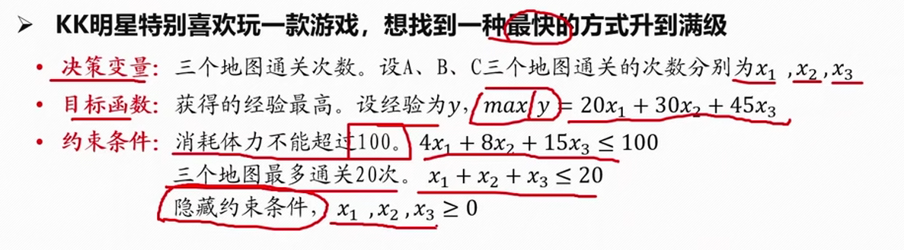
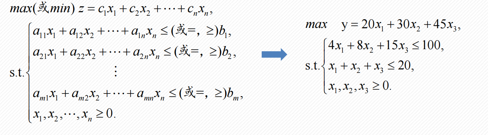
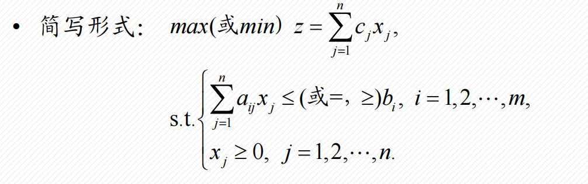
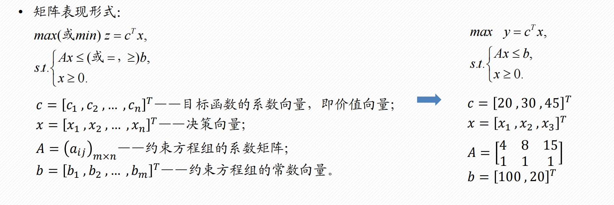
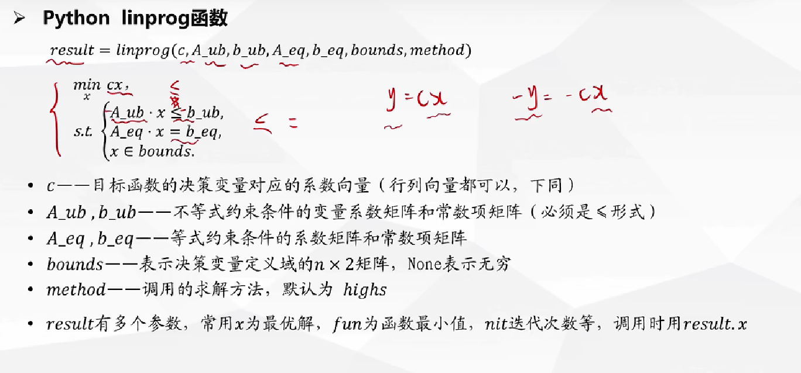
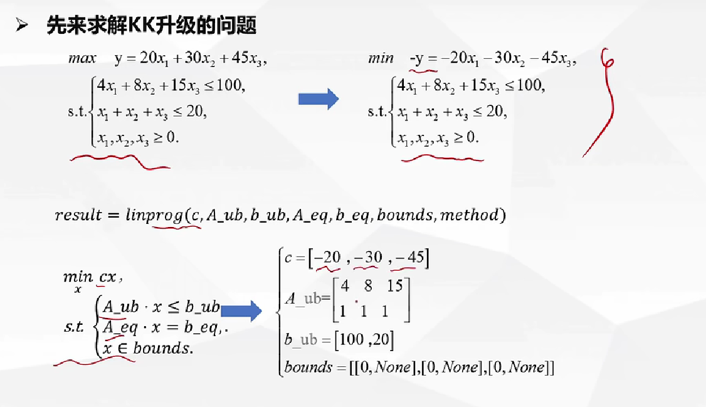
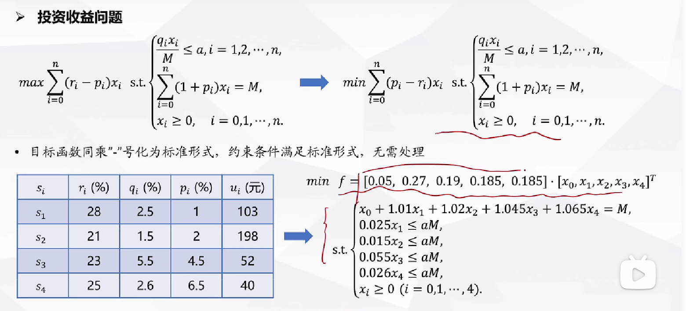

# 线性规划

## 1. 三要素

- 决策变量
- 目标函数
- 约束条件

## 2. 建立步骤

依次找出三要素条件



## 3. 表现形式

- 一般形式/代数形式
  
  

- 简写形式
  
  
  
- 矩阵表现形式

  

## 4. 特点

- 要解决的问题是优化类的
- 目标函数和约束条件都是决策变量的线性函数
- 线性规划模型: 在一组线性约束条件下, 求线性目标函数的最大值或最小值

## 5. Python



- kunkun问题

  

  ```python
  import numpy as np
  from scipy.optimize import linprog
  
  c = [-20, -30, -45]
  # c = eval(input())
  
  A_ub = [
      [4, 8, 15],
      [1, 1, 1]
  ]
  # A_ub = eval(input())
  
  b_ub = [100, 20]
  # b_ub = eval(input())
  
  bounds = [[0, None], [0, None], [0, None]]
  # bounds = eval(input())
  
  result = linprog(c, A_ub, b_ub, bounds=bounds)
  print(result)
  print("A, B, C三图分别通关的次数为: ")
  print(result.x)
  
  Y = -result.fun
  print("最终获得的经验为: ")
  print(Y)
  ```
  
- 投资收益问题

  

  ```python
  import matplotlib.pyplot as plt
  from numpy import ones, diag, c_, zeros
  from scipy.optimize import linprog
  
  # 设置matplot的参数使其支持支持LaTex文本和字体大小
  # plt.rc('text', usetex=True)
  # plt.rc('font', size=16)
  
  c = [-0.05, -0.27, -0.19 ,-0.185, -0.185]
  
  # 线性不等式约束的系数矩阵 (A * x <= b)
  # 用c_来合并数组,zeros创建一个全0的数组作为第一列,diag创建一个对角阵
  A = c_[zeros(4), diag([0.025, 0.015, 0.055, 0.026])]
  
  # 线性等式约束的系数矩阵和右侧的值 (Aeq * x = beq)
  Aeq = [[1, 1.01, 1.02, 1.045, 1.065]]
  beq = [1]
  
  # 初始化参数a, 以及两个用于存储结果的空列表
  a = 0
  aa = []
  ss = []
  
  while a < 0.05:
      b = ones(4) * a
      res = linprog(c, A, b, Aeq, beq, bounds=[(0, None), (0, None), (0, None), (0, None), (0, None),])
  
      x = res.x
      Q = -res.fun
  
      aa.append(a)
      ss.append(Q)
  
      a = a + 0.001
  
  plt.plot(aa, ss, 'r*')
  plt.xlabel('$a$')
  plt.ylabel('$Q$', rotation=90)
  
  plt.show()
  ```
  
  
