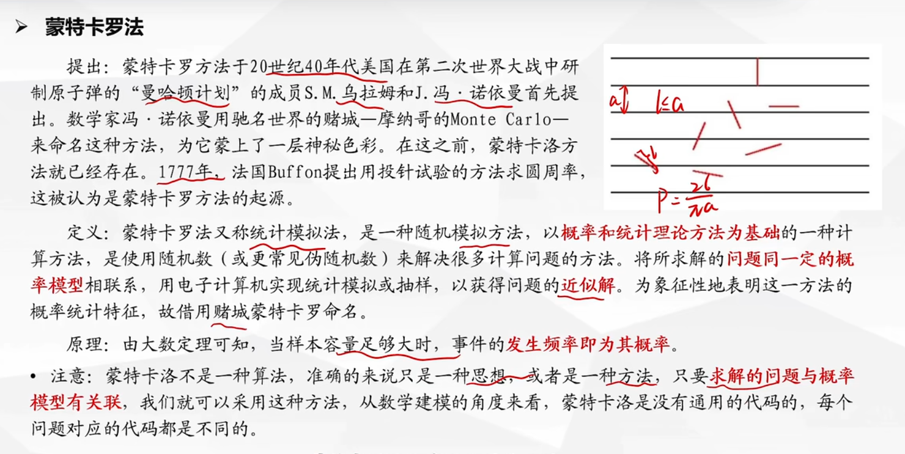

# 蒙特卡罗法

## 1. 介绍



## 2. 求圆周率

```python
import numpy as np
import matplotlib.pyplot as plt

# 投放10000个点, 圆半径为1, 圆心坐标(1, 1)
p = 10000
r = 1
x0, y0 = 1, 1
n = 0   # 初始时还未投放点, 圆内有0个点

# 设置绘图窗口
plt.figure()
plt.title("Monte Carlo Simulation for Estimating PI")
plt.xlabel('x')
plt.ylabel('y')

for i in range(p):
    px = np.random.rand() * 2   # 随机生成该点横坐标
    py = np.random.rand() * 2   # 随机生成该点纵坐标

    if(px - x0) ** 2 + (py - y0) ** 2 < r ** 2:
        plt.plot(px, py, '.', color='b')
        n += 1
    else:
        plt.plot(px, py, '.', color='r')

plt.axis('equal')   # 绘图时横坐标单位长度相同, 便于观察
plt.show()

s = (n / p) * 4
pi_dstimate = s
print("Estimated value of pi:", pi_dstimate)
```

## 3. 三门问题

```python
import numpy as np

# (1)
n = 100000
a = 0
b = 0
for i in range(n):
    x = np.random.randint(1, 4) # 表示汽车出现在第x扇门后
    y = np.random.randint(1, 4) # 表示自己选的门

    # 下面分两种情况讨论: x = y 和 x != y
    if x == y:
        a += 1  # 不需改变注意
    else:
        b += 1  # 只能改变注意才能赢

print("不改变主意时获奖的概率为:", a / n)
print("改变主意时获奖的概率为:", b / n)

# (2)
n = 100000
a = 0   # 表示不改变主意能赢
b = 0   # 表示改变主意能赢
c = 0   # 表示没有获奖的次数
for i in range(n):
    x = np.random.randint(1, 4)  # 表示汽车出现在第x扇门后
    y = np.random.randint(1, 4)  # 表示自己选的门
    change = np.random.randint(0, 2) # change = 0 -> 不改变主意 change = 1 -> 改变主意
    if x == y:
        if change == 0:
            a += 1
        else:
            c += 1
    else:
        if change == 0:
            c += 1
        else:
            b += 1

print("不改变主意时能赢概率:", a / n)
print("改变主意时能赢概率:", b / n)
print("没有获奖的概率:", c / n)
```

