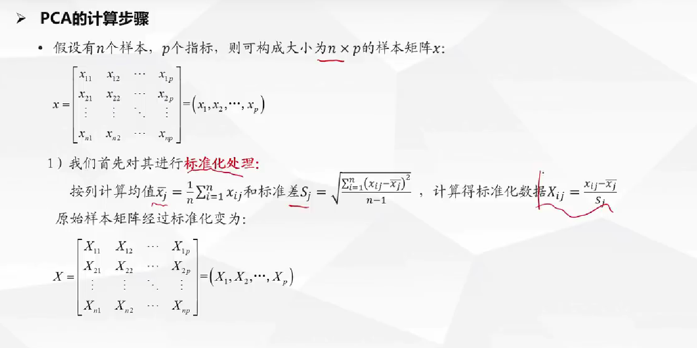
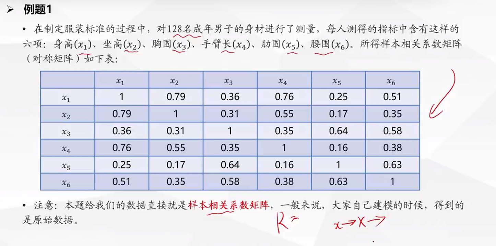

# 主成分分析

## 1. 原理

通过某个投影矩阵将高维空间的中的原始样本点线性投影到低维空间,以达到降维的目的

降维的几何意义可以理解为旋转坐标系,取前k个轴作为新特征

**将特征维度变小,同时减少信息损失**

**数据降维**

优点: 1. 是数据集更容易使用  2. 降噪声  3. 降低算法的计算开销  4. 使得结果更容易理解

- 换特征
- 减少特征

## 2. 代数意义

**m * n阶的原始样本X, 与n * k阶的矩阵W做矩阵乘法运算X * W, 即得到m * k阶低维矩阵Y, 这里的n * k阶矩阵W就是投影矩阵**

## 3. 思想

## 4. 计算步骤

## 5. 例题

## 6. 分析说明

