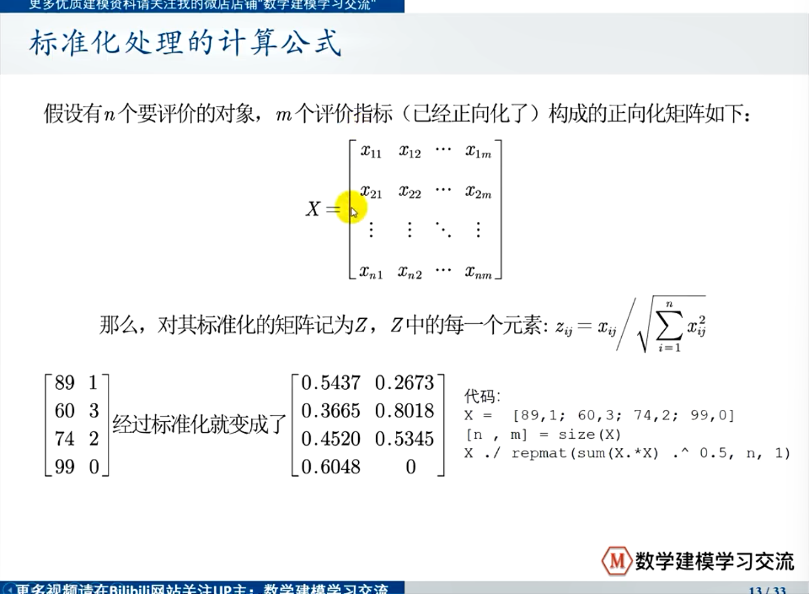
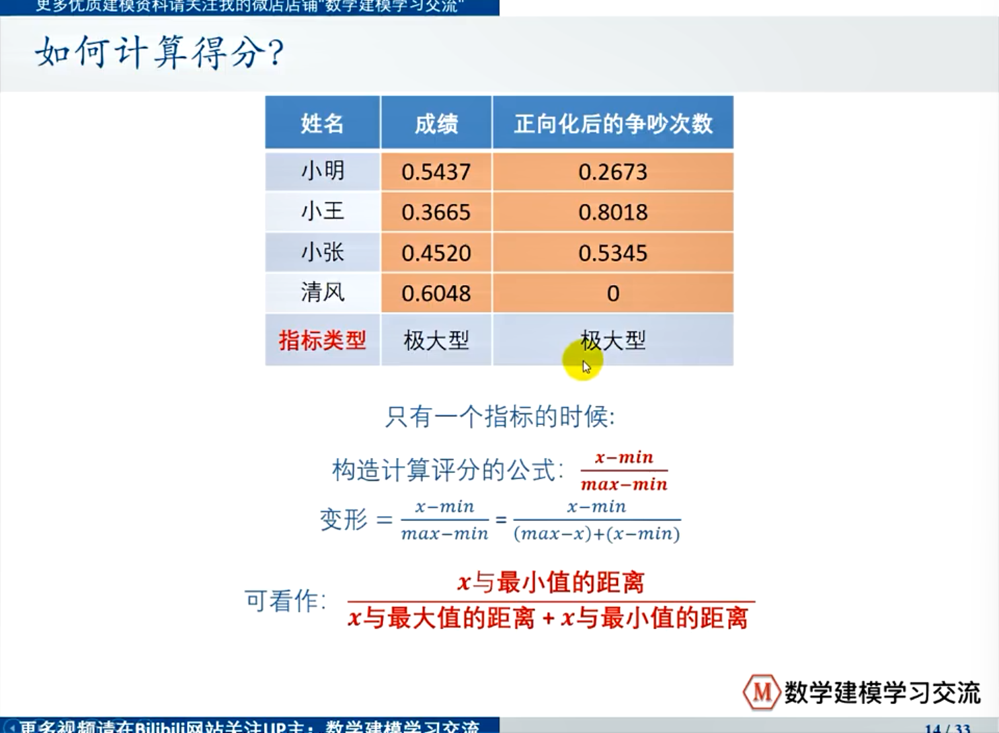
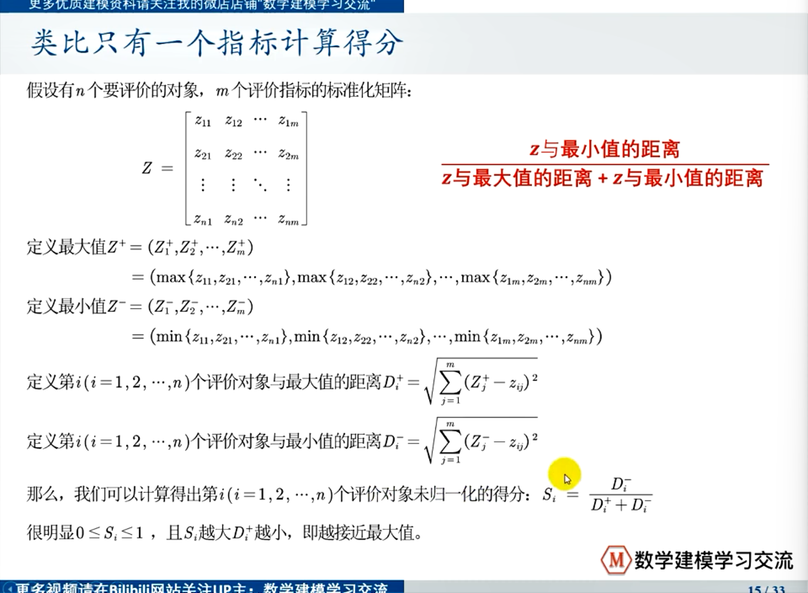
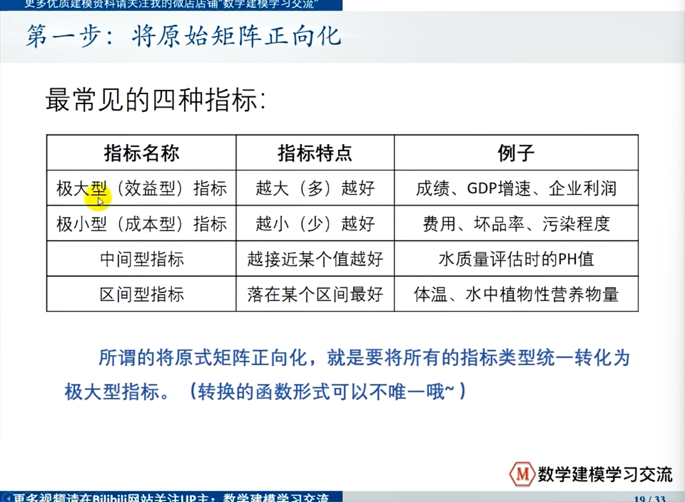
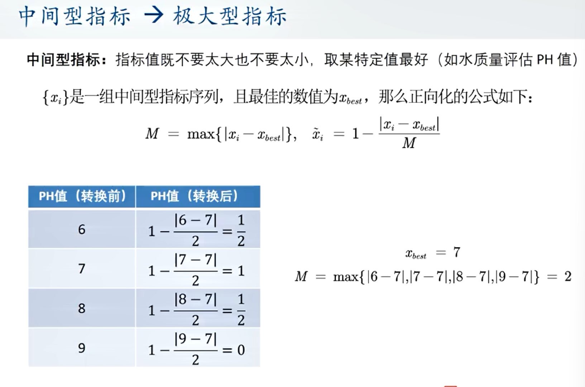
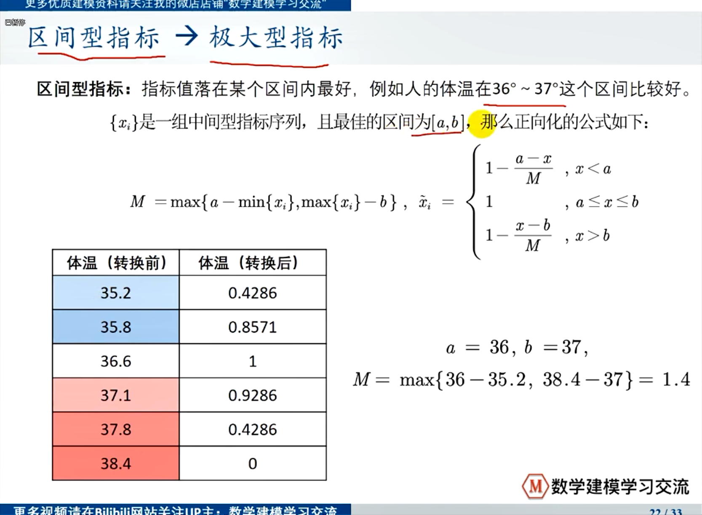

## TOPSIS

1. 比较的对象一般要远大于两个。

2. 比较的指标也往往不是一个方面的。

3. 有很多指标不存在理论上的最大值和最小值。

构造计算评分的公式：

$$
\frac{x - \min}{\max - \min}
$$

- 分类：
  
  - 极大型指标（效益型指标）
  
  - 极小型指标（成本型指标）

- 处理：统一指标类型
  
  - 指标正向化（最常用）
    
    - 极小型指标转换为极大型指标的公式：$\max - x$ 
    
    - 为了消去不同指标量纲的影响，需要对已经正向化的矩阵进行标准化处理
      
      
    
    - 计算得分：
      
      
      
      多个指标:
      
      

- 步骤：
  
  - 第一步：将原始矩阵正向化
    
    
    
    - 处理方法:
      
      
      
      
  
  - 第二步：正向化矩阵标准化
    
    > 同上面例子
  
  - 第三步：计算得分并归一化
    
    > 同上面例子
