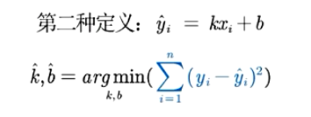
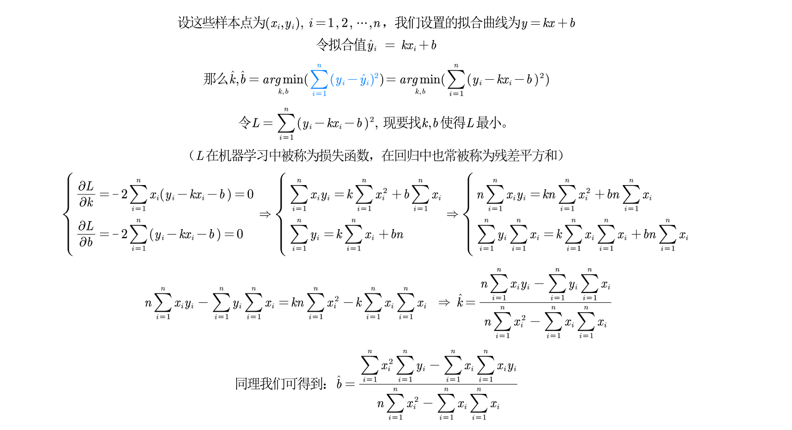

# 拟合

## 最小二乘思想

**不用绝对值：不容易求导，计算复杂**

**不用三次方：正负相抵**

**不用四次方：使拟合曲线更接近异常值** 

## 最小二乘求解

## 如何评价拟合好坏

**拟合优度R_2**

- SSE存在量纲问题

- 用SST=SSE+SSR  R_2 = SSR / SST

- **R_2只能用于拟合函数是线性函数时**
  
  这里说的线性函数是指对参数为线性（线性与参数）
  
  在函数中，参数仅以一次方出现，且不能乘以或除以其他任何的参数，并不能出现参数的复合函数形式。

## 主要用cftool
