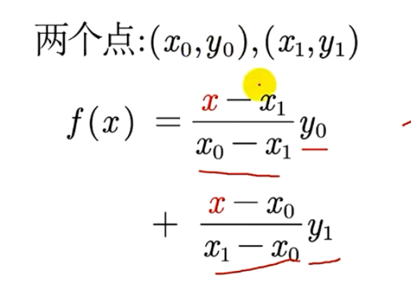
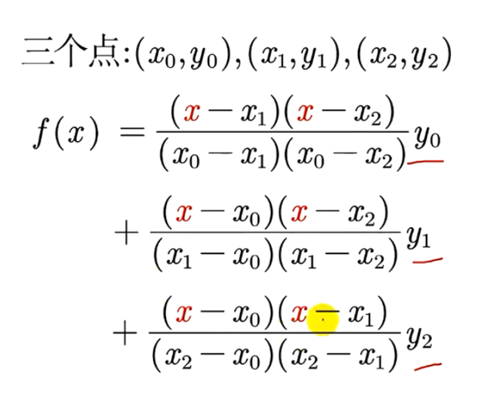
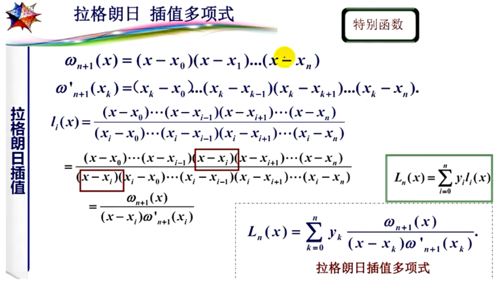

# 插值算法

## 一维插值问题

1. 拉格朗日插值法
   
   - 两个点
   
    
   
   - 三个点
     
     
   
   - 其余类比......

2. 拉格朗日插值多项式
   
   

3. 龙格现象
   
   高次插值会产生龙格现象，即在两端处波动极大，产生明显震荡。在不熟悉曲线运动趋势的前提下，不要轻易使用高次插值。

4. 分段线性插值
   
   - 分段低次插值
     
     - 牛顿插值法
       
       与拉格朗日插值法的对比：与拉格朗日插值法相比，牛顿插值法的计算过程具有继承性。（牛顿插值法每次插值只和前n 项的值有关，这样每次只要在原来的函数上添加新的项，就能够产生新的函数）但是牛顿插值也存在龙格现象的问题。
       
       **两者都不能全面反映被插值函数的性态。**
     
     - 艾尔米特插值
       
       - 三次艾尔米特插值
     
     - 三次样条插值

## n维数据的插值

`interpn` 函数

