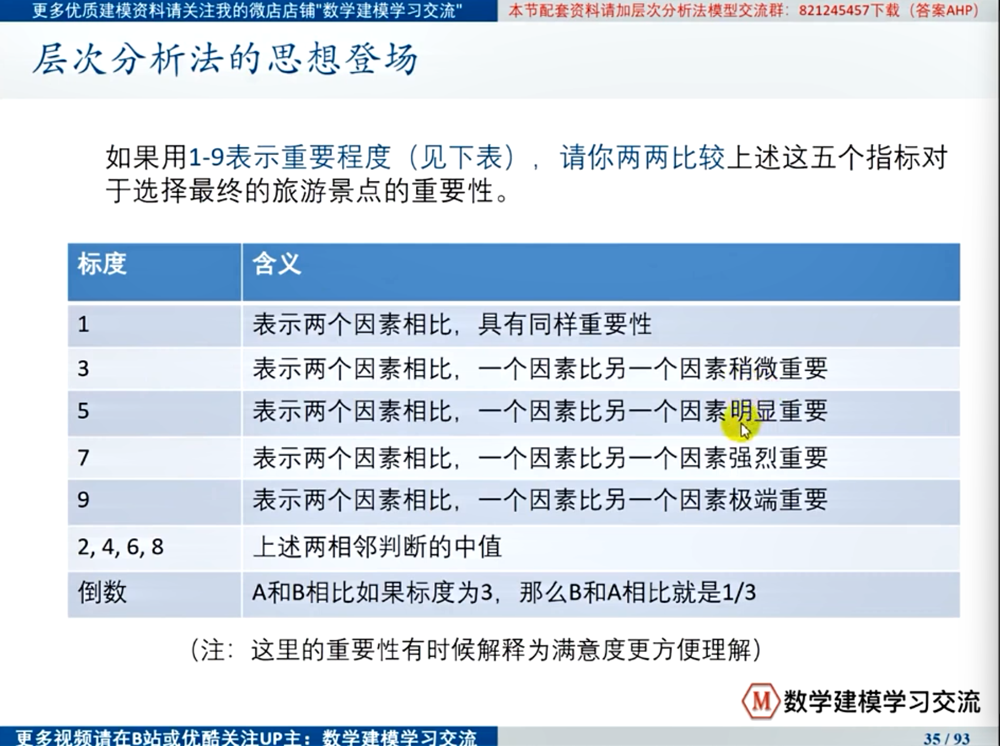

## 层次分析法

### 评价类问题

1. 评价目标是什么？

2. 为了达到这个目标有哪几种可选方案？

3. 评价的准则是什么？
   
   - 背景材料
   
   - 常识
   
   - 搜集到的参考资料
     
     > 虫部落-快搜：`https://search.chongbuluo.com/` 
     > 
     > 优先级：
     > 
     > - 谷歌 
     > - 微信
     > - 知乎
     
     - 知网、万方、百度学术、谷歌学术
   
   - 指标权重：分而治之、两两比较
     
     
     
     
     
     - 判断矩阵（正互反矩阵）
       
       
     
     - 一致矩阵（各行各列成一次关系的判断矩阵）
     
     - **在使用判断矩阵求权重之前，必须对其进行一致性检验**
       
       
     
     - 计算权重
       
       - 一致矩阵：某一列即可
       
       - 判断矩阵：算术平均法、几何平均法
         
         > 一致性可以接受：特征值法

### 层次分析法的局限性

- 评价的决策层不能太多，太多的话n会很大，判断矩阵和一致矩阵差异可能会很大。
- 若决策层指标的数据是已知的，就不可用了。