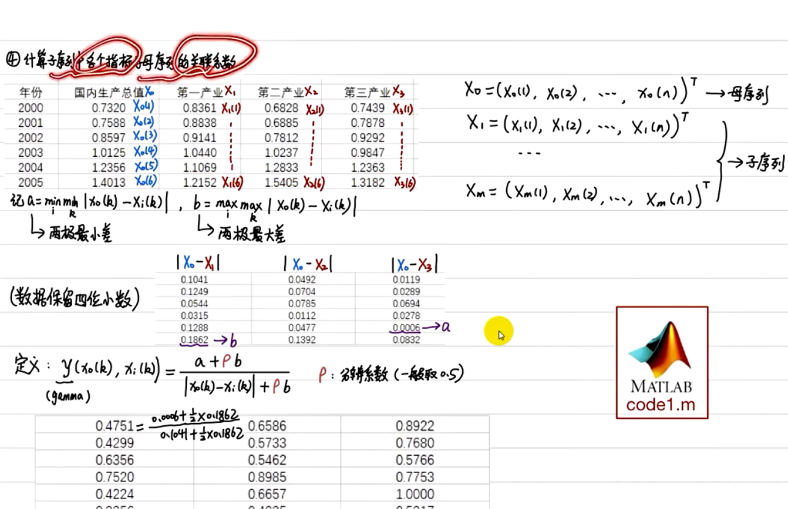
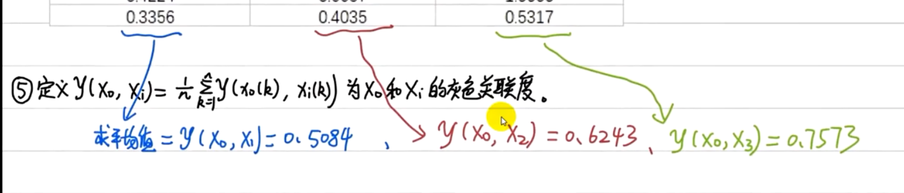
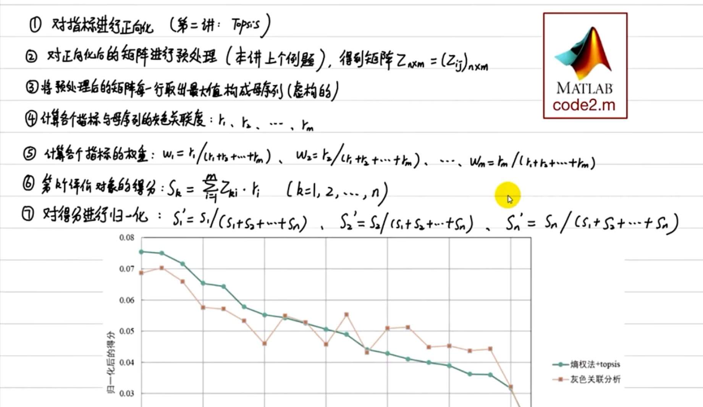

## 灰色关联分析

> 当样本个数n较少时，才使用灰色关联分析

### 应用一：进行系统分析

1. 画统计图（Excel）
   
   > 画图后配上简单的分析

2. 确定分析数列
   
   1）母序列：因变量Y，此处记为X。
   
   2）子序列：自变量X，此处记为（x1，x2，......)

3. 对变量进行预处理（两个目的：去量纲、缩小变量范围简化计算）
   
   1）先求出每个指标的均值，再用该指标中的每个元素都除以其均值。

4. 计算子序列中各个指标与母序列的关联系数。
   
   

5. 

6. 通过比较三个子序列和母序列的关联度可以得到结论。

### 应用二：用于综合评价

